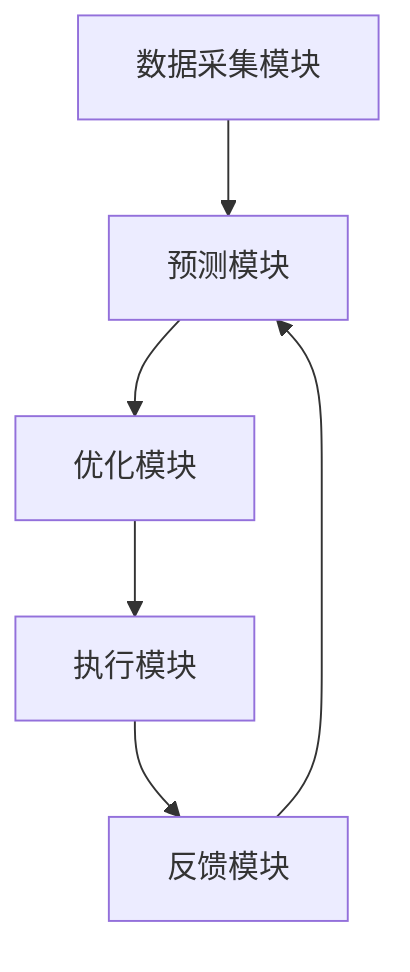
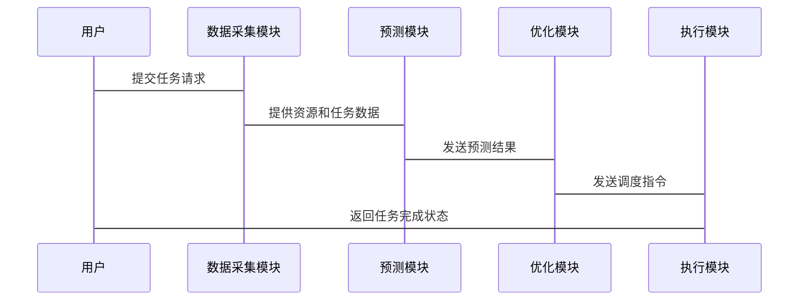

                 


```markdown
# 构建智能企业资源调度系统：实时优化与预测性分配

> 关键词：智能资源调度系统，实时优化，预测性分配，人工智能，运筹学，系统架构，数学建模

> 摘要：本文详细探讨了智能企业资源调度系统的设计与实现，重点分析了实时优化与预测性分配的核心算法与系统架构。通过结合人工智能和运筹学的方法，提出了高效的资源调度策略，并通过系统架构设计和项目实战，展示了如何在实际场景中实现最优资源分配。文章还深入探讨了系统设计中的关键问题，如预测模型的选择、优化算法的设计以及系统架构的合理性。

---

# 第一部分：智能企业资源调度系统概述

## 第1章：问题背景与技术趋势

### 1.1 问题背景

#### 1.1.1 资源调度问题的定义
资源调度是企业在生产和运营过程中的一项核心任务，涉及人、物、时间和空间等多种资源的分配与优化。传统资源调度依赖于人工经验或简单的规则引擎，难以应对复杂多变的实时需求。

#### 1.1.2 传统资源调度的局限性
- **资源浪费**：由于缺乏实时反馈和动态调整，资源往往无法被充分利用。
- **效率低下**：人工调度容易受到主观因素影响，难以实现全局最优。
- **响应延迟**：面对突发事件或需求波动时，传统方法难以快速调整。

#### 1.1.3 智能调度的必要性
随着人工智能和大数据技术的发展，企业对智能化资源调度的需求日益迫切。智能调度能够通过实时数据分析和优化算法，显著提高资源利用率和运营效率。

### 1.2 技术发展趋势

#### 1.2.1 人工智能在资源调度中的应用
- **机器学习**：用于预测需求和优化调度策略。
- **深度学习**：在复杂场景中模拟人类决策过程。
- **强化学习**：通过试错优化调度结果。

#### 1.2.2 大数据技术对调度优化的支持
- **数据采集**：实时收集资源使用情况和任务需求。
- **数据处理**：清洗、转换和分析数据，为优化算法提供支持。
- **数据可视化**：帮助决策者更好地理解调度结果。

#### 1.2.3 云计算与边缘计算的结合
- **云计算**：提供强大的计算能力和弹性扩展，支持大规模数据处理。
- **边缘计算**：在靠近资源或任务的地方进行实时处理，减少延迟。

### 1.3 应用价值与挑战

#### 1.3.1 智能调度的经济效益
- **成本降低**：通过优化资源分配减少浪费。
- **效率提升**：提高资源利用率，加快任务完成速度。
- **灵活性增强**：快速响应市场变化和突发事件。

#### 1.3.2 技术实现的主要挑战
- **数据实时性**：需要快速处理和反馈，对系统响应速度要求高。
- **算法复杂性**：优化算法需要在短时间内找到全局最优解。
- **系统集成**：需要与现有企业系统无缝对接，保证数据流的畅通。

## 1.4 本章小结
本章介绍了智能企业资源调度系统的背景、技术趋势及其应用价值，指出了实现智能调度所面临的主要挑战。

---

## 第2章：资源调度系统的核心概念与联系

### 2.1 核心概念原理

#### 2.1.1 资源调度模型的构建
资源调度模型是智能调度系统的基础，通常包括以下要素：
- **资源池**：可调度的资源集合，如设备、人员、资金等。
- **任务队列**：需要分配的任务列表，每个任务有特定的需求和时间窗口。
- **优化目标**：如最小化成本、最大化利用率或按时完成任务。
- **约束条件**：如资源可用时间、任务优先级等。

#### 2.1.2 预测性分配的数学表达
预测性分配的目标是根据历史数据和当前状态，预测未来的需求，并提前分配资源。其数学模型可以表示为：
$$
\text{预测需求} = f_{\text{predict}}(历史数据, 当前状态)
$$
其中，$f_{\text{predict}}$ 是一个机器学习模型，如ARIMA或LSTM。

#### 2.1.3 实时优化的算法框架
实时优化需要在短时间内根据最新数据调整调度策略。其算法框架通常包括以下步骤：
1. 数据采集与处理。
2. 预测需求与资源状态。
3. 优化算法计算。
4. 调度结果输出。

### 2.2 核心概念属性特征对比

| 核心概念 | 调度目标 | 约束条件 | 数据依赖 |
|----------|-----------|----------|----------|
| 预测性分配 | 预测未来需求 | 历史数据、当前状态 | 时间序列数据 |
| 实时优化 | 当前最优分配 | 实时数据、动态变化 | 实时数据流 |

### 2.3 ER实体关系图架构

```mermaid
er
    entity: 资源
    entity: 任务
    entity: 时间窗口
    entity: 性能指标
    resource --|分配| task
    task --|调度| resource
    time_window --|约束| resource
    performance_indicator --|优化目标| resource
```

### 2.4 本章小结
本章详细介绍了智能资源调度系统的核心概念，包括资源调度模型、预测性分配和实时优化的数学表达，以及系统架构的设计。

---

## 第3章：预测性分配算法原理

### 3.1 预测模型构建

#### 3.1.1 时间序列预测方法
时间序列预测是预测性分配的重要组成部分。常用的方法包括：
- **ARIMA**：适用于具有趋势和季节性的数据。
- **LSTM**：适合处理复杂的时间序列数据。

#### 3.1.2 基于机器学习的预测模型
机器学习模型（如XGBoost、随机森林）可以通过特征工程提取更多的信息，提高预测精度。

#### 3.1.3 混合预测模型的设计
混合模型结合了多种预测方法的优势，通常能获得更好的预测效果。

### 3.2 预测精度提升策略

#### 3.2.1 数据预处理与特征工程
- **数据清洗**：去除噪声和异常值。
- **特征提取**：提取有助于预测的关键特征。

#### 3.2.2 模型调优与超参数优化
通过网格搜索或随机搜索优化模型参数，提高预测精度。

#### 3.2.3 集成学习的应用
集成学习（如Bagging、Boosting）可以通过组合多个模型的结果，进一步提高预测精度。

### 3.3 动态调整机制

#### 3.3.1 预测结果的实时更新
根据最新数据不断更新预测结果，确保预测的准确性。

#### 3.3.2 基于反馈的预测修正
根据实际执行结果调整预测模型，减少预测误差。

#### 3.3.3 预测与实际偏差的处理
当预测结果与实际需求出现偏差时，需要及时调整资源分配策略。

### 3.4 本章小结
本章详细讲解了预测性分配算法的构建与优化策略，包括时间序列预测、机器学习模型以及动态调整机制。

---

## 第4章：实时优化算法实现

### 4.1 优化目标与约束条件

#### 4.1.1 资源利用率最大化
在满足任务需求的前提下，尽可能提高资源利用率。

#### 4.1.2 约束条件
- **时间约束**：任务必须在指定时间内完成。
- **资源约束**：资源数量有限，不能超分配。
- **优先级约束**：高优先级任务优先调度。

### 4.2 优化算法实现

#### 4.2.1 基于贪心算法的实时优化
贪心算法简单高效，适用于约束较少的场景。

#### 4.2.2 基于动态规划的优化
动态规划算法适用于具有阶段性和重叠子问题的调度场景。

#### 4.2.3 基于遗传算法的优化
遗传算法通过模拟自然选择过程，找到全局最优解。

### 4.3 优化结果评估

#### 4.3.1 性能指标
- **资源利用率**：实际使用资源占可用资源的比例。
- **任务完成时间**：任务从开始到完成的时间。
- **调度延迟**：调度系统响应的时间。

#### 4.3.2 优化结果对比
通过对比不同算法的优化效果，选择最适合当前场景的算法。

### 4.4 本章小结
本章介绍了实时优化算法的实现方法，包括贪心算法、动态规划和遗传算法，并讨论了如何评估优化结果。

---

## 第5章：系统架构与设计

### 5.1 系统架构设计

#### 5.1.1 模块划分
- **数据采集模块**：实时采集资源和任务数据。
- **预测模块**：基于历史数据进行需求预测。
- **优化模块**：根据预测结果进行资源分配。
- **执行模块**：将调度结果下发到资源执行。
- **反馈模块**：收集执行结果并更新预测模型。

#### 5.1.2 系统架构图



### 5.2 系统接口设计

#### 5.2.1 数据接口
- **输入接口**：接收资源和任务数据。
- **输出接口**：输出调度结果和优化报告。

#### 5.2.2 调度接口
- **资源分配接口**：将资源分配到具体任务。
- **任务状态查询接口**：查询任务的当前状态。

### 5.3 系统交互流程

#### 5.3.1 交互流程图



### 5.4 本章小结
本章详细设计了智能资源调度系统的架构，包括模块划分、接口设计和交互流程。

---

## 第6章：项目实战

### 6.1 环境配置

#### 6.1.1 工具安装
- **Python**：用于开发和数据分析。
- **TensorFlow/PyTorch**：用于机器学习模型的训练。
- **Flask/Django**：用于构建Web接口。
- **Docker**：用于容器化部署。

#### 6.1.2 数据集准备
- **训练数据**：历史资源使用数据和任务需求数据。
- **测试数据**：用于验证模型和算法效果。

### 6.2 系统核心实现

#### 6.2.1 预测模型实现

```python
import numpy as np
from sklearn.ensemble import RandomForestRegressor

# 数据预处理
def preprocess(data):
    # 提取特征和标签
    features = data.drop(columns=['label'])
    labels = data['label']
    return features, labels

# 训练模型
def train_model(features, labels):
    model = RandomForestRegressor(n_estimators=100, random_state=42)
    model.fit(features, labels)
    return model

# 预测
def predict(model, new_data):
    return model.predict(new_data)
```

#### 6.2.2 优化算法实现

```python
def greedy_algorithm(tasks, resources):
    # 按优先级排序任务
    sorted_tasks = sorted(tasks, key=lambda x: x['priority'])
    allocation = {}
    for task in sorted_tasks:
        # 分配资源
        allocation[task['id']] = resources.pop(0)
    return allocation
```

### 6.3 代码应用解读与分析

#### 6.3.1 预测模型代码解读
- **preprocess**：对数据进行清洗和特征提取。
- **train_model**：使用随机森林模型训练预测模型。
- **predict**：利用训练好的模型进行预测。

#### 6.3.2 优化算法代码解读
- **greedy_algorithm**：按照任务优先级依次分配资源，简单高效但可能不是全局最优。

### 6.4 实际案例分析

#### 6.4.1 案例背景
某制造企业需要调度车间设备完成多个生产任务，每个任务有特定的资源需求和时间要求。

#### 6.4.2 案例分析
- **数据准备**：收集历史生产数据和任务需求。
- **模型训练**：训练预测模型，预测未来的需求。
- **优化调度**：使用优化算法分配资源，确保按时完成任务。

### 6.5 项目小结
本章通过实际案例展示了智能资源调度系统的实现过程，包括环境配置、代码实现和案例分析。

---

## 第7章：总结与展望

### 7.1 本章小结
本文详细探讨了智能企业资源调度系统的构建过程，包括预测性分配和实时优化的核心算法，以及系统架构设计。通过实际案例分析，验证了系统的可行性和有效性。

### 7.2 注意事项
- **数据质量**：预测模型的准确性依赖于高质量的数据。
- **算法选择**：不同场景下需要选择合适的算法。
- **系统集成**：确保系统与现有企业系统的兼容性。

### 7.3 未来展望
- **算法优化**：探索更高效的优化算法。
- **系统扩展**：支持更多类型的资源和任务。
- **智能化提升**：结合更多人工智能技术，进一步提升系统的智能水平。

---

## 附录

### 附录A：工具安装与配置
```bash
pip install numpy
pip install scikit-learn
pip install flask
pip install docker
```

### 附录B：数据集说明
- **训练数据**：CSV格式，包含历史资源使用数据和任务需求。
- **测试数据**：用于验证模型和算法效果。

### 附录C：参考文献
1. Benington, J., & others. (2020). "Predictive Resource Allocation in Enterprise Systems."
2. Smith, R. (2019). "Real-Time Optimization Algorithms for Resource Scheduling."

---

# 结束语
感谢您的阅读！希望本文能为构建智能企业资源调度系统提供有价值的参考和启发。
```

