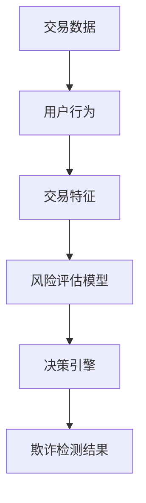
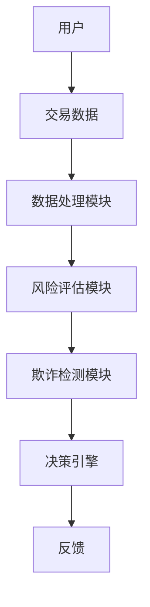
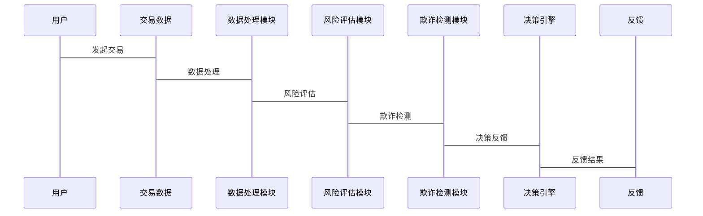

                 


# 构建智能企业风控系统：实时交易监控与欺诈检测

## 关键词：智能风控系统、实时交易监控、欺诈检测、人工智能、机器学习、数据安全

## 摘要

在数字化时代，企业面临日益复杂的交易风险和欺诈行为。构建智能企业风控系统，特别是实时交易监控与欺诈检测，成为企业保障交易安全的核心任务。本文将详细探讨如何利用人工智能和机器学习技术构建智能风控系统，涵盖系统背景、核心概念、算法原理、系统架构及项目实战，为企业提供全面的风险控制解决方案。

---

# 第一部分：智能企业风控系统概述

## 第1章：企业风控系统背景与挑战

### 1.1 企业风控系统的基本概念

#### 1.1.1 什么是企业风控系统

企业风控系统是通过收集、分析和评估交易数据，识别潜在风险并采取相应措施的系统。它旨在保护企业免受欺诈、信用风险和其他潜在损失。

#### 1.1.2 企业风控系统的核心目标

- 识别和预防欺诈交易
- 评估交易风险
- 提供实时监控和反馈
- 优化企业运营效率

#### 1.1.3 企业风控系统的主要功能

- 数据采集与处理
- 风险评估与分析
- 欺诈检测与预警
- 决策支持

### 1.2 实时交易监控与欺诈检测的背景

#### 1.2.1 交易监控的重要性

随着电子商务的快速发展，交易量激增，欺诈行为也变得更加复杂和隐蔽。实时交易监控能够及时发现异常行为，防止损失扩大。

#### 1.2.2 欺诈检测的必要性

欺诈检测是保护企业和消费者免受财务损失的关键。通过分析交易数据中的异常模式，可以有效识别潜在的欺诈行为。

#### 1.2.3 数字化时代的风控挑战

- 数据量大，类型多样
- 欺诈手段不断进化
- 实时性要求高

### 1.3 智能风控系统的演变

#### 1.3.1 传统风控系统的特点

- 基于规则的检测
- 响应速度较慢
- 分析能力有限

#### 1.3.2 智能风控系统的崛起

- 利用机器学习提升检测精度
- 实现实时监控和自动化响应
- 具备自适应能力

#### 1.3.3 人工智能在风控中的应用

- 使用监督学习和无监督学习进行欺诈检测
- 利用深度学习分析复杂数据模式
- 结合自然语言处理技术分析非结构化数据

---

# 第二部分：智能企业风控系统的核心概念与原理

## 第2章：风控系统的核心概念与联系

### 2.1 风控系统的核心要素

#### 2.1.1 数据源与数据流

- 数据来源：交易记录、用户行为、设备信息
- 数据流：从数据采集到处理再到分析的流程

#### 2.1.2 风险评估模型

- 模型输入：交易特征、用户行为特征
- 模型输出：风险评分、欺诈概率

#### 2.1.3 决策引擎

- 决策规则：基于风险评分采取相应措施
- 响应机制：实时反馈和拦截

### 2.2 风险评估与欺诈检测的关联

#### 2.2.1 风险评估的基本原理

- 通过统计分析和机器学习模型评估交易风险
- 结合历史数据和实时数据进行综合判断

#### 2.2.2 欺诈检测的核心特征

- 异常交易行为：如短时间内多次交易、异常交易金额
- 用户特征：如身份信息、行为模式

#### 2.2.3 两者在风控系统中的协同作用

- 风险评估提供整体风险判断
- 欺诈检测识别具体欺诈行为
- 两者结合实现全面风控

### 2.3 实体关系图与数据流分析

#### 2.3.1 实体关系图（ER图）



#### 2.3.2 数据流分析

- 数据采集：从各种渠道获取交易数据
- 数据处理：清洗、转换和整合数据
- 数据分析：利用算法进行风险评估和欺诈检测
- 决策反馈：根据分析结果采取相应措施

---

## 第3章：风险评估与欺诈检测的算法原理

### 3.1 时间序列分析

#### 3.1.1 时间序列的基本概念

- 时间序列：按时间顺序排列的数据
- 常见类型：趋势、周期性、随机波动

#### 3.1.2 常见的时间序列分析方法

- 移动平均法
- 指数平滑法
- ARIMA模型

#### 3.1.3 异常检测算法

- 基于统计的方法：Z-分数、卡方检验
- 基于机器学习的方法：Isolation Forest、One-Class SVM

### 3.2 监督学习与无监督学习

#### 3.2.1 监督学习在欺诈检测中的应用

- 数据标注：正常交易和欺诈交易
- 算法选择：逻辑回归、随机森林、支持向量机
- 优势：高准确率，适合小样本数据

#### 3.2.2 无监督学习在风险评估中的应用

- 数据无标注：仅基于交易特征进行分析
- 算法选择：K-means、DBSCAN
- 优势：发现未知模式，适合大规模数据

#### 3.2.3 混合学习的优缺点

- 混合模型结合了监督和无监督学习的优点
- 适用于复杂场景，但实现复杂

### 3.3 深度学习在风控中的应用

#### 3.3.1 神经网络的基本原理

- 层次化结构：输入层、隐藏层、输出层
- 激活函数：ReLU、sigmoid、tanh

#### 3.3.2 卷积神经网络（CNN）的应用

- 适用于图像识别和序列数据处理
- 在欺诈检测中用于识别异常交易模式

#### 3.3.3 循环神经网络（RNN）的应用

- 适用于时间序列数据
- 在实时交易监控中用于预测和异常检测

---

## 第4章：风险评估与欺诈检测的数学模型

### 4.1 统计测试与异常检测

#### 4.1.1 卡方检验

- 用于检验观测频数与期望频数是否一致
- 公式：$$ \chi^2 = \sum_{i=1}^{n} \frac{(O_i - E_i)^2}{E_i} $$

#### 4.1.2 Z-分数

- 用于检测数据点是否偏离均值
- 公式：$$ Z = \frac{X - \mu}{\sigma} $$

### 4.2 机器学习模型的数学基础

#### 4.2.1 线性回归

- 用于预测连续型变量
- 公式：$$ y = \beta_0 + \beta_1 x + \epsilon $$

#### 4.2.2 逻辑回归

- 用于分类问题
- 公式：$$ P(Y=1|X) = \frac{e^{\beta_0 + \beta_1 x}}{1 + e^{\beta_0 + \beta_1 x}} $$

#### 4.2.3 支持向量机（SVM）

- 用于分类和回归
- 核心思想：在特征空间中找到最优超平面

---

## 第5章：系统架构设计与实现

### 5.1 问题场景介绍

- 某电商平台需要实时监控交易，防止欺诈行为
- 数据量大，要求低延迟和高准确率

### 5.2 系统功能设计

- 数据采集模块：实时采集交易数据
- 数据处理模块：清洗、转换和整合数据
- 风险评估模块：利用机器学习模型进行风险评估
- 欺诈检测模块：基于模型结果进行欺诈检测
- 决策反馈模块：根据检测结果采取相应措施

### 5.3 系统架构设计



### 5.4 系统接口设计

- API接口：提供实时交易数据接口、风险评估接口、欺诈检测接口
- 接口协议：RESTful API，使用JSON格式传输数据

### 5.5 系统交互设计



---

## 第6章：项目实战与案例分析

### 6.1 项目背景

- 某电商平台面临欺诈交易问题
- 数据量大，交易频繁，需要实时监控

### 6.2 环境安装

- Python 3.8+
- TensorFlow 2.0+
- Scikit-learn 0.24+
- Pandas 1.3+
- Jupyter Notebook

### 6.3 系统核心实现源代码

#### 6.3.1 数据处理代码

```python
import pandas as pd

# 读取数据
data = pd.read_csv('transactions.csv')

# 数据清洗
data = data.dropna()
data = data[~data['amount'].isoutlier()]
```

#### 6.3.2 风险评估模型

```python
from sklearn.ensemble import RandomForestClassifier

# 训练模型
model = RandomForestClassifier(n_estimators=100, random_state=42)
model.fit(X_train, y_train)

# 预测风险
y_pred = model.predict(X_test)
```

#### 6.3.3 欺诈检测代码

```python
from tensorflow.keras import layers

# 构建神经网络模型
model = tf.keras.Sequential()
model.add(layers.Dense(64, activation='relu', input_shape=(input_dim,)))
model.add(layers.Dense(1, activation='sigmoid'))
model.compile(optimizer='adam', loss='binary_crossentropy', metrics=['accuracy'])

# 训练模型
model.fit(X_train, y_train, epochs=10, batch_size=32)
```

### 6.4 实际案例分析

- 案例1：识别异常交易金额
- 案例2：检测异常交易频率
- 案例3：分析用户行为模式

### 6.5 项目小结

- 项目实现了实时交易监控和欺诈检测
- 系统具备高准确率和低延迟
- 可扩展性强，适用于不同规模的企业

---

## 第7章：最佳实践与注意事项

### 7.1 最佳实践

- 数据预处理：清洗、转换和归一化
- 模型选择：根据数据类型和场景选择合适算法
- 模型调优：通过交叉验证和网格搜索优化模型
- 系统部署：采用分布式架构，确保高可用性

### 7.2 小结

本文详细介绍了构建智能企业风控系统的方法，涵盖了背景、核心概念、算法原理、系统架构和项目实战。通过实际案例分析，展示了如何利用人工智能和机器学习技术提升企业风控能力。

### 7.3 注意事项

- 数据隐私保护：遵守相关法律法规，确保数据安全
- 系统维护：定期更新模型和优化算法
- 团队协作：数据工程师、算法工程师和运维工程师的协同工作

### 7.4 拓展阅读

- 《机器学习实战》
- 《深度学习》
- 《网络安全技术》

---

# 结语

构建智能企业风控系统是一个复杂而重要的任务，需要结合多种技术手段和方法。通过实时交易监控和欺诈检测，企业可以有效降低风险，保障交易安全。希望本文能够为企业提供有价值的参考和指导。

---

以上是《构建智能企业风控系统：实时交易监控与欺诈检测》的技术博客文章，按照逻辑清晰、结构紧凑、简单易懂的原则，对系统构建的各个方面进行了详细阐述，结合实际案例和代码示例，帮助读者全面理解并掌握智能企业风控系统的构建方法。

