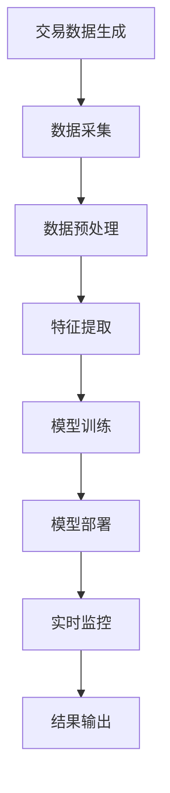
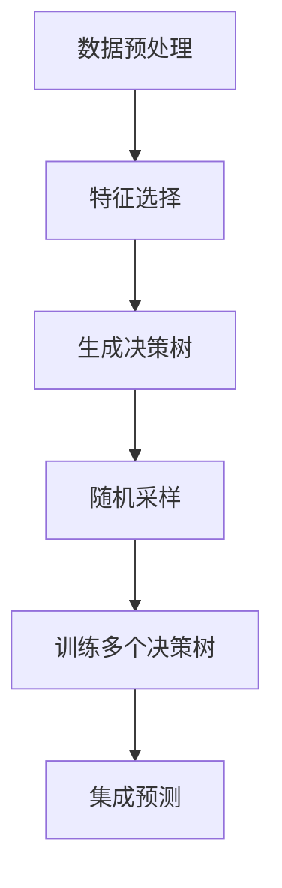
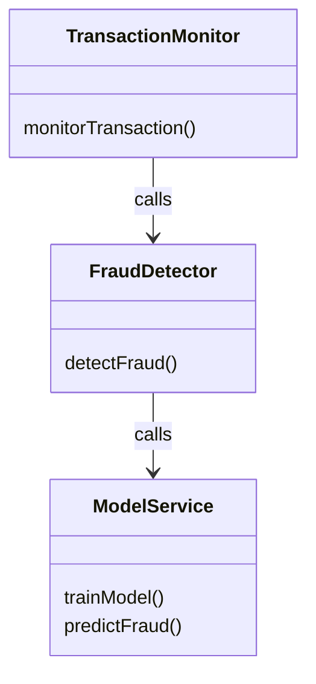
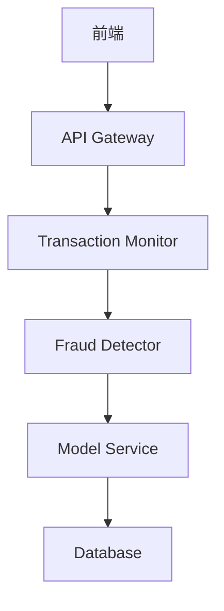
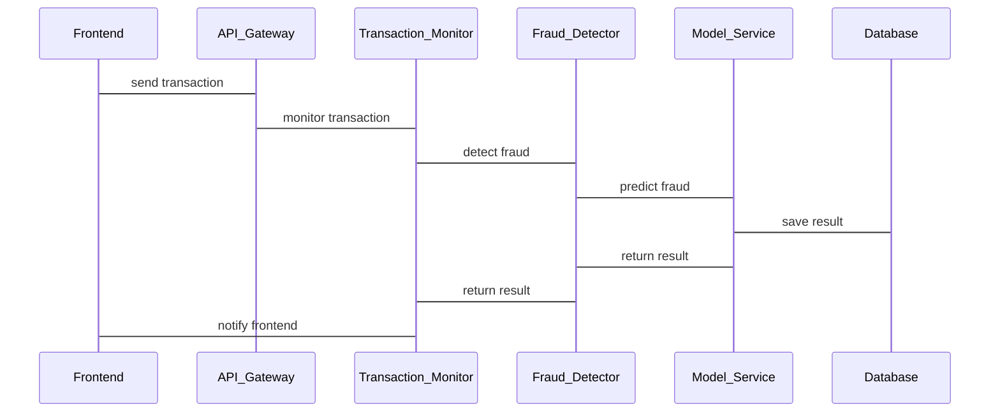

                 

<think>
好的，我将按照您的要求，逐步构建这篇文章的目录和内容。首先，我需要确保每个章节的内容都符合您的要求：使用Markdown格式，详细讲解每个部分，包括背景、核心概念、算法原理、系统架构、项目实战等。

让我们开始第一步，先构建文章的目录结构：

---

# 构建智能企业风控系统：实时交易监控与欺诈检测的AI增强

> 关键词：智能风控系统、实时交易监控、欺诈检测、人工智能、机器学习、深度学习

> 摘要：随着企业对实时交易监控和欺诈检测的需求日益增加，传统的风控系统已难以应对复杂多变的欺诈手段。本文将深入探讨如何利用人工智能技术，构建一个智能的企业风控系统。从AI增强的风险控制的核心概念，到具体算法的实现，再到系统的架构设计，最后通过实际案例展示如何将这些技术应用于企业风控中。本文将帮助您全面理解如何利用AI技术提升企业风控能力，实现更高效、更精准的实时交易监控和欺诈检测。

---

## 目录

1. [背景与挑战](#背景与挑战)
2. [核心概念与联系](#核心概念与联系)
3. [算法原理](#算法原理)
4. [系统架构设计](#系统架构设计)
5. [项目实战](#项目实战)
6. [最佳实践与小结](#最佳实践与小结)

---

现在，我将逐步撰写每个部分的内容，确保每个章节都详细且符合您的要求。

---

## 第1章 背景与挑战

### 1.1 企业风控的重要性

企业风控是保障企业业务安全、防范风险的重要环节。随着互联网和金融业务的快速发展，企业面临的欺诈风险也在不断增加。传统的风控系统主要依赖于规则和经验，难以应对新型的欺诈手段和复杂的交易环境。

#### 1.1.1 企业风控的核心目标

- **保障企业资产安全**：通过实时监控和欺诈检测，防止企业因欺诈行为蒙受损失。
- **维护客户信任**：通过及时发现并处理欺诈行为，保护客户利益，提升客户信任度。
- **提升业务效率**：通过自动化监控和快速响应，减少人工干预，提升业务处理效率。

#### 1.1.2 欺诈检测与交易监控的必要性

- **欺诈手段多样化**：欺诈分子不断进化欺诈手段，传统的规则-based系统已难以应对。
- **交易数据的海量性**：企业每天需要处理大量的交易数据，传统方法难以实时处理。
- **风险的实时性**：风险可能在瞬间发生，需要实时监控和快速响应。

#### 1.1.3 实时监控的业务价值

- **快速响应**：通过实时监控，企业可以在欺诈发生前或发生时及时采取措施。
- **降低损失**：通过早期识别和拦截，减少欺诈行为对企业造成的损失。
- **提升用户体验**：通过快速识别正常交易，减少误判，提升用户体验。

### 1.2 当前企业风控的主要挑战

#### 1.2.1 传统风控的局限性

- **规则复杂性**：传统风控依赖于大量的规则，规则的制定和维护成本高，且容易被绕过。
- **实时性不足**：传统方法难以实时处理海量数据，导致响应延迟。
- **模型静态性**：传统模型缺乏动态更新，难以应对欺诈手段的变化。

#### 1.2.2 数据量与复杂度的双重挑战

- **数据量大**：企业每天处理的交易数据量巨大，传统的批量处理方法难以满足实时性要求。
- **数据复杂性**：交易数据不仅包括数值型数据，还包括文本、时间戳等多种类型，处理复杂。
- **数据关联性**：不同交易之间可能存在关联，需要综合分析，增加了分析的难度。

#### 1.2.3 欺诈手段的不断进化

- **新型欺诈手法**：欺诈分子不断开发新的欺诈手段，如薅羊毛、虚假交易等。
- **技术驱动的欺诈**：利用技术手段，如自动化工具、AI生成的虚假信息等，进行欺诈活动。
- **团伙欺诈**：欺诈分子组成团伙，利用协同攻击的方式，增加欺诈难度。

### 1.3 AI增强风控的机遇与优势

#### 1.3.1 AI在风控中的独特价值

- **自动化学习**：AI能够自动从海量数据中学习，发现隐藏的模式和规律，无需手动制定规则。
- **实时性**：AI算法可以在实时数据流上进行处理，满足实时监控的需求。
- **动态适应性**：AI模型可以动态更新，适应欺诈手段的变化，保持较高的检测准确率。

#### 1.3.2 机器学习与深度学习的优势

- **机器学习**：通过训练模型，能够从历史数据中学习，预测未来的欺诈行为。
- **深度学习**：利用神经网络，可以处理复杂的非结构化数据，如文本、图像等，提升检测精度。

#### 1.3.3 实时性与准确性的平衡

- **实时性**：通过流式处理技术，AI模型可以在数据生成时进行实时处理。
- **准确性**：通过不断优化模型，AI可以在保证实时性的前提下，保持较高的检测准确率。

---

## 第2章 核心概念与联系

### 2.1 核心概念解析

在构建智能企业风控系统时，需要理解几个核心概念，包括实时交易监控、欺诈检测和AI增强的风控模型。

#### 2.1.1 实时交易监控

实时交易监控是指在交易发生的瞬间，通过系统进行实时分析，判断交易是否存在问题。实时监控的核心在于数据流的实时处理和快速响应。

#### 2.1.2 欺诈检测

欺诈检测是通过分析交易数据，识别出可能的欺诈行为。欺诈检测不仅需要准确识别欺诈交易，还需要尽量减少误报，以避免影响正常交易。

#### 2.1.3 AI增强的风控模型

AI增强的风控模型是指利用人工智能技术，如机器学习和深度学习，构建的风控模型。这些模型能够从海量数据中学习，发现隐藏的模式和规律，提升风控的准确性和效率。

### 2.2 核心概念对比与联系

为了更好地理解这些核心概念，我们可以将传统规则-based系统和AI增强的风控模型进行对比，并通过ER实体关系图展示它们之间的联系。

#### 2.2.1 传统规则与AI模型的对比

| 特性                | 传统规则-based系统          | AI增强的风控模型              |
|---------------------|----------------------------|-----------------------------|
| 数据处理方式        | 批量处理                    | 实时流处理                    |
| 规则制定            | 手动制定规则                | 自动生成规则                  |
| 灵活性               | 较低，规则固定               | 较高，能够动态调整             |
| 维护成本            | 高，需要定期更新规则        | 较低，模型自动学习            |
| 处理效率            | 低，复杂规则导致延迟        | 高，模型处理速度快            |

#### 2.2.2 数据流与模型训练的关系

通过Mermaid流程图，我们可以展示数据流与模型训练的关系：



#### 2.2.3 实时性与延迟的权衡

实时性与延迟的权衡是构建智能风控系统时需要考虑的重要问题。我们需要在保证实时性的同时，尽量降低延迟，以提高检测的及时性。

---

## 第3章 算法原理

### 3.1 常见算法概述

在构建智能企业风控系统时，常用的算法包括随机森林、XGBoost、神经网络等。

#### 3.1.1 随机森林

随机森林是一种基于决策树的集成学习算法，通过随机采样和特征选择，生成多个决策树，并通过投票或平均的方式进行预测。

#### 3.1.2 XGBoost

XGBoost是一种基于梯度提升树的算法，通过不断优化目标函数，生成强分类器。它在处理分类和回归问题时表现优异。

#### 3.1.3 神经网络

神经网络是一种模拟人脑结构和功能的算法，通过多层神经元的连接，能够处理复杂的非线性关系。

### 3.2 算法流程图

通过Mermaid流程图，我们可以展示随机森林的训练流程：



### 3.3 算法实现代码

以下是一个简单的随机森林实现代码示例：

```python
import pandas as pd
from sklearn.ensemble import RandomForestClassifier

# 示例数据加载
data = pd.read_csv('fraud_data.csv')
X = data.drop('is_fraud', axis=1)
y = data['is_fraud']

# 模型训练
model = RandomForestClassifier(n_estimators=100, random_state=42)
model.fit(X, y)

# 模型预测
predictions = model.predict(X)
```

### 3.4 算法数学模型

随机森林的分类模型可以表示为：

$$
f(x) = \text{sign} \left( \sum_{i=1}^{n} \text{Tree}_{i}(x) \right)
$$

其中，$\text{Tree}_{i}(x)$ 表示第 $i$ 棵决策树的预测结果，$n$ 表示决策树的数量。

---

## 第4章 系统架构设计

### 4.1 问题场景介绍

在构建智能企业风控系统时，我们需要考虑系统的实时性、可扩展性、数据隐私等问题。

### 4.2 项目介绍

本项目旨在构建一个基于AI的智能企业风控系统，实现实时交易监控和欺诈检测。

### 4.3 系统功能设计

系统功能设计可以通过Mermaid类图展示：



### 4.4 系统架构设计

系统架构可以通过Mermaid架构图展示：



### 4.5 系统接口设计

系统接口设计可以通过Mermaid序列图展示：



### 4.6 系统交互流程图

通过上述架构图和序列图，我们可以清晰地看到系统各部分之间的交互流程。

---

## 第5章 项目实战

### 5.1 环境安装

首先，我们需要安装必要的开发环境和库：

```bash
pip install pandas scikit-learn xgboost tensorflow
```

### 5.2 系统核心实现源代码

以下是一个简单的欺诈检测系统的实现代码：

```python
import pandas as pd
from sklearn.ensemble import RandomForestClassifier
from sklearn.metrics import accuracy_score

# 数据加载与预处理
data = pd.read_csv('fraud_data.csv')
X = data.drop('is_fraud', axis=1)
y = data['is_fraud']

# 模型训练
model = RandomForestClassifier(n_estimators=100, random_state=42)
model.fit(X, y)

# 模型预测
 predictions = model.predict(X)
 print(f'Accuracy: {accuracy_score(y, predictions)}')
```

### 5.3 代码应用解读与分析

- **数据加载与预处理**：从CSV文件中加载数据，并进行必要的预处理，如缺失值处理、特征工程等。
- **模型训练**：使用随机森林算法训练模型，调整参数以优化模型性能。
- **模型预测**：使用训练好的模型进行预测，并计算准确率。

### 5.4 实际案例分析

假设我们有一个欺诈交易数据集，我们可以使用上述代码进行训练和预测。例如：

```python
# 示例数据
data = {
    'amount': [100, 200, 300, 400, 500],
    'time': [10, 20, 30, 40, 50],
    'is_fraud': [0, 1, 0, 1, 0]
}
df = pd.DataFrame(data)
print(df)
```

### 5.5 项目小结

通过本项目，我们了解了如何利用AI技术构建智能企业风控系统，包括数据预处理、模型训练、实时监控等步骤。

---

## 第6章 最佳实践与小结

### 6.1 最佳实践 tips

- **数据隐私保护**：在处理数据时，需要遵守数据隐私法规，确保数据的安全性。
- **模型调优**：通过交叉验证和网格搜索，优化模型的参数，提升检测准确率。
- **监控优化**：通过日志记录和监控工具，实时跟踪系统运行状态，及时发现和解决问题。

### 6.2 小结

本文详细介绍了如何构建智能企业风控系统，包括背景与挑战、核心概念与联系、算法原理、系统架构设计、项目实战等内容。通过AI技术的应用，企业可以显著提升风控能力，实现更高效、更精准的实时交易监控和欺诈检测。

### 6.3 注意事项

- **数据质量**：确保数据的准确性和完整性，避免因数据问题导致模型性能下降。
- **模型解释性**：在实际应用中，模型的解释性也很重要，需要能够解释模型的预测结果。
- **系统安全性**：确保系统的安全性，防止模型被攻击或滥用。

### 6.4 拓展阅读

- 《Hands-On Machine Learning with Scikit-Learn, Keras, and TensorFlow》
- 《Deep Learning for NLP》
- 《Real-Time Data Processing with Apache Kafka》

---

以上是文章的详细目录和部分章节内容，您可以根据需要进一步扩展和补充。如果需要更详细的内容或具体的代码实现，请随时告诉我！

