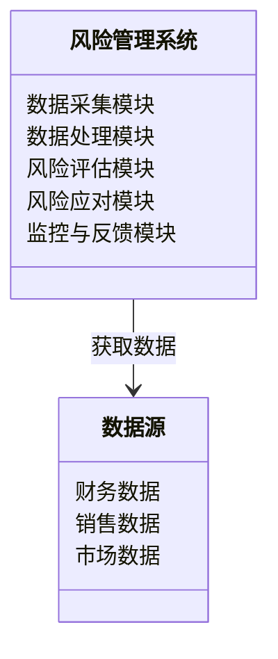

                 


# 《构建智能企业风险管理系统：AI预测与防控》

## 关键词：风险管理, 人工智能, AI预测, 风险防控, 企业安全

## 摘要：本文系统地介绍了构建智能企业风险管理系统的核心理念、技术基础和实现方法。通过结合人工智能技术，详细探讨了风险预测与防控的算法原理、系统架构以及实际应用案例，为读者提供了从理论到实践的全面指导。

---

## 第1章：企业风险管理概述

### 1.1 企业风险管理的基本概念

#### 1.1.1 企业风险管理的定义与目标

企业风险管理（Enterprise Risk Management，ERM）是一种系统化的方法，用于识别、评估和应对可能影响企业目标实现的各种风险。其目标包括：

1. **保护企业资产**：确保企业的财务、声誉和资源不受损害。
2. **降低不确定性**：通过预测和应对潜在风险，减少对企业运营的影响。
3. **提高决策效率**：基于风险分析，做出更明智的商业决策。
4. **合规性**：确保企业在遵守相关法律法规的同时，稳健发展。

#### 1.1.2 风险管理的核心要素与流程

风险管理通常包括以下几个关键步骤：

1. **风险识别**：识别可能影响企业的各种风险因素，如市场风险、操作风险、信用风险等。
2. **风险评估**：分析每个风险的可能影响程度和发生概率。
3. **风险应对**：制定策略和措施，降低风险发生的可能性或影响。
4. **风险监控**：持续监测风险的变化，并根据需要调整应对策略。

#### 1.1.3 企业风险管理的重要性与挑战

企业风险管理的重要性体现在其能够帮助企业在复杂多变的环境中保持稳定和持续发展。然而，风险管理也面临诸多挑战，如数据的多样性和不完整性、模型的准确性和可解释性等。

---

### 1.2 AI在风险管理中的应用

#### 1.2.1 AI技术在企业风险管理中的优势

人工智能（AI）通过其强大的数据处理能力和学习能力，为风险管理带来了显著的优势：

1. **数据驱动的决策**：AI能够从大量数据中提取有价值的信息，帮助做出更精准的决策。
2. **实时监控**：AI可以实时分析数据，快速识别潜在风险，实现早期预警。
3. **自动化与智能化**：AI能够自动执行风险评估和预测，减少人为错误，提高效率。

#### 1.2.2 AI预测与防控的基本原理

AI预测的基本原理包括：

1. **数据采集与预处理**：收集相关数据，并进行清洗、转换等预处理步骤。
2. **特征提取**：从数据中提取有助于预测的关键特征。
3. **模型训练**：使用机器学习算法训练模型，使其能够识别风险模式。
4. **风险预测**：基于训练好的模型，预测未来的风险，并制定应对策略。

#### 1.2.3 企业风险管理的智能化转型

智能化转型意味着将传统的人工风险管理方式升级为基于AI的自动化系统。这种转型不仅提高了效率，还能够处理更复杂和动态的风险因素。

---

## 第2章：智能企业风险管理系统的核心概念

### 2.1 风险管理系统的基本架构

#### 2.1.1 系统的功能模块划分

智能风险管理系统通常包括以下几个核心模块：

1. **数据采集模块**：负责从多种来源（如数据库、API、传感器等）获取数据。
2. **数据处理模块**：对数据进行清洗、转换和增强。
3. **风险评估模块**：利用机器学习模型对风险进行预测和评估。
4. **风险应对模块**：根据评估结果，制定和执行应对策略。
5. **监控与反馈模块**：实时监控风险变化，并根据反馈调整系统。

#### 2.1.2 系统的输入与输出

- **输入**：包括原始数据、模型参数等。
- **输出**：包括风险预测结果、应对建议等。

#### 2.1.3 系统的核心算法与技术

系统的核心算法包括：

1. **监督学习**：如随机森林、支持向量机（SVM）等。
2. **无监督学习**：如聚类分析、异常检测等。
3. **深度学习**：如神经网络、LSTM等。

---

### 2.2 风险预测与防控的关键技术

#### 2.2.1 数据采集与预处理

- **数据来源**：企业内部数据（如财务数据、销售数据）和外部数据（如市场数据、新闻数据）。
- **数据预处理**：包括数据清洗、缺失值处理、特征工程等。

#### 2.2.2 风险特征提取与建模

- **特征提取**：通过主成分分析（PCA）等方法，提取关键特征。
- **模型建模**：选择合适的算法，构建预测模型。

#### 2.2.3 风险预测与决策优化

- **预测模型**：如逻辑回归、XGBoost等。
- **决策优化**：通过强化学习等技术，优化应对策略。

---

## 第3章：企业风险管理系统的核心要素

### 3.1 风险类型与特征

#### 3.1.1 常见的企业风险类型

- **财务风险**：如债务过高、现金流不足。
- **市场风险**：如市场需求波动、竞争加剧。
- **操作风险**：如流程失误、员工失误。

#### 3.1.2 风险特征的分类与分析

- **定量特征**：如财务指标、销售数据。
- **定性特征**：如市场趋势、政策变化。

#### 3.1.3 风险特征的量化与标准化

- **量化方法**：如Z-score标准化、min-max标准化。
- **标准化的意义**：确保模型输入的数据具有可比性。

---

### 3.2 系统设计的核心要素

#### 3.2.1 数据源的选择与整合

- **数据源**：企业内部数据库、第三方API、社交媒体等。
- **数据整合**：将多源数据整合到统一的数据仓库中。

#### 3.2.2 模型选择与优化策略

- **模型选择**：根据数据类型和任务选择合适的算法。
- **优化策略**：如网格搜索、交叉验证等。

#### 3.2.3 系统的可扩展性与可维护性

- **模块化设计**：确保系统各模块独立，便于扩展和维护。
- **接口设计**：提供清晰的API接口，方便与其他系统集成。

---

## 第4章：AI预测与防控的数学模型与算法

### 4.1 机器学习算法在风险预测中的应用

#### 4.1.1 线性回归模型

线性回归是一种简单的回归模型，适用于连续型风险预测。

- **数学模型**：$$ y = \beta_0 + \beta_1x + \epsilon $$
- **应用场景**：如销售预测、成本预测。

#### 4.1.2 支持向量机（SVM）

SVM适用于分类问题，常用于信用评分、欺诈检测等。

- **数学模型**：$$ f(x) = \text{sign}(w \cdot x + b) $$
- **优点**：适合高维数据，具有良好的泛化能力。

#### 4.1.3 随机森林与梯度提升树

随机森林是一种基于树的集成算法，常用于分类和回归问题。

- **数学模型**：多个决策树的集成预测。
- **优点**：抗过拟合，鲁棒性强。

---

### 4.2 时间序列分析与风险预测

#### 4.2.1 ARIMA模型

ARIMA（AutoRegressive Integrated Moving Average）常用于时间序列预测。

- **数学模型**：$$ ARIMA(p, d, q) $$
- **应用场景**：如股票价格预测、销售预测。

#### 4.2.2 LSTM网络

LSTM（长短期记忆网络）适用于时间序列数据，能够捕捉长期依赖关系。

- **数学模型**：包含输入门、遗忘门和输出门。
- **优点**：适合处理序列数据，能够记住长期信息。

#### 4.2.3 贝叶斯网络在时间序列中的应用

贝叶斯网络是一种概率图模型，适用于不确定性推理。

- **数学模型**：基于概率分布构建有向无环图。
- **优点**：能够处理不确定性，提供概率预测。

---

### 4.3 集成学习与模型优化

#### 4.3.1 Bagging与Boosting算法

- **Bagging**：通过 bootstrap 方法生成多个训练集，分别训练模型，然后进行投票或平均。
- **Boosting**：通过加权训练数据，逐步优化模型，如 AdaBoost、梯度提升。

#### 4.3.2 模型融合与投票

- **融合方法**：将多个模型的预测结果进行融合，如平均、加权投票等。
- **优点**：能够提高模型的准确性和稳定性。

---

## 第5章：系统架构与设计

### 5.1 系统功能设计

#### 5.1.1 领域模型（类图）

以下是领域模型的Mermaid图：



---

#### 5.1.2 系统架构设计

以下是系统架构的Mermaid图：


---

### 5.2 系统接口设计

系统接口设计包括：

1. **API接口**：如 RESTful API，用于数据交互。
2. **用户界面**：如 Web 界面，供用户查看和操作。

---

## 第6章：项目实战

### 6.1 环境配置

- **编程语言**：Python
- **框架**：Flask 或 Django
- **机器学习库**：Scikit-learn、XGBoost
- **深度学习库**：TensorFlow、Keras

### 6.2 核心功能实现

#### 6.2.1 风险预测模型实现

以下是风险预测模型的Python代码示例：

```python
from sklearn.ensemble import RandomForestClassifier
from sklearn.metrics import accuracy_score

# 数据预处理
X = data.drop(columns=['target'])
y = data['target']

# 模型训练
model = RandomForestClassifier()
model.fit(X, y)

# 预测
predictions = model.predict(X_test)
print("准确率:", accuracy_score(y_test, predictions))
```

#### 6.2.2 系统集成与部署

- **部署环境**：如 AWS、Azure
- **容器化**：使用 Docker 包装应用
- **自动化部署**：使用 CI/CD 工具

---

## 第7章：最佳实践与总结

### 7.1 最佳实践

1. **数据质量**：确保数据的准确性和完整性。
2. **模型可解释性**：选择易于解释的模型，便于业务人员理解。
3. **系统维护**：定期更新模型和数据，确保系统的有效性。

### 7.2 小结

通过本文的介绍，读者可以系统地了解如何利用AI技术构建智能企业风险管理系统，从理论到实践，全面掌握相关技术和方法。

---

## 参考文献

（此处列出相关书籍、论文、技术文档等参考资料）

---

希望这篇博客能够为您提供有价值的信息和启示！如果需要进一步讨论或补充，请随时告知！

