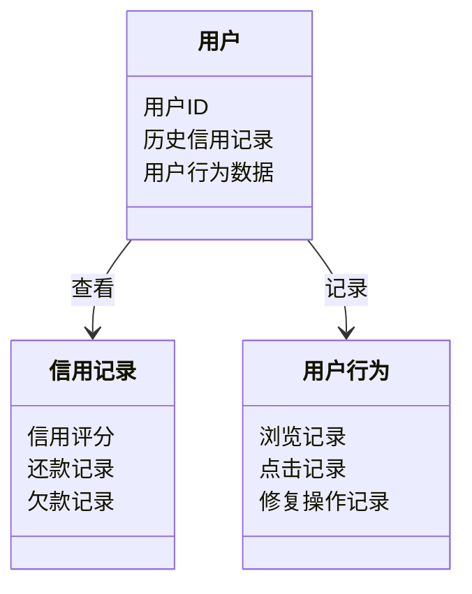
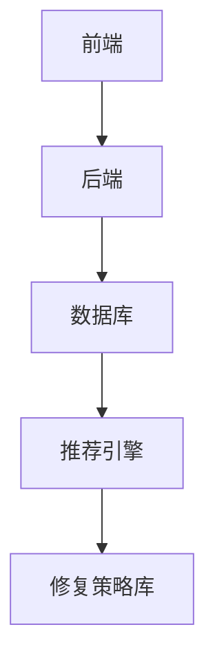
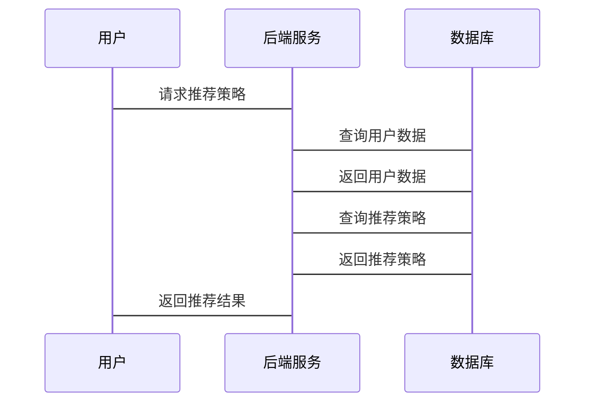

                 


接下来继续补充完成目录大纲：

---

# 第4章: 系统分析与架构设计方案

## 4.1 系统分析

### 4.1.1 问题场景介绍
#### 4.1.1.1 信用修复的典型场景
#### 4.1.1.2 系统的需求来源

### 4.1.2 系统的功能需求
#### 4.1.2.1 核心功能模块
#### 4.1.2.2 边缘功能模块

## 4.2 系统架构设计

### 4.2.1 领域模型设计
#### 4.2.1.1 领域模型类图（Mermaid）
```

```

### 4.2.2 系统架构设计
#### 4.2.2.1 系统整体架构（Mermaid）
```

```

### 4.2.3 接口设计
#### 4.2.3.1 RESTful API定义
#### 4.2.3.2 输入输出参数说明
#### 4.2.3.3 返回格式

### 4.2.4 系统交互流程图（Mermaid）
```

```

## 4.3 系统实现的关键点
### 4.3.1 数据模型设计
### 4.3.2 系统模块划分
### 4.3.3 系统性能优化

---

# 第5章: 项目实战——构建智能化的个人信用修复策略推荐系统

## 5.1 环境搭建与开发工具安装

### 5.1.1 安装Python与开发库
#### 5.1.1.1 安装Python
#### 5.1.1.2 安装开发库（如pandas、numpy、scikit-learn、xgboost等）
#### 5.1.1.3 安装IDE（如PyCharm、Jupyter Notebook）

### 5.1.2 数据获取与预处理
#### 5.1.2.1 数据来源
#### 5.1.2.2 数据清洗
#### 5.1.2.3 数据增强

## 5.2 系统核心功能实现

### 5.2.1 数据预处理代码实现
#### 5.2.1.1 数据加载与清洗
```python
import pandas as pd
import numpy as np

# 加载数据
df = pd.read_csv('credit_data.csv')

# 数据清洗
df.dropna(inplace=True)
df = df[~df['credit_score'].isnull()]
```

### 5.2.2 推荐模型训练与优化
#### 5.2.2.1 协同过滤算法实现
```python
from sklearn.metrics.pairwise import cosine_similarity

# 计算用户-物品相似度矩阵
similarity_matrix = cosine_similarity(df[['feature1', 'feature2']], df[['feature1', 'feature2']])
```

### 5.2.3 系统接口开发
#### 5.2.3.1 接口定义
```python
from flask import Flask, request, jsonify

app = Flask(__name__)

@app.route('/recommend', methods=['POST'])
def recommend():
    user_id = request.json['user_id']
    # 推荐逻辑
    recommendations = get_recommendations(user_id)
    return jsonify({'recommendations': recommendations})
```

## 5.3 项目实现与测试

### 5.3.1 系统测试
#### 5.3.1.1 功能测试
#### 5.3.1.2 性能测试
#### 5.3.1.3 安全测试

### 5.3.2 系统部署与上线
#### 5.3.2.1 系统部署步骤
#### 5.3.2.2 系统监控与维护

## 5.4 实际案例分析与总结

### 5.4.1 实际案例分析
#### 5.4.1.1 案例背景
#### 5.4.1.2 系统应用效果

### 5.4.2 项目总结与经验分享
#### 5.4.2.1 项目小结
#### 5.4.2.2 经验总结
#### 5.4.2.3 未来改进方向

---

# 第6章: 最佳实践与系统优化

## 6.1 系统优化建议

### 6.1.1 数据质量优化
#### 6.1.1.1 数据清洗策略
#### 6.1.1.2 数据增强方法

### 6.1.2 模型优化策略
#### 6.1.2.1 超参数调优
#### 6.1.2.2 模型融合

## 6.2 系统维护与监控

### 6.2.1 日志管理
#### 6.2.1.1 日志记录
#### 6.2.1.2 日志分析

### 6.2.2 性能监控
#### 6.2.2.1 常见性能指标
#### 6.2.2.2 性能调优方法

## 6.3 最佳实践总结

### 6.3.1 系统设计中的注意事项
#### 6.3.1.1 数据隐私保护
#### 6.3.1.2 系统可扩展性

### 6.3.2 项目实施中的经验分享
#### 6.3.2.1 团队协作
#### 6.3.2.2 技术选型

---

# 附录: 参考文献与扩展阅读

## 附录A: 参考文献
### 1. 书籍
### 2. 论文
### 3. 网站与博客

## 附录B: 工具与库
### 1. 开发工具
### 2. 第三方库
### 3. 开发文档

## 附录C: 代码仓库
### 1. 项目源码
### 2. 代码示例
### 3. 使用说明

---

通过上述目录大纲，您可以逐步构建一个智能化的个人信用修复策略推荐系统，从理论到实践，全面掌握系统设计、实现与优化的全过程。

