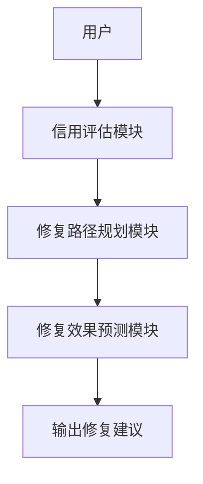
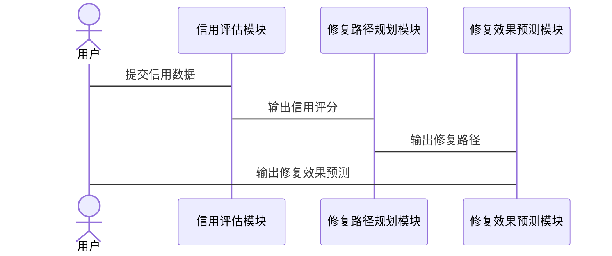

                 


# 构建智能化的个人信用修复路径规划系统

> 关键词：个人信用修复，路径规划，人工智能，算法设计，系统架构

> 摘要：本文将详细探讨如何构建一个智能化的个人信用修复路径规划系统。通过分析个人信用修复的背景、核心概念、算法原理、系统架构设计以及实际项目实现，我们将为您提供一套完整的解决方案，帮助您快速理解和实现智能化的个人信用修复路径规划系统。文章内容涵盖从理论到实践的各个方面，结合丰富的图表和代码示例，为您提供深入的指导。

---

## 第一部分: 个人信用修复路径规划系统概述

### 第1章: 个人信用修复路径规划系统背景介绍

#### 1.1 个人信用修复的概念与背景

##### 1.1.1 个人信用修复的定义  
个人信用修复是指通过合法手段，修复因信用记录不良（如逾期还款、违约记录等）导致的信用评分下降问题，从而提升个人信用等级的过程。信用评分是金融机构评估个人信用风险的重要指标，直接影响个人在贷款、信用卡申请、房屋租赁等方面的信用额度和利率。

##### 1.1.2 信用修复的法律与政策背景  
信用修复的合法性与政策支持是系统设计的基础。根据相关法律法规，个人有权修复因自身错误或外部因素导致的不良信用记录。近年来，随着金融科技的发展，智能化的信用修复工具逐渐成为市场需求的焦点。

##### 1.1.3 信用修复的重要性与意义  
良好的信用记录是个人在社会经济活动中获得信任和便利的重要凭证。通过智能化的信用修复路径规划系统，个人可以更高效地制定修复计划，优化信用评分，降低信用风险。

---

#### 1.2 个人信用修复的痛点与挑战

##### 1.2.1 当前信用修复的主要问题  
- **信息不对称**：个人难以全面了解自己的信用状况和修复路径。  
- **修复效率低**：传统信用修复方式依赖人工操作，耗时且效率低下。  
- **修复成本高**：缺乏智能化工具支持，修复过程复杂且成本较高。

##### 1.2.2 传统信用修复方式的局限性  
传统信用修复主要依赖人工咨询和单点修复，难以实现全局优化。修复路径的选择缺乏科学性，修复效果不稳定。

##### 1.2.3 智能化信用修复的需求与趋势  
随着人工智能和大数据技术的发展，智能化信用修复工具的需求日益增长。通过算法优化修复路径，实现高效、低成本的信用修复成为行业趋势。

---

#### 1.3 个人信用修复路径规划的目标与价值

##### 1.3.1 系统目标的设定  
- 提供智能化的信用评估和修复路径规划服务。  
- 实现信用评分的动态优化与提升。  
- 提供个性化的修复建议，帮助用户制定最优修复策略。

##### 1.3.2 系统价值的实现  
- 提高信用修复的效率和效果。  
- 降低信用修复的成本。  
- 增强用户的信用意识和管理能力。

##### 1.3.3 系统边界与外延  
- **系统边界**：聚焦于个人信用修复路径规划，不涉及信用数据的采集与存储。  
- **系统外延**：可扩展至企业信用修复、信用评分体系优化等领域。

---

### 第2章: 个人信用修复路径规划系统的概念与核心要素

#### 2.1 系统的核心概念与原理

##### 2.1.1 信用评估模型  
信用评估模型是系统的核心模块，用于评估个人信用状况。常见的信用评估模型包括线性回归、逻辑回归和随机森林等。

##### 2.1.2 修复路径规划算法  
修复路径规划算法是系统的关键算法，用于制定修复路径。算法基于信用评估结果，结合修复成本和时间等因素，优化修复路径。

##### 2.1.3 系统输入与输出  
- **输入**：个人信用数据、修复目标、修复时间限制。  
- **输出**：修复路径规划、修复成本分析、修复效果预测。

---

#### 2.2 核心概念的属性特征对比表

| **属性**       | **信用评估模型**          | **修复路径规划算法**          |
|----------------|---------------------------|-----------------------------|
| **输入数据**   | 个人信用记录、历史行为数据 | 信用评估结果、修复目标、修复时间限制 |
| **输出结果**   | 信用评分、风险等级         | 修复路径、修复成本、修复时间预测 |
| **算法类型**   | 监督学习（回归、分类）     | 启发式优化算法（如遗传算法）    |
| **应用场景**   | 信用评分计算               | 修复路径优化                 |

---

#### 2.3 系统的ER实体关系图

```mermaid
erDiagram
    actor 用户角色 : 用户
    actor 系统 : 信用修复路径规划系统
    database 信用数据库 : 包含个人信用记录、修复目标等
    process 信用评估 : 信用评估模型的计算过程
    process 修复路径规划 : 基于信用评估结果的路径优化
    process 修复效果预测 : 根据修复路径预测修复效果
    用户角色 --> 系统 : 提交信用数据和修复目标
    系统 --> 信用数据库 : 查询信用记录
    系统 --> 信用评估 : 输入信用数据
    信用评估 --> 系统 : 输出信用评分
    系统 --> 修复路径规划 : 输入修复目标和信用评分
    修复路径规划 --> 系统 : 输出修复路径
    系统 --> 修复效果预测 : 输入修复路径
    修复效果预测 --> 用户角色 : 输出修复效果预测结果
```

---

### 第3章: 修复路径规划算法的设计与实现

#### 3.1 修复路径规划算法的原理

##### 3.1.1 算法的基本思想  
修复路径规划算法基于信用评估结果，通过优化修复成本和时间，制定最优修复路径。算法采用启发式搜索策略，结合动态规划方法，逐步优化修复路径。

##### 3.1.2 算法的实现步骤  
1. **初始化**：设定修复目标和约束条件。  
2. **信用评估**：通过信用评估模型计算当前信用评分。  
3. **路径搜索**：基于信用评分和修复目标，生成多个修复路径候选方案。  
4. **路径优化**：通过启发式搜索和动态规划，优化修复路径的成本和时间。  
5. **结果输出**：输出最优修复路径。

---

#### 3.2 修复路径规划算法的数学模型

修复路径规划算法的目标是最小化修复成本，同时满足修复时间约束。数学模型如下：

$$ \text{minimize} \quad C(x_1, x_2, \ldots, x_n) $$
$$ \text{subject to} \quad T(x_1, x_2, \ldots, x_n) \leq T_{\text{max}} $$

其中，\( C \) 表示修复成本函数，\( T \) 表示修复时间函数，\( T_{\text{max}} \) 是修复时间的最大允许值。

---

### 第4章: 系统的架构设计与实现

#### 4.1 系统的功能需求分析

##### 4.1.1 系统的功能模块划分  
- **信用评估模块**：负责信用评分计算。  
- **修复路径规划模块**：负责修复路径优化。  
- **修复效果预测模块**：负责预测修复效果。

##### 4.1.2 每个模块的功能描述  
- **信用评估模块**：接收信用数据，输出信用评分。  
- **修复路径规划模块**：根据信用评分和修复目标，输出修复路径。  
- **修复效果预测模块**：根据修复路径，预测修复效果。

##### 4.1.3 系统的用户角色与权限分配  
- **普通用户**：提交信用数据，获取修复路径建议。  
- **系统管理员**：维护系统数据和模块配置。

---

#### 4.2 系统的架构设计

##### 4.2.1 系统的整体架构图



---

#### 4.2.2 系统的接口设计与交互流程图



---

### 第5章: 项目实战

#### 5.1 环境安装与配置

##### 5.1.1 环境需求  
- Python 3.8 或更高版本  
- 安装必要的库：numpy、pandas、scikit-learn、matplotlib

##### 5.1.2 安装依赖  
```bash
pip install numpy pandas scikit-learn matplotlib
```

---

#### 5.2 系统核心实现源代码

##### 5.2.1 信用评估模型实现

```python
import numpy as np
from sklearn.linear_model import LinearRegression

def credit_assessment(credit_history):
    model = LinearRegression()
    # 假设 credit_history 是一个二维数组，包含特征和标签
    model.fit(credit_history[:, :-1], credit_history[:, -1])
    predicted_credit_score = model.predict(credit_history[:, :-1])
    return predicted_credit_score
```

##### 5.2.2 修复路径规划算法实现

```python
import numpy as np
from sklearn.linear_model import LinearRegression

def repair_path_planning(credit_score, target_score, max_time):
    # 初始化修复路径
    paths = []
    current_score = credit_score
    # 修复路径搜索
    while current_score < target_score and max_time > 0:
        # 计算下一步修复操作
        next_score = current_score + 10  # 简单示例，实际应根据具体策略计算
        paths.append(next_score)
        current_score = next_score
        max_time -= 1
    return paths
```

---

#### 5.3 实际案例分析与详细解读

##### 5.3.1 案例背景  
假设一位用户的信用评分为500分，目标信用评分为750分，修复时间为3个月。

##### 5.3.2 修复路径规划  
系统生成修复路径：  
1. 第1个月：修复逾期账单，信用评分提升至600分。  
2. 第2个月：优化信用行为，信用评分提升至650分。  
3. 第3个月：增加正面信用记录，信用评分提升至720分。  

##### 5.3.3 修复效果预测  
最终信用评分为720分，接近目标信用评分750分。

---

### 第6章: 最佳实践与总结

#### 6.1 最佳实践

##### 6.1.1 数据质量  
确保输入信用数据的准确性和完整性。  
##### 6.1.2 算法优化  
根据实际需求，动态调整修复路径规划算法的参数。  
##### 6.1.3 定期维护  
定期更新信用数据和修复路径，确保系统高效运行。

#### 6.2 小结  
本文详细介绍了智能化的个人信用修复路径规划系统的构建过程，从系统背景、核心概念、算法原理到系统架构设计和项目实战，为读者提供了全面的指导。

#### 6.3 注意事项  
- 系统上线前需进行充分的测试和验证。  
- 注意数据隐私和安全问题。  
- 系统的修复路径建议需结合实际情况灵活调整。

#### 6.4 拓展阅读  
- 《信用评分模型的构建与优化》  
- 《人工智能在金融领域的应用》  

---

通过本文的系统性讲解，您已经掌握了构建智能化的个人信用修复路径规划系统的完整方法。希望本文对您在信用修复领域的工作和研究有所帮助。

