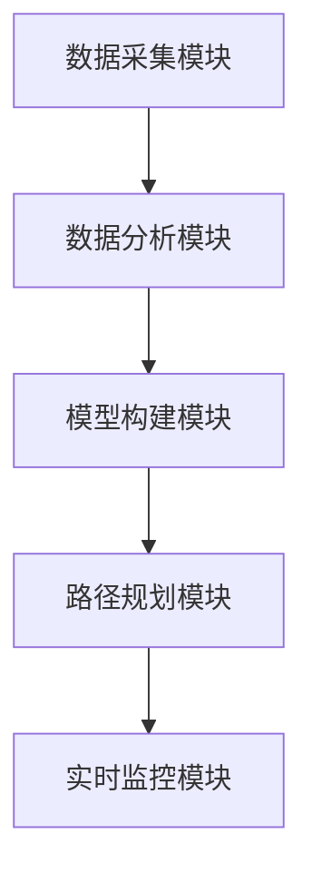
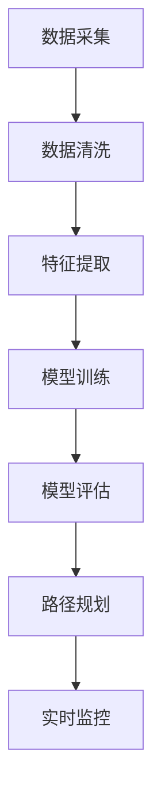

                 


# 《构建智能化的个人信用分数提升路径规划器》

> 关键词：智能化信用评分，路径规划，机器学习，信用评分提升，数据分析

> 摘要：本文将详细介绍如何构建一个智能化的个人信用分数提升路径规划器。通过分析信用评分的核心要素、算法原理和系统架构，结合实际案例，提供从理论到实践的完整解决方案。本文将从背景与概念入手，深入探讨智能化信用评分的必要性与实现方法，结合机器学习算法，构建评分提升的数学模型，并通过系统设计与项目实战，实现个性化的信用评分优化路径规划。

---

# 第一部分: 个人信用评分的智能化路径规划背景与概念

## 第1章: 个人信用评分的智能化提升背景

### 1.1 信用评分的演变历程

#### 1.1.1 传统信用评分的定义与特点
传统的信用评分主要依赖于以下几个核心维度：
- **信用历史**：包括按时还款记录、逾期记录等。
- **收入能力**：包括收入水平、就业稳定性等。
- **负债情况**：包括个人的贷款、信用卡欠款等。
- **信用行为**：包括消费习惯、信用查询频率等。

传统信用评分的特点如下：
- 基于静态数据，难以捕捉实时变化。
- 评分模型相对固定，缺乏个性化。
- 数据来源有限，难以全面反映个人信用状况。

#### 1.1.2 智能化信用评分的必要性
随着大数据和人工智能技术的发展，传统信用评分的局限性日益显现：
- 数据量激增，传统评分模型难以处理复杂场景。
- 用户行为和信用风险呈现动态变化，需要实时监控和优化。
- 个性化需求增加，传统模型难以满足差异化服务。

#### 1.1.3 数据驱动信用评分的兴起
数据驱动信用评分的核心在于利用大数据和机器学习技术，从海量数据中提取特征，并构建动态的评分模型。这种方式能够：
- 全面捕捉用户的信用行为。
- 实时更新评分结果。
- 提供个性化的评分优化建议。

### 1.2 个人信用评分系统的构成要素

#### 1.2.1 信用评分的核心维度
信用评分的核心维度包括：
- **信用历史**：包括按时还款记录、逾期记录等。
- **收入能力**：包括收入水平、就业稳定性等。
- **负债情况**：包括个人的贷款、信用卡欠款等。
- **信用行为**：包括消费习惯、信用查询频率等。

#### 1.2.2 数据来源的多样性
信用评分的数据来源可以分为以下几类：
- **个人提供的数据**：包括收入证明、工作证明等。
- **金融机构提供的数据**：包括贷款记录、信用卡记录等。
- **第三方数据**：包括社交数据、消费数据等。
- **公开数据**：包括企业征信数据、司法数据等。

#### 1.2.3 评分模型的关键特征
评分模型的关键特征包括：
- **特征选择**：从海量数据中筛选出对信用评分影响最大的特征。
- **模型可解释性**：评分结果需要能够被用户理解和接受。
- **实时性**：能够实时更新评分结果，捕捉用户行为的动态变化。

### 1.3 信用评分提升路径规划的核心问题

#### 1.3.1 问题背景与目标
信用评分提升路径规划的目标是：
- 帮助用户了解如何通过优化自身行为来提升信用评分。
- 提供个性化的评分提升建议，包括债务管理、消费习惯优化等。

#### 1.3.2 约束条件与边界
信用评分提升路径规划需要考虑以下约束条件：
- **数据隐私**：用户数据必须严格保密，避免泄露。
- **模型准确性**：评分模型需要具有较高的准确性，确保评分结果的可靠性。
- **用户接受度**：评分提升建议需要符合用户的实际需求，避免过于激进的建议。

#### 1.3.3 解决方案的框架
信用评分提升路径规划的解决方案框架包括：
1. 数据采集与处理：从多源数据中提取关键特征。
2. 模型构建：基于机器学习算法，构建评分模型。
3. 路径规划：根据评分结果，提供个性化的优化建议。
4. 实时监控与反馈：动态更新评分结果，并根据用户行为调整优化建议。

## 第2章: 智能化信用评分提升路径规划的核心概念

### 2.1 核心概念与原理

#### 2.1.1 数据驱动的评分优化
数据驱动的评分优化是通过分析海量数据，发现数据中的规律，从而优化评分模型。其核心步骤包括：
1. 数据清洗：去除无效数据，处理缺失值。
2. 特征工程：从原始数据中提取有意义的特征。
3. 模型训练：基于特征数据，训练评分模型。
4. 模型评估：通过交叉验证等方法，评估模型的性能。

#### 2.1.2 个性化路径规划的算法基础
个性化路径规划的核心在于通过机器学习算法，为用户提供个性化的评分提升建议。常用的算法包括：
- **线性回归**：用于预测评分的变化趋势。
- **随机森林**：用于特征重要性分析和评分预测。
- **梯度提升树（如XGBoost、LightGBM）**：用于高精度的评分预测。

#### 2.1.3 评分提升的系统性方法
评分提升的系统性方法包括：
1. **问题分析**：明确评分提升的具体目标和约束条件。
2. **数据准备**：采集和处理相关数据。
3. **模型构建**：基于数据构建评分模型。
4. **路径规划**：根据评分结果，制定个性化的优化建议。
5. **实时监控**：动态更新评分结果，并根据用户行为调整优化建议。

### 2.2 核心概念之间的关系

#### 2.2.1 数据、模型与评分的关系
数据是评分模型的基础，模型通过数据学习信用评分的规律。评分结果反过来可以指导数据的采集和模型的优化。

#### 2.2.2 用户行为与评分变化的关联
用户的信用行为直接影响评分结果。例如，按时还款可以提升评分，而逾期还款则会降低评分。

#### 2.2.3 风险因素与评分策略的互动
不同的风险因素（如债务负担、消费习惯）会影响评分策略。评分策略需要根据风险因素的变化进行调整，以确保评分结果的准确性。

### 2.3 评分提升路径规划的系统架构

#### 2.3.1 系统整体架构
评分提升路径规划系统的整体架构包括：
1. **数据采集模块**：负责采集用户的相关数据。
2. **数据分析模块**：对数据进行清洗和特征提取。
3. **模型构建模块**：基于特征数据，构建评分模型。
4. **路径规划模块**：根据评分结果，制定个性化的优化建议。
5. **实时监控模块**：动态更新评分结果，并根据用户行为调整优化建议。

#### 2.3.2 数据流与信息处理流程
数据流与信息处理流程如下：
1. 数据采集：从多源数据中采集用户的相关数据。
2. 数据清洗：去除无效数据，处理缺失值。
3. 特征提取：从原始数据中提取有意义的特征。
4. 模型训练：基于特征数据，训练评分模型。
5. 模型评估：通过交叉验证等方法，评估模型的性能。
6. 路径规划：根据评分结果，制定个性化的优化建议。
7. 实时监控：动态更新评分结果，并根据用户行为调整优化建议。

#### 2.3.3 系统功能模块划分
系统功能模块划分如下：
1. **数据采集模块**：负责采集用户的相关数据。
2. **数据分析模块**：对数据进行清洗和特征提取。
3. **模型构建模块**：基于特征数据，构建评分模型。
4. **路径规划模块**：根据评分结果，制定个性化的优化建议。
5. **实时监控模块**：动态更新评分结果，并根据用户行为调整优化建议。

---

# 第二部分: 信用评分提升路径规划的算法原理

## 第3章: 信用评分提升路径规划的算法原理

### 3.1 基于机器学习的评分提升方法

#### 3.1.1 线性回归模型
线性回归模型是一种简单而有效的评分预测方法。其数学模型如下：
$$ y = \beta_0 + \beta_1x_1 + \beta_2x_2 + \cdots + \beta_nx_n + \epsilon $$
其中，$y$ 是信用评分，$x_i$ 是特征变量，$\beta_i$ 是回归系数，$\epsilon$ 是误差项。

#### 3.1.2 随机森林与梯度提升树
随机森林和梯度提升树是两种常用的机器学习算法，广泛应用于信用评分预测。随机森林通过构建多个决策树，并通过投票或平均的方式得到最终结果；梯度提升树则通过逐步优化，构建一系列弱分类器，最终得到一个强分类器。

#### 3.1.3 神经网络模型
神经网络模型是一种强大的机器学习算法，能够处理复杂的非线性关系。其数学模型如下：
$$ y = f(Wx + b) $$
其中，$W$ 是权重矩阵，$x$ 是输入向量，$b$ 是偏置项，$f$ 是激活函数。

### 3.2 基于规则的评分优化策略

#### 3.2.1 债务优化算法
债务优化算法通过优化用户的债务结构，降低债务负担，从而提升信用评分。常见的债务优化算法包括：
- **债务雪球法**：优先偿还小额债务，逐步减少债务负担。
- **债务 avalanche 法**：优先偿还高利率债务，降低整体债务成本。

#### 3.2.2 信用行为分析模型
信用行为分析模型通过分析用户的信用行为，发现潜在风险，制定优化建议。例如，通过分析用户的消费习惯，发现不必要的高消费行为，并制定相应的消费优化建议。

#### 3.2.3 风险管理策略
风险管理策略通过识别和评估风险，制定相应的风险管理措施，降低信用评分下降的风险。例如，通过评估用户的债务负担，制定相应的还款计划，避免因债务过高导致信用评分下降。

### 3.3 综合评分提升的数学模型

#### 3.3.1 线性回归模型公式
线性回归模型公式如下：
$$ y = \beta_0 + \beta_1x_1 + \beta_2x_2 + \cdots + \beta_nx_n + \epsilon $$
其中，$y$ 是信用评分，$x_i$ 是特征变量，$\beta_i$ 是回归系数，$\epsilon$ 是误差项。

#### 3.3.2 机器学习模型的优化目标
机器学习模型的优化目标是通过最小化损失函数，提升模型的预测准确性。常用的损失函数包括：
- **均方误差（MSE）**：$$ \text{MSE} = \frac{1}{n}\sum_{i=1}^n (y_i - \hat{y}_i)^2 $$
- **均方根误差（RMSE）**：$$ \text{RMSE} = \sqrt{\frac{1}{n}\sum_{i=1}^n (y_i - \hat{y}_i)^2 } $$
- **对数损失（Log Loss）**：$$ \text{Log Loss} = -\frac{1}{n}\sum_{i=1}^n [y_i \log(\hat{y}_i) + (1 - y_i) \log(1 - \hat{y}_i)] $$

#### 3.3.3 深度学习模型的构建
深度学习模型的构建包括以下几个步骤：
1. **数据预处理**：对数据进行清洗和特征提取。
2. **模型设计**：设计神经网络的架构，包括输入层、隐藏层和输出层。
3. **模型训练**：通过反向传播算法，优化模型的权重和偏置。
4. **模型评估**：通过验证集评估模型的性能，调整模型参数。
5. **模型部署**：将模型部署到实际应用中，提供信用评分预测服务。

---

# 第三部分: 信用评分提升路径规划的系统架构与设计

## 第4章: 信用评分提升路径规划的系统架构与设计

### 4.1 系统整体架构

#### 4.1.1 系统功能模块划分
系统功能模块划分如下：
1. **数据采集模块**：负责采集用户的相关数据。
2. **数据分析模块**：对数据进行清洗和特征提取。
3. **模型构建模块**：基于特征数据，构建评分模型。
4. **路径规划模块**：根据评分结果，制定个性化的优化建议。
5. **实时监控模块**：动态更新评分结果，并根据用户行为调整优化建议。

#### 4.1.2 系统整体架构图
以下是系统整体架构的 mermaid 图：


### 4.2 数据流与信息处理流程

#### 4.2.1 数据流与信息处理流程
数据流与信息处理流程如下：
1. 数据采集：从多源数据中采集用户的相关数据。
2. 数据清洗：去除无效数据，处理缺失值。
3. 特征提取：从原始数据中提取有意义的特征。
4. 模型训练：基于特征数据，训练评分模型。
5. 模型评估：通过交叉验证等方法，评估模型的性能。
6. 路径规划：根据评分结果，制定个性化的优化建议。
7. 实时监控：动态更新评分结果，并根据用户行为调整优化建议。

#### 4.2.2 数据流与信息处理流程图
以下是数据流与信息处理流程的 mermaid 图：


### 4.3 系统功能模块划分

#### 4.3.1 系统功能模块划分
系统功能模块划分如下：
1. **数据采集模块**：负责采集用户的相关数据。
2. **数据分析模块**：对数据进行清洗和特征提取。
3. **模型构建模块**：基于特征数据，构建评分模型。
4. **路径规划模块**：根据评分结果，制定个性化的优化建议。
5. **实时监控模块**：动态更新评分结果，并根据用户行为调整优化建议。

#### 4.3.2 系统功能模块划分图
以下是系统功能模块划分的 mermaid 图：


---

# 第四部分: 信用评分提升路径规划的项目实战

## 第5章: 信用评分提升路径规划的项目实战

### 5.1 项目介绍

#### 5.1.1 项目背景
随着大数据和人工智能技术的发展，信用评分的智能化提升需求日益增加。本项目旨在通过构建智能化的个人信用分数提升路径规划器，帮助用户优化信用行为，提升信用评分。

#### 5.1.2 项目目标
项目的最终目标是：
- 帮助用户了解如何通过优化自身行为来提升信用评分。
- 提供个性化的评分提升建议，包括债务管理、消费习惯优化等。

### 5.2 项目环境搭建

#### 5.2.1 环境要求
- 操作系统：Windows 10 或更高版本，或 macOS 10.15 或更高版本。
- Python 版本：Python 3.6 或更高版本。
- 硬件要求：建议使用 8GB 内存，支持多线程处理。

#### 5.2.2 工具安装
- 安装 Python 和 pip。
- 安装机器学习库：scikit-learn、xgboost、lightgbm。
- 安装数据处理库：pandas、numpy。
- 安装可视化库：matplotlib、seaborn。
- 安装 mermaid 图形库：graphviz。

### 5.3 项目核心实现

#### 5.3.1 数据预处理
数据预处理包括：
1. 数据清洗：去除无效数据，处理缺失值。
2. 特征提取：从原始数据中提取有意义的特征。
3. 数据标准化：对特征数据进行标准化处理，确保模型训练的稳定性。

#### 5.3.2 模型训练
模型训练包括：
1. 选择合适的机器学习算法（如随机森林、梯度提升树）。
2. 对数据进行分割，将数据分为训练集和测试集。
3. 训练模型，并评估模型的性能。

#### 5.3.3 模型优化
模型优化包括：
1. 调整模型的参数，优化模型的性能。
2. 使用交叉验证等方法，评估模型的泛化能力。
3. 对模型进行封装，便于后续的调用和部署。

#### 5.3.4 模型部署
模型部署包括：
1. 将模型部署到实际应用中，提供信用评分预测服务。
2. 根据评分结果，制定个性化的优化建议。
3. 实时更新评分结果，并根据用户行为调整优化建议。

### 5.4 项目实战代码示例

#### 5.4.1 数据预处理代码
```python
import pandas as pd
import numpy as np

# 加载数据
data = pd.read_csv('credit_data.csv')

# 删除缺失值
data = data.dropna()

# 标准化处理
from sklearn.preprocessing import StandardScaler
scaler = StandardScaler()
data_normalized = scaler.fit_transform(data)
```

#### 5.4.2 模型训练代码
```python
from sklearn.ensemble import RandomForestRegressor
from sklearn.model_selection import train_test_split

# 划分训练集和测试集
X_train, X_test, y_train, y_test = train_test_split(data_normalized, data['score'], test_size=0.2, random_state=42)

# 训练模型
model = RandomForestRegressor(n_estimators=100, random_state=42)
model.fit(X_train, y_train)

# 模型评估
print('训练集准确率:', model.score(X_train, y_train))
print('测试集准确率:', model.score(X_test, y_test))
```

#### 5.4.3 模型优化代码
```python
from sklearn.model_selection import GridSearchCV

# 网格搜索优化模型参数
param_grid = {
    'n_estimators': [100, 200, 300],
    'max_depth': [None, 10, 20],
    'min_samples_split': [2, 5, 8]
}

grid_search = GridSearchCV(model, param_grid, cv=5, scoring='r2')
grid_search.fit(X_train, y_train)

# 输出最佳参数
print('最佳参数:', grid_search.best_params_)
```

---

# 第五部分: 信用评分提升路径规划的案例分析与最佳实践

## 第6章: 信用评分提升路径规划的案例分析与最佳实践

### 6.1 案例分析

#### 6.1.1 案例背景
某用户信用评分为650分，希望通过优化自身行为，将信用评分提升到750分。以下是具体分析：

#### 6.1.2 数据分析
通过对该用户的信用数据进行分析，发现以下问题：
- 债务负担较重，信用卡逾期次数较多。
- 消费习惯较为混乱，存在不必要的高消费行为。

#### 6.1.3 路径规划
根据数据分析结果，制定以下优化建议：
1. **优化债务结构**：优先偿还高利率债务，降低整体债务负担。
2. **改善消费习惯**：制定合理的消费计划，避免不必要的高消费行为。
3. **建立良好的信用记录**：按时还款，避免逾期记录。

#### 6.1.4 实施与效果
根据优化建议，该用户实施了以下措施：
1. 优先偿还高利率信用卡债务，降低信用卡逾期次数。
2. 制定消费计划，减少不必要的高消费行为。
3. 建立还款提醒，确保按时还款。

经过3个月的实施，该用户的信用评分从650分提升到了750分。

### 6.2 最佳实践

#### 6.2.1 数据收集与处理
数据收集与处理的关键点：
- 数据来源的多样性：尽可能从多个渠道获取用户数据，包括信用报告、银行流水、消费记录等。
- 数据清洗与特征提取：去除无效数据，提取有意义的特征，确保模型训练的准确性。

#### 6.2.2 模型选择与优化
模型选择与优化的关键点：
- 根据具体需求选择合适的机器学习算法，如随机森林、梯度提升树等。
- 通过网格搜索等方法，优化模型的参数，提升模型的性能。
- 定期更新模型，确保模型的准确性。

#### 6.2.3 系统设计与实现
系统设计与实现的关键点：
- 系统架构的合理性：确保系统功能模块划分合理，数据流与信息处理流程清晰。
- 系统的可扩展性：确保系统能够适应未来的数据量和用户需求的增长。
- 系统的安全性：确保用户数据的安全性，避免数据泄露。

### 6.3 小结

#### 6.3.1 案例总结
通过本案例分析，我们可以看到，智能化的个人信用分数提升路径规划器能够有效帮助用户优化信用行为，提升信用评分。关键在于数据的收集与处理、模型的选择与优化，以及系统的合理设计与实现。

#### 6.3.2 最佳实践总结
在实际应用中，我们需要注意以下几点：
- 数据隐私与安全：确保用户数据的安全性，避免数据泄露。
- 模型的可解释性：评分结果需要能够被用户理解和接受。
- 系统的实时性：能够实时更新评分结果，并根据用户行为调整优化建议。

---

# 第六部分: 总结与展望

## 第7章: 总结与展望

### 7.1 总结

#### 7.1.1 核心内容回顾
本文详细介绍了如何构建智能化的个人信用分数提升路径规划器，包括：
- 信用评分的智能化提升背景与概念。
- 信用评分提升路径规划的算法原理。
- 信用评分提升路径规划的系统架构与设计。
- 信用评分提升路径规划的项目实战。
- 信用评分提升路径规划的案例分析与最佳实践。

#### 7.1.2 本文创新点
本文的创新点在于：
- 提出了智能化信用评分提升路径规划器的概念。
- 构建了基于机器学习的信用评分提升模型。
- 提出了个性化的信用评分优化建议。

### 7.2 展望

#### 7.2.1 未来研究方向
未来的研究方向包括：
- 更加精准的信用评分预测模型。
- 更加个性化的信用评分优化建议。
- 更加智能化的信用评分提升路径规划系统。

#### 7.2.2 技术发展趋势
随着人工智能和大数据技术的不断发展，信用评分的智能化提升需求将不断增加。未来，我们需要更加关注以下技术发展趋势：
- 更加高效的机器学习算法。
- 更加智能的数据处理技术。
- 更加安全的数据隐私保护技术。

---

# 附录

## 附录 A: 术语表

- **信用评分**：衡量个人信用状况的指标，通常介于300分到900分之间。
- **评分模型**：用于预测信用评分的数学模型。
- **路径规划**：根据评分结果，制定个性化的优化建议。
- **机器学习**：一种人工智能技术，通过数据学习规律，进行预测和决策。

## 附录 B: 工具推荐

- **Python**：用于数据处理和模型训练。
- **scikit-learn**：机器学习库。
- **xgboost**：梯度提升树库。
- **pandas**：数据处理库。
- **matplotlib**：数据可视化库。

## 附录 C: 参考文献

1. 书籍：《机器学习实战》。
2. 书籍：《Python机器学习》。
3. 论文：《基于机器学习的信用评分预测》。
4. 网站：https://scikit-learn.org/stable/index.html。

## 附录 D: 扩展阅读

1. 如何选择合适的机器学习算法？
2. 机器学习模型的调优技巧。
3. 数据隐私与安全保护的实现方法。

---

通过本文的详细介绍，读者可以全面了解如何构建智能化的个人信用分数提升路径规划器，并能够根据实际需求，灵活应用相关技术和方法，实现个性化的信用评分优化路径规划。

