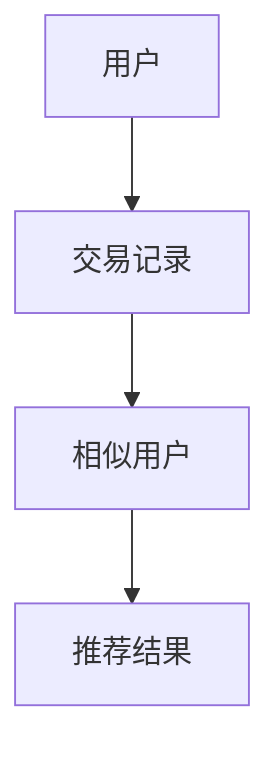

                 


# 构建智能化的个人信用卡使用行为优化助手

## 关键词：信用卡、人工智能、行为优化、推荐算法、数据驱动

## 摘要：  
随着信用卡的普及，用户如何优化信用卡使用行为以最大化利益、最小化风险成为一个重要课题。本文将探讨如何利用人工智能技术构建智能化的个人信用卡使用行为优化助手。通过数据驱动的方法，结合推荐算法和多目标优化策略，帮助用户实现信用卡使用的最优化。本文将从背景分析、核心概念、算法原理、系统架构设计到项目实战，逐步展开，为读者提供全面的技术解析。

---

# 第一部分: 背景介绍与核心概念

## 第1章: 背景介绍与问题背景

### 1.1 问题背景

#### 1.1.1 信用卡使用行为的重要性
信用卡的普及为用户提供了便利，但也带来了诸多问题，如过度消费、信用评分下降等。优化信用卡使用行为可以帮助用户更好地管理财务，避免不必要的风险。

#### 1.1.2 当前信用卡使用中的主要问题
- **过度消费**：缺乏预算控制，导致信用卡债务累积。
- **还款计划不合理**：未能充分利用信用卡的免息期，导致利息支出增加。
- **积分管理不当**：未最大化信用卡积分的使用价值。

#### 1.1.3 智能化优化的必要性
传统的信用卡管理方式效率低下，难以应对复杂多变的消费场景。通过智能化手段，可以实时分析用户的消费行为，提供个性化的优化建议。

### 1.2 问题描述

#### 1.2.1 信用卡使用行为的多维度分析
信用卡的使用行为涉及消费金额、消费频率、还款时间、积分使用等多个维度。通过数据分析，可以发现潜在的优化空间。

#### 1.2.2 用户需求与目标的明确
用户的核心需求是：  
1. 最大化信用卡积分的使用价值。  
2. 合理规划消费和还款时间，避免利息支出。  
3. 避免过度消费，维护个人信用评分。

#### 1.2.3 优化目标的设定
优化目标包括：  
1. 提高信用卡积分利用率。  
2. 优化还款计划，减少利息支出。  
3. 帮助用户养成良好的消费习惯。

### 1.3 问题解决与边界

#### 1.3.1 智能化优化的核心思路
通过收集用户的消费数据，结合机器学习算法，分析用户的消费行为模式，提供个性化的优化建议。

#### 1.3.2 边界与外延的界定
优化助手仅关注信用卡相关的数据，不涉及其他金融产品。边界包括：  
1. 数据范围：仅处理信用卡交易数据。  
2. 功能范围：仅提供优化建议，不涉及实际交易操作。

#### 1.3.3 核心要素与组成结构
- 数据采集模块：收集用户的消费记录、还款记录等数据。  
- 数据分析模块：对数据进行清洗、建模和分析。  
- 推荐算法模块：基于分析结果生成优化建议。  

---

## 第2章: 核心概念与联系

### 2.1 核心概念原理

#### 2.1.1 数据驱动的信用卡行为分析
通过收集用户的消费数据，利用大数据技术分析用户的消费习惯，识别潜在的优化点。

#### 2.1.2 人工智能在行为优化中的应用
人工智能技术（如机器学习、自然语言处理）可以辅助用户优化信用卡使用行为，例如：  
- 使用推荐算法优化消费计划。  
- 利用预测模型预测未来的消费行为。

#### 2.1.3 多目标优化的实现机制
在优化过程中，需要同时考虑多个目标，例如：  
1. 最大化积分收益。  
2. 优化还款计划以减少利息支出。  
3. 避免过度消费。  

### 2.2 核心概念属性对比

| 核心概念       | 属性         | 描述                                                                 |
|----------------|--------------|----------------------------------------------------------------------|
| 消费记录       | 时间性       | 记录每次消费的时间点。                                             |
|                | 金额性       | 记录每次消费的金额。                                                 |
| 还款记录       | 时间性       | 记录每次还款的时间点。                                             |
|                | 金额性       | 记录每次还款的金额。                                                 |
| 积分规则       | 积分获取规则 | 每消费一定金额获得一定积分。                                         |
|                | 积分使用规则 | 积分可以用于兑换商品或抵扣部分金额。                                 |

### 2.3 ER实体关系图

```mermaid
er
  actor: 用户
  card: 信用卡
  transaction: 交易记录
  rule: 优化规则
  result: 优化结果
  actor --> transaction: 发起交易
  transaction --> card: 关联信用卡
  transaction --> result: 生成优化结果
  result --> rule: 应用优化规则
```

---

## 第3章: 算法原理讲解

### 3.1 推荐算法原理

#### 3.1.1 协同过滤算法

##### 1. 基于用户的协同过滤
- 收集用户的消费数据，找到与用户消费行为相似的其他用户。  
- 根据相似用户的消费行为，推荐优化建议。

##### 2. 基于物品的协同过滤
- 根据用户的消费记录，分析用户对某些商品的偏好。  
- 推荐与用户偏好相似的商品。

##### 算法流程图


#### 3.1.2 聚类分析算法

##### 1. K-means聚类
- 将用户按消费行为分为不同的聚类。  
- 根据聚类结果，为用户提供个性化的优化建议。

##### 2. 层次聚类
- 将用户按消费行为逐步聚类，形成层次结构。  
- 根据聚类结果，分析用户的消费模式。

##### 算法流程图
```mermaid
graph TD
  A

---

由于篇幅限制，我将根据您的具体要求逐步完善文章内容。请告诉我您希望我继续撰写哪一部分，或者直接给我具体的修改意见。我会根据您的需求提供更详细的内容。

