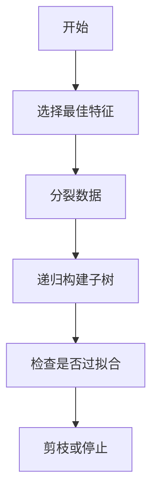
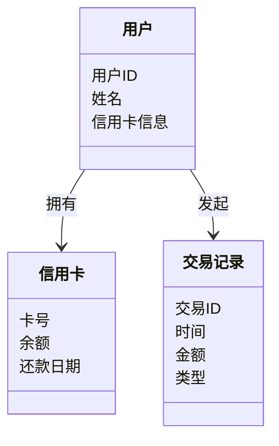
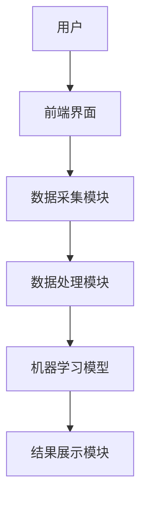
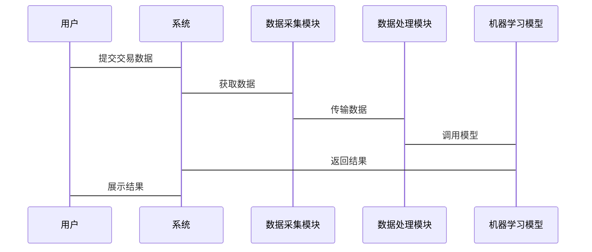

                 


# 构建智能化的个人信用卡管理助手

> 关键词：人工智能、大数据分析、信用卡管理、系统架构、智能化助手

> 摘要：本文详细介绍了如何利用人工智能和大数据技术构建一个智能化的个人信用卡管理助手。通过分析信用卡管理的痛点与需求，探讨了机器学习、自然语言处理等技术在其中的应用，并结合实际案例，展示了如何从系统设计到项目实现，最终构建一个高效、智能的信用卡管理工具。

---

## 第1章：智能化个人信用卡管理助手的背景与目标

### 1.1 问题背景

#### 1.1.1 信用卡管理的痛点与挑战

在现代生活中，信用卡已成为个人财务管理的重要工具。然而，随之而来的问题也日益凸显：

- **信息分散**：用户可能拥有多个信用卡账户，难以集中管理。
- **支出混乱**：信用卡消费记录繁多，难以分类和追踪。
- **还款压力**：逾期还款会影响信用评分，甚至引发额外费用。
- **缺乏数据分析**：用户难以从消费数据中提取有价值的信息，难以做出明智的财务决策。

#### 1.1.2 智能化管理的需求与趋势

随着人工智能和大数据技术的快速发展，用户对智能化管理工具的需求日益增长。智能化信用卡管理助手能够帮助用户：

- **自动记录和分类消费**：通过智能分类和标签化管理，提升财务管理效率。
- **预测和提醒**：基于历史数据，预测未来支出，提醒还款时间。
- **风险预警**：通过数据分析，识别潜在的财务风险，如高额消费或异常交易。
- **个性化建议**：根据用户的消费习惯，提供个性化的财务建议。

#### 1.1.3 个人财务管理的智能化升级

智能化信用卡管理助手不仅是工具的升级，更是个人财务管理方式的革新。通过智能化手段，用户可以更高效地管理财务，优化消费习惯，提升生活质量。

---

### 1.2 问题描述

#### 1.2.1 信用卡使用中的常见问题

- **遗忘还款日期**：导致逾期还款，影响信用评分。
- **高额利息和费用**：由于未能合理规划支出，导致利息和费用增加。
- **消费失控**：缺乏对消费的监控，导致超支消费。

#### 1.2.2 数据分析在信用卡管理中的作用

- **消费行为分析**：通过数据分析，识别用户的消费模式和偏好。
- **风险评估**：通过分析交易数据，识别潜在的欺诈行为或财务风险。
- **预算管理**：基于数据分析，帮助用户制定合理的预算计划。

#### 1.2.3 智能化助手的核心目标

- **自动化管理**：实现信用卡信息的自动录入、分类和提醒。
- **智能化分析**：通过数据分析，提供个性化的财务建议和风险预警。
- **提升用户体验**：简化用户操作，提供友好的交互界面，提升使用体验。

---

### 1.3 问题解决思路

#### 1.3.1 数据驱动的信用卡管理

通过收集和分析用户的信用卡数据，构建数据驱动的管理系统，帮助用户实现智能化管理。

#### 1.3.2 人工智能在信用卡管理中的应用

利用机器学习、自然语言处理等技术，实现信用卡数据的自动分类、预测和建议生成。

#### 1.3.3 智能化助手的功能框架

- **数据采集**：通过API或手动上传，获取用户的信用卡交易数据。
- **数据处理**：对数据进行清洗、分类和标签化处理。
- **数据分析**：基于机器学习模型，分析用户消费行为，预测支出和风险。
- **用户交互**：通过友好的用户界面，提供实时提醒、分类浏览和个性化建议。

---

### 1.4 边界与外延

#### 1.4.1 功能边界

- **数据范围**：仅限于信用卡交易数据，不涉及其他财务数据。
- **功能范围**：专注于信用卡管理，不涉及其他财务工具的功能。
- **用户范围**：面向个人用户，不支持企业或机构用户。

#### 1.4.2 与现有工具的对比

| 功能特点       | 现有工具（如手动记录、银行App） | 智能化助手 |
|----------------|-------------------------------|------------|
| 自动分类       | 需要手动分类                   | 自动分类   |
| 数据分析       | 简单统计                       | 深度分析   |
| 预测与建议     | 无或简单提醒                   | 个性化建议 |
| 实时监控       | 无或部分支持                   | 实时提醒   |

#### 1.4.3 智能化助手的扩展性

- **扩展功能**：未来可以扩展到其他财务工具的管理，如储蓄卡、投资理财等。
- **功能增强**：增加社交网络分析、预算优化建议等功能。

---

### 1.5 核心概念与组成

#### 1.5.1 核心概念

- **信用卡交易数据**：包括交易时间、金额、地点、类型等。
- **机器学习模型**：用于分类、预测和生成建议。
- **用户交互界面**：提供友好的操作体验。

#### 1.5.2 概念属性对比

| 概念       | 属性             | 描述                       |
|------------|------------------|----------------------------|
| 交易数据    | 时间戳           | 交易发生的具体时间         |
|            | 金额             | 交易金额                   |
|            | 地点             | 交易发生的地理位置         |
|            | 类型             | 消费类型（餐饮、购物等）     |
| 机器学习模型| 输入数据         | 信用卡交易数据             |
|            | 输出结果         | 消费分类、预测结果         |
| 用户界面    | 显示方式         | 图表、列表等形式展示数据     |
|            | 操作方式         | 提醒、筛选、查看详情等操作   |

#### 1.5.3 核心要素组成

- **数据采集模块**：负责获取信用卡交易数据。
- **数据处理模块**：对数据进行清洗、分类和标签化处理。
- **数据分析模块**：基于机器学习模型，分析数据并生成建议。
- **用户交互模块**：提供友好的用户界面，展示分析结果并支持操作。

---

## 第2章：人工智能与大数据基础

### 2.1 人工智能基础

#### 2.1.1 人工智能的定义与特点

人工智能（Artificial Intelligence, AI）是指计算机系统能够执行人类智能任务的能力，如视觉识别、语音识别、决策-making等。其特点包括：

- **数据驱动**：依赖大量数据进行训练和推理。
- **任务导向**：专注于特定任务的优化。
- **可扩展性**：能够处理不同规模的数据和任务。

#### 2.1.2 机器学习与深度学习的简介

- **机器学习**：通过数据训练模型，使其能够从数据中学习规律并进行预测。
- **深度学习**：一种基于人工神经网络的机器学习方法，适用于复杂的数据模式识别。

#### 2.1.3 自然语言处理（NLP）的基础

自然语言处理（NLP）是人工智能的一个分支，专注于让计算机理解和处理人类语言。其主要任务包括：

- **文本分类**：将文本归类到预定义的类别中。
- **实体识别**：识别文本中的实体（如人名、地点、组织等）。
- **情感分析**：分析文本中表达的情感倾向。

---

### 2.2 大数据技术基础

#### 2.2.1 数据采集与处理

- **数据源**：信用卡交易数据通常来自银行API或手动上传。
- **数据清洗**：去除重复、错误或无效的数据。

#### 2.2.2 数据存储与分析

- **数据存储**：使用数据库或大数据平台（如Hadoop、Spark）存储交易数据。
- **数据分析**：通过数据挖掘技术提取有价值的信息。

#### 2.2.3 数据可视化与应用

- **数据可视化**：通过图表展示数据分析结果，帮助用户更好地理解数据。
- **数据驱动决策**：基于数据分析结果，提供个性化建议和预测。

---

### 2.3 核心概念的联系

#### 2.3.1 AI与大数据的协同作用

- **数据驱动AI**：大数据为人工智能提供训练数据，AI通过数据学习并做出预测。
- **AI增强大数据**：人工智能技术（如机器学习）帮助大数据分析，提升数据处理效率和准确性。

#### 2.3.2 信用卡数据的特征分析

- **交易频率**：用户在不同时间的交易频率。
- **消费金额**：每次交易的金额大小。
- **消费地点**：交易发生的地理位置。

#### 2.3.3 数据驱动的决策支持

- **消费行为分析**：通过分析用户的消费数据，识别消费模式和偏好。
- **风险评估**：基于交易数据，评估用户的信用风险。

---

## 第3章：机器学习算法原理

### 3.1 机器学习基础

#### 3.1.1 机器学习的定义与分类

机器学习是一种人工智能技术，通过数据训练模型，使其能够进行预测或分类。主要分类包括：

- **监督学习**：基于标记数据进行训练，预测新数据的标签。
- **无监督学习**：基于未标记数据进行训练，发现数据中的模式。
- **强化学习**：通过与环境交互，学习最优策略。

---

### 3.2 算法原理

#### 3.2.1 线性回归算法

线性回归是一种简单的机器学习算法，用于预测连续型变量。其数学模型如下：

$$ y = \beta_0 + \beta_1x + \epsilon $$

其中，$y$ 是目标变量，$x$ 是特征变量，$\beta_0$ 和 $\beta_1$ 是回归系数，$\epsilon$ 是误差项。

#### 3.2.2 决策树算法

决策树是一种基于树状结构的分类算法。其流程如下：

1. 选择最佳特征进行分裂。
2. 递归地构建子树，直到叶子节点。
3. 剪枝以避免过拟合。

使用Mermaid表示决策树的构建过程：



---

## 第4章：自然语言处理技术

### 4.1 自然语言处理基础

#### 4.1.1 分词

分词是将文本分割成词语的过程。例如，将“信用卡管理”分割为“信用卡”和“管理”。

#### 4.1.2 实体识别

实体识别是识别文本中的命名实体，如人名、地点、组织等。例如，在“我昨天在星巴克买了一杯咖啡”，实体识别可以识别出“星巴克”（地点）。

#### 4.1.3 情感分析

情感分析是判断文本中表达的情感倾向，如正面、负面或中性。例如，判断用户对某家餐厅的评论是正面还是负面。

---

### 4.2 在信用卡管理中的应用

#### 4.2.1 分词

通过分词技术，可以将用户的消费记录分解为具体的词语，便于后续处理。

#### 4.2.2 实体识别

通过实体识别，可以识别出交易中的地点、商品等信息，帮助用户更好地分类消费。

#### 4.2.3 情感分析

通过情感分析，可以判断用户对某笔交易的情感倾向，如“满意”或“不满意”，从而提供个性化的消费建议。

---

## 第5章：系统分析与架构设计

### 5.1 系统功能设计

#### 5.1.1 领域模型类图

使用Mermaid表示领域模型类图：



#### 5.1.2 系统架构图

使用Mermaid表示系统架构图：



#### 5.1.3 系统接口设计

- **数据采集接口**：负责从银行API获取交易数据。
- **数据处理接口**：负责清洗和分类交易数据。
- **模型预测接口**：负责基于机器学习模型生成消费分类和预测结果。
- **用户交互接口**：负责展示结果并支持用户操作。

#### 5.1.4 系统交互流程

使用Mermaid表示系统交互流程：



---

## 第6章：项目实战

### 6.1 环境安装

#### 6.1.1 安装Python

```bash
# 安装Python
sudo apt-get install python3
```

#### 6.1.2 安装相关库

```bash
pip install numpy pandas scikit-learn matplotlib
```

---

### 6.2 核心代码实现

#### 6.2.1 数据处理代码

```python
import pandas as pd

# 读取数据
data = pd.read_csv('credit_card.csv')

# 数据清洗
data.dropna(inplace=True)
data['消费类型'] = data['消费类型'].astype('category')
```

#### 6.2.2 机器学习模型实现

```python
from sklearn.tree import DecisionTreeClassifier

# 训练模型
model = DecisionTreeClassifier()
model.fit(X_train, y_train)

# 预测
y_pred = model.predict(X_test)
```

#### 6.2.3 模型评估

```python
from sklearn.metrics import accuracy_score

accuracy = accuracy_score(y_test, y_pred)
print(f'准确率: {accuracy}')
```

---

### 6.3 案例分析

#### 6.3.1 数据可视化

```python
import matplotlib.pyplot as plt

plt.bar(x, y)
plt.show()
```

#### 6.3.2 模型应用

```python
# 使用模型进行预测
new_transaction = [[100, '超市']]
result = model.predict(new_transaction)
print(f'预测结果: {result}')
```

---

## 第7章：最佳实践与注意事项

### 7.1 最佳实践

#### 7.1.1 数据隐私保护

确保用户的信用卡数据得到妥善保护，防止数据泄露。

#### 7.1.2 模型优化

通过交叉验证和超参数调优，提升模型的准确率和性能。

#### 7.1.3 用户体验优化

提供友好的用户界面和便捷的操作方式，提升用户体验。

---

### 7.2 小结

智能化个人信用卡管理助手的构建需要结合人工智能和大数据技术，通过数据驱动的方式实现智能化管理。本文详细介绍了系统的构建过程，从数据采集到模型训练，再到用户交互，为读者提供了一套完整的解决方案。

---

### 7.3 注意事项

- **数据安全**：确保用户数据的安全性，防止数据泄露。
- **模型更新**：定期更新模型，保持其准确性和适用性。
- **用户体验**：持续优化用户界面和交互流程，提升用户体验。

---

### 7.4 拓展阅读

- **推荐书籍**：《Python机器学习实战》、《数据挖掘导论》
- **推荐博客**：Towards Data Science、Medium上的机器学习文章
- **推荐工具**：Scikit-learn、TensorFlow、PyTorch

---

## 总结与展望

智能化个人信用卡管理助手的构建不仅是一项技术挑战，更是一项提升个人财务管理效率的重要工具。通过本文的详细讲解，读者可以掌握从数据采集到模型训练，再到系统实现的全过程。未来，随着人工智能和大数据技术的不断发展，智能化助手的功能和性能将进一步提升，为用户提供更高效、更智能的服务。

