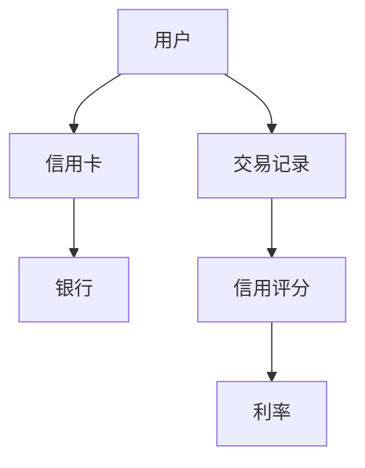
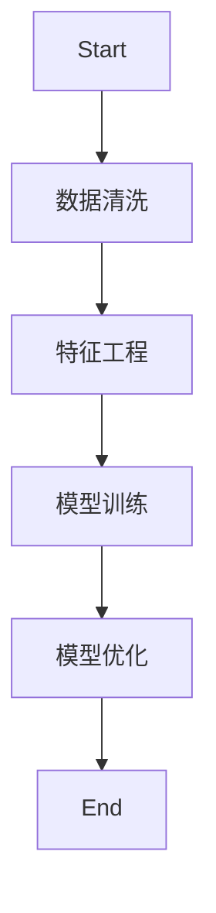
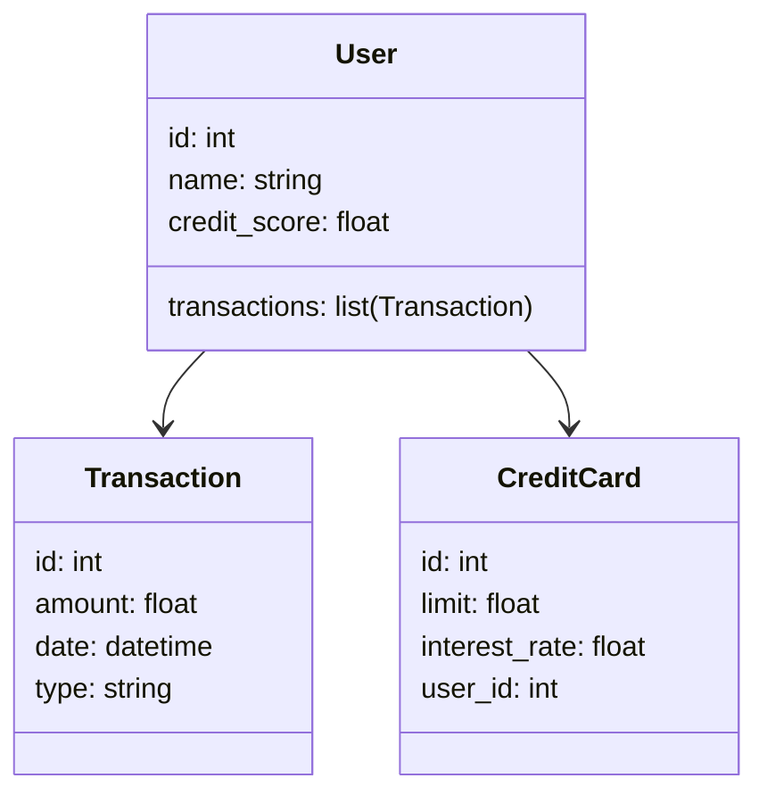
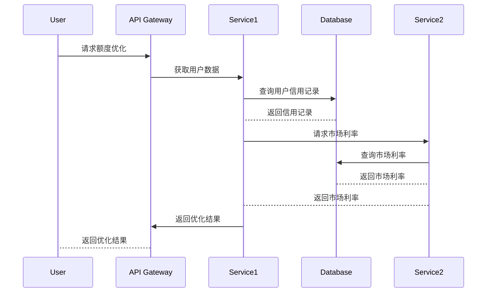

                 


---

# {{此处是文章标题}}

**关键词：**{{此处列出文章的5-7个核心关键词}}

**摘要：**{{此处给出文章的核心内容和主题思想}}

---

# 第1章: 信用卡额度与利率优化的背景与挑战

## 1.1 问题背景
### 1.1.1 信用卡额度与利率管理的重要性
### 1.1.2 当前信用卡管理中存在的问题
### 1.1.3 智能化优化的必要性

## 1.2 问题描述
### 1.2.1 信用卡额度与利率的关联性分析
### 1.2.2 用户信用评估的复杂性
### 1.2.3 市场利率波动对信用卡管理的影响

## 1.3 问题解决思路
### 1.3.1 数据驱动的优化方法
### 1.3.2 智能算法的应用场景
### 1.3.3 个性化服务的实现路径

## 1.4 边界与外延
### 1.4.1 系统边界定义
### 1.4.2 优化范围的外延
### 1.4.3 与其他系统的接口关系

## 1.5 核心概念结构与组成
### 1.5.1 核心要素分析
### 1.5.2 概念之间的关系
### 1.5.3 系统架构的核心模块

---

# 第2章: 核心概念原理与关系分析

## 2.1 核心概念原理
### 2.1.1 数据驱动的信用评估原理
### 2.1.2 智能算法的优化机制
### 2.1.3 个性化服务的实现原理

## 2.2 核心概念属性对比
### 2.2.1 数据来源对比
### 2.2.2 模型特征对比
### 2.2.3 优化目标对比

## 2.3 ER实体关系图


---

# 第3章: 算法原理与实现

## 3.1 算法原理
### 3.1.1 机器学习模型选择
### 3.1.2 数据预处理方法
### 3.1.3 模型训练与优化

## 3.2 算法流程图


## 3.3 

---

# 第四部分: 系统分析与架构设计

## 4.1 问题场景介绍
### 4.1.1 信用卡管理系统的现有问题
### 4.1.2 用户需求分析
### 4.1.3 系统目标设定

## 4.2 项目介绍
### 4.2.1 项目背景
### 4.2.2 项目目标
### 4.2.3 项目范围

## 4.3 系统功能设计
### 4.3.1 领域模型设计


## 4.4 系统架构设计
```mermaid
graph TD
    Client --> API Gateway[API网关]
    API Gateway --> Service1[服务1]
    Service1 --> Database[数据库]
    API Gateway --> Service2[服务2]
    Service2 --> Database
```

## 4.5 系统接口设计
### 4.5.1 API接口定义
### 4.5.2 接口调用流程
### 4.5.3 接口安全设计

## 4.6 系统交互流程


---

# 第五部分: 项目实战

## 5.1 环境安装与配置
### 5.1.1 安装Python
### 5.1.2 安装依赖库
### 5.1.3 配置开发环境

## 5.2 核心代码实现
### 5.2.1 数据预处理代码
### 5.2.2 模型训练代码
### 5.2.3 系统接口实现

## 5.3 代码解读与分析
### 5.3.1 核心算法解读
### 5.3.2 代码实现细节
### 5.3.3 系统性能优化

## 5.4 实际案例分析
### 5.4.1 案例背景
### 5.4.2 数据分析
### 5.4.3 优化结果展示

## 5.5 项目小结
### 5.5.1 项目成果
### 5.5.2 经验总结
### 5.5.3 改进方向

---

# 第六部分: 最佳实践与总结

## 6.1 小结
### 6.1.1 核心观点回顾
### 6.1.2 系统设计总结
### 6.1.3 实战经验总结

## 6.2 注意事项
### 6.2.1 数据隐私保护
### 6.2.2 系统安全防护
### 6.2.3 模型维护与更新

## 6.3 拓展阅读
### 6.3.1 相关技术领域
### 6.3.2 进阶学习资料
### 6.3.3 行业发展趋势

---

# 附录

## 附录A: 代码示例
```python
# 数据预处理代码示例
import pandas as pd
from sklearn.preprocessing import StandardScaler

def preprocess_data(data):
    # 数据清洗
    data = data.dropna()
    # 特征工程
    features = data[['transaction_amount', 'credit_score', 'interest_rate']]
    scaler = StandardScaler()
    features_scaled = scaler.fit_transform(features)
    return features_scaled

# 模型训练代码示例
from sklearn.linear_model import LinearRegression
from sklearn.model_selection import train_test_split

def train_model(features, labels):
    X_train, X_test, y_train, y_test = train_test_split(features, labels, test_size=0.2)
    model = LinearRegression()
    model.fit(X_train, y_train)
    return model
```

## 附录B: 系统架构图
```mermaid
graph TD
    Client --> API Gateway
    API Gateway --> Service1
    Service1 --> Database
    Service2 --> Database
```

## 附录C: 参考文献
### [1] 书籍名称, 作者, 出版社, 出版年份
### [2] 网站名称, 网址, 访问日期
### [3] 其他参考文献

---

# 结束语

通过本文的详细讲解，我们系统地探讨了如何构建智能化的个人信用卡额度与利率优化管理助手，从背景分析到系统实现，再到项目实战和总结，为读者提供了全面的技术指导和实践方案。希望本文能为相关领域的技术人员和研究人员提供有价值的参考和启示。

