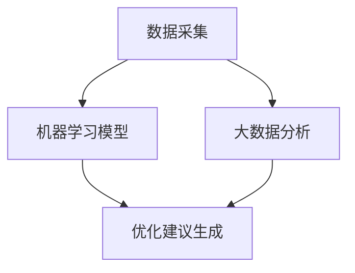
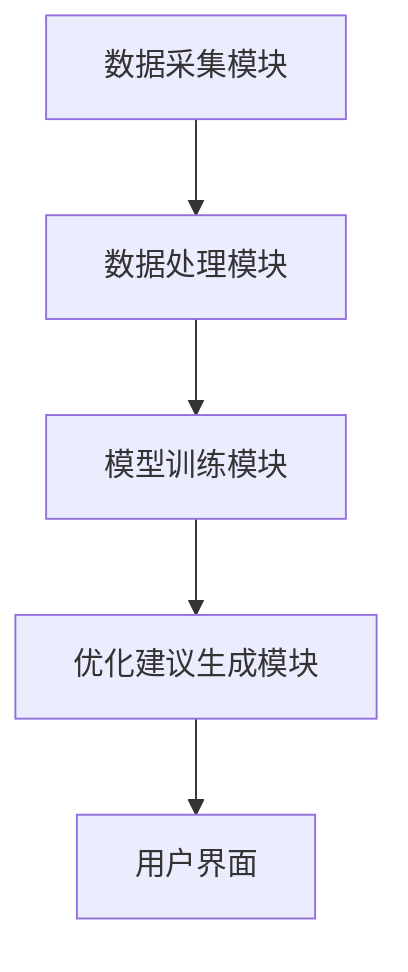

                 


# 《构建智能化的个人信用卡额度管理优化助手》

## 关键词：信用卡、额度管理、人工智能、大数据、优化助手

## 摘要：
在现代社会，信用卡已成为个人财务管理的重要工具。然而，如何科学、合理地管理信用卡额度，以最大化资金利用效率，同时避免过度消费和信用风险，是一个亟待解决的问题。本文将从技术角度出发，探讨如何利用人工智能和大数据技术构建一个智能化的信用卡额度管理优化助手。通过分析用户消费行为、信用评分和财务状况，结合机器学习算法，为用户提供个性化的额度调整建议。本文将详细阐述系统设计、算法实现、项目实战及优化策略，帮助读者深入了解如何将先进技术应用于实际金融管理场景中。

---

## 第一部分：背景与概念

### 第1章：个人信用卡额度管理概述

#### 1.1 问题背景
随着信用卡的普及，越来越多的用户开始依赖信用卡进行日常消费和财务管理。然而，许多用户在使用信用卡时存在以下问题：
- **额度不合理**：部分用户因为额度过低而无法满足消费需求，而另一些用户则因为额度过高而难以控制消费。
- **风险控制不足**：部分用户因额度管理不当，导致逾期还款、信用评分下降等问题。
- **缺乏个性化服务**：传统信用卡额度调整往往基于简单的规则或历史数据，难以满足用户的个性化需求。

#### 1.2 问题描述
信用卡额度管理的核心问题在于如何根据用户的实时消费行为、信用评分和财务状况，动态调整额度，以实现以下目标：
- 提高用户的消费体验。
- 风险控制与信用评分优化。
- 降低用户的财务压力。

#### 1.3 问题解决思路
智能化的信用卡额度管理助手需要结合以下技术手段：
- **数据采集**：收集用户的消费记录、信用评分、收入情况等数据。
- **数据分析**：利用大数据技术对数据进行清洗、建模和挖掘。
- **机器学习**：通过训练机器学习模型，预测用户的信用风险和消费行为。
- **智能推荐**：基于模型预测结果，为用户提供个性化的额度调整建议。

#### 1.4 边界与外延
- **边界**：智能化助手仅针对个人信用卡额度管理，不涉及企业或团体的信用管理。
- **外延**：数据来源仅限于用户授权的信用卡消费数据和基本财务信息，不涉及其他金融资产。
- **接口关系**：需要与信用卡发行机构的系统进行数据交互，同时为用户提供直观的额度调整建议界面。

#### 1.5 核心要素组成
- **数据采集模块**：负责采集用户的消费记录、信用评分等数据。
- **数据预处理模块**：对数据进行清洗和转换，确保数据质量。
- **机器学习模型**：用于预测用户的信用风险和消费行为。
- **优化建议生成模块**：根据模型预测结果，生成个性化的额度调整建议。

---

## 第二部分：核心概念与技术

### 第2章：人工智能与大数据技术

#### 2.1 AI在信用卡额度管理中的应用
- **机器学习模型**：用于预测用户的信用风险和消费行为。
- **自然语言处理技术**：用于分析用户在社交媒体上的评论，挖掘潜在的消费倾向。
- **图神经网络**：用于分析用户之间的关系网络，预测用户的信用风险。

#### 2.2 大数据技术的作用
- **数据采集与清洗**：通过数据采集工具收集用户数据，并进行数据清洗。
- **数据存储与管理**：使用分布式数据库存储海量数据，并进行高效的查询和管理。
- **数据分析与挖掘**：通过数据挖掘技术，发现用户行为模式和信用评分特征。

#### 2.3 核心概念的联系
以下表格展示了核心概念之间的联系：

| 概念 | 描述 | 关联技术 |
|------|------|----------|
| 数据采集 | 收集用户的消费记录和信用评分 | 大数据技术 |
| 机器学习 | 预测用户的信用风险和消费行为 | AI技术 |
| 优化建议 | 生成个性化的额度调整建议 | 数据分析与挖掘 |

以下用Mermaid图展示核心概念的联系：



---

## 第三部分：算法原理

### 第3章：机器学习模型

#### 3.1 线性回归模型
线性回归模型是一种简单的回归模型，用于预测连续型变量。其数学公式如下：

$$ y = \beta_0 + \beta_1x + \epsilon $$

其中：
- $y$ 是目标变量（如信用评分）。
- $x$ 是自变量（如消费金额）。
- $\beta_0$ 和 $\beta_1$ 是模型参数。
- $\epsilon$ 是误差项。

**示例**：假设我们有一个用户的消费金额和信用评分数据，可以通过线性回归模型预测其信用评分。

#### 3.2 决策树算法
决策树算法是一种基于树状结构的分类算法。其核心思想是通过特征选择，将数据分成不同的子集，直到每个子集中的数据都属于同一类别。

**ID3算法**是一种常见的决策树算法，其步骤如下：
1. 计算信息增益，选择信息增益最大的特征作为根节点。
2. 根据特征值划分数据集，重复上述过程，直到每个子集都属于同一类别。

**示例**：假设我们有一个用户的消费记录和信用评分数据，可以通过ID3算法构建决策树模型，预测其信用评分。

#### 3.3 随机森林
随机森林是一种基于集成学习的分类算法，通过构建多个决策树，并将它们的结果进行投票或平均，得到最终的预测结果。

**数学公式**：随机森林的预测结果是多个决策树的预测结果的平均值。

**示例**：假设我们有一个用户的消费记录和信用评分数据，可以通过随机森林模型预测其信用评分。

---

## 第四部分：系统架构与设计

### 第4章：系统架构设计

#### 4.1 系统模块划分
以下是系统的模块划分：

- **数据采集模块**：负责采集用户的消费记录、信用评分等数据。
- **数据处理模块**：对数据进行清洗、转换和特征提取。
- **模型训练模块**：利用机器学习算法训练模型，预测用户的信用风险和消费行为。
- **优化建议生成模块**：根据模型预测结果，生成个性化的额度调整建议。

#### 4.2 系统架构设计
以下是系统的架构设计：



#### 4.3 系统功能设计
以下是系统的功能设计：

- **数据采集**：通过API接口采集用户的消费记录、信用评分等数据。
- **数据处理**：对数据进行清洗、转换和特征提取。
- **模型训练**：利用机器学习算法训练模型，预测用户的信用风险和消费行为。
- **优化建议生成**：根据模型预测结果，生成个性化的额度调整建议。

---

## 第五部分：项目实战

### 第5章：项目实战

#### 5.1 环境安装
- **Python**：安装Python 3.8及以上版本。
- **库的安装**：安装以下库：
  - `pandas`：用于数据处理。
  - `scikit-learn`：用于机器学习模型训练。
  - `matplotlib`：用于数据可视化。
  - `numpy`：用于数值计算。

#### 5.2 核心代码实现
以下是核心代码实现：

```python
import pandas as pd
from sklearn.model_selection import train_test_split
from sklearn.linear_model import LinearRegression
from sklearn.metrics import mean_squared_error

# 数据加载
data = pd.read_csv('credit_card_data.csv')

# 数据预处理
X = data[['consumption_amount', 'credit_score']]
y = data['recommended_limit']

# 数据划分
X_train, X_test, y_train, y_test = train_test_split(X, y, test_size=0.2, random_state=42)

# 模型训练
model = LinearRegression()
model.fit(X_train, y_train)

# 模型预测
y_pred = model.predict(X_test)

# 模型评估
mse = mean_squared_error(y_test, y_pred)
print('均方误差：', mse)
```

#### 5.3 案例分析
以下是一个具体的案例分析：

假设我们有一个用户的消费记录和信用评分数据，可以通过上述代码生成个性化的额度调整建议。

---

## 第六部分：优化与展望

### 第6章：优化与展望

#### 6.1 总结
本文详细介绍了如何利用人工智能和大数据技术构建智能化的个人信用卡额度管理优化助手。通过分析用户消费行为、信用评分和财务状况，结合机器学习算法，为用户提供个性化的额度调整建议。

#### 6.2 优化方向
- **模型优化**：进一步优化机器学习模型，提高预测精度。
- **数据源扩展**：引入更多数据源，提高模型的泛化能力。
- **用户界面优化**：设计更直观的用户界面，提高用户体验。

#### 6.3 展望
未来，随着人工智能和大数据技术的不断发展，智能化的个人信用卡额度管理优化助手将更加智能化和个性化。通过实时数据分析和模型预测，用户可以更好地管理自己的信用卡额度，实现财务管理的最优目标。

---

## 结语
通过本文的介绍，读者可以深入了解如何利用先进技术构建智能化的个人信用卡额度管理优化助手。希望本文的内容能够为相关领域的研究和实践提供有价值的参考。

