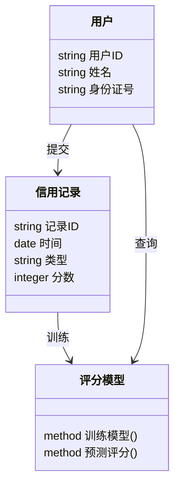
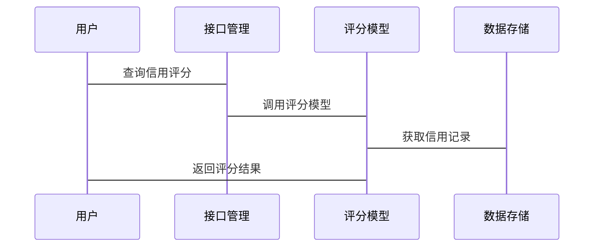

                 


# 构建智能化的个人信用评分解释系统

## 关键词
- 信用评分系统
- 人工智能
- 大模型
- 评分模型
- 可解释性

## 摘要
随着人工智能技术的快速发展，个人信用评分系统逐渐从传统的统计模型转向智能化的机器学习模型。智能化信用评分系统不仅能够提高评分的准确性和效率，还能通过模型的可解释性增强用户的信任度。本文将详细介绍如何构建一个智能化的个人信用评分解释系统，从背景介绍到系统实现，从算法原理到项目实战，全面解析其构建过程和关键点。

---

# 第一部分: 智能化个人信用评分解释系统背景与核心概念

## 第1章: 个人信用评分系统概述

### 1.1 个人信用评分的定义与作用
#### 1.1.1 信用评分的基本概念
信用评分是一种用于评估个人信用状况的指标，通常以分数形式表示。评分越高，表示个人的信用风险越低，反之亦然。信用评分广泛应用于贷款审批、信用卡额度设定、赊购授信等领域。

#### 1.1.2 信用评分在金融领域的应用
信用评分在金融领域中具有重要作用。例如：
- **贷款审批**：银行在审批贷款时，会参考个人的信用评分来决定是否放贷以及放贷额度。
- **信用卡额度设定**：信用卡发卡机构会根据申请人的信用评分来确定初始额度。
- **风险管理**：金融机构通过信用评分来识别和管理信用风险。

#### 1.1.3 信用评分对个人和机构的重要性
对于个人而言，良好的信用评分有助于获得更低的贷款利率、更高的信用额度和更多的信用机会。对于机构而言，信用评分是风险管理的重要工具，能够帮助机构降低坏账率和损失。

### 1.2 传统信用评分系统的局限性
#### 1.2.1 传统评分模型的局限性
传统的信用评分系统主要依赖于统计模型（如线性回归模型）。这些模型虽然简单，但存在以下问题：
- **模型复杂性低**：传统模型难以处理非线性关系和复杂特征。
- **可解释性有限**：传统模型的解释性较差，难以向用户说明评分的具体原因。
- **数据依赖性强**：传统模型对数据质量要求较高，且难以处理小样本数据。

#### 1.2.2 数据获取与处理的挑战
传统信用评分系统依赖于机构内部的信用数据，存在以下挑战：
- **数据孤岛问题**：不同金融机构之间的数据难以共享，导致评分模型难以充分利用多源数据。
- **数据质量参差不齐**：不同机构的数据格式、质量和技术标准不统一，增加了数据整合的难度。

#### 1.2.3 模型解释性不足的问题
传统信用评分系统的解释性较差，导致用户对评分结果的不信任。例如，用户难以理解为什么自己的信用评分较低，或者为什么被拒绝贷款。

### 1.3 智能化信用评分系统的提出
#### 1.3.1 智能化信用评分的核心理念
智能化信用评分系统基于人工智能技术，能够处理复杂的数据关系和非线性特征。其核心理念包括：
- **数据驱动**：通过大数据分析技术，充分利用多源数据，提高评分的准确性和全面性。
- **模型可解释性**：通过可解释的人工智能技术，向用户解释评分结果的原因。
- **实时性**：智能化系统能够实时更新评分结果，反映用户的最新信用状况。

#### 1.3.2 人工智能技术在信用评分中的应用前景
人工智能技术（如机器学习、深度学习）在信用评分中的应用前景广阔。例如：
- **特征工程**：通过机器学习技术自动提取特征，提高模型的准确性和鲁棒性。
- **模型优化**：通过深度学习技术构建复杂的评分模型，捕捉数据中的非线性关系。
- **实时反馈**：通过流数据处理技术，实现信用评分的实时更新和反馈。

#### 1.3.3 智能化信用评分系统的潜在价值
智能化信用评分系统的潜在价值体现在以下几个方面：
- **提高评分准确率**：通过机器学习技术，提高评分的准确性和可靠性。
- **增强用户信任度**：通过模型的可解释性，增强用户对评分结果的信任。
- **降低机构风险**：通过实时更新的评分系统，帮助机构及时识别和管理信用风险。

### 1.4 本章小结
本章介绍了传统信用评分系统的局限性，提出了智能化信用评分系统的概念和核心理念。智能化信用评分系统通过人工智能技术，克服了传统系统的不足，能够实现更准确、更透明的信用评分。

---

## 第2章: 个人信用评分系统的核心概念与联系

### 2.1 核心概念原理
#### 2.1.1 信用评分系统的输入与输出
信用评分系统的输入包括：
- **个人基本信息**：如姓名、身份证号、联系方式等。
- **信用历史**：如贷款记录、信用卡使用记录、还款记录等。
- **行为数据**：如消费记录、借贷记录、社交网络数据等。

信用评分系统的输出是个人信用评分，通常以分数形式表示。

#### 2.1.2 评分模型的训练与优化
评分模型的训练与优化是构建智能化信用评分系统的核心任务。训练目标是通过大量数据，训练出一个能够准确预测信用风险的模型。

#### 2.1.3 模型的可解释性与透明度
模型的可解释性是指用户能够理解模型评分的原因。透明度是指模型的评分过程和逻辑清晰明了，用户能够信任评分结果。

### 2.2 核心概念对比分析
#### 2.2.1 传统评分模型与智能化评分模型的对比
| 对比维度 | 传统评分模型 | 智能化评分模型 |
|----------|---------------|----------------|
| 模型类型 | 线性回归模型   | 机器学习模型   |
| 解释性   | 较低           | 较高           |
| 数据要求 | 较高           | 较低           |
| 处理能力 | 简单           | 复杂           |

#### 2.2.2 不同评分模型的优缺点分析
| 模型类型 | 优点                     | 缺点                     |
|----------|--------------------------|--------------------------|
| 线性回归 | 简单，易于解释             | 难以处理非线性关系       |
| 神经网络 | 能够处理复杂特征           | 解释性较差               |
| 支持向量机 | 高准确性                   | 对数据预处理要求较高     |

#### 2.2.3 模型解释性的关键影响因素
- **模型复杂度**：复杂模型通常解释性较差。
- **特征重要性**：特征的重要性影响模型的解释性。
- **数据质量**：数据质量影响模型的解释性。

### 2.3 ER实体关系图架构
```mermaid
erDiagram
    actor 用户 {
        string 用户ID
        string 姓名
        string 身份证号
    }
    actor 金融机构 {
        string 机构ID
        string 名称
        string 联系方式
    }
    entity 信用记录 {
        string 记录ID
        date 时间
        string 类型
        integer 分数
    }
    user -> credit_record : 提交
    financial_institution -> credit_record : 查询
```

### 2.4 本章小结
本章详细介绍了个人信用评分系统的核心概念与联系，包括系统的输入与输出、模型的训练与优化、模型的可解释性与透明度等。通过对比分析不同评分模型的优缺点，提出了构建智能化信用评分系统的可行性方案。

---

## 第3章: 智能化信用评分系统的算法原理

### 3.1 算法原理概述
#### 3.1.1 评分模型的训练目标
评分模型的训练目标是通过大量数据，训练出一个能够准确预测信用风险的模型。训练目标通常包括以下方面：
- **分类任务**：将信用评分分为不同类别（如高风险、中风险、低风险）。
- **回归任务**：预测具体的信用评分分数。

#### 3.1.2 模型的输入特征与输出结果
模型的输入特征包括：
- **个人基本信息**：如年龄、性别、职业等。
- **信用历史**：如贷款记录、还款记录等。
- **行为数据**：如消费记录、借贷记录等。

模型的输出结果是信用评分分数。

#### 3.1.3 算法的核心思想与实现步骤
算法的核心思想是通过机器学习技术，训练出一个能够准确预测信用风险的模型。实现步骤包括：
1. 数据预处理与特征提取。
2. 模型训练与参数优化。
3. 模型评估与验证。

### 3.2 算法实现流程
#### 3.2.1 数据预处理与特征提取
数据预处理包括：
- **数据清洗**：去除缺失值、异常值。
- **特征工程**：提取特征、处理特征。
- **数据标准化**：对特征进行标准化处理。

#### 3.2.2 模型训练与参数优化
模型训练包括：
- **选择模型**：选择合适的模型（如逻辑回归、随机森林、神经网络等）。
- **训练模型**：通过训练数据训练模型。
- **参数优化**：通过交叉验证等方法优化模型参数。

#### 3.2.3 模型评估与验证
模型评估包括：
- **验证集评估**：在验证集上评估模型的性能。
- **测试集评估**：在测试集上评估模型的性能。
- **性能指标**：如准确率、召回率、F1分数等。

### 3.3 算法的数学模型与公式
#### 3.3.1 线性回归模型
线性回归模型的公式为：
$$ y = \beta_0 + \beta_1x_1 + \beta_2x_2 + ... + \beta_nx_n $$

其中：
- $y$ 是信用评分分数。
- $\beta_0$ 是截距项。
- $\beta_1, \beta_2, ..., \beta_n$ 是各个特征的系数。

#### 3.3.2 神经网络模型
神经网络模型的结构通常包括输入层、隐藏层和输出层。模型的训练过程如下：
1. 输入层接收输入特征。
2. 隐藏层通过激活函数处理特征。
3. 输出层输出信用评分分数。

神经网络模型的训练过程通常使用反向传播算法优化权重和偏置。

### 3.4 本章小结
本章详细介绍了智能化信用评分系统的算法原理，包括模型的训练目标、实现步骤和数学公式。通过对比分析不同算法的优缺点，提出了构建智能化信用评分系统的可行性方案。

---

## 第4章: 系统分析与架构设计

### 4.1 问题场景介绍
在构建智能化个人信用评分解释系统时，需要考虑以下几个问题：
- **数据来源**：如何获取多源数据？
- **数据隐私**：如何保护用户隐私？
- **模型解释性**：如何向用户解释评分结果？

### 4.2 系统功能设计
#### 4.2.1 领域模型


#### 4.2.2 系统架构设计


#### 4.2.3 系统接口设计
系统接口设计包括：
- **用户接口**：用户查询信用评分。
- **模型接口**：模型训练和预测。
- **数据接口**：数据存储和查询。

#### 4.2.4 系统交互流程


### 4.3 本章小结
本章详细介绍了系统分析与架构设计，包括问题场景、系统功能设计、系统架构设计和系统交互流程。通过明确系统的各个模块和它们之间的关系，为后续的系统实现奠定了基础。

---

## 第5章: 项目实战

### 5.1 环境安装
构建智能化个人信用评分解释系统需要以下环境：
- **Python**：安装Python 3.x。
- **机器学习库**：安装scikit-learn、xgboost、keras等。
- **数据处理工具**：安装Pandas、NumPy。
- **可视化工具**：安装Matplotlib、Seaborn。

### 5.2 核心代码实现
#### 5.2.1 数据预处理
```python
import pandas as pd
import numpy as np

# 读取数据
data = pd.read_csv('credit_data.csv')

# 数据清洗
data.dropna(inplace=True)

# 特征工程
from sklearn.preprocessing import StandardScaler
scaler = StandardScaler()
data_scaled = scaler.fit_transform(data)
```

#### 5.2.2 模型训练
```python
from sklearn.model_selection import train_test_split
from sklearn.linear_model import LogisticRegression

# 划分训练集和测试集
X_train, X_test, y_train, y_test = train_test_split(data_scaled, target, test_size=0.2)

# 训练模型
model = LogisticRegression()
model.fit(X_train, y_train)

# 预测结果
y_pred = model.predict(X_test)
```

#### 5.2.3 模型解释
```python
from sklearn.inspection import permutation_importances

# 计算特征重要性
importances = permutation_importances(model, X_test, y_test)

# 可视化特征重要性
importances.plot(kind='barh')
```

### 5.3 案例分析
通过实际案例分析，验证系统的可行性和准确性。例如，分析一个用户的信用评分变化过程，解释评分结果的原因。

### 5.4 项目总结
总结项目实现过程中的经验教训，提出改进建议。

### 5.5 本章小结
本章通过实际案例分析，详细讲解了智能化个人信用评分解释系统的实现过程，包括环境安装、核心代码实现和案例分析。通过项目实战，验证了系统的可行性和准确性。

---

## 第6章: 最佳实践

### 6.1 小结
智能化个人信用评分解释系统的构建需要结合人工智能技术，通过数据驱动和模型优化，实现更准确、更透明的信用评分。

### 6.2 注意事项
- **数据隐私保护**：在构建系统时，需要注意用户数据的隐私保护。
- **模型解释性**：需要确保模型的可解释性，增强用户的信任度。
- **模型更新**：需要定期更新模型，确保评分结果的准确性。

### 6.3 拓展阅读
推荐一些相关的书籍和论文，帮助读者进一步深入学习。

---

## 第7章: 结语

随着人工智能技术的不断发展，智能化个人信用评分解释系统将变得更加重要。通过本文的详细介绍，读者可以全面了解系统的构建过程和关键点。未来，随着技术的进步，智能化信用评分系统将在金融领域发挥更大的作用。

--- 

以上是《构建智能化的个人信用评分解释系统》的完整目录和部分章节内容。希望对您有所帮助！

