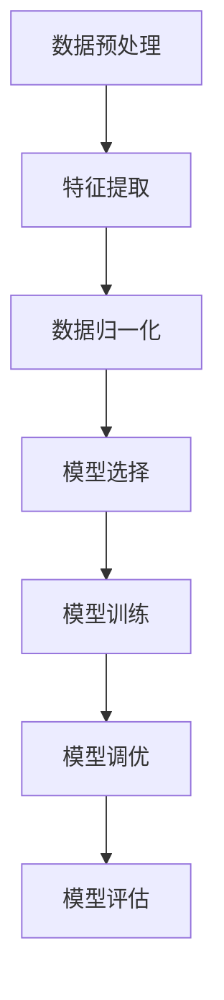
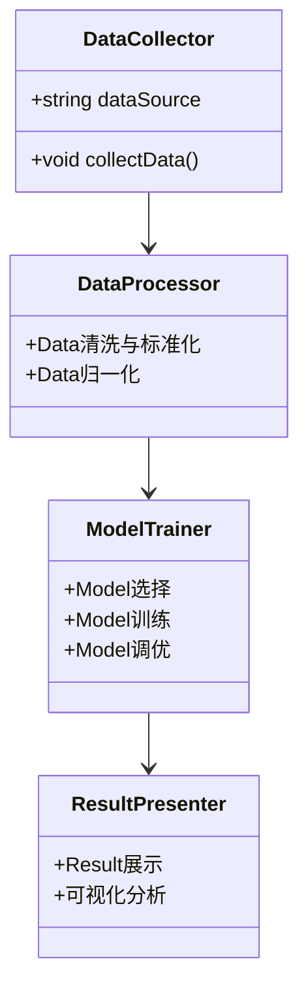
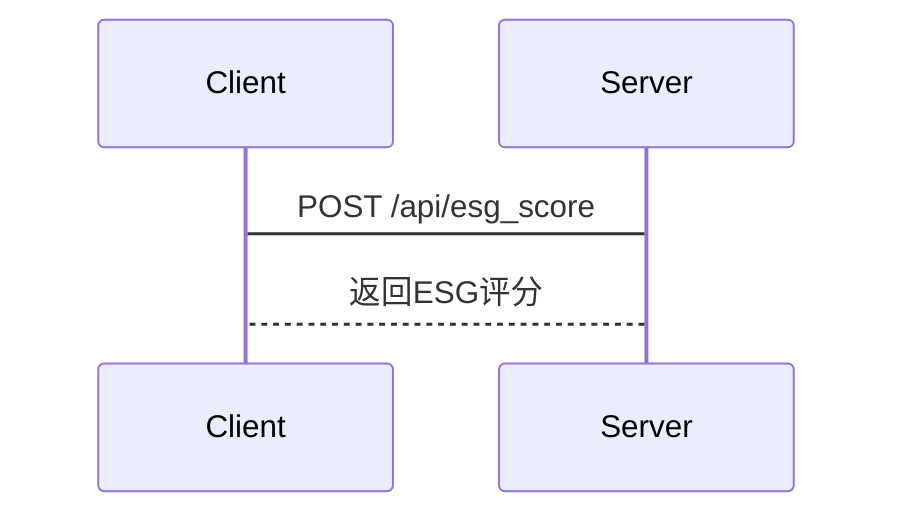

                 


# 第三部分: 算法原理

## 第5章: ESG评估的算法原理

### 5.1 数据预处理与特征提取

#### 5.1.1 数据清洗与标准化
- 使用Python代码对数据进行清洗和标准化处理
- 示例代码：`import pandas as pd; data = pd.read_csv('esg_data.csv'); data_clean = data.dropna()`

#### 5.1.2 ESG特征提取
- 从原始数据中提取关键的ESG指标
- 使用正则表达式提取文本特征
- 示例代码：`import re; re.findall(r'\bESG\b', text)`

#### 5.1.3 数据归一化
- 使用标准化方法对数据进行归一化处理
- 示例代码：`from sklearn.preprocessing import MinMaxScaler; scaler = MinMaxScaler(); normalized_data = scaler.fit_transform(data)`

### 5.2 ESG评估模型的构建与训练

#### 5.2.1 模型选择
- 选择合适的机器学习模型，如随机森林、支持向量机等
- 示例代码：`from sklearn.ensemble import RandomForestClassifier; model = RandomForestClassifier(n_estimators=100, random_state=42)`

#### 5.2.2 模型训练
- 使用训练数据对模型进行训练
- 示例代码：`model.fit(X_train, y_train)`

#### 5.2.3 模型调优
- 使用交叉验证和网格搜索进行参数调优
- 示例代码：`from sklearn.model_selection import GridSearchCV; grid_search = GridSearchCV(model, param_grid, cv=5); grid_search.fit(X_train, y_train)`

### 5.3 ESG评估的数学模型

#### 5.3.1 线性回归模型
- 使用线性回归预测ESG评分
- 数学公式：$$y = \beta_0 + \beta_1x_1 + \beta_2x_2 + \cdots + \beta_nx_n + \epsilon$$
- 示例代码：`from sklearn.linear_model import LinearRegression; lr_model = LinearRegression().fit(X_train, y_train)`

#### 5.3.2 支持向量机模型
- 使用支持向量机进行分类或回归
- 数学公式：$$\text{minimize}\ \frac{1}{2}||\mathbf{w}||^2 + C\sum_{i=1}^n \xi_i$$
- 示例代码：`from sklearn.svm import SVC; svm_model = SVC().fit(X_train, y_train)`

#### 5.3.3 随机森林模型
- 使用集成学习方法进行预测
- 示例代码：`from sklearn.ensemble import RandomForestClassifier; rf_model = RandomForestClassifier().fit(X_train, y_train)`

### 5.4 模型评估与优化

#### 5.4.1 模型评估
- 使用准确率、召回率、F1分数等指标评估模型性能
- 示例代码：`from sklearn.metrics import accuracy_score; accuracy = accuracy_score(y_test, y_pred)`

#### 5.4.2 模型优化
- 使用超参数优化技术提升模型性能
- 示例代码：`from sklearn.model_selection import GridSearchCV; grid_search = GridSearchCV(estimator, param_grid, cv=5); grid_search.fit(X, y)`

#### 5.4.3 模型解释
- 使用特征重要性分析解释模型结果
- 示例代码：`importances = model.feature_importances_`

### 5.5 算法流程图



## 第6章: ESG评估的系统架构与实现

### 6.1 系统架构设计

#### 6.1.1 系统功能模块
- 数据采集模块
- 数据处理模块
- 模型训练模块
- 结果展示模块

#### 6.1.2 系统架构图



### 6.2 系统实现

#### 6.2.1 数据采集
- 使用API接口获取ESG数据
- 示例代码：`import requests; response = requests.get('https://api.example.com/esg_data')`

#### 6.2.2 数据处理
- 对采集到的数据进行清洗和预处理
- 示例代码：`import pandas as pd; df = pd.DataFrame(response.json())`

#### 6.2.3 模型训练
- 使用训练好的模型对新数据进行预测
- 示例代码：`import joblib; model = joblib.load('esg_model.pkl')`

#### 6.2.4 结果展示
- 将模型预测结果以可视化方式展示
- 示例代码：`import matplotlib.pyplot as plt; plt.plot(results); plt.show()`

### 6.3 系统接口设计

#### 6.3.1 API接口定义
- 提供RESTful API接口供其他系统调用
- 示例代码：`from flask import Flask, jsonify; app = Flask(__name__); @app.route('/api/esg_score', methods=['POST'])`

#### 6.3.2 接口交互流程



## 第7章: 项目实战与案例分析

### 7.1 项目环境安装

#### 7.1.1 安装Python环境
- 使用Anaconda安装Python 3.8及以上版本

#### 7.1.2 安装依赖库
- 使用pip安装所需的依赖库
- 示例代码：`pip install pandas numpy scikit-learn matplotlib`

### 7.2 核心代码实现

#### 7.2.1 数据预处理代码
```python
import pandas as pd
import numpy as np

# 读取数据
data = pd.read_csv('esg_data.csv')

# 数据清洗
data_clean = data.dropna()

# 特征提取
features = data_clean[['环境影响', '社会责任', '治理结构']]

# 数据归一化
from sklearn.preprocessing import MinMaxScaler
scaler = MinMaxScaler()
normalized_features = scaler.fit_transform(features)
```

#### 7.2.2 模型训练代码
```python
from sklearn.ensemble import RandomForestClassifier
from sklearn.model_selection import train_test_split

# 划分训练集和测试集
X_train, X_test, y_train, y_test = train_test_split(normalized_features, data_clean['ESG评分'], test_size=0.2, random_state=42)

# 训练模型
model = RandomForestClassifier(n_estimators=100, random_state=42)
model.fit(X_train, y_train)

# 预测结果
y_pred = model.predict(X_test)
```

#### 7.2.3 模型评估代码
```python
from sklearn.metrics import accuracy_score, classification_report

# 计算准确率
accuracy = accuracy_score(y_test, y_pred)
print(f'准确率: {accuracy}')

# 打印分类报告
print(classification_report(y_test, y_pred))
```

### 7.3 案例分析与结果解读

#### 7.3.1 案例背景
- 选取一家公司作为案例，分析其ESG评分

#### 7.3.2 数据分析
- 展示该公司的环境、社会和治理评分

#### 7.3.3 模型预测
- 使用训练好的模型预测该公司的ESG评分
- 示例代码：`company_data = [[0.8, 0.7, 0.9]]; model.predict(company_data)`

#### 7.3.4 结果解读
- 解释预测结果的意义和可能的影响

### 7.4 项目小结

#### 7.4.1 项目总结
- 总结项目的实施过程和主要成果

#### 7.4.2 经验与教训
- 总结在项目实施过程中遇到的问题及解决方法

#### 7.4.3 未来改进方向
- 提出可能的改进措施和优化方向

## 第8章: 最佳实践与注意事项

### 8.1 最佳实践

#### 8.1.1 数据质量管理
- 强调数据质量的重要性
- 提供数据清洗和验证的建议

#### 8.1.2 模型选择与调优
- 提供模型选择和调优的实用技巧
- 推荐使用交叉验证和网格搜索

#### 8.1.3 可视化与解释性
- 强调结果可视化和模型解释的重要性
- 提供使用图表展示结果的建议

### 8.2 小结

#### 8.2.1 项目整体回顾
- 简要回顾项目的主要内容和目标

#### 8.2.2 项目成果总结
- 总结项目取得的主要成果和意义

#### 8.2.3 项目实施的经验与教训
- 总结在项目实施过程中积累的经验和教训

### 8.3 注意事项

#### 8.3.1 数据隐私与安全
- 强调数据隐私和安全的重要性
- 提供保护数据隐私的建议

#### 8.3.2 模型局限性
- 分析模型的局限性和可能的误差来源
- 提供克服模型局限性的建议

#### 8.3.3 投资决策的复杂性
- 提醒读者投资决策的复杂性，ESG评估只是其中的一部分
- 强调结合其他因素进行综合评估的重要性

## 第9章: 未来展望与扩展阅读

### 9.1 未来趋势

#### 9.1.1 ESG投资的未来发展
- 展望ESG投资的未来发展趋势
- 分析技术进步对ESG投资的影响

#### 9.1.2 智能化投资工具的发展
- 探讨智能化投资工具的未来发展
- 分析人工智能和大数据技术在投资领域的应用前景

#### 9.1.3 可持续投资的创新
- 探讨可持续投资的新模式和新技术
- 分析绿色金融和可持续金融的发展趋势

### 9.2 扩展阅读

#### 9.2.1 ESG投资的经典文献
- 推荐一些经典的ESG投资文献
- 提供一些深入探讨ESG投资的书籍和文章

#### 9.2.2 智能化投资工具的相关研究
- 推荐一些关于智能化投资工具的研究论文
- 提供一些技术文档和最佳实践指南

#### 9.2.3 未来研究方向
- 提出未来可能的研究方向
- 鼓励读者进行创新性的研究和实践

### 9.3 总结与展望

#### 9.3.1 总结
- 简要总结全文的主要内容和目标
- 强调ESG投资和智能化投资工具的重要性

#### 9.3.2 展望
- 展望未来ESG投资和智能化投资工具的发展前景
- 鼓励读者积极参与到这一领域的研究和实践中

#### 9.3.3 结束语
- 结束全文，感谢读者的阅读和支持
- 鼓励读者提出宝贵意见和建议

## 第10章: 总结

### 10.1 项目总结

#### 10.1.1 项目目标的实现
- 总结项目是否达到了预期的目标
- 分析项目成果与目标的差距

#### 10.1.2 项目实施过程的回顾
- 回顾项目实施的主要步骤和关键节点
- 总结项目管理的经验和教训

#### 10.1.3 项目成果的评估
- 评估项目成果的价值和意义
- 分析项目成果对个人投资组合ESG评估的贡献

### 10.2 个人成长与收获

#### 10.2.1 技术能力的提升
- 总结在项目中个人技术能力的提升
- 分析在数据处理、模型训练和系统设计等方面的能力提升

#### 10.2.2 知识储备的增加
- 总结在ESG投资、可持续投资和智能化工具方面的知识储备增加
- 分析对行业趋势和技术创新的理解和把握

#### 10.2.3 实践经验的积累
- 总结在项目实施过程中积累的实践经验
- 分析这些经验对未来职业发展的帮助

### 10.3 未来规划与目标

#### 10.3.1 个人职业规划
- 结合项目成果，制定个人职业发展规划
- 设定未来在技术、管理和研究等方面的目标

#### 10.3.2 项目后续发展
- 分析项目的后续发展潜力
- 提出进一步优化和扩展项目的想法和计划

#### 10.3.3 行业发展趋势
- 关注ESG投资和智能化投资工具的行业发展趋势
- 分析个人在行业发展趋势中的定位和机会

### 10.4 结语

- 感谢读者的阅读和支持
- 鼓励读者积极参与到ESG投资和智能化工具的研究和实践中
- 展望未来，呼吁更多的创新和合作，共同推动ESG投资和可持续发展的目标

## 第11章: 最终总结与感谢

### 11.1 最终总结

- 回顾全文，总结主要内容和核心思想
- 强调ESG投资的重要性和智能化工具的必要性
- 总结项目成果和对未来发展的启示

### 11.2 感谢与致谢

- 感谢读者的支持和关注
- 致谢在项目实施过程中提供帮助和支持的团队和人员
- 表达对未来研究和实践的期待和热情

### 11.3 未来展望

- 展望未来，预测ESG投资和智能化工具的发展趋势
- 鼓励读者积极参与到这一领域的研究和实践中
- 呼吁更多的创新和合作，共同推动ESG投资和可持续发展的目标

### 11.4 结束语

- 结束全文，再次感谢读者的阅读和支持
- 鼓励读者提出宝贵意见和建议
- 展望未来，期待更多有价值的成果和贡献

