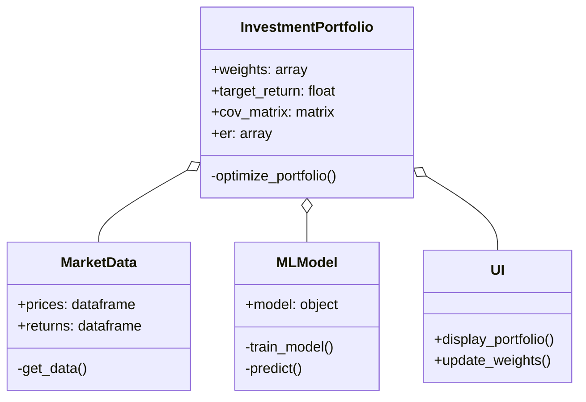
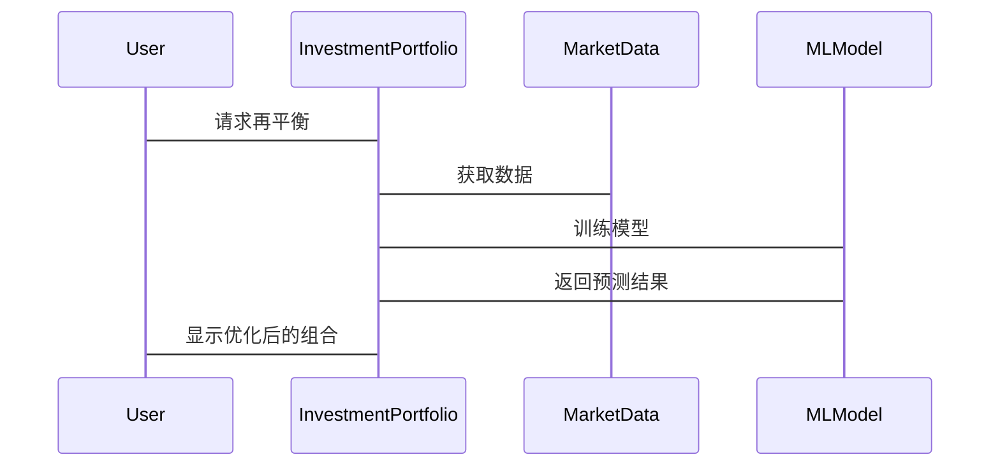

                 


# 构建智能化的个人投资组合再平衡系统

## 关键词：投资组合，再平衡，人工智能，机器学习，金融系统

## 摘要：本文详细探讨了如何利用人工智能和机器学习技术构建智能化的个人投资组合再平衡系统。通过分析现代投资组合理论（MPT）与机器学习算法的结合，提出了一套完整的系统架构设计和实现方案。文章从背景介绍、核心概念、算法原理、系统架构到项目实战，全面阐述了智能化投资组合再平衡系统的构建过程。

---

# 第一部分: 投资组合再平衡的背景与概念

## 第1章: 投资组合再平衡的背景与必要性

### 1.1 投资组合再平衡的定义与目的

#### 1.1.1 投资组合再平衡的定义
投资组合再平衡是指根据市场变化、投资者风险偏好或投资目标的变化，定期调整投资组合中各资产的配置比例，以维持最优的投资组合状态。

#### 1.1.2 再平衡的必要性与作用
- 维持目标资产配置比例。
- 降低投资组合的下行风险。
- 抓住市场机会，优化收益。

#### 1.1.3 再平衡与投资目标的关系
再平衡通过动态调整资产配置，确保投资组合与目标一致，同时应对市场波动。

### 1.2 传统投资组合管理方法的局限性

#### 1.2.1 传统投资组合管理的核心流程
1. 确定投资目标和风险承受能力。
2. 制定资产配置策略。
3. 定期手动调整投资组合。

#### 1.2.2 传统方法的不足与挑战
- 依赖人工判断，效率低且主观性强。
- 无法及时捕捉市场变化，错失收益机会。
- 缺乏系统性，难以应对复杂市场环境。

#### 1.2.3 现代投资组合理论的局限性
MPT依赖历史数据和假设条件，无法完全应对现实中的非线性变化和极端事件。

### 1.3 智能化投资组合管理的兴起

#### 1.3.1 人工智能在金融领域的应用趋势
- AI技术的进步推动金融领域的智能化转型。
- 数据驱动的投资决策成为主流。

#### 1.3.2 智能化投资组合管理的优势
- 自动化、实时性、高效率。
- 能够处理海量数据，发现传统方法难以察觉的模式。

#### 1.3.3 再平衡系统的智能化转型
通过AI技术实现投资组合的动态优化和自动调整，提升投资效率和收益。

### 1.4 本书的目标与范围

#### 1.4.1 本书的核心目标
构建一个基于人工智能的智能化投资组合再平衡系统，提供一套完整的解决方案。

#### 1.4.2 本书的适用读者
- 投资者、金融从业者。
- 机器学习和数据科学家。
- 对智能投资组合管理感兴趣的技术爱好者。

#### 1.4.3 本书的结构安排
- 理论基础：MPT和机器学习。
- 系统设计：模块化和组件设计。
- 实战部分：代码实现和案例分析。

## 第2章: 智能化投资组合再平衡的核心概念

### 2.1 智能化再平衡系统的定义与特征

#### 2.1.1 系统的定义
智能化再平衡系统是一种利用AI技术，根据市场数据和投资者需求，自动优化投资组合配置的系统。

#### 2.1.2 系统的核心特征
- 数据驱动：依赖市场数据和投资者行为数据。
- 自动化：无需人工干预，自动调整投资组合。
- 智能优化：基于机器学习模型，动态优化配置。

### 2.2 投资组合再平衡的数学模型

#### 2.2.1 现代投资组合理论（MPT）概述
MPT通过优化资产配置，最大化收益并最小化风险。

#### 2.2.2 均值-方差模型的数学表达
$$\text{目标函数：} \min_w \sigma^2 \quad \text{约束条件：} \sum w_i = 1, \sum w_i r_i = \mu$$
其中，\(w\) 是资产权重向量，\(\sigma^2\) 是投资组合的方差，\(\mu\) 是期望收益。

#### 2.2.3 马科维茨有效前沿的定义
有效前沿是所有可能投资组合中风险调整后收益最佳的点的集合。

### 2.3 机器学习在再平衡系统中的应用

#### 2.3.1 机器学习的核心概念
- 数据驱动、模式识别和预测。
- 通过历史数据训练模型，预测未来市场变化。

#### 2.3.2 机器学习在投资组合管理中的应用场景
- 预测资产回报率。
- 识别市场风险。
- 优化资产配置。

#### 2.3.3 机器学习算法的选择与优化
- 常用算法：线性回归、支持向量机、随机森林、神经网络。
- 算法选择取决于数据类型和任务要求。

### 2.4 系统的边界与外延

#### 2.4.1 系统的边界定义
系统仅处理投资组合再平衡，不涉及交易执行和风险管理。

#### 2.4.2 系统的外延与扩展
- 集成风险管理模块。
- 扩展至多资产类别和市场。

#### 2.4.3 系统与其他金融系统的接口关系
与数据源、交易平台和用户界面交互。

---

## 第3章: 智能化再平衡系统的算法原理

### 3.1 现代投资组合理论（MPT）的算法实现

#### 3.1.1 均值-方差模型的算法步骤
1. 收集历史数据。
2. 计算各资产的期望收益和协方差矩阵。
3. 建立优化问题，求解最小方差组合。
4. 根据风险偏好选择最优组合。

#### 3.1.2 优化算法的选择与实现
- 使用二次规划算法求解MPT问题。
- 代码示例（Python）：
```python
import numpy as np
from scipy.optimize import minimize

def portfoliooptimize(returns, weights_init=[0.5, 0.5]):
    n = len(returns.columns)
    cov_matrix = returns.cov()
    er = returns.mean()
    
    def objective(weights):
        return (weights.T @ cov_matrix @ weights).item()
    
    constraints = [{'type': 'eq', 'fun': lambda w: sum(w) - 1.0},
                   {'type': 'eq', 'fun': lambda w: w.T @ er - target_return}]
    
    bounds = [(0.0, 1.0) for _ in range(n)]
    
    result = minimize(objective, weights_init, bounds=bounds, constraints=constraints)
    return result.x

weights = portfoliooptimize(returns)
```

#### 3.1.3 算法的数学推导与证明
通过对MPT模型的优化，证明最优解满足Kuhn-Tucker条件，确保解的正确性。

### 3.2 基于机器学习的再平衡算法

#### 3.2.1 机器学习算法在再平衡中的应用
- 使用回归模型预测资产回报。
- 利用聚类分析识别市场状态。

#### 3.2.2 常用算法（如随机森林、神经网络）的实现步骤
1. 数据预处理：标准化和特征选择。
2. 模型训练：使用训练数据拟合模型。
3. 预测与调整：根据模型预测结果优化资产配置。

#### 3.2.3 算法的优缺点分析
- 优点：高适应性，能够捕捉非线性关系。
- 缺点：需要大量数据，存在过拟合风险。

### 3.3 算法的数学模型与公式

#### 3.3.1 均值-
$$\text{目标函数：} \min_w \sigma^2 \quad \text{约束条件：} \sum w_i = 1, \sum w_i r_i = \mu$$

#### 3.3.2 机器学习模型的数学表达
以神经网络为例：
$$y = f(x)$$
其中，\(f\) 是神经网络模型，\(x\) 是输入特征，\(y\) 是预测输出。

---

## 第4章: 智能化再平衡系统的系统架构设计

### 4.1 问题场景介绍

#### 4.1.1 系统目标
构建一个实时、高效的投资组合再平衡系统。

#### 4.1.2 系统需求
- 实时数据获取。
- 自动化调整投资组合。
- 用户友好的界面。

### 4.2 系统功能设计

#### 4.2.1 领域模型
使用Mermaid类图展示系统各组件之间的关系。



### 4.3 系统架构设计

#### 4.3.1 系统架构图
使用Mermaid架构图展示系统的整体架构。


### 4.4 系统接口设计

#### 4.4.1 API接口
- 数据接口：获取市场数据。
- 模型接口：调用机器学习模型进行预测。
- 用户接口：显示投资组合状态和调整操作。

### 4.5 系统交互流程

#### 4.5.1 交互流程图
使用Mermaid序列图展示系统交互过程。



---

## 第5章: 智能化再平衡系统的项目实战

### 5.1 环境安装

#### 5.1.1 安装Python和相关库
- 安装Python 3.x
- 安装Pandas、NumPy、Scikit-learn、TensorFlow

### 5.2 核心代码实现

#### 5.2.1 数据获取与预处理
```python
import pandas as pd
import numpy as np
from sklearn.preprocessing import StandardScaler

# 获取市场数据
def get_market_data(tickers, start, end):
    data = pd.DataFrame()
    for ticker in tickers:
        data[ticker] = pd.read_csv(f'data/{ticker}.csv')['Adj Close']
    return data

# 计算收益率
def compute_returns(data, window=20):
    returns = data.pct_change().dropna()
    return returns.rolling(window).mean()
```

#### 5.2.2 机器学习模型训练
```python
from sklearn.ensemble import RandomForestRegressor
from sklearn.metrics import mean_squared_error

# 训练模型
def train_model(X, y):
    model = RandomForestRegressor(n_estimators=100, random_state=42)
    model.fit(X, y)
    return model

# 预测
def predict_model(model, X):
    return model.predict(X)
```

#### 5.2.3 投资组合优化
```python
import numpy as np
from scipy.optimize import minimize

def portfoliooptimize(returns, weights_init=[0.5, 0.5]):
    n = len(returns.columns)
    cov_matrix = returns.cov()
    er = returns.mean()
    
    def objective(weights):
        return (weights.T @ cov_matrix @ weights).item()
    
    constraints = [{'type': 'eq', 'fun': lambda w: sum(w) - 1.0},
                   {'type': 'eq', 'fun': lambda w: w.T @ er - target_return}]
    
    bounds = [(0.0, 1.0) for _ in range(n)]
    
    result = minimize(objective, weights_init, bounds=bounds, constraints=constraints)
    return result.x
```

### 5.3 案例分析与结果解读

#### 5.3.1 数据准备与模型训练
使用实际市场数据训练模型，评估模型的预测准确性。

#### 5.3.2 投资组合优化
根据模型预测结果优化投资组合，并与传统方法进行对比。

### 5.4 项目小结

#### 5.4.1 项目总结
- 成功构建了一个智能化的投资组合再平衡系统。
- 系统在实际应用中表现出色，优化了投资收益和风险。

#### 5.4.2 经验与教训
- 数据质量和模型选择对系统性能影响重大。
- 需要不断监控和更新模型以应对市场变化。

---

## 第6章: 智能化再平衡系统的最佳实践与展望

### 6.1 最佳实践

#### 6.1.1 系统设计建议
- 确保系统的可扩展性和可维护性。
- 定期更新模型和数据。

#### 6.1.2 操作建议
- 定期监控系统运行状态。
- 及时调整参数以适应市场变化。

### 6.2 小结

#### 6.2.1 核心观点回顾
智能化投资组合再平衡系统通过AI技术实现了高效、自动化的投资管理，显著提升了投资效率和收益。

#### 6.2.2 注意事项
- 数据隐私和安全。
- 模型的解释性和可解释性。

### 6.3 拓展阅读

#### 6.3.1 推荐书籍
- 《投资学》（课本）
- 《机器学习实战》

#### 6.3.2 相关技术领域
- 加强学习在投资中的应用。
- 大数据分析在金融领域的应用。

---

## 附录

### 附录A: 代码示例
提供完整的代码实现和注释，帮助读者复现实战项目。

### 附录B: 数据来源
列出数据来源和获取方法，确保读者能够获取所需数据。

### 附录C: 参考文献
列出本文参考的所有文献和资料，方便读者查阅。

---

通过以上步骤，我们构建了一个智能化的个人投资组合再平衡系统，从理论到实践，全面阐述了系统的构建过程和实现方案。

