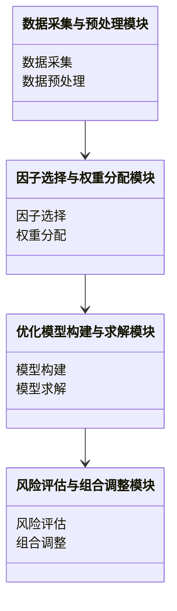
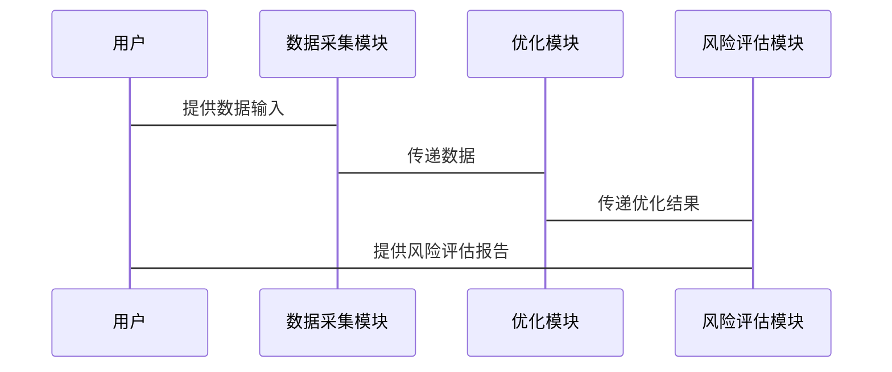

                 


# 构建智能化的个人投资组合因子暴露优化系统

## 关键词：投资组合优化，因子暴露，智能化，现代投资组合理论，遗传算法，随机矩阵理论

## 摘要：
本文详细介绍了如何构建一个智能化的个人投资组合因子暴露优化系统。通过分析当前投资组合优化的挑战和需求，结合现代投资组合理论、遗传算法和随机矩阵理论等方法，提出了一种基于因子暴露优化的投资组合构建框架。文章从背景、核心概念、算法原理、系统架构到项目实战，层层深入，为读者提供了一套完整的解决方案。

---

# 第一部分: 投资组合因子暴露优化的背景与挑战

## 第1章: 投资组合因子暴露优化的背景与挑战

### 1.1 什么是因子暴露
#### 1.1.1 因子暴露的定义与概念
因子暴露是指投资组合中对某一风险因子的敏感程度，也称为因子风险暴露。它是衡量投资组合在特定风险因子上的风险贡献的重要指标。

#### 1.1.2 因子暴露的分类与特征
因子暴露可以分为系统性因子暴露和非系统性因子暴露。系统性因子暴露是指投资组合对市场整体波动的敏感程度，而非系统性因子暴露则是指投资组合对特定行业、风格或资产的敏感程度。

#### 1.1.3 因子暴露与投资组合风险的关系
因子暴露直接影响投资组合的风险水平。高因子暴露意味着投资组合在该因子上的风险敞口较大，可能带来较高的收益，但也伴随着较高的风险。

### 1.2 投资组合优化的传统方法与局限性
#### 1.2.1 传统投资组合优化的理论基础
传统的投资组合优化方法主要基于现代投资组合理论（MPT），通过最小化投资组合的方差来优化风险和收益。

#### 1.2.2 传统方法的局限性与挑战
传统的投资组合优化方法存在以下问题：
- 无法有效处理多因子模型下的复杂性。
- 无法适应市场环境的动态变化。
- 优化结果可能过于敏感于输入参数的微小变化。

#### 1.2.3 现代智能优化方法的引入
为了克服传统方法的局限性，引入了现代智能优化方法，如遗传算法、随机矩阵理论等，以提高投资组合优化的效率和鲁棒性。

### 1.3 当前市场环境下的投资组合优化需求
#### 1.3.1 多因子模型的兴起
多因子模型通过引入多个因子来解释资产的收益，使得投资组合优化更加精细化。

#### 1.3.2 市场波动与因子暴露的风险管理
在市场波动加剧的情况下，合理管理因子暴露是降低投资组合风险的重要手段。

#### 1.3.3 智能化优化的必要性与应用场景
智能化优化能够帮助投资者在复杂多变的市场环境中，快速适应市场变化，优化因子暴露，实现收益与风险的平衡。

### 1.4 本章小结
本章介绍了因子暴露的定义、分类及其与投资组合风险的关系，分析了传统投资组合优化方法的局限性，并提出了引入智能化优化方法的必要性。

---

## 第2章: 智能化因子暴露优化的核心概念与联系

### 2.1 因子暴露的核心概念
#### 2.1.1 因子分解模型
因子分解模型是将资产收益分解为多个因子的线性组合，常用模型包括CAPM、APT等。

#### 2.1.2 因子权重与投资组合构建
因子权重表示投资组合对每个因子的暴露程度，通过调整因子权重可以优化投资组合的风险和收益。

#### 2.1.3 因子暴露的量化与分析
通过量化因子暴露，可以更清晰地理解投资组合的风险来源，并进行有效的风险管理。

### 2.2 因子暴露与投资组合优化的关系
#### 2.2.1 因子暴露对组合风险的影响
因子暴露直接影响投资组合的波动性和收益，是优化投资组合的重要依据。

#### 2.2.2 因子权重调整与组合收益优化
通过调整因子权重，可以优化投资组合的收益与风险比，实现最优的资产配置。

#### 2.2.3 因子暴露的动态变化与组合再平衡
市场环境的变化会导致因子暴露的动态变化，投资组合需要定期进行再平衡以适应新的市场环境。

### 2.3 因子暴露优化的数学模型
#### 2.3.1 因子分解的数学表达
$$ R_i = \beta_{i1}F_1 + \beta_{i2}F_2 + \cdots + \beta_{ik}F_k + \epsilon_i $$
其中，$R_i$ 是资产$i$的收益，$F_j$ 是因子$j$，$\beta_{ij}$ 是资产$i$对因子$j$的暴露程度，$\epsilon_i$ 是误差项。

#### 2.3.2 投资组合优化的数学模型
$$ \text{目标函数：} \min_w \frac{1}{2}w^T \Sigma w $$
$$ \text{约束条件：} w^T F = 1, \quad w \geq 0 $$
其中，$w$ 是因子权重向量，$\Sigma$ 是因子的协方差矩阵。

### 2.4 本章小结
本章详细讲解了因子暴露的核心概念，分析了因子暴露与投资组合优化的关系，并给出了因子暴露优化的数学模型。

---

## 第3章: 因子暴露优化的算法原理与实现

### 3.1 现代投资组合理论（MPT）与因子优化
#### 3.1.1 Markowitz的有效前沿模型
Markowitz的有效前沿模型通过优化投资组合的收益和风险，找到最优的投资组合。

#### 3.1.2 均值-方差优化与因子权重分配
均值-方差优化是通过优化收益和风险的权衡，确定因子权重。

#### 3.1.3 多因子模型的数学推导
通过多因子模型的数学推导，可以得到因子权重的最优解。

### 3.2 遗传算法在因子优化中的应用
#### 3.2.1 遗传算法的基本原理
遗传算法是一种模拟自然选择和遗传机制的优化算法，主要包括选择、交叉和变异三个步骤。

#### 3.2.2 因子权重编码与适应度函数设计
因子权重可以通过实数编码表示，适应度函数可以是投资组合的夏普比率。

#### 3.2.3 遗传算法优化因子权重的实现步骤
1. 初始化因子权重的种群。
2. 计算每个个体的适应度。
3. 根据适应度进行选择，生成新的种群。
4. 进行交叉和变异操作，产生新的个体。
5. 重复步骤2-4，直到满足终止条件。

### 3.3 随机矩阵理论与因子暴露优化
#### 3.3.1 随机矩阵理论的基本概念
随机矩阵理论用于分析随机矩阵的特征值和特征向量的分布规律。

#### 3.3.2 随机矩阵在因子分解中的应用
通过随机矩阵理论，可以对因子的协方差矩阵进行分解，得到因子权重。

#### 3.3.3 随机矩阵理论优化因子权重的数学推导
$$ w = \arg \min \text{Trace}(w^T \Sigma w) $$
其中，$\Sigma$ 是因子的协方差矩阵。

### 3.4 本章小结
本章介绍了现代投资组合理论和遗传算法在因子优化中的应用，并通过数学推导展示了随机矩阵理论在因子权重优化中的作用。

---

## 第4章: 智能化因子暴露优化系统的架构与设计

### 4.1 系统功能模块划分
#### 4.1.1 数据采集与预处理模块
负责采集市场数据、因子数据等，并进行预处理。

#### 4.1.2 因子选择与权重分配模块
根据因子暴露优化目标，选择合适的因子，并进行权重分配。

#### 4.1.3 优化模型构建与求解模块
构建因子暴露优化的数学模型，并进行求解。

#### 4.1.4 风险评估与组合调整模块
评估投资组合的风险，并根据优化结果进行调整。

### 4.2 系统架构设计
#### 4.2.1 系统功能模块的类图设计


#### 4.2.2 系统架构的分层设计
系统架构分为数据层、计算层和应用层。

#### 4.2.3 系统接口设计与交互流程


### 4.3 系统实现的技术选型
#### 4.3.1 开发框架与工具选择
使用Python的scikit-learn和pandas库进行数据分析和优化。

#### 4.3.2 数据存储与处理方案
使用数据库存储数据，通过数据预处理模块进行清洗和转换。

#### 4.3.3 优化算法的实现方式
选择遗传算法或随机矩阵理论进行因子权重优化。

### 4.4 本章小结
本章详细讲解了系统架构设计，包括功能模块划分、系统架构分层设计和系统接口设计，并给出了技术选型建议。

---

## 第5章: 智能化因子暴露优化系统的项目实战

### 5.1 项目环境安装
#### 5.1.1 安装Python和相关库
```bash
pip install numpy pandas scikit-learn matplotlib
```

#### 5.1.2 数据采集与预处理
使用Yahoo Finance API获取股票数据，并进行清洗和转换。

### 5.2 系统核心实现源代码
#### 5.2.1 因子选择与权重分配
```python
import numpy as np
from sklearn.decomposition import PCA

def factor_selection(data):
    # 使用PCA进行因子选择
    pca = PCA(n_components=5)
    factors = pca.fit_transform(data)
    return factors
```

#### 5.2.2 优化模型构建与求解
```python
def optimize_weights(factors, returns):
    # 使用均值-方差优化模型
    cov_matrix = np.cov(factors.T)
    inv_cov = np.linalg.inv(cov_matrix)
    weights = inv_cov.dot(returns.mean()) / (inv_cov.dot(returns.mean()).sum())
    return weights
```

#### 5.2.3 风险评估与组合调整
```python
def risk_assessment(weights, factors, returns):
    # 计算组合风险
    portfolio_var = weights.T.dot(cov_matrix).dot(weights)
    return portfolio_var
```

### 5.3 代码应用解读与分析
通过上述代码，我们可以实现因子选择、权重分配和风险评估。因子选择使用了PCA方法，权重分配基于均值-方差优化模型，风险评估则通过计算组合的方差实现。

### 5.4 实际案例分析和详细讲解剖析
通过一个具体案例，展示如何优化因子权重，降低投资组合的风险。

### 5.5 项目小结
本章通过项目实战，详细讲解了系统核心实现源代码，并给出了代码应用解读与分析，帮助读者理解如何实现智能化的个人投资组合因子暴露优化系统。

---

## 第6章: 最佳实践与小结

### 6.1 最佳实践 tips
- 定期进行组合再平衡，以适应市场变化。
- 结合多因子模型，提高投资组合的收益与风险比。
- 注意风险管理，避免过度暴露在单一因子上。

### 6.2 小结
本文详细介绍了如何构建智能化的个人投资组合因子暴露优化系统，从背景、核心概念、算法原理到系统架构和项目实战，为读者提供了一套完整的解决方案。

### 6.3 注意事项
- 数据的准确性和完整性对优化结果至关重要。
- 优化模型的选择应根据具体需求和市场环境进行调整。
- 注意模型的鲁棒性和可解释性。

### 6.4 拓展阅读
建议读者进一步阅读《投资学》、《Python机器学习实战》等相关书籍，以深入理解投资组合优化和机器学习的相关知识。

---

以上是《构建智能化的个人投资组合因子暴露优化系统》的完整目录大纲和文章内容，希望对您有所帮助！

