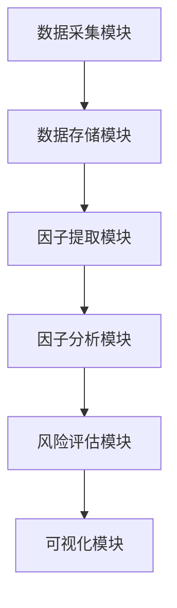

                 


# 构建智能化的个人投资组合因子暴露分析系统

---

## 关键词
- 因子分析
- 智能化系统
- 投资组合
- 风险管理
- 机器学习

---

## 摘要
本文详细介绍构建智能化个人投资组合因子暴露分析系统的背景、方法和实现过程。通过因子分析的数学模型、算法原理、系统架构设计及项目实战，帮助读者掌握如何利用智能化技术优化投资组合管理，降低风险，提升收益。文章最后提供最佳实践和系统优化建议，为实际应用提供指导。

---

# 第1章: 个人投资组合因子暴露分析的背景与问题

## 1.1 问题背景
### 1.1.1 投资组合管理的重要性
投资组合管理是金融领域的重要组成部分，涉及资产配置、风险控制和收益最大化。传统的投资组合管理依赖于历史数据和统计方法，但难以应对复杂多变的市场环境。

### 1.1.2 因子分析在投资组合管理中的作用
因子分析通过提取影响资产收益的关键因素，帮助投资者更好地理解和管理风险。然而，传统方法在因子选择和模型构建上存在局限性。

### 1.1.3 当前因子分析的挑战与不足
现有因子分析方法难以捕捉非线性关系，计算复杂度高，且难以实时更新。这些不足限制了其在实际投资组合管理中的应用。

## 1.2 问题描述
### 1.2.1 投资组合因子暴露的定义
因子暴露是指资产或投资组合对特定风险因子的敏感程度。通过量化因子暴露，投资者可以更好地理解投资组合的风险来源。

### 1.2.2 因子暴露分析的目标
目标包括识别主要风险因子、量化因子影响、优化投资组合配置以及实时监控和调整。

### 1.2.3 现有因子分析方法的局限性
传统方法依赖线性模型，难以处理高维数据和非线性关系，且缺乏动态调整能力。

## 1.3 问题解决方法
### 1.3.1 智能化因子暴露分析的必要性
引入机器学习和大数据技术，提升因子分析的准确性和实时性，增强系统的适应能力。

### 1.3.2 机器学习在因子分析中的应用
利用机器学习算法（如随机森林、神经网络）提取非线性因子关系，提升模型的泛化能力。

### 1.3.3 智能化系统的构建目标
构建一个实时、动态、高精度的因子暴露分析系统，帮助投资者做出更明智的投资决策。

## 1.4 系统的边界与外延
### 1.4.1 系统的功能边界
系统专注于因子暴露分析，不涉及投资组合的具体交易和执行。

### 1.4.2 系统的外延与扩展性
系统可扩展至多因子模型、实时监控和动态调整，支持与其他投资工具的集成。

### 1.4.3 系统与其他投资工具的关系
系统作为投资决策的辅助工具，与其他工具（如风险管理平台、资产配置工具）协同工作。

## 1.5 概念结构与核心要素
### 1.5.1 投资组合的构成要素
包括资产、权重、因子、因子暴露、风险收益等。

### 1.5.2 因子分析的核心要素
涉及因子选择、因子模型、因子载荷、因子暴露等。

### 1.5.3 智能化系统的构成要素
包括数据采集、因子提取、模型构建、风险评估、动态调整等模块。

---

# 第2章: 因子暴露分析的核心概念与联系

## 2.1 因子分析的基本原理
### 2.1.1 因子分析的定义
因子分析是一种统计方法，用于识别影响观测变量的潜在因素。

### 2.1.2 因子分析的数学模型
$$
\mathbf{x} = \mathbf{B}\mathbf{f} + \mathbf{\epsilon}
$$
其中，$\mathbf{x}$为观测变量，$\mathbf{B}$为因子载荷矩阵，$\mathbf{f}$为潜在因子，$\mathbf{\epsilon}$为误差项。

### 2.1.3 因子分析的步骤
1. 计算相关系数矩阵。
2. 确定因子数量。
3. 因子旋转以提高可解释性。
4. 计算因子得分。

## 2.2 因子模型的类型
### 2.2.1 线性因子模型
$$
R_i = \alpha_i + \beta_{i1}f_1 + \beta_{i2}f_2 + \cdots + \beta_{ik}f_k + \epsilon_i
$$

### 2.2.2 非线性因子模型
引入非线性关系，如平方项或交互项。

### 2.2.3 混合因子模型
结合线性与非线性因素，适用于复杂市场环境。

## 2.3 因子与风险暴露的关系
### 2.3.1 因子与风险暴露的定义
因子暴露量化了资产或投资组合对特定因子的敏感程度，影响整体风险和收益。

### 2.3.2 因子对风险暴露的影响
通过因子载荷矩阵，计算各因子对投资组合风险的贡献程度。

### 2.3.3 智能化系统中因子暴露的动态变化
系统实时更新因子暴露，反映市场变化对投资组合的影响。

## 2.4 核心概念的ER实体关系图
```mermaid
er
actor:Investor
actor:Risk_Management_System
actor:Data_Source
entity:Factor
entity:Portfolio
entity:Risk_Exposure
```

---

# 第3章: 因子暴露分析的算法原理

## 3.1 因子分析的数学模型
### 3.1.1 因子载荷的计算
使用主成分分析（PCA）或最大似然估计（MLE）方法计算因子载荷。

### 3.1.2 因子得分的计算
$$
\hat{f}_i = \sum_{j=1}^p \hat{\beta}_{ij}x_j - \sum_{j=1}^p \hat{\beta}_{ij} \hat{\mu}_j
$$

## 3.2 系统输入输出与数据流
### 3.2.1 数据输入
包括资产价格数据、市场因子数据、宏观经济指标等。

### 3.2.2 数据处理
清洗、标准化、特征提取等预处理步骤。

## 3.3 算法实现步骤
### 3.3.1 数据预处理
清洗数据，处理缺失值，标准化数据。

### 3.3.2 因子提取
使用PCA或因子分析方法提取潜在因子。

### 3.3.3 因子载荷计算
应用MLE方法估计因子载荷矩阵。

### 3.3.4 计算因子得分
基于因子载荷矩阵计算因子得分。

## 3.4 代码实现与解释
```python
import numpy as np
from sklearn.decomposition import FactorAnalysis

# 示例数据：假设我们有5个资产，100天的数据
X = np.random.randn(100, 5)

# 使用因子分析提取2个因子
fa = FactorAnalysis(n_components=2)
fa.fit(X)

# 因子载荷矩阵
loadings = fa.components_

# 计算因子得分
factor_scores = fa.transform(X)
```

---

# 第4章: 智能化因子暴露分析系统的架构设计

## 4.1 项目背景
构建一个智能化的因子暴露分析系统，帮助投资者实时监控和优化投资组合。

## 4.2 系统功能设计
### 4.2.1 系统功能模块
- 数据采集模块：从多种数据源获取数据。
- 因子提取模块：使用机器学习算法提取因子。
- 模型构建模块：构建因子分析模型。
- 风险评估模块：计算因子暴露并评估风险。
- 可视化模块：提供直观的可视化结果。

## 4.3 系统架构设计
### 4.3.1 系统架构图


## 4.4 系统接口设计与交互流程
### 4.4.1 系统接口设计
- 数据接口：接收数据流，处理数据。
- 模型接口：与因子提取和分析模块交互。
- 用户接口：提供输入和输出界面。

### 4.4.2 系统交互流程
1. 用户输入投资组合数据。
2. 数据采集模块获取实时数据。
3. 因子提取模块处理数据，提取因子。
4. 因子分析模块计算因子载荷和得分。
5. 风险评估模块计算因子暴露，生成报告。
6. 可视化模块展示结果，用户查看并调整投资组合。

---

# 第5章: 项目实战

## 5.1 环境安装与配置
- 安装Python和必要的库（如NumPy、scikit-learn）。
- 数据源：获取历史资产价格数据和宏观经济指标。

## 5.2 核心代码实现
```python
import numpy as np
import pandas as pd
from sklearn.decomposition import FactorAnalysis
from sklearn.preprocessing import StandardScaler

# 数据预处理
data = pd.read_csv('asset_prices.csv')
scaler = StandardScaler()
X = scaler.fit_transform(data)

# 因子分析
fa = FactorAnalysis(n_components=3)
fa.fit(X)

# 计算因子载荷和得分
loadings = fa.components_
factor_scores = fa.transform(X)

# 可视化因子载荷
import matplotlib.pyplot as plt
plt.figure(figsize=(10, 6))
plt.imshow(loadings, cmap='viridis')
plt.colorbar()
plt.title('Factor Loadings')
plt.show()
```

## 5.3 代码应用解读与分析
- 数据预处理：标准化数据，确保各变量具有可比性。
- 因子分析：提取主要因子，捕捉数据中的潜在结构。
- 可视化：直观展示因子载荷，帮助理解各因子的含义。

## 5.4 案例分析与详细解读
以具体资产组合为例，展示如何通过系统分析因子暴露，优化投资组合配置，降低风险。

## 5.5 系统实现总结
- 代码实现的关键点：数据预处理、因子提取、因子分析。
- 系统优势：实时性、动态调整能力、高精度。

---

# 第6章: 最佳实践与系统优化

## 6.1 最佳实践 tips
- 数据质量：确保数据准确、完整，避免偏差。
- 模型选择：根据实际情况选择合适的因子分析方法。
- 系统维护：定期更新模型，适应市场变化。

## 6.2 系统小结
智能化个人投资组合因子暴露分析系统通过机器学习和大数据技术，显著提升了因子分析的准确性和实时性，为投资者提供了有力的决策支持。

## 6.3 注意事项与风险提示
- 数据依赖风险：数据质量直接影响结果。
- 模型过拟合风险：避免过拟合，选择合适模型。
- 市场变化风险：系统需动态调整，适应市场波动。

## 6.4 拓展阅读
- 推荐书籍：《投资学》、《机器学习实战》。
- 相关文献：关于因子分析和机器学习的最新研究。

---

# 结语
构建智能化的个人投资组合因子暴露分析系统是一个复杂而重要的任务。通过本文的详细讲解，读者可以掌握系统的构建方法，并在实际投资中应用。未来，随着技术进步，系统将更加智能化和个性化，为投资者创造更大价值。

--- 

**全文完**

