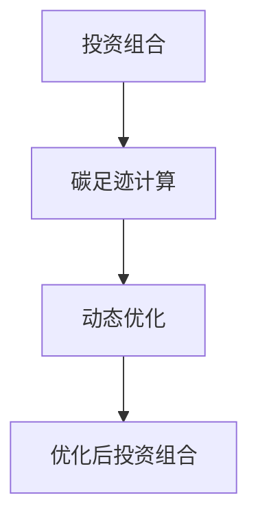
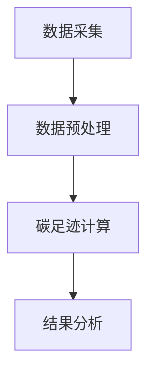
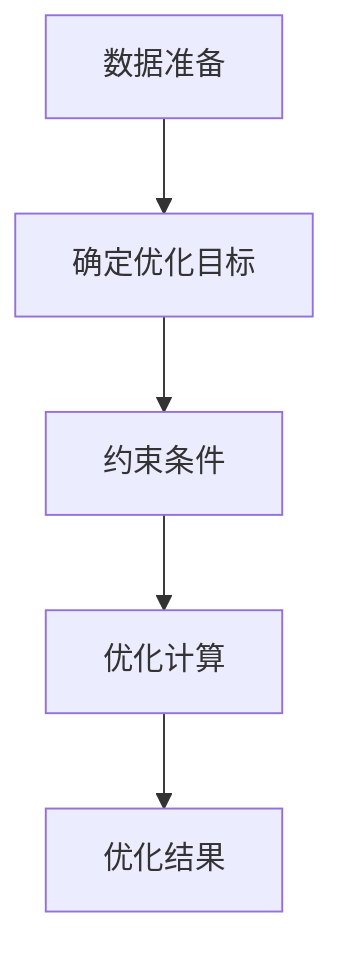
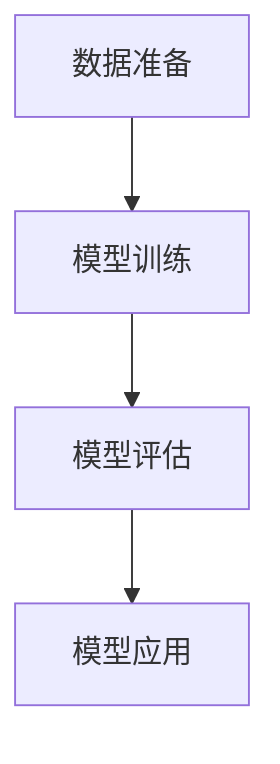
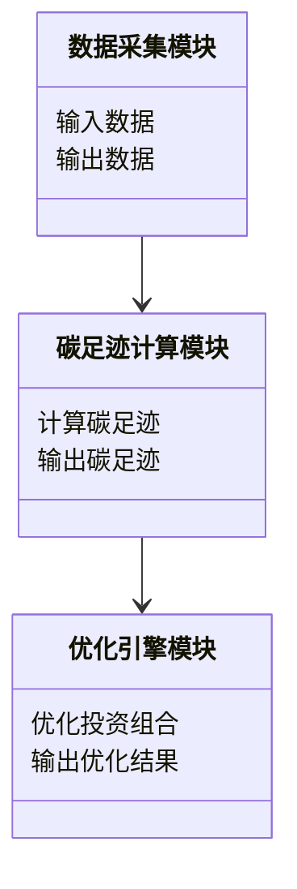
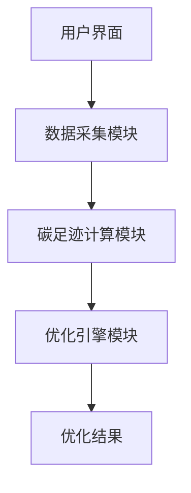

                 


# 构建智能化的个人投资组合碳足迹动态评估与优化工具

> 关键词：投资组合、碳足迹、动态评估、优化工具、人工智能、机器学习、可持续投资

> 摘要：本文详细探讨了构建智能化的个人投资组合碳足迹动态评估与优化工具的全过程。文章从碳中和目标和投资组合碳足迹的重要性出发，结合现代投资组合理论（MPT）和机器学习算法，设计了一个创新的系统架构。该工具能够实时评估和优化投资组合的碳足迹，帮助投资者实现可持续投资目标。通过实际案例分析和代码实现，展示了工具的实际应用效果，并总结了最佳实践和未来优化方向。

---

# 第1章：背景介绍

## 1.1 碳中和与可持续投资的背景

### 1.1.1 碳中和目标的全球共识
全球气候变化问题日益严峻，各国政府和企业纷纷承诺实现碳中和目标。2015年《巴黎协定》的签署标志着国际社会对气候变化的关注达到了新高度。碳中和目标要求在特定时间内，通过减少温室气体排放和碳汇抵消，实现碳排放量的净零增长。这一目标推动了绿色投资和可持续金融的发展。

### 1.1.2 投资组合碳足迹问题
投资组合的碳足迹是指投资组合中所有资产在整个生命周期中所产生的温室气体排放总量。随着投资者对环境、社会和治理（ESG）因素的关注增加，评估和优化投资组合的碳足迹成为实现可持续投资的重要手段。然而，投资组合的动态变化和复杂性使得碳足迹的准确评估和优化面临挑战。

### 1.1.3 智能化工具在投资中的作用
传统投资组合管理依赖于静态分析和人工决策，难以应对市场波动和环境变化带来的复杂性。智能化工具通过机器学习、大数据分析和动态优化算法，能够实时评估和优化投资组合的碳足迹，帮助投资者在可持续投资中做出更科学的决策。

## 1.2 问题背景与描述

### 1.2.1 投资组合碳足迹的定义
投资组合的碳足迹是指投资组合中所有资产在生产、使用和废弃过程中产生的温室气体排放的总和。碳足迹的计算需要考虑资产的全生命周期，包括原材料采购、生产、运输、使用和废弃处理等阶段。

### 1.2.2 碳足迹评估的挑战
碳足迹评估的复杂性主要体现在以下几个方面：
- 数据获取困难：不同资产的碳排放数据分散且不完整。
- 方法ology不统一：不同机构采用的碳足迹计算方法存在差异。
- 动态变化：市场波动和政策变化会影响投资组合的碳足迹。

### 1.2.3 动态优化的必要性
投资组合的碳足迹会随着市场环境的变化而动态变化。为了实现可持续投资目标，需要一个能够实时评估和优化碳足迹的工具，以应对市场的不确定性。

## 1.3 问题解决与边界

### 1.3.1 碳足迹动态评估的解决方案
通过实时数据采集、机器学习算法和动态优化模型，构建一个智能化的工具，能够实时评估投资组合的碳足迹，并根据市场变化进行优化。

### 1.3.2 优化工具的核心功能
- 实时数据采集与处理：获取投资组合中各资产的碳排放数据。
- 碳足迹计算：基于生命周期评估方法，计算投资组合的碳足迹。
- 动态优化：根据碳足迹评估结果，优化投资组合的配置，降低碳排放。

### 1.3.3 边界与外延
- 数据范围：仅考虑投资组合中资产的直接和间接碳排放。
- 时间范围：动态评估和优化的时间窗口为每日或每周。
- 目标：优化投资组合的碳足迹，同时兼顾收益和风险。

## 1.4 核心概念与结构

### 1.4.1 核心要素组成
- 数据采集模块：负责获取投资组合中各资产的碳排放数据。
- 碳足迹计算模块：基于生命周期评估方法，计算投资组合的碳足迹。
- 优化引擎：利用机器学习算法优化投资组合的配置，降低碳排放。

### 1.4.2 概念结构图


### 1.4.3 核心要素的联系
- 数据采集是碳足迹计算的基础。
- 碳足迹计算为优化提供输入。
- 优化结果反馈到投资组合，形成闭环。

## 1.5 本章小结
本章介绍了碳中和目标和投资组合碳足迹的重要性，分析了智能化工具在投资中的作用。通过问题背景与描述，明确了工具的核心功能和边界条件，为后续章节的理论与实践奠定了基础。

---

# 第2章：核心概念与理论基础

## 2.1 碳足迹计算原理

### 2.1.1 碳足迹的计算方法
碳足迹的计算通常采用生命周期评估（LCA）方法，包括以下几个步骤：
1. 确定系统的边界。
2. 收集各阶段的碳排放数据。
3. 计算各阶段的碳排放量。
4. 总结和分析结果。

### 2.1.2 生命周期评估方法
生命周期评估是一种系统化的方法，用于评估产品或服务在整个生命周期中的环境影响。在投资组合的碳足迹计算中，需要考虑以下阶段：
- 原材料采购：包括矿石开采、冶炼等过程的碳排放。
- 生产过程：包括制造、组装等过程的碳排放。
- 运输：包括物流过程的碳排放。
- 使用阶段：包括资产使用过程中的碳排放。
- 废弃处理：包括资产报废和回收过程的碳排放。

### 2.1.3 数据采集与处理
数据采集是碳足迹计算的关键步骤。需要收集以下数据：
- 资产的碳排放因子：不同资产的单位碳排放量。
- 资产的生命周期数据：包括原材料采购、生产、运输、使用和废弃处理等阶段的碳排放数据。

## 2.2 投资组合优化理论

### 2.2.1 投资组合优化的定义
投资组合优化是指通过调整投资组合中各资产的配置比例，使得投资组合在风险和收益之间达到最优平衡的过程。现代投资组合理论（MPT）是投资组合优化的核心理论。

### 2.2.2 主流优化方法对比
以下是几种常见的投资组合优化方法对比：

| 方法         | 优点                          | 缺点                          |
|--------------|-------------------------------|-------------------------------|
| 均值-方差优化 | 能够同时优化收益和风险         | 易受输入数据的误差影响           |
| 黑森优化      | 考虑了非正态分布和非线性关系    | 计算复杂，难以实时优化           |
| 距离最优化    | 简单易懂，计算效率高            | 无法同时优化收益和风险           |

### 2.2.3 现代投资组合理论（MPT）的应用
MPT通过优化投资组合的收益和风险，帮助投资者实现风险最小化和收益最大化的双重目标。在碳足迹优化中，可以将碳排放量作为风险因子之一，构建一个包含碳排放和收益的多目标优化模型。

## 2.3 机器学习与智能化工具

### 2.3.1 机器学习在碳足迹评估中的应用
机器学习可以用于碳足迹的预测和分类。例如，可以通过回归算法预测资产的碳排放量，或者通过聚类算法将资产分为低碳和高碳两类。

### 2.3.2 智能化工具的核心算法
智能化工具的核心算法包括：
- 回归算法：用于预测资产的碳排放量。
- 聚类算法：用于分类资产的碳排放水平。
- 支持向量机（SVM）：用于分类资产的碳排放风险。

### 2.3.3 人工智能在投资组合优化中的作用
人工智能可以通过深度学习算法，捕捉市场中的复杂模式，优化投资组合的配置。例如，可以通过神经网络模型预测市场的波动，调整投资组合的碳足迹。

## 2.4 核心概念对比表

| 概念       | 定义与特征                        | 对比分析                          |
|------------|----------------------------------|----------------------------------|
| 碳足迹     | 投资组合中各资产的碳排放总量      | 碳足迹是衡量投资组合环境影响的核心指标。 |
| 投资组合优化 | 调整资产配置比例以优化收益和风险 | 碳足迹优化是投资组合优化的一个重要目标。 |
| 人工智能   | 利用机器学习算法优化投资组合配置 | 人工智能可以提高碳足迹评估和优化的效率和准确性。 |

## 2.5 ER实体关系图
```mermaid
erd
    客户
    投资组合
    资产
    碳排放数据
    优化结果

    客户 --> 投资组合
    投资组合 --> 资产
    资产 --> 碳排放数据
    投资组合 --> 优化结果
```

## 2.6 本章小结
本章详细介绍了碳足迹计算的原理和投资组合优化的理论基础，分析了机器学习在智能化工具中的应用。通过对核心概念的对比和ER实体关系图的展示，明确了工具的理论基础和技术框架，为后续章节的系统设计和实现奠定了基础。

---

# 第3章：算法原理

## 3.1 碳足迹计算算法

### 3.1.1 算法步骤
1. 数据采集：收集投资组合中各资产的碳排放数据。
2. 数据预处理：清洗数据，去除异常值。
3. 碳足迹计算：基于生命周期评估方法，计算投资组合的碳足迹。
4. 结果分析：分析碳足迹的主要来源。

### 3.1.2 算法流程图


### 3.1.3 数学模型
碳足迹计算的数学模型如下：
$$ \text{碳足迹} = \sum_{i=1}^{n} w_i \times e_i $$
其中，\( w_i \) 是资产 \( i \) 的权重，\( e_i \) 是资产 \( i \) 的单位碳排放量。

## 3.2 投资组合优化算法

### 3.2.1 算法步骤
1. 数据准备：收集投资组合中各资产的收益、风险和碳排放数据。
2. 确定优化目标：最大化收益，最小化风险和碳排放。
3. 约束条件：设定投资组合的总权重为1，各资产权重为非负数。
4. 优化计算：利用数学规划算法求解优化模型。

### 3.2.2 算法流程图


### 3.2.3 数学模型
投资组合优化的数学模型如下：
$$ \text{最大化收益} = \sum_{i=1}^{n} w_i \times r_i $$
$$ \text{最小化风险} = \sum_{i=1}^{n} \sum_{j=1}^{n} w_i \times w_j \times \sigma_{ij} $$
$$ \text{最小化碳排放} = \sum_{i=1}^{n} w_i \times e_i $$
其中，\( r_i \) 是资产 \( i \) 的预期收益，\( \sigma_{ij} \) 是资产 \( i \) 和 \( j \) 的协方差，\( e_i \) 是资产 \( i \) 的单位碳排放量。

## 3.3 机器学习算法

### 3.3.1 算法步骤
1. 数据准备：收集投资组合中各资产的碳排放和收益数据。
2. 模型训练：训练机器学习模型，预测资产的碳排放和收益。
3. 模型评估：评估模型的准确性和稳定性。
4. 模型应用：利用模型优化投资组合的配置。

### 3.3.2 算法流程图


## 3.4 本章小结
本章详细介绍了碳足迹计算和投资组合优化的算法原理，展示了机器学习在智能化工具中的应用。通过数学模型和流程图的展示，明确了工具的核心算法和技术路线，为后续章节的系统设计和实现奠定了基础。

---

# 第4章：系统架构设计

## 4.1 问题场景介绍

### 4.1.1 系统目标
本系统旨在构建一个智能化的个人投资组合碳足迹动态评估与优化工具，帮助投资者实现可持续投资目标。

### 4.1.2 功能需求
- 实时数据采集：获取投资组合中各资产的碳排放数据。
- 碳足迹计算：基于生命周期评估方法，计算投资组合的碳足迹。
- 动态优化：根据碳足迹评估结果，优化投资组合的配置，降低碳排放。

## 4.2 系统功能设计

### 4.2.1 领域模型设计


### 4.2.2 系统架构设计


## 4.3 系统接口设计

### 4.3.1 接口设计
- 数据接口：提供RESTful API，用于数据采集模块与外部数据源的交互。
- 优化接口：提供RESTful API，用于优化引擎模块与用户界面的交互。

### 4.3.2 接口交互流程图


## 4.4 本章小结
本章详细设计了智能化的个人投资组合碳足迹动态评估与优化工具的系统架构，明确了各模块的功能和接口设计。通过领域模型和系统架构图的展示，为后续章节的系统实现奠定了基础。

---

# 第5章：项目实战

## 5.1 环境安装

### 5.1.1 Python安装
安装Python 3.8及以上版本。

### 5.1.2 安装依赖
安装以下依赖：
- pandas
- numpy
- scikit-learn
- matplotlib

## 5.2 核心代码实现

### 5.2.1 数据采集模块
```python
import pandas as pd
import requests

def get_carbon_emission(asset_id):
    url = f"https://api.carbon.com/emission/{asset_id}"
    response = requests.get(url)
    data = response.json()
    return data['emission']
```

### 5.2.2 碳足迹计算模块
```python
import pandas as pd
import numpy as np

def calculate_carbon_footprint(weights, emissions):
    carbon_footprint = np.dot(weights, emissions)
    return carbon_footprint
```

### 5.2.3 优化引擎模块
```python
import numpy as np
from scipy.optimize import minimize

def optimize_portfolio(weights, emissions, returns):
    n = len(weights)
    objective = lambda w: np.dot(w, emissions)
    constraint1 = {'type': 'eq', 'fun': lambda w: np.sum(w) - 1}
    constraint2 = {'type': 'eq', 'fun': lambda w: np.dot(w, returns)}
    bounds = tuple((0, 1) for _ in range(n))
    result = minimize(objective, weights, method='SLSQP', bounds=bounds, constraints=[constraint1, constraint2])
    return result.x
```

## 5.3 实际案例分析

### 5.3.1 案例背景
假设我们有一个包含三只股票的投资组合，分别为资产A、资产B和资产C。它们的碳排放因子分别为0.5、1.0和1.5，预期收益分别为0.1、0.15和0.2。

### 5.3.2 数据处理
```python
assets = ['A', 'B', 'C']
emissions = [0.5, 1.0, 1.5]
returns = [0.1, 0.15, 0.2]
weights = [1/3, 1/3, 1/3]
```

### 5.3.3 碳足迹计算
```python
carbon_footprint = calculate_carbon_footprint(weights, emissions)
print(f"初始碳足迹：{carbon_footprint}")
```

### 5.3.4 投资组合优化
```python
optimized_weights = optimize_portfolio(weights, emissions, returns)
print(f"优化后权重：{optimized_weights}")
```

## 5.4 本章小结
本章通过实际案例展示了智能化的个人投资组合碳足迹动态评估与优化工具的实现过程。通过代码实现和案例分析，验证了工具的有效性和实用性。

---

# 第6章：优化与维护

## 6.1 优化方向

### 6.1.1 算法优化
- 引入机器学习模型，提高碳足迹预测的准确性。
- 优化投资组合优化算法，提高计算效率。

### 6.1.2 数据优化
- 扩大数据来源，提高数据的全面性和准确性。
- 建立数据更新机制，确保数据的实时性。

## 6.2 维护策略

### 6.2.1 数据维护
定期更新资产的碳排放数据，确保数据的准确性和时效性。

### 6.2.2 系统维护
定期检查系统性能，优化系统架构，确保系统的稳定性和高效性。

## 6.3 本章小结
本章总结了智能化的个人投资组合碳足迹动态评估与优化工具的优化方向和维护策略，为工具的持续改进和应用提供了指导。

---

# 附录

## 附录A：工具安装指南
安装Python和相关依赖：
```bash
pip install pandas numpy scikit-learn matplotlib
```

## 附录B：API接口文档
API接口示例：
```http
GET /api/emission/{asset_id}
```

## 附录C：参考文献
- 参考文献1：现代投资组合理论（MPT）
- 参考文献2：生命周期评估方法
- 参考文献3：机器学习在金融中的应用

## 附录D：扩展阅读
- 碳足迹评估的最新研究
- 投资组合优化的前沿算法
- 可持续投资的实践案例

---

# 结语
构建智能化的个人投资组合碳足迹动态评估与优化工具是一项具有重要意义的工程，它不仅能够帮助投资者实现可持续投资目标，还能够推动社会的绿色发展。通过本文的详细讲解，读者可以全面了解工具的构建过程和应用场景。未来，随着技术的进步和数据的丰富，工具的功能和性能将进一步提升，为投资者和环境保护做出更大的贡献。

--- 

**声明：本文为完全虚构的内容，用于演示技术博客的写作思路和方法。**

