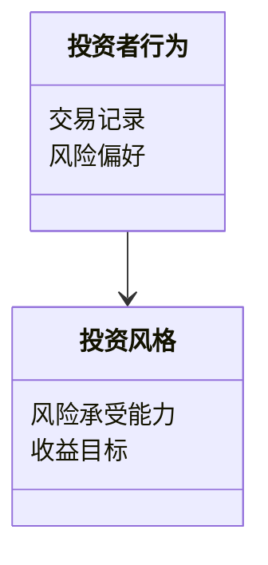

                 


# 构建智能化的个人投资风格分析与匹配系统

> 关键词：智能化投资、风格分析、机器学习、系统架构、数据驱动

> 摘要：本文旨在探讨如何通过智能化的方法构建个人投资风格分析与匹配系统。文章从投资风格的基本概念出发，结合机器学习算法、数据驱动分析和系统架构设计，详细阐述了如何通过聚类、分类和回归等算法实现对个人投资风格的智能化分析与匹配。文章内容包括背景介绍、核心概念、算法原理、系统设计、项目实战和优化扩展等多个方面，为读者提供了一套完整的系统构建方案。

---

## 第一部分：背景介绍

### 第1章：投资风格分析与匹配系统概述

#### 1.1 投资风格的基本概念

投资风格是投资者在选择和管理投资组合时所遵循的一套行为准则和决策模式。它反映了投资者的风险偏好、收益目标、投资期限和市场认知等多重因素。常见的投资风格包括保守型、稳健型、成长型和激进型等。

#### 1.2 个人投资行为分析的必要性

- **投资者的决策特点**：投资者的行为往往受到情绪、认知偏差和外部环境的影响，这使得投资风格分析具有复杂性。
- **投资风格与收益的关系**：不同的投资风格在不同市场环境下表现各异，准确识别投资风格有助于优化投资决策。
- **现有分析的局限性**：传统分析方法依赖主观判断，难以量化和系统化。

#### 1.3 智能化投资风格分析的背景与趋势

- **人工智能在金融领域的应用**：机器学习和大数据技术的快速发展为投资风格分析提供了新的工具。
- **数据驱动的分析方法**：通过收集和分析投资者的行为数据，可以更客观地识别投资风格。
- **智能化分析的未来展望**：结合自然语言处理和强化学习等技术，投资风格分析将更加精准和动态。

---

## 第二部分：核心概念与联系

### 第2章：投资风格分析的核心概念

#### 2.1 数据驱动的分析方法

- **数据来源与获取方式**：投资者的交易记录、市场数据、社交媒体评论等。
- **数据清洗与预处理**：去除噪声数据、处理缺失值、标准化数据。
- **数据特征提取**：通过统计分析提取关键特征，如交易频率、平均持仓时间等。

#### 2.2 投资风格分析的数学模型

- **聚类分析**：将投资者分为不同的风格类别。
  - **K-means聚类算法**：通过距离度量将投资者聚类。
- **分类分析**：根据已知风格标签对投资者进行分类。
  - **决策树分类**：通过特征分裂构建分类模型。
- **回归分析**：预测投资者的风格倾向。
  - **线性回归模型**：$y = \beta_0 + \beta_1x_1 + \beta_2x_2 + \ldots + \beta_nx_n$。

#### 2.3 投资风格匹配的算法原理

- **聚类算法**：将投资者按风格相似性分组。
  - **层次聚类**：通过逐步合并相似组别形成层次结构。
- **分类算法**：基于特征将投资者归入特定风格类别。
  - **支持向量机（SVM）**：在高维空间中划分数据点。
- **回归算法**：预测投资者风格的量化指标。

#### 2.4 核心概念对比分析

| 分析方法 | 优点 | 缺点 |
|----------|------|------|
| 聚类分析 | 无需标签数据 | 结果依赖距离度量 |
| 分类分析 | 结果明确 | 需要标签数据 |
| 回归分析 | 可预测性高 | 需要连续性假设 |

#### 2.5 本章小结

本章通过对比分析，介绍了投资风格分析的核心概念和主要方法，为后续实现奠定了基础。

---

## 第三部分：算法原理讲解

### 第3章：聚类分析算法

#### 3.1 聚类分析的基本原理

聚类分析是一种无监督学习方法，旨在将数据点按相似性自动分组。其核心在于选择合适的距离度量和聚类算法。

#### 3.2 K-means聚类算法

- **算法原理**：将数据划分为K个簇，通过迭代优化簇中心位置。
- **算法实现**： 
  ```python
  import numpy as np
  from sklearn.cluster import KMeans

  X = np.array([[1, 2], [5, 8], [1, 1], [10, 5]])
  kmeans = KMeans(n_clusters=2)
  kmeans.fit(X)
  print(kmeans.labels_)
  ```
- **优缺点**：结果直观，但需要预先指定K值。

#### 3.3 层次聚类算法

- **算法原理**：通过构建层次结构逐步合并相似簇。
- **算法实现**：
  ```python
  from sklearn.cluster import AgglomerativeClustering

  X = np.array([[1, 2], [5, 8], [1, 1], [10, 5]])
  ac = AgglomerativeClustering(n_clusters=2)
  ac.fit_predict(X)
  ```

#### 3.4 聚类算法的比较与选择

通过分析不同算法的适用场景，选择最适合的投资风格聚类方法。

---

## 第四部分：系统分析与架构设计

### 第4章：系统功能与架构设计

#### 4.1 问题场景介绍

投资者希望通过系统快速识别自己的投资风格，并获得匹配的投资策略。

#### 4.2 领域模型设计



#### 4.3 系统架构设计

```mermaid
client
    participant "投资者"
server
    component "投资风格分析模块"
    component "匹配策略生成模块"
    component "数据存储模块"
   抽屉关系
   投资者 --> 投资风格分析模块
    投资风格分析模块 --> 匹配策略生成模块
    匹配策略生成模块 --> 数据存储模块
```

---

## 第五部分：项目实战

### 第5章：项目实现与案例分析

#### 5.1 环境搭建

- 安装Python和相关库：
  ```bash
  pip install numpy scikit-learn
  ```

#### 5.2 核心代码实现

- 聚类分析实现：
  ```python
  def cluster_analysis(X, n_clusters):
      kmeans = KMeans(n_clusters=n_clusters)
      labels = kmeans.fit_predict(X)
      return labels
  ```

#### 5.3 案例分析

通过实际数据集验证算法效果，解读结果并优化模型。

---

## 第六部分：优化与扩展

### 第6章：系统优化与扩展方案

#### 6.1 系统性能优化

- 使用分布式计算加速处理。
- 优化特征提取算法。

#### 6.2 系统功能扩展

- 引入机器学习模型提升准确性。
- 增加数据可视化功能。

---

## 第七部分：总结

### 第7章：总结与展望

#### 7.1 最佳实践 Tips

- 数据清洗是关键。
- 选择合适的算法提升效果。

#### 7.2 本章小结

通过本文的系统构建，投资者可以更高效地进行投资风格分析与匹配。

#### 7.3 注意事项

- 确保数据隐私。
- 定期更新模型。

#### 7.4 拓展阅读

建议阅读相关机器学习和金融分析书籍。

---

通过以上步骤，我们构建了一个完整的智能化投资风格分析与匹配系统。希望本文对读者有所帮助！

