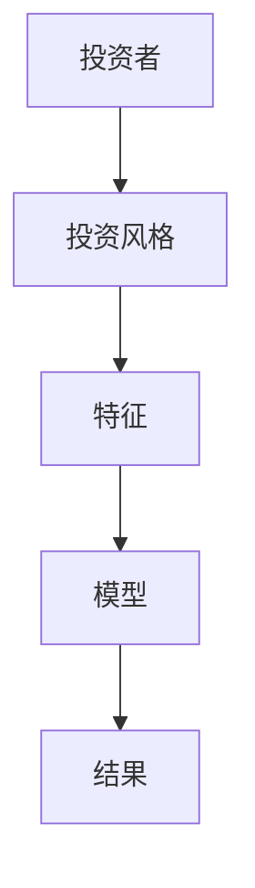

                 

# 构建智能化的个人投资风格分析工具

> 关键词：人工智能，投资风格分析，机器学习，自然语言处理，系统架构设计

> 摘要：本文将详细探讨如何利用人工智能技术构建智能化的个人投资风格分析工具。通过分析投资风格的核心概念，介绍机器学习和自然语言处理在投资分析中的应用，详细讲解算法原理与数学模型，并提供系统架构设计和项目实战，最终帮助读者实现一个高效的智能化投资风格分析系统。

---

## 第一部分: 背景与核心概念

### 第1章: 投资风格分析的背景与现状

#### 1.1 投资风格的背景

投资风格分析是理解投资者行为和决策模式的重要工具。传统的投资分析方法依赖于人工经验，难以大规模应用和量化。随着人工智能技术的发展，智能化的投资风格分析工具逐渐成为可能。

#### 1.2 投资风格的定义与特征

投资风格是指投资者在投资过程中表现出的一系列特征，包括风险偏好、投资期限、资产配置偏好等。不同投资风格的投资者在市场波动中的表现差异显著，因此准确识别和分析投资风格对于制定个性化投资策略至关重要。

#### 1.3 智能化投资风格分析的必要性

传统分析方法效率低、主观性强，而人工智能技术能够通过大数据分析和机器学习模型，实现自动化、高效的投资风格识别和分类，为投资者提供个性化的投资建议。

---

### 第2章: 核心概念与联系

#### 2.1 核心概念

投资风格分析涉及多个核心概念，包括投资者行为、市场数据、文本数据等。这些概念通过机器学习和自然语言处理技术连接起来，形成一个完整的分析框架。

#### 2.2 实体关系图

---

## 第二部分: 技术基础与算法原理

### 第3章: 机器学习基础

#### 3.1 机器学习的基本概念

机器学习是人工智能的核心技术之一，包括监督学习、无监督学习和强化学习。在投资风格分析中，监督学习常用于分类任务，无监督学习用于聚类分析。

#### 3.2 机器学习在投资分析中的应用

- **特征提取与选择**：通过统计方法或模型提取关键特征。
- **分类与回归模型**：用于预测投资风格和投资回报。
- **聚类分析**：用于发现潜在的投资风格簇。

### 第4章: 自然语言处理基础

#### 4.1 自然语言处理的基本概念

自然语言处理（NLP）技术包括词嵌入、文本分类、情感分析等，能够从文本数据中提取有用的信息。

#### 4.2 NLP在投资分析中的应用

- **文本特征提取**：从新闻、报告中提取情感和主题特征。
- **文本分类**：用于识别投资者的风格偏好。
- **情感分析**：分析市场情绪对投资风格的影响。

---

## 第三部分: 算法原理与数学模型

### 第5章: 特征提取与表示

#### 5.1 特征提取的基本原理

特征提取是投资风格分析的关键步骤，常用的方法包括统计方法、词嵌入和自注意力机制。

#### 5.2 特征表示的数学模型

- **词嵌入模型**：如Word2Vec，将词转换为低维向量。
- **自注意力机制**：如BERT模型，用于捕捉长距离依赖关系。

### 第6章: 分类与推荐算法

#### 6.1 分类算法的原理与实现

- **支持向量机（SVM）**：用于分类任务。
- **随机森林**：用于特征重要性分析。
- **神经网络**：用于复杂非线性分类。

#### 6.2 推荐算法的原理与实现

- **协同过滤**：基于用户行为推荐投资风格。
- **深度学习推荐**：如神经网络协同过滤（ NeuCF）。

---

## 第四部分: 系统分析与架构设计

### 第7章: 系统功能设计

#### 7.1 功能模块划分

- 数据采集模块：收集市场数据和投资者行为数据。
- 数据预处理模块：清洗和特征提取。
- 模型训练模块：构建和训练机器学习模型。
- 分析与可视化模块：展示分析结果。

#### 7.2 系统架构设计

---

## 第五部分: 项目实战

### 第8章: 环境配置与数据处理

#### 8.1 环境配置

安装必要的库，如Python、TensorFlow、Keras等。

#### 8.2 数据处理

- 数据清洗：处理缺失值和异常值。
- 特征工程：提取文本和数值特征。

### 第9章: 模型训练与优化

#### 9.1 模型训练

使用训练数据训练机器学习模型，如随机森林或神经网络。

#### 9.2 模型优化

通过交叉验证和超参数调优提升模型性能。

---

## 第六部分: 总结与展望

### 第10章: 总结与展望

#### 10.1 总结

本文详细介绍了构建智能化个人投资风格分析工具的全过程，从技术基础到系统设计，再到项目实战，为读者提供了一套完整的解决方案。

#### 10.2 展望

未来，随着AI技术的不断发展，投资风格分析将更加智能化和个性化，结合实时数据和动态调整模型，为投资者提供更精准的服务。

---

## 附录: 额外资源

### A. 数据集

- 标准化金融数据集：如Yahoo Finance API。
- 自然语言处理数据集：如新闻和市场评论数据。

### B. 工具与库

- Python库：scikit-learn, TensorFlow, PyTorch。
- 数据可视化工具：Matplotlib, Seaborn。

### C. 推荐阅读

- 《机器学习实战》
- 《深度学习》
- 《自然语言处理入门》

---

以上是《构建智能化的个人投资风格分析工具》的技术博客文章的完整内容，涵盖了从背景到实现的各个方面，帮助读者系统地理解和掌握如何利用人工智能技术构建智能化的投资风格分析工具。

