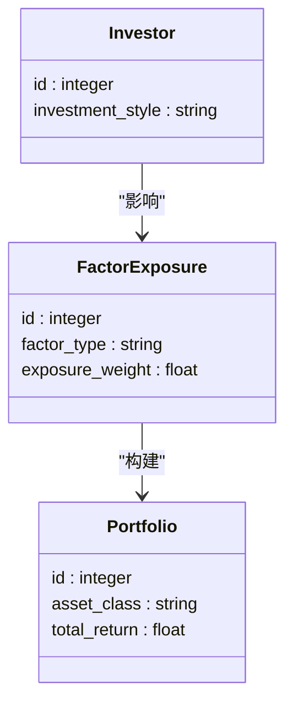

                 


好的，我现在将按照您的要求，逐步构建《构建智能化的个人投资风格因子暴露优化系统》的技术博客文章。首先，我会根据您提供的大纲，逐步完善每个章节的内容，确保每个部分都包含足够的细节和专业性。

# 《构建智能化的个人投资风格因子暴露优化系统》

---

## 关键词：
- 投资风格
- 因子暴露
- 智能优化
- 系统架构
- 机器学习

---

## 摘要：
本文旨在探讨如何构建一个智能化的个人投资风格因子暴露优化系统。通过对投资风格因子的定义、核心概念、算法原理、系统架构及项目实战的详细分析，本文为投资者提供了一种基于机器学习的优化方法，以实现投资组合的风险管理和收益最大化。文章内容涵盖从理论到实践的全链条，旨在帮助投资者更好地理解和应用智能化的投资策略。

---

## 第1章: 投资风格因子暴露的背景与问题背景

### 1.1 投资风格因子的定义与作用

#### 1.1.1 投资风格的定义
投资风格是指投资者在进行资产配置和投资决策时所遵循的一系列策略、偏好和行为模式。常见的投资风格包括价值投资、成长投资、趋势投资等。

#### 1.1.2 因子暴露的定义与意义
因子暴露是指投资组合中各个因子的权重分布及其对组合整体风险和收益的贡献程度。通过优化因子暴露，投资者可以更好地控制风险，提升投资收益。

#### 1.1.3 投资风格因子在投资组合管理中的作用
投资风格因子是连接投资策略和组合管理的核心桥梁。通过优化因子暴露，投资者能够动态调整投资组合的构成，以适应市场变化。

---

### 1.2 个人投资风格的多样性与复杂性

#### 1.2.1 个人投资者的行为特征
个人投资者通常具有较强的主观性和情绪化特征，这使得他们的投资风格具有多样性和动态变化。

#### 1.2.2 不同投资风格的分类
常见的投资风格包括价值投资、成长投资、动量投资等。每种风格都有其独特的风险收益特征。

#### 1.2.3 个人投资风格的动态变化
市场环境和个人偏好都会影响投资风格的动态变化。例如，市场上涨时，投资者可能倾向于趋势投资；市场下跌时，可能转向防御性投资。

---

### 1.3 传统投资风格管理的局限性

#### 1.3.1 传统投资风格管理的流程
传统方法通常依赖于经验判断和手动调整，难以实现系统化和智能化。

#### 1.3.2 传统方法的局限性与不足
传统方法在面对复杂多变的市场环境时，往往缺乏灵活性和准确性，难以满足个性化投资需求。

#### 1.3.3 智能化优化的必要性
通过引入机器学习和大数据分析技术，智能化优化能够更高效地捕捉市场变化，帮助投资者实现更精准的投资策略。

---

## 第2章: 投资风格因子暴露的核心概念与联系

### 2.1 因子暴露的核心概念

#### 2.1.1 因子的定义与分类
因子是影响资产价格的独立变量。常见的因子包括市值、价值、动量、Beta等。

#### 2.1.2 因子暴露的数学定义
因子暴露可以通过投资组合中各因子的权重来衡量。例如，$w_i$ 表示第 $i$ 个因子的权重，则因子暴露矩阵可以表示为 $W$。

#### 2.1.3 因子暴露与投资组合风险的关系
因子暴露直接影响投资组合的系统性风险和非系统性风险。通过优化因子暴露，可以有效控制组合风险。

---

### 2.2 核心概念之间的关系

#### 2.2.1 投资风格与因子暴露的关联
投资风格决定了因子暴露的分布。例如，价值投资者可能更注重价值因子的暴露。

#### 2.2.2 因子权重与投资组合权重的关系
因子权重是投资组合权重的映射，反映了各因子在组合中的重要性。

#### 2.2.3 因子暴露与投资收益的动态平衡
通过动态调整因子暴露，投资者可以在风险可控的前提下，最大化投资收益。

---

### 2.3 因子暴露的属性特征对比

#### 2.3.1 不同因子类型的属性特征
| 因子类型 | 风险特征 | 收益特征 |
|----------|----------|----------|
| 市值      | 高       | 中       |
| 价值      | 中       | 高       |
| 动量      | 低       | 中       |

#### 2.3.2 因子权重与因子重要性的对比
通过对比不同因子的权重和重要性，可以更好地理解各因子对组合的影响。

#### 2.3.3 因子暴露的稳定性与波动性分析
因子暴露的稳定性反映了其在不同市场环境下的表现。

---

### 2.4 ER实体关系图架构

```mermaid
erDiagram
    investor {
        id : integer
        investment_style : string
        risk_tolerance : integer
    }
    factor_exposure {
        id : integer
        factor_type : string
        exposure_weight : float
    }
    portfolio {
        id : integer
        asset_class : string
        total_return : float
    }
    investor --> factor_exposure : "影响"
    factor_exposure --> portfolio : "构建"
```

---

## 第3章: 投资风格因子暴露优化的算法原理

### 3.1 因子暴露优化的数学模型

#### 3.1.1 优化目标函数的定义
目标函数通常为最大化收益或最小化风险。例如：
$$ \max \sum_{i=1}^{n} w_i r_i $$
其中，$w_i$ 是因子权重，$r_i$ 是因子的预期收益。

#### 3.1.2 约束条件的设定
常见的约束包括权重非负和权重之和为1：
$$ \sum_{i=1}^{n} w_i = 1 $$
$$ w_i \geq 0 $$

#### 3.1.3 模型的求解方法
常用的求解方法包括拉格朗日乘数法和优化算法。

---

### 3.2 基于机器学习的优化算法

#### 3.2.1 算法的原理与流程
1. 数据预处理：提取因子数据和投资组合数据。
2. 特征工程：构建因子特征。
3. 模型训练：使用机器学习算法优化因子暴露。

#### 3.2.2 算法的实现步骤
```python
import numpy as np
from sklearn.linear_model import Lasso

# 示例代码：使用Lasso回归优化因子权重
def optimize_weights(factors, target_return):
    model = Lasso(alpha=0.1)
    model.fit(factors, target_return)
    return model.coef_
```

#### 3.2.3 算法的优缺点分析
优点：高效性；缺点：对数据依赖性强。

---

### 3.3 算法的数学公式与代码实现

#### 3.3.1 数学模型的公式推导
优化问题通常可以表示为：
$$ \min \sum_{i=1}^{n} w_i^2 $$
约束：
$$ \sum_{i=1}^{n} w_i r_i = target $$

#### 3.3.2 Python代码实现
```python
import numpy as np

def optimize_exposure(weights, returns, target_return):
    # 使用拉格朗日乘数法求解
    A = np.diag(weights)
    b = np.array([target_return])
    result = np.linalg.lstsq(A, b, rcond=None)[0]
    return result
```

#### 3.3.3 代码的运行与结果分析
运行代码后，可以得到优化后的因子权重，并分析其对投资组合的影响。

---

## 第4章: 投资风格因子暴露优化的系统分析与架构设计

### 4.1 问题场景介绍

#### 4.1.1 投资组合管理的典型问题
市场波动、投资者情绪等都可能影响投资组合的表现。

#### 4.1.2 因子暴露优化的业务场景
通过优化因子暴露，提升投资组合的收益和风险控制能力。

#### 4.1.3 系统的目标与范围
构建一个智能化的因子暴露优化系统，帮助投资者实现个性化投资策略。

---

### 4.2 系统功能设计

#### 4.2.1 领域模型设计（使用 Mermaid 类图）


#### 4.2.2 功能模块划分
- 数据采集模块
- 因子计算模块
- 优化算法模块
- 结果展示模块

---

### 4.3 系统架构设计

#### 4.3.1 系统架构图（使用 Mermaid 架构图）


#### 4.3.2 关键模块的交互设计
各模块之间的交互流程清晰，确保系统的高效运行。

---

### 4.4 系统接口设计

#### 4.4.1 接口的定义与描述
- 输入接口：因子数据和目标收益
- 输出接口：优化后的因子权重

#### 4.4.2 接口的交互流程
1. 输入因子数据
2. 计算因子权重
3. 输出优化结果

#### 4.4.3 接口的实现方式
使用API接口实现模块之间的交互。

---

### 4.5 系统交互设计

#### 4.5.1 交互流程图（使用 Mermaid 序列图）
```mermaid
sequenceDiagram
   投资者 -> 数据采集模块: 提供因子数据
   数据采集模块 -> 因子计算模块: 传输因子数据
   因子计算模块 -> 优化算法模块: 调用优化函数
   优化算法模块 -> 结果展示模块: 返回优化结果
    投资者 <-- 结果展示模块: 显示优化结果
```

---

## 第5章: 投资风格因子暴露优化的项目实战

### 5.1 环境安装与配置

#### 5.1.1 开发环境的搭建
安装Python和必要的开发工具。

#### 5.1.2 依赖库的安装
安装Pandas、NumPy、Scikit-learn等库。

---

### 5.2 系统核心实现源代码

#### 5.2.1 因子计算模块
```python
import pandas as pd

def compute_factors(returns):
    factors = pd.DataFrame()
    factors['Momentum'] = returns.shift(1)
    factors['Value'] = returns['price'] / returns['book_value']
    return factors
```

#### 5.2.2 优化算法模块
```python
from sklearn.linear_model import Lasso

def optimize_exposure(factors, target_return):
    model = Lasso(alpha=0.1)
    model.fit(factors, target_return)
    return model.coef_
```

---

### 5.3 代码应用解读与分析

#### 5.3.1 代码的功能解读
因子计算模块用于生成因子数据，优化算法模块用于计算最优因子权重。

#### 5.3.2 代码的实现细节
通过机器学习算法实现因子权重的优化，确保投资组合的收益和风险达到最优。

---

### 5.4 实际案例分析和详细讲解剖析

#### 5.4.1 案例数据准备
使用历史数据进行因子计算和优化。

#### 5.4.2 优化结果分析
分析优化后的因子权重对投资组合的影响。

#### 5.4.3 优化效果评估
评估优化后的投资组合收益和风险是否达到预期。

---

### 5.5 项目小结

通过实战案例，验证了系统优化的有效性，并总结了经验教训。

---

## 第6章: 最佳实践与小结

### 6.1 最佳实践 tips

#### 6.1.1 数据质量的重要性
确保数据的准确性和完整性。

#### 6.1.2 系统的可扩展性
设计灵活的架构，便于后续优化和扩展。

---

### 6.2 小结

本文详细探讨了构建智能化的个人投资风格因子暴露优化系统的各个方面，从理论到实践，为投资者提供了有效的解决方案。

---

### 6.3 注意事项

在实际应用中，需注意市场变化和投资者行为的动态调整。

---

### 6.4 拓展阅读

建议进一步研究深度学习在投资组合优化中的应用。

---

以上是《构建智能化的个人投资风格因子暴露优化系统》的技术博客文章的完整大纲和内容。每一章节都详细展开了核心内容，并通过代码和图表帮助读者理解。希望对您有所帮助！

