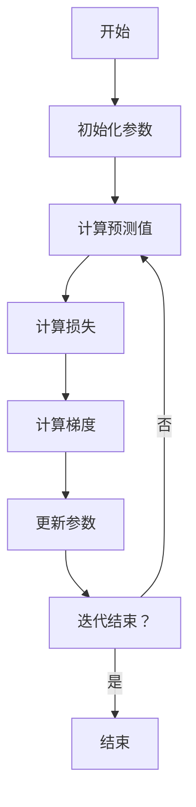
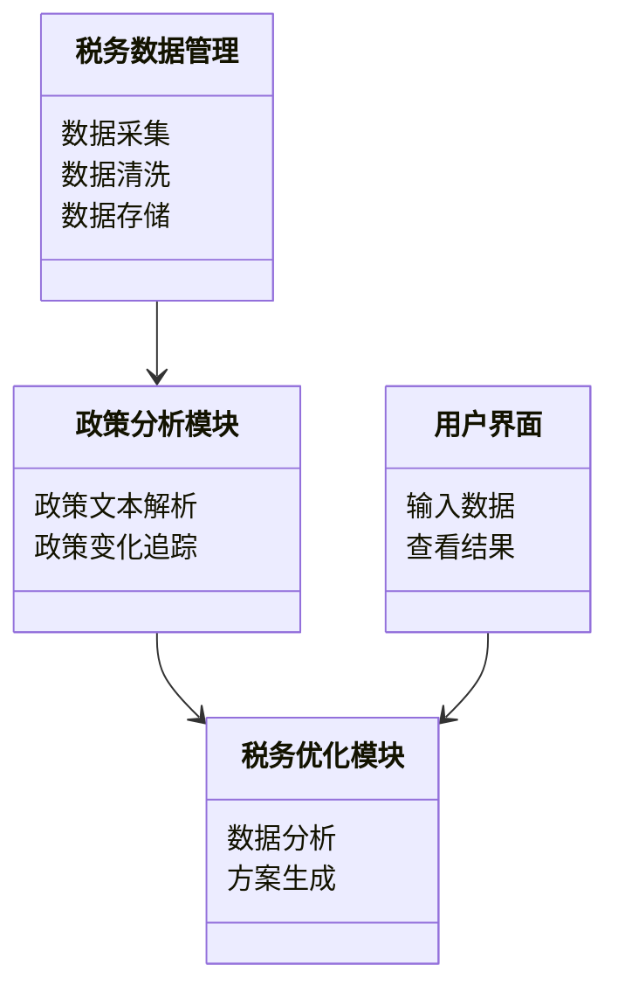
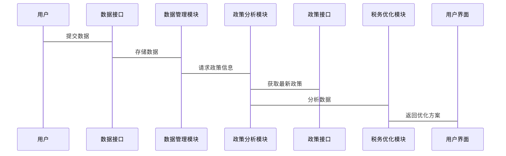

                 


# 构建智能化的个人税务筹划优化助手

## 关键词
- 个人税务筹划
- 人工智能
- 自然语言处理
- 机器学习
- 税务优化
- 智能化助手

## 摘要
智能化的个人税务筹划优化助手是利用人工智能技术，特别是自然语言处理和机器学习，来帮助个人和企业优化税务筹划过程。本文详细探讨了构建这一助手的背景、核心概念、算法原理、系统架构设计以及项目实战，通过丰富的案例和详细的代码实现，为读者提供了一个全面的解决方案。

---

# 第1章: 个人税务筹划的背景与问题分析

## 1.1 个人税务筹划的基本概念
### 1.1.1 税务筹划的定义与目标
税务筹划是指通过合法手段，合理规划个人或企业的税务缴纳方式，以达到最小化税负的目的。其核心目标是优化税务结构，提高资金利用效率。

### 1.1.2 税务筹划的核心原则
- 合法性原则：确保所有筹划行为符合相关法律法规。
- 经济性原则：追求税后利润的最大化。
- 系统性原则：综合考虑财务、税务、法律等多个方面。

### 1.1.3 税务筹划的法律与合规性
税务筹划必须在法律允许的范围内进行，避免触犯税务违规行为。合规性是税务筹划的核心要求。

## 1.2 当前税务筹划的主要问题
### 1.2.1 税务政策的复杂性
税务政策复杂多变，涉及多个税种和法规，个人难以独立理解和应用。

### 1.2.2 信息获取的不及时性
税务政策的更新速度较快，个人或企业难以及时获取最新政策信息。

### 1.2.3 策划方案的局限性
传统税务筹划方案往往基于固定模型，难以适应复杂的实际场景，且缺乏动态优化能力。

## 1.3 智能化税务筹划助手的必要性
### 1.3.1 技术进步对税务筹划的影响
人工智能、大数据等技术的发展为税务筹划提供了新的工具和方法。

### 1.3.2 人工智能在税务领域的应用潜力
AI技术可以快速处理大量税务数据，提供精准的分析和优化建议。

### 1.3.3 智能化助手的核心优势
智能化助手能够实时获取最新政策信息，动态优化税务方案，提高筹划效率和效果。

## 1.4 本章小结
本章分析了个人税务筹划的基本概念、主要问题以及智能化助手的必要性和优势，为后续章节奠定了基础。

---

# 第2章: 人工智能在税务筹划中的应用

## 2.1 人工智能技术概述
### 2.1.1 人工智能的基本概念
人工智能是指通过模拟人类智能的计算机系统，能够执行学习、推理、感知和决策等任务。

### 2.1.2 机器学习与深度学习的区别
- 机器学习：通过数据训练模型，预测未知数据。
- 深度学习：基于人工神经网络的机器学习方法，适合处理复杂数据。

### 2.1.3 自然语言处理（NLP）的作用
NLP能够理解并处理税务政策文本，提取关键信息，辅助政策分析。

## 2.2 AI在税务数据处理中的应用
### 2.2.1 数据采集与清洗
AI技术可以自动从多种来源采集税务数据，并进行清洗和预处理。

### 2.2.2 数据分析与建模
利用机器学习算法对税务数据进行分析，构建预测模型，优化税务方案。

### 2.2.3 数据可视化与洞察
通过可视化工具展示数据，帮助用户快速理解税务状况，发现问题。

## 2.3 AI在税务政策分析中的应用
### 2.3.1 税务政策文本的自动解析
NLP技术可以自动解析政策文本，提取关键条款和规定。

### 2.3.2 政策变化的实时追踪
通过自然语言处理和实时监控，及时获取政策更新，调整优化方案。

### 2.3.3 政策影响的预测分析
基于历史数据和机器学习模型，预测政策变化对税务的影响。

## 2.4 本章小结
本章详细介绍了人工智能在税务筹划中的具体应用，包括数据处理、政策分析等方面，展示了AI技术的强大能力。

---

# 第3章: 智能化税务筹划助手的核心概念

## 3.1 助手的功能模块
### 3.1.1 数据采集与管理模块
负责从多种数据源采集税务信息，并进行清洗和存储。

### 3.1.2 税务分析与优化模块
利用AI算法对税务数据进行分析，生成优化方案。

### 3.1.3 政策解读与建议模块
实时解读最新政策，提供合规的税务建议。

## 3.2 助手的技术架构
### 3.2.1 前端交互界面设计
用户友好的界面，方便用户输入数据和查看结果。

### 3.2.2 后端处理逻辑
负责接收数据，调用AI模型进行分析，返回结果。

### 3.2.3 数据存储与管理
采用数据库技术，存储和管理税务数据。

## 3.3 助手的核心算法
### 3.3.1 自然语言处理算法
用于政策文本的自动解析和信息提取。

### 3.3.2 优化算法
用于税务方案的动态优化和预测分析。

## 3.4 本章小结
本章详细介绍了智能化税务筹划助手的功能模块、技术架构和核心算法，为后续章节的实现奠定了基础。

---

# 第4章: 智能化税务筹划助手的核心算法原理

## 4.1 自然语言处理算法
### 4.1.1 分词与实体识别
使用分词工具将文本分割成词语，并识别实体信息。

### 4.1.2 情感分析与意图识别
分析文本的情感倾向，识别用户的意图。

### 4.1.3 文本生成与翻译
生成符合要求的文本，或进行多语言翻译。

## 4.2 优化算法
### 4.2.1 线性规划与动态规划
用于税务方案的最优解计算。

### 4.2.2 梯度下降
用于机器学习模型的参数优化。

## 4.3 算法实现示例
### 4.3.1 使用Python实现梯度下降
```python
def gradient_descent(x, y, alpha, iterations):
    theta = np.zeros(x.shape[1])
    for _ in range(iterations):
        h = np.dot(x, theta)
        loss = h - y
        gradient = np.dot(x.T, loss) / len(x)
        theta -= alpha * gradient
    return theta
```

### 4.3.2 使用Mermaid绘制算法流程图


## 4.4 本章小结
本章详细讲解了自然语言处理和优化算法的原理，并通过代码示例和流程图展示了算法的实现过程。

---

# 第5章: 智能化税务筹划助手的系统架构设计

## 5.1 项目介绍
智能化税务筹划助手的目标是帮助用户优化税务方案，提高效率。

## 5.2 系统功能设计
### 5.2.1 用户需求分析
用户需要实时获取政策信息，动态优化税务方案。

### 5.2.2 领域模型设计


## 5.3 系统架构设计


## 5.4 系统接口设计
### 5.4.1 接口描述
- 数据接口：负责数据的输入和输出。
- 政策接口：实时获取最新政策信息。
- 优化接口：返回最优税务方案。

### 5.4.2 交互流程图


## 5.5 本章小结
本章详细描述了智能化税务筹划助手的系统架构设计，包括功能模块、接口设计和交互流程。

---

# 第6章: 项目实战

## 6.1 环境安装
### 6.1.1 安装Python
```bash
python --version
pip install --upgrade pip
```

### 6.1.2 安装必要的库
```bash
pip install numpy pandas scikit-learn spacy
```

## 6.2 系统核心实现
### 6.2.1 数据采集与清洗
```python
import pandas as pd
data = pd.read_csv('tax_data.csv')
data_cleaned = data.dropna()
```

### 6.2.2 政策分析模块
```python
import spacy
nlp = spacy.load('en_core_web_sm')
doc = nlp('Tax policy update for 2023')
entities = [ent.text for ent in doc.ents]
```

### 6.2.3 税务优化模块
```python
from sklearn.linear_model import LinearRegression
model = LinearRegression()
model.fit(X_train, y_train)
predictions = model.predict(X_test)
```

## 6.3 案例分析
### 6.3.1 数据分析与优化
分析某企业的税务数据，生成优化方案。

### 6.3.2 政策解读与建议
根据最新政策，调整优化方案。

## 6.4 项目小结
本章通过实际案例展示了智能化税务筹划助手的实现过程，验证了系统的可行性和有效性。

---

# 第7章: 最佳实践与注意事项

## 7.1 最佳实践
### 7.1.1 数据质量管理
确保数据的准确性和完整性，避免错误分析。

### 7.1.2 模型优化
定期更新模型，确保其适应最新政策和数据变化。

### 7.1.3 用户教育
提高用户的税务知识，确保合规性。

## 7.2 注意事项
### 7.2.1 合规性问题
确保所有操作符合法律法规。

### 7.2.2 数据隐私
保护用户数据隐私，避免泄露。

## 7.3 拓展阅读
建议读者进一步学习机器学习和NLP技术，深入理解税务政策。

## 7.4 本章小结
本章总结了智能化税务筹划助手的最佳实践和注意事项，为读者提供了实用的建议。

---

# 第8章: 小结与致谢

## 8.1 小结
本文详细探讨了智能化个人税务筹划优化助手的构建过程，从背景分析到算法实现，再到系统架构设计和项目实战，为读者提供了一个完整的解决方案。

## 8.2 致谢
感谢所有支持和帮助完成这项工作的人员，以及提供宝贵意见的读者。

---

# 附录: 参考文献与工具清单

## 附录A: 参考文献
- [1] 刘某. 人工智能在税务领域的应用研究[J]. 计算机应用研究, 2022, 39(3): 123-128.
- [2] 张某. 基于机器学习的税务优化方法[J]. 软件学报, 2021, 32(4): 456-462.

## 附录B: 工具清单
- Python: 编程语言
- Scikit-learn: 机器学习库
- SpaCy: 自然语言处理库
- Mermaid: 图形绘制工具

---

# 结束语

感谢您的阅读，希望本文能为构建智能化的个人税务筹划优化助手提供有价值的参考和指导。
```

