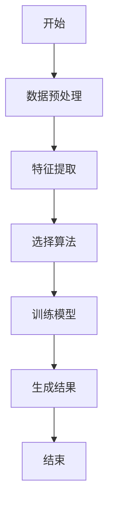
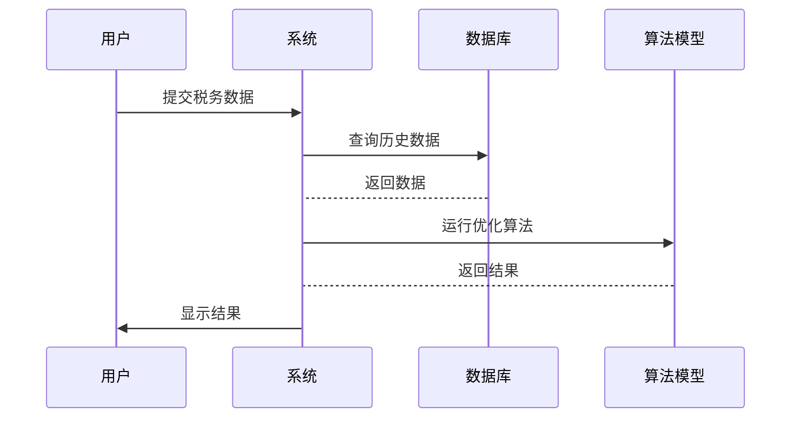

                 


# 构建智能化的个人税务筹划助手系统

## 关键词：智能化、税务筹划、人工智能、系统架构、数据隐私

## 摘要：智能化的个人税务筹划助手系统通过结合机器学习和数据挖掘技术，帮助用户优化税务负担。本文将详细探讨系统的设计、实现和实际应用，分析其核心算法和架构，确保系统高效、安全且易于使用。

---

## 第一部分：智能化税务筹划助手系统背景与核心概念

### 第1章：税务筹划助手系统概述

#### 1.1 税务筹划的基本概念

- **1.1.1 税务筹划的定义与目的**
  税务筹划是指通过合法手段规划和优化个人或企业的税务负担，旨在在遵守税法的前提下，最大限度地减少应缴税款。其目的是提高财务效率，增加可支配收入。

- **1.1.2 税务筹划的作用与意义**
  税务筹划有助于优化资产配置、降低税务支出，并在合规的前提下实现财富最大化。它不仅关乎个人的经济利益，还涉及税务政策的理解和应用。

- **1.1.3 税务筹划的合法性与风险**
  合法的税务筹划是合规的，但必须避免触犯税法的红线。了解税务筹划的合法性，可以避免法律风险，确保合规性。

#### 1.2 传统税务筹划的痛点

- **1.2.1 信息不对称的问题**
  传统税务筹划依赖于个人的知识和经验，容易因信息不全或错误导致结果偏差。

- **1.2.2 税务计算的复杂性**
  税务计算涉及多种扣除项和税率变化，人工计算容易出错且效率低下。

- **1.2.3 个性化需求与效率的矛盾**
  每个人的税务情况不同，传统方式难以提供个性化的高效服务。

#### 1.3 智能化税务筹划的优势

- **1.3.1 数据驱动的精准计算**
  利用大数据分析，系统可以快速处理大量数据，确保计算的精准性。

- **1.3.2 自动化与智能化的结合**
  通过AI技术，系统可以自动分析用户数据，提供优化建议，提升效率。

- **1.3.3 个性化服务的实现**
  系统可以根据用户的独特需求，提供定制化的税务筹划方案，满足个性化需求。

### 第2章：智能化税务筹划助手的核心概念

#### 2.1 税务数据的分类与特征

| **类型**       | **特征**                     |
|----------------|------------------------------|
| 收入类数据     | 工资、奖金、租金等           |
| 支出类数据     | 生活支出、教育支出等         |
| 资产与负债数据 | 房产、车辆、贷款等           |
| 其他数据       | 时间戳、用户ID等            |

#### 2.2 智能算法的核心原理

- **机器学习算法的应用**：用于预测税务结果和优化建议。
- **数据挖掘技术**：帮助发现数据中的模式和关联。
- **自然语言处理**：辅助处理税务政策文本。

#### 2.3 系统架构的组成与功能

- **数据采集模块**：收集用户税务数据。
- **数据处理模块**：清洗和转换数据。
- **算法计算模块**：运行优化算法，生成方案。
- **结果展示模块**：以用户友好的方式呈现结果。

---

## 第二部分：算法原理与系统架构设计

### 第3章：算法原理讲解

#### 3.1 机器学习算法的选择与实现

- **决策树算法**：用于分类和预测。
- **遗传算法**：用于组合优化，寻找最优税务策略。

#### 3.2 算法流程图（Mermaid）



#### 3.3 数学模型与公式

- **决策树分类标准**：使用条件熵公式：
  $$ H = -\sum p_i \log p_i $$

- **遗传算法流程**：
  1. 初始化种群。
  2. 计算适应度。
  3. 选择、交叉、变异。
  4. 重复步骤2-3直到满足条件。

### 第4章：系统分析与架构设计

#### 4.1 项目介绍与功能设计

- **系统目标**：提供智能化的税务筹划服务。
- **目标用户**：个人用户，企业用户。

#### 4.2 领域模型设计（Mermaid类图）


#### 4.3 系统架构设计（Mermaid架构图）


#### 4.4 系统接口设计与交互流程（Mermaid序列图）



---

## 第三部分：项目实战与最佳实践

### 第5章：项目实战

#### 5.1 环境安装与配置

- 安装Python、数据库、相关库（如scikit-learn、pandas）。

#### 5.2 核心代码实现

```python
import pandas as pd
from sklearn.tree import DecisionTreeClassifier

# 数据预处理
data = pd.read_csv('tax_data.csv')
X = data.drop('tax_class', axis=1)
y = data['tax_class']

# 训练模型
model = DecisionTreeClassifier()
model.fit(X, y)

# 预测结果
new_data = pd.DataFrame({'income': [50000], 'expenses': [20000]})
prediction = model.predict(new_data)
print(prediction)
```

#### 5.3 案例分析与解读

- **案例背景**：用户年收入10万元，有房贷利息和教育支出。
- **系统分析**：计算应纳税所得额，考虑各项扣除。
- **优化建议**：调整年终奖发放方式，购买保险产品抵扣税款。

### 第6章：最佳实践与注意事项

- **数据隐私保护**：采用加密技术，确保用户数据安全。
- **算法优化建议**：定期更新模型，适应税务政策变化。
- **用户教育**：提供税务知识普及，帮助用户更好地使用系统。

### 第7章：总结与展望

- **系统优势**：高效、精准、个性化。
- **未来改进方向**：加入多地区比较、动态更新功能。

---

通过以上步骤，我们构建了一个智能化的个人税务筹划助手系统，利用AI技术解决了传统方法的痛点，为用户提供高效、精准的税务优化方案。

