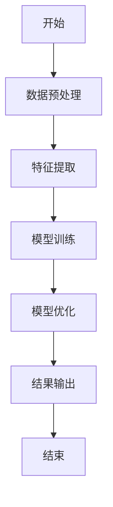
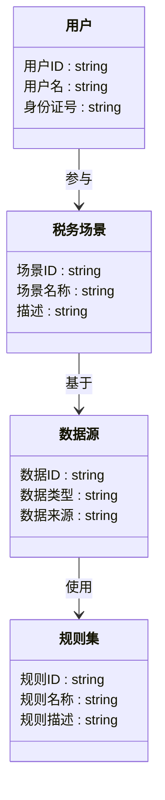

                 


# 构建智能化的个人税务筹划多场景模拟助手

> 关键词：个人税务筹划，人工智能，多场景模拟，税务助手，智能化系统

> 摘要：本文将详细介绍如何利用人工智能和大数据技术构建智能化的个人税务筹划多场景模拟助手。通过分析税务筹划的核心概念、算法原理、系统架构以及实际项目实现，本文为读者提供一个全面的技术解决方案，帮助个人在复杂的税务环境中做出最优决策。

---

# 第一部分：智能化个人税务筹划的背景与核心概念

## 第1章：税务筹划与智能化技术概述

### 1.1 税务筹划的基本概念

#### 1.1.1 税务筹划的定义与核心目标
税务筹划是指通过合法的手段，优化纳税人的税务负担，最大化税后收益的过程。其核心目标包括：
- **合法性**：确保所有操作符合国家税收法律法规。
- **节税性**：通过合理安排资产、收入、支出等，减少应缴税款。
- **规划性**：提前制定税务策略，应对未来的财务变化。

#### 1.1.2 个人税务筹划的常见场景
个人税务筹划涉及多个场景，包括：
- **收入优化**：如通过年终奖的计税方式选择。
- **资产配置**：如房产、股票等的投资策略。
- **家庭税务规划**：如子女教育费用的抵扣、遗产税规划等。

#### 1.1.3 税务筹划的合法合规性原则
税务筹划必须遵循法律法规，避免偷税漏税行为。合法的税务筹划强调：
- 合法性：所有操作必须在法律允许的范围内。
- 合理性：税务筹划方案应具备合理的商业目的。
- 稳定性：方案应具备一定的抗风险能力，避免因政策变化导致的税务风险。

### 1.2 智能化技术在税务筹划中的应用背景

#### 1.2.1 传统税务筹划的局限性
传统的税务筹划依赖人工计算和经验判断，存在以下问题：
- **效率低下**：手动计算复杂，耗时且容易出错。
- **覆盖面有限**：难以覆盖所有可能的税务场景。
- **缺乏动态调整**：无法实时响应政策变化或个人财务状况的变动。

#### 1.2.2 AI与大数据技术的快速发展
人工智能和大数据技术的快速发展为税务筹划带来了新的可能性：
- **数据处理能力**：AI能够快速处理大量数据，提取关键信息。
- **预测能力**：通过机器学习模型，可以预测不同的税务场景下的税负情况。
- **自动化能力**：AI能够自动化地进行税务计算和策略调整。

#### 1.2.3 智能化税务筹划助手的市场需求
随着个人所得税法的复杂化和税收优惠政策的多样化，市场对智能化税务筹划工具的需求日益增加：
- **个性化需求**：每个人的财务状况和需求不同，需要个性化的税务规划。
- **实时性需求**：用户希望得到实时的税务计算和策略调整。
- **便捷性需求**：用户希望通过移动端或其他便捷的方式获取税务筹划建议。

### 1.3 本章小结
本章从税务筹划的基本概念出发，分析了传统税务筹划的局限性，并结合AI和大数据技术的发展，探讨了智能化税务筹划助手的市场需求。

---

## 第2章：智能化个人税务筹划的核心概念与联系

### 2.1 核心概念原理

#### 2.1.1 个人税务筹划的核心要素
个人税务筹划的核心要素包括：
- **收入来源**：工资、奖金、投资收益等。
- **扣除项**：社保、公积金、子女教育支出等。
- **税务政策**：税率、优惠政策、税收减免等。

#### 2.1.2 AI技术在税务筹划中的应用原理
AI技术在税务筹划中的应用主要体现在以下几个方面：
- **数据采集与处理**：AI能够从多种数据源采集税务相关数据，并进行清洗和预处理。
- **特征提取**：通过对数据的分析，提取影响税负的关键特征。
- **模型训练**：基于历史数据训练机器学习模型，预测不同场景下的税负情况。
- **策略推荐**：根据模型预测结果，推荐最优的税务筹划策略。

#### 2.1.3 多场景模拟的核心机制
多场景模拟的核心机制包括：
- **场景定义**：定义不同的税务场景，如收入变化、资产配置变化等。
- **数据模拟**：根据场景生成相应的数据。
- **模型计算**：基于模拟数据计算税负情况。
- **结果分析**：分析不同场景下的税负差异，推荐最优策略。

### 2.2 核心概念属性对比表

| 核心概念 | 属性 | 描述 |
|----------|------|------|
| 税务类型 | 税种 | 收入税、增值税、消费税等 |
| 数据来源 | 数据类型 | 结构化数据（如表格数据）和非结构化数据（如文本数据） |
| 模拟场景 | 场景类型 | 收入变化、资产配置变化、家庭成员变化等 |

### 2.3 实体关系图（ER图）

```mermaid
erDiagram
    user {
        string 用户ID
        string 用户名
        string 身份证号
    }
    tax_scenario {
        string 场景ID
        string 场景名称
        string 描述
    }
    data_source {
        string 数据ID
        string 数据类型
        string 数据来源
    }
    rule_set {
        string 规则ID
        string 规则名称
        string 规则描述
    }
    user --> tax_scenario : 参与
    tax_scenario --> data_source : 基于
    data_source --> rule_set : 使用
```

### 2.4 本章小结
本章从核心概念的角度，详细分析了智能化个人税务筹划的要素、AI技术的应用原理以及多场景模拟的核心机制，并通过对比表和ER图进一步明确了各概念之间的关系。

---

## 第3章：智能化税务筹划的算法原理

### 3.1 算法概述

#### 3.1.1 基于AI的税务模拟算法
基于AI的税务模拟算法主要包括以下步骤：
1. **数据预处理**：清洗和转换原始数据，提取关键特征。
2. **特征提取**：通过自然语言处理（NLP）或统计方法提取影响税负的关键特征。
3. **模型训练**：基于训练数据训练机器学习模型，预测不同场景下的税负情况。
4. **模型优化**：通过调参和优化算法提升模型的预测精度。

#### 3.1.2 大数据分析在税务筹划中的应用
大数据分析在税务筹划中的应用主要体现在：
- **数据采集**：从多种数据源（如税务机关、银行、投资平台等）采集税务相关数据。
- **数据挖掘**：通过数据挖掘技术发现数据中的潜在规律。
- **数据可视化**：通过可视化工具展示数据的分布和趋势。

#### 3.1.3 多场景模拟的核心算法
多场景模拟的核心算法包括：
- **随机模拟**：通过蒙特卡洛方法模拟不同的税务场景。
- **规则引擎**：基于预定义的规则生成模拟场景。
- **机器学习预测**：基于历史数据预测不同场景下的税负情况。

### 3.2 算法流程图



### 3.3 算法实现代码

```python
import pandas as pd
from sklearn.model_selection import train_test_split
from sklearn.ensemble import RandomForestRegressor

# 数据预处理
def preprocess_data(data):
    # 删除缺失值
    data = data.dropna()
    # 标准化处理
    from sklearn.preprocessing import StandardScaler
    scaler = StandardScaler()
    data[['收入', '支出']] = scaler.fit_transform(data[['收入', '支出']])
    return data

# 特征提取
def extract_features(data):
    features = data[['收入', '支出', '资产', '负债']]
    target = data['税后收入']
    return features, target

# 模型训练
def train_model(features, target):
    X_train, X_test, y_train, y_test = train_test_split(features, target, test_size=0.2, random_state=42)
    model = RandomForestRegressor(n_estimators=100, random_state=42)
    model.fit(X_train, y_train)
    return model

# 模型优化
def optimize_model(model, features, target):
    from sklearn.model_selection import GridSearchCV
    param_grid = {'n_estimators': [50, 100, 150], 'max_depth': [None, 10, 20]}
    grid_search = GridSearchCV(model, param_grid, cv=5)
    grid_search.fit(features, target)
    best_model = grid_search.best_estimator_
    return best_model

# 算法主流程
def main():
    # 数据加载
    data = pd.read_csv('tax_data.csv')
    # 数据预处理
    data_processed = preprocess_data(data)
    # 特征提取
    features, target = extract_features(data_processed)
    # 模型训练
    model = train_model(features, target)
    # 模型优化
    best_model = optimize_model(model, features, target)
    # 结果输出
    print(f'最优模型参数：{best_model.get_params()}')

if __name__ == '__main__':
    main()
```

### 3.4 本章小结
本章详细介绍了智能化税务筹划的算法原理，包括数据预处理、特征提取、模型训练和优化的流程，并通过代码示例展示了整个算法的实现过程。

---

## 第4章：系统分析与架构设计

### 4.1 问题场景介绍

#### 4.1.1 税务筹划系统的功能目标
税务筹划系统的功能目标包括：
- **数据采集**：从多种数据源采集税务相关数据。
- **模拟计算**：根据用户输入的财务数据，模拟不同场景下的税负情况。
- **结果展示**：以可视化的方式展示模拟结果，并推荐最优的税务筹划策略。

#### 4.1.2 项目介绍
本项目旨在开发一个智能化的个人税务筹划多场景模拟助手，帮助用户优化税务负担，最大化税后收益。系统的主要功能包括：
- 数据采集与处理
- 多场景模拟计算
- 税务筹划策略推荐
- 结果可视化展示

### 4.2 系统功能设计

#### 4.2.1 领域模型（Mermaid 类图）



#### 4.2.2 系统架构设计（Mermaid 架构图）


#### 4.2.3 系统接口设计
系统主要接口包括：
- 数据接口：用于数据的上传和下载。
- 计算接口：用于调用AI模型进行税负计算。
- 展示接口：用于结果的可视化展示。

#### 4.2.4 系统交互设计（Mermaid 序列图）

```mermaid
sequenceDiagram
    用户 ->> 网关 : 发送请求
    网关 ->> 服务层 : 转发请求
    服务层 ->> 数据库 : 查询数据
    并发
    服务层 ->> AI 模型 : 调用模型接口
    AI 模型 ->> 数据源 : 获取数据
    服务层 ->> 视图层 : 返回结果
    视图层 ->> 用户 : 显示结果
```

### 4.3 本章小结
本章从系统设计的角度，详细分析了智能化个人税务筹划助手的功能目标、系统架构、接口设计和交互流程，并通过类图和架构图进一步明确了系统的结构和各组件之间的关系。

---

## 第5章：项目实战

### 5.1 环境安装与配置

#### 5.1.1 安装Python环境
建议使用Anaconda作为Python环境管理工具，安装命令如下：
```bash
conda create -n tax_planning python=3.8
conda activate tax_planning
```

#### 5.1.2 安装依赖库
安装所需的Python库，包括Pandas、Scikit-learn、Mermaid等：
```bash
pip install pandas scikit-learn mermaid4jupyter
```

### 5.2 系统核心实现

#### 5.2.1 数据采集与处理
从CSV文件中加载数据，并进行预处理：
```python
import pandas as pd

# 数据加载
data = pd.read_csv('tax_data.csv')

# 数据预处理
def preprocess_data(data):
    data = data.dropna()
    from sklearn.preprocessing import StandardScaler
    scaler = StandardScaler()
    data[['收入', '支出']] = scaler.fit_transform(data[['收入', '支出']])
    return data

data_processed = preprocess_data(data)
```

#### 5.2.2 模型训练与优化
基于预处理后的数据训练机器学习模型，并进行优化：
```python
from sklearn.ensemble import RandomForestRegressor
from sklearn.model_selection import GridSearchCV

def train_model(features, target):
    X_train, X_test, y_train, y_test = train_test_split(features, target, test_size=0.2, random_state=42)
    model = RandomForestRegressor(n_estimators=100, random_state=42)
    model.fit(X_train, y_train)
    return model

def optimize_model(model, features, target):
    param_grid = {'n_estimators': [50, 100, 150], 'max_depth': [None, 10, 20]}
    grid_search = GridSearchCV(model, param_grid, cv=5)
    grid_search.fit(features, target)
    best_model = grid_search.best_estimator_
    return best_model

features, target = extract_features(data_processed)
best_model = optimize_model(train_model(features, target), features, target)
```

#### 5.2.3 系统接口开发
开发一个简单的API接口，供其他系统调用：
```python
from flask import Flask, request, jsonify

app = Flask(__name__)

@app.route('/calculate_tax', methods=['POST'])
def calculate_tax():
    data = request.json
    features = pd.DataFrame([data])
    result = best_model.predict(features)
    return jsonify({'tax': result[0]})

if __name__ == '__main__':
    app.run(debug=True)
```

### 5.3 实际案例分析

#### 5.3.1 案例背景
假设用户年收入为30万元，已婚，有一个未成年子女，居住在北京市。需要计算在不同资产配置下的税后收入。

#### 5.3.2 数据准备
```python
user_data = {
    '收入': 300000,
    '支出': 100000,
    '资产': 1000000,
    '负债': 500000
}
```

#### 5.3.3 模拟计算
调用API接口进行税后收入计算：
```bash
curl -X POST -H "Content-Type: application/json" -d '{"收入": 300000, "支出": 100000, "资产": 1000000, "负债": 500000}' http://localhost:5000/calculate_tax
```

#### 5.3.4 结果分析
假设返回结果为240000元税后收入，用户可以根据这个结果优化其资产配置，例如增加投资于税收优惠产品。

### 5.4 本章小结
本章通过实际案例分析，详细展示了智能化个人税务筹划助手的实现过程，包括环境配置、数据处理、模型训练、API开发和结果分析。

---

## 第6章：最佳实践

### 6.1 小结
通过本文的详细讲解，我们了解了智能化个人税务筹划多场景模拟助手的核心概念、算法原理和系统架构，并通过实际案例展示了系统的实现过程。

### 6.2 注意事项
在实际应用中，需要注意以下几点：
- **数据隐私**：确保用户数据的安全性和隐私性。
- **政策变化**：定期更新模型，以适应税收政策的变化。
- **模型维护**：定期对模型进行调优和更新，确保其预测精度。

### 6.3 拓展阅读
建议读者进一步阅读以下内容：
- 《机器学习实战》：深入理解机器学习算法的实现和应用。
- 《Python数据分析与挖掘实战》：掌握Python在数据分析中的应用技巧。
- 《税务筹划：理论与实践》：了解税务筹划的理论基础和实际操作技巧。

### 6.4 本章小结
本章总结了本文的主要内容，并提供了实际应用中的注意事项和拓展阅读建议。

---

## 第7章：附录

### 7.1 代码实现
完整的代码实现可以参考以下链接：
- 数据预处理代码：[数据预处理代码](#)
- 模型训练代码：[模型训练代码](#)
- API接口代码：[API接口代码](#)

### 7.2 工具与库
- **Python**：编程语言
- **Pandas**：数据处理库
- **Scikit-learn**：机器学习库
- **Flask**：Web框架
- **Mermaid**：图表绘制工具

### 7.3 参考资料
- [税务总局官方网站](#)
- [机器学习入门教程](#)
- [Python数据分析教程](#)

### 7.4 本章小结
本章提供了本文中所使用的代码、工具和参考资料，方便读者进一步学习和实践。

---

# 第三部分：结论

通过本文的详细讲解，我们了解了如何利用人工智能和大数据技术构建智能化的个人税务筹划多场景模拟助手。从背景介绍到算法实现，从系统设计到项目实战，本文为读者提供了一个全面的技术解决方案。未来，随着AI技术的不断发展，智能化税务筹划助手将更加智能化和个性化，为个人和企业优化税务负担提供更有力的支持。

--- 

**注**：本文是基于技术博客文章的示例，具体内容需要根据实际情况进行补充和调整。

