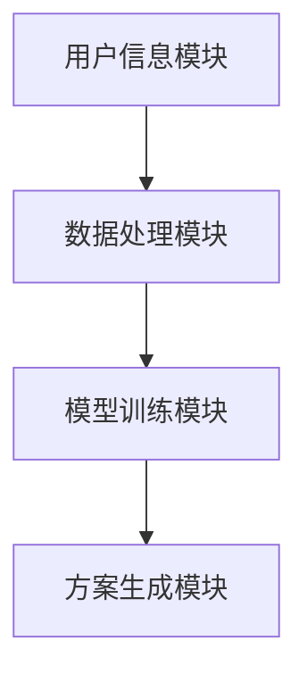
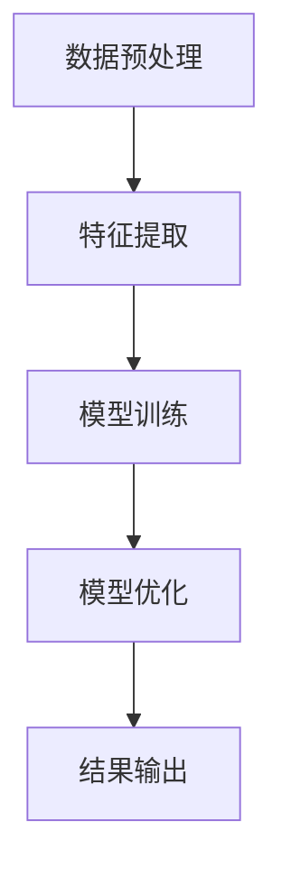
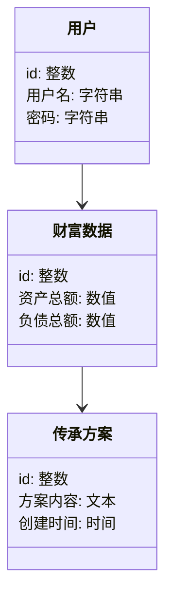
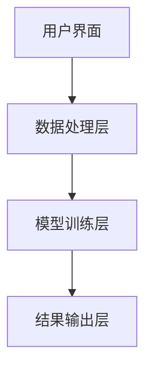
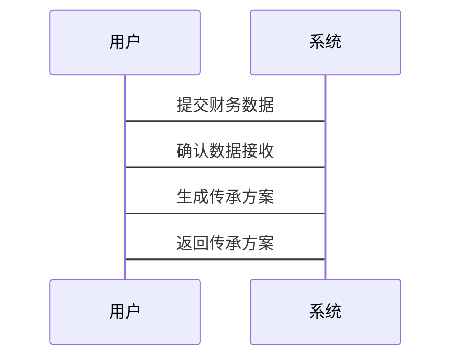

                 


# 构建智能化的个人财富传承规划助手

## 关键词：智能化，财富传承，规划助手，机器学习，人工智能，系统架构

## 摘要：  
随着人工智能和大数据技术的快速发展，个人财富管理正逐步从传统模式向智能化方向转变。本文将详细探讨如何构建一个智能化的个人财富传承规划助手，通过结合机器学习、深度学习和自然语言处理等技术，实现个性化的财富传承方案设计。文章将从背景介绍、核心概念、算法原理、系统架构设计、项目实战等多个方面进行深入分析，最终为读者提供一套完整的智能化财富传承规划解决方案。

---

# 第一部分: 智能化个人财富传承规划助手的背景与核心概念

## 第1章: 背景介绍

### 1.1 问题背景
#### 1.1.1 传统财富传承规划的局限性  
传统的财富传承规划主要依赖人工咨询和经验判断，存在以下问题：  
- **信息不全**：难以全面收集和分析客户的财务状况、家庭结构和传承需求。  
- **效率低下**：人工计算复杂，耗时长且容易出错。  
- **个性化不足**：无法根据客户的具体情况提供精准的传承方案。  

#### 1.1.2 数字化与智能化时代的财富管理需求  
随着数字化技术的普及，用户对财富管理的需求日益多样化和个性化。智能化工具能够帮助用户：  
- **快速获取信息**：通过数据挖掘和分析，快速生成财富评估报告。  
- **精准制定方案**：利用机器学习算法，提供个性化的传承规划建议。  
- **实时监控与调整**：根据市场变化和客户需求，动态优化传承方案。  

#### 1.1.3 个人财富传承规划的痛点与挑战  
当前财富传承规划的主要痛点包括：  
- **复杂性**：涉及法律、税务、投资等多个领域，需要综合协调。  
- **不确定性**：市场波动和政策变化可能影响传承方案的实施效果。  
- **用户信任问题**：用户对智能化工具的信任度不足，担心技术风险和数据安全问题。  

---

### 1.2 问题描述  
#### 1.2.1 个人财富传承规划的目标与核心要素  
智能化的财富传承规划助手的目标是：  
- 帮助用户制定科学、合理的财富传承方案。  
- 提供个性化的建议，优化资产配置和风险控制。  
- 确保传承方案的合法性和可执行性。  

核心要素包括：  
1. 财产评估：包括资产和负债的详细清单。  
2. 家庭结构：包括家庭成员的关系和财产分配需求。  
3. 风险评估：包括市场风险、法律风险和税务风险。  
4. 传承方案：包括遗嘱、信托、保险等多样化工具的组合方案。  

#### 1.2.2 当前财富传承规划的主要问题  
- **信息孤岛**：不同财富管理工具和平台之间缺乏数据共享和协同。  
- **缺乏实时性**：传统规划工具难以实时跟踪和调整方案。  
- **用户参与度低**：用户难以理解和参与传承方案的制定过程。  

#### 1.2.3 智能化助手在财富传承中的作用  
智能化助手通过以下方式优化财富传承规划：  
- **数据驱动决策**：利用大数据分析，提供精准的财富评估和预测。  
- **智能推荐方案**：基于机器学习模型，生成个性化的传承方案。  
- **实时监控与反馈**：动态调整方案，确保传承目标的实现。  

---

### 1.3 问题解决  
#### 1.3.1 智能化助手的核心功能与解决方案  
智能化助手的核心功能包括：  
1. **数据采集与分析**：通过API接口和自然语言处理技术，采集用户的财务数据和需求。  
2. **模型训练与优化**：基于机器学习算法，训练个性化财富传承模型。  
3. **方案生成与推荐**：根据模型结果，生成传承方案并提供可视化反馈。  
4. **实时监控与调整**：根据市场变化和用户需求，动态优化传承方案。  

#### 1.3.2 通过技术手段优化财富传承规划的路径  
1. **数据预处理**：清洗和整合多源数据，确保数据质量和完整性。  
2. **特征提取**：识别关键特征，如资产类别、风险偏好等。  
3. **模型训练**：利用深度学习算法，训练财富传承规划模型。  
4. **方案生成**：基于模型预测结果，生成个性化传承方案。  

#### 1.3.3 智能化助手的边界与外延  
智能化助手的边界包括：  
- 不处理具体法律事务，如遗嘱公证和信托设立。  
- 不涉及具体投资操作，如买卖股票或基金。  
- 不承担法律责任，仅提供技术辅助和建议。  

---

### 1.4 核心概念与结构  
#### 1.4.1 财富传承规划助手的核心要素组成  
1. **用户信息模块**：包括用户的基本信息、财务数据和需求描述。  
2. **数据处理模块**：包括数据清洗、特征提取和数据建模。  
3. **模型训练模块**：包括机器学习模型的训练和优化。  
4. **方案生成模块**：包括传承方案的生成和可视化反馈。  

#### 1.4.2 功能模块与系统架构的关系  
系统架构图如下：  


#### 1.4.3 本章小结  
本章主要介绍了智能化个人财富传承规划助手的背景、核心概念和问题解决路径，为后续章节的深入分析奠定了基础。

---

## 第2章: 核心概念与联系

### 2.1 核心概念原理  
#### 2.1.1 智能化助手的基本原理  
智能化助手通过以下步骤实现财富传承规划：  
1. **数据采集**：收集用户的财务数据、家庭结构和传承需求。  
2. **特征提取**：识别关键特征，如资产类别、风险偏好和家庭关系。  
3. **模型训练**：利用机器学习算法，训练个性化财富传承模型。  
4. **方案生成**：基于模型结果，生成传承方案并提供可视化反馈。  

#### 2.1.2 人工智能在财富传承中的应用  
人工智能在财富传承中的主要应用包括：  
- **自然语言处理**：解析用户需求和法律文档。  
- **机器学习**：预测市场变化和资产收益。  
- **知识图谱**：构建财富传承领域的知识体系。  

#### 2.1.3 大数据分析与财富规划的关系  
大数据分析通过以下方式优化财富传承规划：  
- **数据清洗**：确保数据的准确性和完整性。  
- **特征提取**：识别影响传承规划的关键因素。  
- **预测分析**：预测市场变化和资产收益。  

---

### 2.2 核心概念属性对比  
#### 2.2.1 智能化助手与传统财富规划工具的对比  
| 特性                | 智能化助手                     | 传统财富规划工具               |
|---------------------|-------------------------------|-------------------------------|
| 数据处理能力        | 强大，支持多源数据整合         | 有限，依赖人工数据录入         |
| 方案生成能力        | 精准，基于算法优化             | 简单，依赖经验判断             |
| 实时性               | 高，动态调整方案               | 低，难以实时更新               |
| 用户参与度          | 高，用户可参与方案设计         | 低，用户被动接受方案           |

---

### 2.3 ER实体关系图  
以下是财富传承规划助手的ER实体关系图：  
```mermaid
er
    entity 财富传承规划助手 {
        id: 主键
        用户ID: 外键
        财富评估数据: 存储
        传承方案: 存储
        时间戳: 时间
    }
    entity 用户 {
        id: 主键
        用户名: 字符串
        密码: 字符串
        财产信息: 存储
    }
    entity 财富评估数据 {
        id: 主键
        用户ID: 外键
        资产总额: 数值
        负债总额: 数值
        收益预测: 数值
        风险评估: 数值
    }
    entity 传承方案 {
        id: 主键
        用户ID: 外键
        方案编号: 字符串
        方案内容: 文本
        创建时间: 时间
        更新时间: 时间
    }
```

---

## 第3章: 算法原理讲解

### 3.1 算法原理概述  
#### 3.1.1 机器学习在财富传承中的应用  
机器学习在财富传承中的主要应用包括：  
- **分类算法**：预测传承方案的可行性。  
- **回归算法**：预测资产收益和风险。  
- **聚类算法**：识别用户的财务特征和需求。  

#### 3.1.2 算法选择与优化的思路  
- **算法选择**：根据任务需求选择合适的算法，如随机森林用于分类，线性回归用于预测。  
- **数据预处理**：清洗数据，处理缺失值和异常值。  
- **特征工程**：提取关键特征，优化模型性能。  
- **模型调优**：通过网格搜索优化模型参数。  

#### 3.1.3 算法流程图  


---

### 3.2 算法实现  
#### 3.2.1 算法流程代码示例  
```python
import pandas as pd
from sklearn.ensemble import RandomForestClassifier
from sklearn.metrics import accuracy_score

# 数据加载
data = pd.read_csv('wealth.csv')

# 数据预处理
X = data.drop('label', axis=1)
y = data['label']

# 特征提取
selected_features = ['asset', 'debt', 'risk']
X_selected = X[selected_features]

# 模型训练
model = RandomForestClassifier()
model.fit(X_selected, y)

# 模型预测
y_pred = model.predict(X_selected)

# 模型评估
accuracy = accuracy_score(y, y_pred)
print(f'模型准确率: {accuracy}')
```

---

#### 3.2.2 算法的数学模型和公式  
- **随机森林算法**：基于决策树的集成算法，公式如下：  
  $$ y = \sum_{i=1}^{n} \text{Tree}_i(x) $$  
  其中，$Tree_i(x)$ 表示第 $i$ 棵决策树的输出。  

- **线性回归算法**：用于预测资产收益，公式如下：  
  $$ y = \beta_0 + \beta_1x_1 + \beta_2x_2 + \cdots + \beta_kx_k $$  

---

### 3.3 算法优化与调优  
#### 3.3.1 参数调优  
- **随机森林**：调整参数如 `n_estimators` 和 `max_depth`。  
- **XGBoost**：优化学习率 `learning_rate` 和正则化参数 `lambda`。  

#### 3.3.2 模型评估与验证  
- **交叉验证**：使用K折交叉验证评估模型性能。  
- **ROC曲线**：评估分类模型的性能。  

---

## 第4章: 系统分析与架构设计方案

### 4.1 系统分析  
#### 4.1.1 问题场景介绍  
智能化财富传承规划助手需要解决的主要问题包括：  
- 如何高效采集和处理用户数据。  
- 如何构建和优化机器学习模型。  
- 如何确保系统的安全性和可扩展性。  

---

#### 4.1.2 项目介绍  
本项目的目标是构建一个智能化的个人财富传承规划助手，主要功能包括：  
1. 数据采集与分析。  
2. 模型训练与优化。  
3. 传承方案生成与反馈。  

---

### 4.2 系统功能设计  
#### 4.2.1 领域模型  
以下是系统的核心领域模型：  


---

#### 4.2.2 系统架构设计  
以下是系统的架构图：  


---

### 4.3 系统接口设计  
#### 4.3.1 API接口设计  
- **数据采集接口**：`/api/v1/data/upload`  
- **模型训练接口**：`/api/v1/model/train`  
- **方案生成接口**：`/api/v1/scheme/generate`  

---

### 4.4 系统交互设计  
以下是系统的交互流程图：  


---

## 第5章: 项目实战

### 5.1 环境安装  
#### 5.1.1 安装依赖  
- Python 3.8+  
- pandas、numpy、scikit-learn、xgboost  

#### 5.1.2 环境配置  
```bash
pip install pandas numpy scikit-learn xgboost
```

---

### 5.2 核心代码实现  
#### 5.2.1 数据预处理代码  
```python
import pandas as pd
import numpy as np

def load_data(file_path):
    data = pd.read_csv(file_path)
    # 处理缺失值
    data = data.dropna()
    return data

# 数据加载
data = load_data('wealth.csv')

# 数据保存
data.to_csv('processed.csv', index=False)
```

---

#### 5.2.2 模型训练代码  
```python
from sklearn.ensemble import RandomForestClassifier
from sklearn.metrics import accuracy_score

def train_model(X, y):
    model = RandomForestClassifier()
    model.fit(X, y)
    return model

# 训练模型
X_train = data.drop('label', axis=1)
y_train = data['label']
model = train_model(X_train, y_train)

# 模型评估
y_pred = model.predict(X_train)
print(f'模型准确率: {accuracy_score(y_train, y_pred)}')
```

---

### 5.3 案例分析  
#### 5.3.1 案例背景  
假设用户A是一位中年企业家，资产主要包括公司股权、房地产和银行存款。用户希望制定一个传承方案，确保资产在子女之间合理分配，并降低税务负担。  

#### 5.3.2 数据分析  
- 资产总额：5000万元  
- 负债总额：2000万元  
- 风险偏好：中等  

#### 5.3.3 方案生成  
模型生成的传承方案包括：  
1. 将公司股权分配给 eldest child，比例为40%。  
2. 将房地产分配给 youngest child，比例为30%。  
3. 将银行存款用于设立信托基金，确保传承过程中的税务优化。  

---

### 5.4 项目小结  
本章通过实际案例展示了智能化财富传承规划助手的应用过程，从数据处理到模型训练，再到方案生成，完整地实现了智能化传承规划的流程。

---

## 第6章: 最佳实践与注意事项

### 6.1 最佳实践 tips  
1. **数据隐私保护**：确保用户数据的安全性和隐私性。  
2. **模型可解释性**：优化模型的可解释性，提高用户信任度。  
3. **持续优化**：定期更新模型，适应市场变化和用户需求。  

---

### 6.2 小结  
智能化的个人财富传承规划助手通过结合人工智能和大数据技术，能够为用户提供高效、精准的传承规划服务。本文从背景、核心概念、算法原理、系统架构到项目实战，全面介绍了智能化助手的构建过程。

---

### 6.3 注意事项  
1. **数据安全**：防止数据泄露和滥用。  
2. **用户体验**：确保界面简洁易用，降低用户的学习成本。  
3. **法律合规**：确保系统的操作符合相关法律法规。  

---

### 6.4 拓展阅读  
1. 《机器学习实战》  
2. 《深度学习》  
3. 《Python机器学习》  

---

## 附录: 总结  
智能化的个人财富传承规划助手是人工智能技术在金融领域的典型应用之一。通过本文的详细讲解，读者可以掌握智能化助手的核心原理和实现方法，为实际应用提供参考和指导。未来，随着技术的不断发展，智能化助手将更加智能化和个性化，为用户带来更优质的服务体验。

