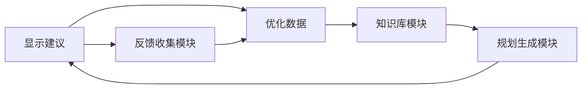

                 


# 构建智能化的个人财富传承规划助手

## 关键词：人工智能，财富传承，智能化助手，系统架构，算法原理，项目实战

## 摘要：本文旨在探讨如何利用人工智能技术构建智能化的个人财富传承规划助手。通过分析财富传承规划的核心要素，结合智能化助手的算法原理和系统架构设计，提出一套完整的解决方案。文章内容涵盖背景介绍、核心概念、算法原理、系统架构、项目实战以及最佳实践，为读者提供一个全面的技术视角。

---

# 第一部分：智能化财富传承规划助手的背景与核心概念

## 第1章：财富传承规划的背景与问题背景

### 1.1 什么是财富传承
#### 1.1.1 财富传承的定义
财富传承是指个人或家族将其积累的财富（包括资产、股权、知识产权等）通过法律、税务、投资等多种手段，传递给下一代或其他受益人的一种过程。财富传承的核心目标是确保财富的合法、合规和高效转移，同时最大化财富的保值和增值。

#### 1.1.2 财富传承的核心要素
- **资产识别**：明确可传承的资产类型（如房地产、股票、艺术品等）。
- **法律框架**：了解相关法律法规，确保传承过程的合法性。
- **税务优化**：通过合理的税务规划，减少传承过程中的税务负担。
- **风险管理**：防范潜在的法律风险和资产损失。

#### 1.1.3 财富传承的常见方式
- **遗嘱**：通过法律文书明确资产分配。
- **信托**：设立信托基金，实现资产隔离和长期管理。
- **家族企业传承**：通过股权分配和管理权交接实现企业传承。
- **保险**：利用人寿保险或财产保险保障财富安全。

### 1.2 财富传承规划的重要性
#### 1.2.1 个人财富传承的意义
财富传承不仅是个人资产的延续，更是家族财富保值和增值的重要手段。合理的财富传承规划可以帮助个人或家族避免财产纠纷，确保财富的稳定传承。

#### 1.2.2 传统财富传承规划的局限性
- **信息不对称**：传统规划方式依赖于人工咨询，可能存在信息不透明和咨询成本高的问题。
- **效率低下**：传统规划过程复杂，耗时长，难以快速响应客户需求。
- **个性化不足**：传统规划方式难以根据客户的个性化需求进行定制化设计。

#### 1.2.3 智能化规划的需求与优势
- **需求**：随着财富规模的增加和资产类型的多样化，传统规划方式已无法满足客户的需求。
- **优势**：智能化助手可以通过大数据分析和人工智能技术，提供高效、个性化的财富传承规划服务。

### 1.3 智能化财富传承规划的背景
#### 1.3.1 人工智能在财富管理中的应用
人工智能技术（如自然语言处理、机器学习、知识图谱）的应用，使得财富传承规划更加智能化和个性化。

#### 1.3.2 智能化规划的必要性
随着财富管理需求的多样化和复杂化，智能化规划成为解决传统规划方式效率低下的关键。

#### 1.3.3 技术驱动财富传承规划的变革
人工智能技术的进步为财富传承规划带来了新的可能性，推动了财富管理行业的数字化和智能化转型。

## 第2章：智能化财富传承规划助手的核心概念

### 2.1 智能化助手的定义与特点
#### 2.1.1 定义
智能化财富传承规划助手是一种基于人工智能技术的智能化工具，能够通过分析客户的资产、法律、税务等信息，提供个性化的财富传承规划建议。

#### 2.1.2 核心特点
- **智能化**：通过机器学习和自然语言处理技术，实现自动化分析和个性化建议。
- **高效性**：快速处理大量数据，提供即时反馈。
- **个性化**：根据客户需求定制化规划方案。
- **可扩展性**：支持多种资产类型和复杂场景。

#### 2.1.3 与传统财富管理的区别
- **传统方式**：依赖人工咨询，效率低，个性化不足。
- **智能化助手**：通过技术实现自动化、个性化和高效化。

### 2.2 财富传承规划的系统性分析
#### 2.2.1 问题背景
财富传承规划涉及多个领域，包括法律、税务、投资等，需要综合考虑各种因素。

#### 2.2.2 问题描述
客户需要一个能够综合分析其资产、法律和税务情况，并提供个性化传承规划的工具。

#### 2.2.3 问题解决的路径
通过智能化助手实现资产分析、法律合规性评估、税务优化和风险管理。

#### 2.2.4 边界与外延
智能化助手的边界是提供规划建议，不涉及实际的法律操作和资产管理。

#### 2.2.5 核心要素组成
- **资产识别**：识别可传承的资产类型。
- **法律合规**：确保传承过程的合法性。
- **税务优化**：降低税务负担。
- **风险管理**：防范潜在风险。

### 2.3 核心概念的联系与对比
#### 2.3.1 核心概念原理
智能化助手通过分析客户的资产、法律和税务信息，生成个性化的财富传承规划建议。

#### 2.3.2 核心概念属性特征对比表

| 属性         | 传统财富管理 | 智能化财富传承助手 |
|--------------|--------------|---------------------|
| 效率         | 低效         | 高效               |
| 个性化       | 有限         | 强化               |
| 可扩展性     | 低           | 高                 |

#### 2.3.3 ER实体关系图架构
```mermaid
erDiagram
    customer[客户] {
        +int id
        +string name
        +string assets
    }
    advisor[财富顾问] {
        +int id
        +string name
        +string credentials
    }
    plan[传承计划] {
        +int id
        +string description
        +date plan_date
    }
    customer --> advisor : 咨询
    customer --> plan : 提交
    advisor --> plan : 制定
```

---

## 第三部分：智能化财富传承规划助手的算法与系统架构

## 第3章：智能化助手的算法原理

### 3.1 自然语言处理在财富传承规划中的应用
#### 3.1.1 NLP技术概述
自然语言处理（NLP）技术用于分析客户的文本信息，提取关键数据。

#### 3.1.2 文本分析算法


#### 3.1.3 实例分析
客户输入：“我有两处房产和一些股票，希望传承给我的两个孩子。”
系统分析并生成传承建议：设立信托基金，分别分配房产和股票。

### 3.2 知识图谱构建与财富传承规划
#### 3.2.1 知识图谱的定义与构建方法
知识图谱是一种结构化的数据表示方式，用于存储和关联财富传承相关的知识。

#### 3.2.2 财富传承知识图谱的构建流程


#### 3.2.3 实例分析
构建财富传承知识图谱，包括资产类型、法律条款、税务优化等信息。

### 3.3 基于规则的财富传承规划生成算法
#### 3.3.1 规则生成算法概述
基于预定义的规则生成传承规划建议。

#### 3.3.2 规则库构建


#### 3.3.3 规则匹配与生成流程


---

## 第4章：智能化助手的系统架构设计

### 4.1 问题场景介绍
客户希望通过智能化助手进行财富传承规划，系统需要处理资产识别、法律合规、税务优化和风险管理。

### 4.2 系统架构设计
#### 4.2.1 模块划分与交互流程
- **用户界面**：用户输入资产信息和需求。
- **数据分析模块**：分析客户资产、法律和税务信息。
- **知识库模块**：存储财富传承相关知识。
- **建议生成模块**：根据分析结果生成传承建议。
- **反馈优化模块**：根据用户反馈优化建议。

#### 4.2.2 系统架构


---

## 第五部分：智能化财富传承规划助手的项目实战

## 第5章：项目实战

### 5.1 环境安装
- **Python**：安装Python 3.x。
- **库依赖**：安装 `numpy`, `pandas`, `spacy`, `networkx`。

### 5.2 系统核心实现源代码
```python
import spacy
from spacy.lang.zh import Chinese

# 初始化中文分词器
nlp = spacy.load("zh_core_web_sm")

def analyze_assets(text):
    doc = nlp(text)
    entities = set()
    for ent in doc.ents:
        if ent.label_ in ["ORG", "MONEY"]:
            entities.add(ent.text)
    return entities

# 示例
text = "我有两处房产和一些股票，希望传承给我的两个孩子。"
assets = analyze_assets(text)
print("识别到的资产：", assets)
```

### 5.3 代码应用解读与分析
- **代码功能**：识别文本中的实体，如资产类型。
- **应用场景**：分析客户的资产信息，为传承规划提供数据支持。

### 5.4 实际案例分析
客户输入：“我有两处房产和一些股票，希望传承给我的两个孩子。”
系统分析并生成传承建议：设立信托基金，分别分配房产和股票。

### 5.5 项目小结
通过智能化助手实现高效、个性化的财富传承规划，帮助客户优化资产配置和风险管理。

---

## 第六部分：智能化财富传承规划助手的最佳实践

## 第6章：最佳实践

### 6.1 小结
智能化财富传承规划助手通过人工智能技术，实现高效、个性化的财富传承规划。

### 6.2 注意事项
- **数据隐私**：确保客户数据的安全性和隐私性。
- **模型可解释性**：规划建议需要清晰易懂，避免复杂性。
- **持续优化**：根据用户反馈不断优化系统性能。

### 6.3 拓展阅读
- **书籍**：《人工智能在财富管理中的应用》
- **论文**：《基于知识图谱的财富传承规划研究》

---

# 附录：相关工具与资源

## 附录A：相关工具
- **spaCy**：自然语言处理库。
- **NetworkX**：图论与网络分析库。

## 附录B：资源链接
- **spaCy官方文档**：[https://spacy.io](https://spacy.io)
- **Python官方文档**：[https://docs.python.org](https://docs.python.org)

---

通过以上目录大纲，我们可以清晰地看到构建智能化的个人财富传承规划助手的完整过程，包括背景分析、算法设计、系统架构、项目实现和最佳实践等各个方面。这为读者提供了一个全面的技术视角，帮助他们在实际应用中更好地理解和实施智能化财富传承规划。

