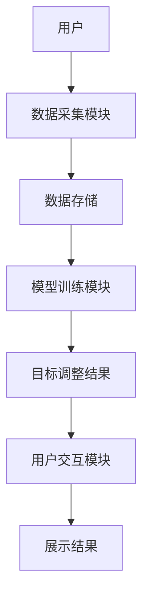
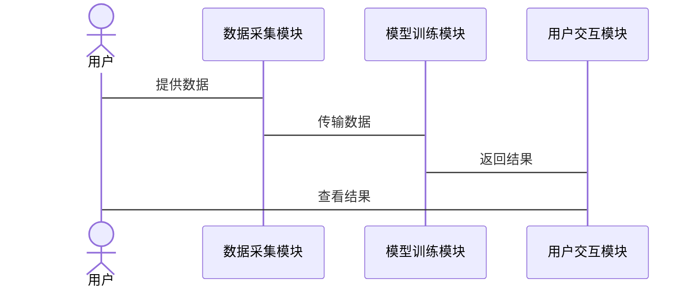

                 


# 构建智能化的个人财富管理目标动态调整助手

## 关键词
智能化，财富管理，动态调整，人工智能，目标管理

## 摘要
本文旨在探讨如何利用人工智能技术构建一个智能化的个人财富管理目标动态调整助手。通过分析传统财富管理的局限性，提出基于AI的目标动态调整方法，并详细阐述其核心概念、算法原理、系统架构以及实际应用案例。文章内容包括背景介绍、核心概念、算法原理、系统架构、项目实战和最佳实践，帮助读者全面理解并掌握如何构建智能化的财富管理助手。

## 第一部分: 智能化个人财富管理目标动态调整助手概述

### 第1章: 问题背景与目标设定

#### 1.1 问题背景
- **传统财富管理的局限性**：传统财富管理方法依赖人工决策，难以实时调整，且缺乏个性化。
- **个人财富管理目标的重要性**：明确的目标有助于优化投资策略，提高收益。
- **动态调整的必要性**：市场环境和个人情况的变化要求目标不断调整。

#### 1.2 问题描述
- **财富管理目标的复杂性**：涉及多方面因素，如市场波动、个人收入变化等。
- **目标动态调整的挑战**：需要实时数据处理和快速决策。
- **现有解决方案的不足**：传统方法效率低，难以适应变化。

#### 1.3 问题解决思路
- **引入智能化技术的必要性**：利用AI技术提高目标调整的效率和准确性。
- **基于AI的目标动态调整方法**：通过机器学习模型实时分析数据，动态调整目标。
- **技术与业务的结合点**：AI技术与财富管理业务的深度融合，实现智能化目标管理。

#### 1.4 边界与外延
- **系统功能的边界**：专注于目标动态调整，不涉及具体投资操作。
- **与外部系统的交互**：与其他财富管理系统接口兼容。
- **适用场景与限制**：适用于个人用户，不考虑机构投资者。

#### 1.5 核心概念与组成
- **财富管理目标的定义**：用户设定的财务目标，如投资收益、资产配置等。
- **动态调整的机制**：基于实时数据和AI模型，自动调整目标。
- **智能化助手的功能模块**：数据采集、模型训练、用户交互等。

### 第2章: 核心概念与联系

#### 2.1 核心概念原理
- **目标管理模型**：定义用户目标的结构和关系。
- **动态调整算法**：通过AI模型实时调整目标。
- **智能化决策机制**：结合数据和模型，做出最优决策。

#### 2.2 核心概念对比表
| 比较维度 | 传统方法 | 基于AI的方法 |
|----------|----------|--------------|
| 调整频率 | 低       | 高           |
| 精准度   | 低       | 高           |
| 复杂度   | 高       | 中           |

#### 2.3 ER实体关系图
```mermaid
er
actor: 用户
goal: 财富管理目标
adjustment_rule: 调整规则
data_source: 数据源
system: 智能化助手
```

### 第3章: 算法原理讲解

#### 3.1 动态调整算法
- **算法流程**：
  1. 数据采集：收集市场数据和个人信息。
  2. 特征提取：提取影响目标的关键特征。
  3. 模型训练：训练机器学习模型。
  4. 目标预测：预测调整后的目标。
  5. 调整规则应用：根据规则调整目标。
  6. 结果输出：输出调整后的目标。

- **算法实现**：
  ```mermaid
  graph TD
  A[开始] --> B[数据采集]
  B --> C[特征提取]
  C --> D[模型训练]
  D --> E[目标预测]
  E --> F[调整规则应用]
  F --> G[结果输出]
  G --> H[结束]
  ```

  ```python
  def dynamic_adjustment_algorithm(data):
      # 数据预处理
      processed_data = preprocess(data)
      # 特征提取
      features = extract_features(processed_data)
      # 模型预测
      prediction = model.predict(features)
      # 调整规则应用
      adjusted_prediction = apply_rules(prediction)
      return adjusted_prediction
  ```

- **数学模型**：
  $$预测值 = \alpha \times 市场数据 + \beta \times 个人信息$$
  其中，$\alpha$ 和 $\beta$ 是通过模型训练得到的参数。

## 第二部分: 系统分析与架构设计方案

### 第4章: 系统架构设计

#### 4.1 问题场景介绍
- **用户需求**：实时调整财富管理目标。
- **系统目标**：构建智能化助手，实现动态调整。

#### 4.2 系统功能设计
- **数据采集模块**：收集市场数据和用户信息。
- **模型训练模块**：训练AI模型。
- **用户交互模块**：展示调整结果。

#### 4.3 系统架构图


#### 4.4 系统接口设计
- **输入接口**：数据采集模块接收市场数据。
- **输出接口**：用户交互模块显示调整结果。

#### 4.5 系统交互图


## 第三部分: 项目实战

### 第5章: 项目实现

#### 5.1 环境安装
- **Python**：安装Anaconda或Miniconda。
- **机器学习库**：安装Scikit-learn、TensorFlow等。
- **可视化工具**：安装Matplotlib或Seaborn。

#### 5.2 核心代码实现
```python
import pandas as pd
from sklearn.model import LinearRegression

def preprocess(data):
    # 数据清洗和转换
    data = data.dropna()
    return data

def extract_features(data):
    # 提取特征
    features = data[['市场数据', '个人信息']]
    return features

def train_model(features, target):
    # 训练模型
    model = LinearRegression()
    model.fit(features, target)
    return model

def apply_rules(prediction):
    # 应用调整规则
    adjusted = prediction * 1.1  # 示例规则
    return adjusted

# 示例代码
data = pd.read_csv('wealth_data.csv')
processed_data = preprocess(data)
features = extract_features(processed_data)
target = processed_data['目标']
model = train_model(features, target)
prediction = model.predict(features)
adjusted_prediction = apply_rules(prediction)
print('调整后的预测值:', adjusted_prediction)
```

#### 5.3 案例分析
- **数据来源**：假设市场数据包括股票指数、债券收益率等。
- **用户信息**：包括收入、风险偏好等。
- **调整规则**：根据市场波动调整目标。

#### 5.4 项目总结
- **实现步骤**：数据预处理、特征提取、模型训练、结果调整。
- **注意事项**：确保数据质量和模型泛化能力。

## 第四部分: 最佳实践

### 第6章: 最佳实践

#### 6.1 小结
- **总结内容**：智能化助手的优势和实现方法。
- **关键点**：数据质量和模型选择。

#### 6.2 注意事项
- **数据隐私**：确保用户数据安全。
- **模型更新**：定期更新模型以适应市场变化。
- **用户反馈**：收集用户反馈，优化系统。

#### 6.3 拓展阅读
- 推荐相关书籍和资源，如《机器学习实战》、《Python机器学习》。

## 结语

通过本文的详细讲解，读者可以全面理解如何构建智能化的个人财富管理目标动态调整助手。从背景分析到系统实现，再到项目实战，每一步都详细展开，确保读者能够掌握核心技术和实际应用。希望本文能为相关领域的研究和实践提供有价值的参考。

