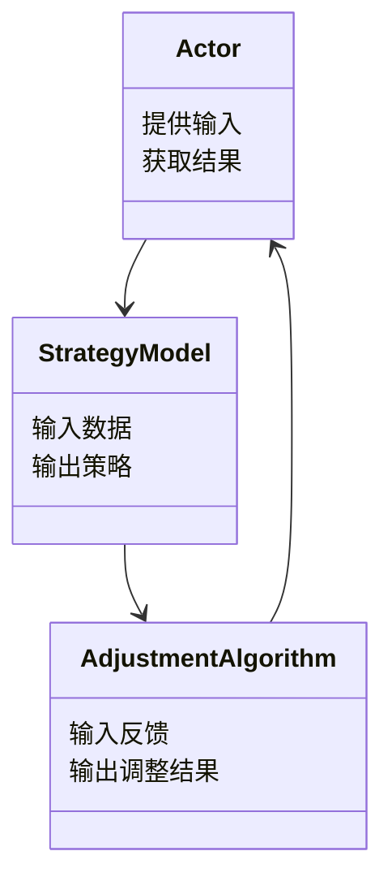

                 


# 构建智能化的个人财富管理策略动态生成与调整助手

> 关键词：智能化财富管理，动态生成，调整助手，生成式模型，强化学习，系统架构

> 摘要：本文旨在探讨如何构建一个智能化的个人财富管理策略动态生成与调整助手。通过分析传统财富管理的局限性，提出利用生成式模型和强化学习等人工智能技术，实现财富管理策略的自动生成与动态调整。本文详细介绍了核心概念、算法原理、系统架构设计、项目实战及案例分析，为构建智能化财富管理助手提供了全面的技术指导。

---

# 第1章: 背景介绍

## 1.1 问题背景与描述
### 1.1.1 传统个人财富管理的局限性
传统个人财富管理依赖于人工分析和经验判断，存在以下问题：
- **信息处理效率低**：面对海量市场数据，人工分析耗时且效率低下。
- **策略静态化**：传统策略通常基于历史数据制定，难以适应实时市场变化。
- **个性化不足**：难以根据用户实时需求和市场环境进行动态调整。

### 1.1.2 智能化财富管理的需求与趋势
随着人工智能技术的发展，智能化财富管理成为可能：
- **实时数据处理**：利用AI技术快速处理市场数据，生成实时策略。
- **动态调整**：根据市场波动和个人需求变化，动态优化投资组合。
- **个性化服务**：通过用户画像和行为分析，提供定制化财富管理方案。

### 1.1.3 动态生成与调整的必要性
财富市场具有高度不确定性，仅靠静态策略难以应对复杂变化。动态生成与调整能够：
- **捕捉市场机会**：及时调整投资策略，最大化收益。
- **降低风险**：通过动态调整，减少市场波动带来的损失。
- **提高用户满意度**：为用户提供个性化的实时服务。

## 1.2 核心概念与问题解决
### 1.2.1 智能化财富管理助手的核心目标
智能化财富管理助手的目标是：
- 自动生成财富管理策略。
- 根据市场变化和用户需求动态调整策略。
- 提供实时反馈和优化建议。

### 1.2.2 动态生成与调整的实现路径
实现路径包括：
- 数据采集与处理：获取市场数据、用户数据等。
- 策略生成：利用生成式模型生成初始策略。
- 动态调整：通过强化学习优化策略。

### 1.2.3 边界与外延分析
- **边界**：限定在个人财富管理领域，不涉及机构投资。
- **外延**：可扩展至其他领域，如健康管理、时间管理等。

## 1.3 核心要素与概念结构
### 1.3.1 财富管理策略的核心要素
包括：
- 投资目标（收益、风险偏好等）。
- 市场环境（经济指标、行业趋势等）。
- 用户特征（风险承受能力、投资期限等）。

### 1.3.2 动态生成与调整的逻辑架构
逻辑架构分为：
1. 数据采集：获取市场、用户数据。
2. 策略生成：生成初步财富管理策略。
3. 动态调整：根据反馈优化策略。

### 1.3.3 边界条件与限制因素
- 数据来源的可靠性。
- 模型的泛化能力。
- 用户隐私保护。

---

# 第2章: 核心概念与联系

## 2.1 核心概念原理
### 2.1.1 财富管理策略生成模型
生成式模型通过以下步骤生成策略：
1. 数据预处理：清洗和标准化数据。
2. 模型训练：使用历史数据训练生成模型。
3. 策略生成：基于当前市场数据生成新策略。

### 2.1.2 动态调整机制
动态调整机制包括：
1. 状态监测：实时监测市场和用户变化。
2. 模型推理：根据变化调整策略。
3. 反馈优化：根据结果优化模型。

### 2.1.3 用户行为与市场变化的关联
通过分析用户行为数据和市场数据，建立关联模型：
- 用户行为预测市场变化。
- 市场变化影响用户行为。

## 2.2 概念属性特征对比
以下是核心概念的特征对比表：

| 概念                | 输入数据       | 输出结果       | 调整频率     |
|---------------------|----------------|----------------|--------------|
| 策略生成模型        | 市场数据、用户数据 | 初始策略       | 低频         |
| 动态调整算法        | 市场变化、用户反馈 | 优化策略       | 高频         |

## 2.3 ER实体关系图
以下是核心概念的ER图：

```mermaid
er
  actor: 用户
  strategy_model: 策略生成模型
  adjustment_algorithm: 动态调整算法
  market_data: 市场数据
  user_profile: 用户档案
  wealth_management_strategy: 财富管理策略
  interaction_log: 交互记录
  actor --> strategy_model: 提供输入
  strategy_model --> wealth_management_strategy: 生成策略
  wealth_management_strategy --> adjustment_algorithm: 触发调整
  adjustment_algorithm --> wealth_management_strategy: 输出调整结果
  wealth_management_strategy --> interaction_log: 记录交互
```

---

# 第3章: 算法原理讲解

## 3.1 生成式模型的数学模型
生成式模型通过以下公式生成策略：
$$
P(s | x) = \prod_{i=1}^{n} P(s_i | x_{i})
$$

其中，$s$ 是策略，$x$ 是输入数据。

## 3.2 强化学习的数学模型
强化学习通过以下公式优化策略：
$$
Q(s, a) = r + \gamma \max_{a'} Q(s', a')
$$

其中，$s$ 是状态，$a$ 是动作，$r$ 是奖励，$\gamma$ 是折扣因子。

---

# 第4章: 系统架构设计

## 4.1 问题场景介绍
系统需要实现以下功能：
1. 数据采集与处理。
2. 策略生成与调整。
3. 用户交互与反馈。

## 4.2 系统功能设计
系统功能模块包括：
1. 数据采集模块：采集市场和用户数据。
2. 策略生成模块：生成初始策略。
3. 动态调整模块：优化策略。

## 4.3 系统架构设计
系统架构如下：



---

# 第5章: 项目实战

## 5.1 环境安装
需要安装以下工具：
- Python 3.8+
- TensorFlow 2.0+
- Pandas 1.0+

## 5.2 核心代码实现
以下是核心代码示例：

```python
import pandas as pd
import numpy as np
from tensorflow.keras import Model
from tensorflow.keras.layers import Dense, Input

# 数据预处理
def preprocess(data):
    return (data - data.mean()) / data.std()

# 生成式模型
class StrategyGenerator(Model):
    def __init__(self):
        super().__init__()
        self.dense1 = Dense(64, activation='relu')
        self.dense2 = Dense(1, activation='linear')

    def call(self, inputs):
        x = self.dense1(inputs)
        return self.dense2(x)

# 动态调整算法
def adjust(strategy, feedback):
    return strategy * (1 + feedback)
```

## 5.3 案例分析
通过以下步骤实现案例：
1. 数据预处理。
2. 训练生成式模型。
3. 动态调整策略。

---

# 第6章: 案例分析与最佳实践

## 6.1 案例分析
通过具体案例展示系统应用。

## 6.2 最佳实践
建议如下：
- 定期更新模型。
- 保护用户隐私。

---

# 结语

通过本文的详细讲解，我们了解了如何构建智能化的个人财富管理策略动态生成与调整助手。希望本文能为相关领域的研究者和开发者提供有价值的参考。

