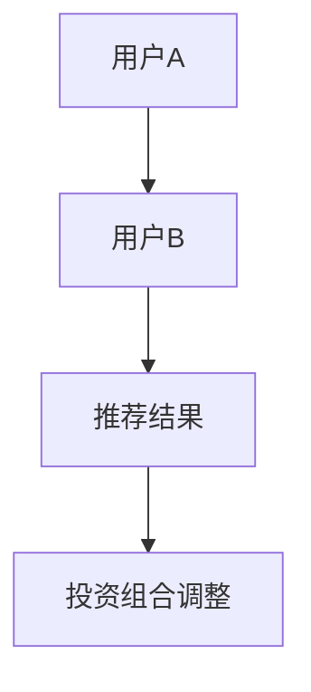
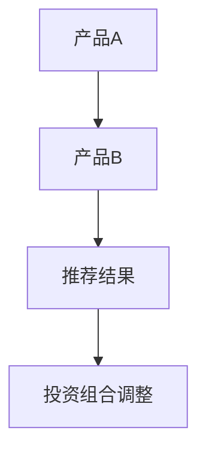
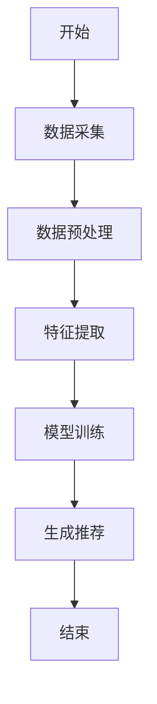
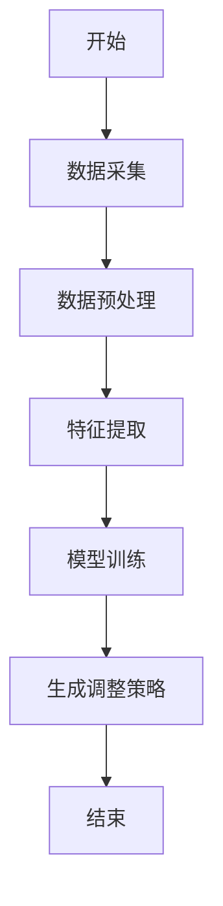
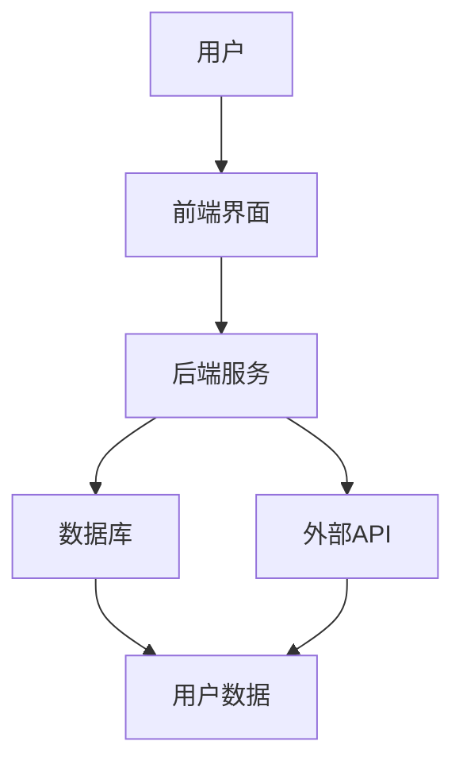
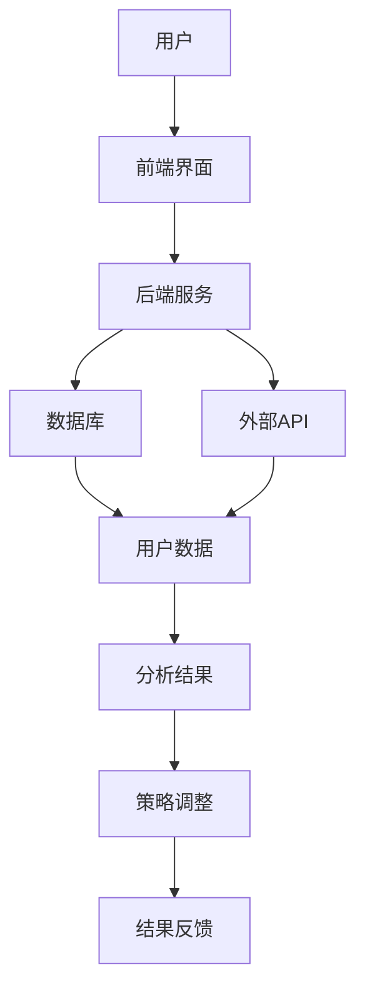

                 


# 构建智能化的个人财富管理策略动态调整助手

> 关键词：智能化财富管理、动态调整、人工智能、机器学习、个人理财

> 摘要：随着人工智能和大数据技术的快速发展，个人财富管理领域正经历着前所未有的变革。传统的静态财富管理策略已难以应对市场波动和个性化需求的变化。本文将探讨如何构建一个智能化的个人财富管理策略动态调整助手，通过机器学习和数据分析，实时优化投资组合和财务管理策略，帮助用户实现财富最大化。本文将从背景与需求、核心概念、算法原理、系统设计到项目实战，全面解析这一智能化助手的构建过程。

---

## 第一章：智能化个人财富管理的背景与需求

### 1.1 智能化财富管理的背景

#### 1.1.1 传统财富管理的局限性
传统的财富管理依赖于人工分析和经验判断，存在以下问题：
- **信息孤岛**：难以整合多渠道数据，导致决策不够全面。
- **效率低下**：人工分析耗时长，难以及时应对市场变化。
- **个性化不足**：难以满足不同用户的个性化需求。

#### 1.1.2 人工智能技术的兴起
人工智能（AI）和大数据技术的快速发展为财富管理带来了新的可能性：
- **数据驱动决策**：通过分析海量数据，提供更精准的投资建议。
- **自动化与智能化**：AI能够实时监控市场变化，自动调整投资策略。
- **个性化服务**：通过用户数据分析，提供定制化的财富管理方案。

#### 1.1.3 数字化转型对财富管理的影响
数字化转型使得财富管理更加便捷和高效：
- **在线平台**：用户可以通过在线平台随时查看资产状况和调整策略。
- **实时反馈**：系统能够实时监控市场变化，提供及时反馈。
- **用户体验优化**：通过数据分析，优化用户体验，提升用户满意度。

### 1.2 财富管理策略动态调整的需求

#### 1.2.1 个人财富管理的核心目标
个人财富管理的核心目标包括：
- **资产保值**：确保资产不贬值。
- **资产增值**：通过投资实现资产增值。
- **风险控制**：降低投资风险，确保资产安全。

#### 1.2.2 策略动态调整的必要性
市场环境和用户需求的变化要求财富管理策略必须动态调整：
- **市场波动**：股市、债市等市场的波动需要及时应对。
- **用户需求变化**：用户的财务状况和风险偏好可能随时间变化。
- **经济周期**：经济周期的变化会影响投资策略的有效性。

#### 1.2.3 用户行为与市场变化的关联性
用户的决策与市场变化密切相关：
- **用户行为分析**：通过分析用户行为，预测市场趋势。
- **市场变化影响**：市场变化会直接影响用户的资产状况和投资决策。

### 1.3 动态调整助手的核心概念

#### 1.3.1 动态调整助手的定义
动态调整助手是指通过人工智能技术，实时分析市场数据和用户需求，动态调整财富管理策略的工具。

#### 1.3.2 动态调整助手的功能模块
动态调整助手的功能模块包括：
- **数据采集模块**：采集市场数据和用户数据。
- **数据分析模块**：分析数据，生成策略建议。
- **策略调整模块**：根据分析结果，动态调整投资策略。
- **用户交互模块**：与用户交互，提供实时反馈。

#### 1.3.3 动态调整助手的实现方式
动态调整助手的实现方式包括：
- **基于规则的调整**：根据预设的规则进行策略调整。
- **基于机器学习的调整**：通过机器学习模型预测市场趋势，动态调整策略。
- **混合调整方式**：结合规则和机器学习的混合方式。

### 1.4 本章小结
本章介绍了智能化个人财富管理的背景，分析了传统财富管理的局限性和人工智能技术的兴起。同时，提出了动态调整助手的核心概念和功能模块，为后续章节的深入分析奠定了基础。

---

## 第二章：智能化财富管理的核心概念

### 2.1 智能化财富管理的关键要素

#### 2.1.1 数据驱动的分析
数据驱动的分析是智能化财富管理的核心要素：
- **数据来源**：包括市场数据、用户数据、宏观经济数据等。
- **数据分析方法**：包括统计分析、机器学习分析等。
- **数据可视化**：通过图表展示数据分析结果，帮助用户理解和决策。

#### 2.1.2 机器学习的应用
机器学习在智能化财富管理中的应用包括：
- **预测模型**：用于预测市场趋势和资产价格。
- **分类模型**：用于分类用户的风险偏好和资产类别。
- **聚类模型**：用于发现用户群体的共性，提供个性化服务。

#### 2.1.3 自然语言处理的作用
自然语言处理在智能化财富管理中的作用包括：
- **文本分析**：分析新闻、报告等文本，提取有用信息。
- **情感分析**：分析市场情绪，辅助投资决策。
- **问答系统**：为用户提供实时的财务咨询。

### 2.2 动态调整策略的实现原理

#### 2.2.1 策略调整的触发条件
策略调整的触发条件包括：
- **市场变化**：如市场指数波动、利率变化等。
- **用户行为变化**：如用户的资产配置调整需求。
- **系统预警**：系统根据预测模型发出预警信号。

#### 2.2.2 数据分析与决策逻辑
数据分析与决策逻辑是动态调整策略的核心：
- **数据分析流程**：采集数据、清洗数据、分析数据、生成策略建议。
- **决策逻辑**：根据数据分析结果，制定具体的调整策略。
- **策略执行**：将调整策略执行到实际投资组合中。

#### 2.2.3 策略优化的数学模型
策略优化的数学模型包括：
- **线性规划模型**：用于优化投资组合的收益和风险。
- **动态规划模型**：用于处理时间序列的优化问题。
- **马尔可夫链模型**：用于预测市场状态的转移概率。

### 2.3 核心概念对比分析

#### 2.3.1 智能化与传统财富管理的对比
| **对比维度** | **传统财富管理** | **智能化财富管理** |
|--------------|------------------|---------------------|
| 数据使用     | 依赖少量数据    | 依赖海量数据       |
| 决策方式     | 依赖人工经验     | 依赖机器学习模型    |
| 调整频率     | 低频             | 高频                |

#### 2.3.2 动态调整与静态策略的对比
| **对比维度** | **静态策略** | **动态策略** |
|--------------|---------------|---------------|
| 策略调整     | 固定           | 动态             |
| 响应速度     | 较慢           | 较快             |
| 适应性       | 较低           | 较高             |

#### 2.3.3 不同技术手段的优劣势对比
| **技术手段**       | **优势**                          | **劣势**                          |
|--------------------|-----------------------------------|-----------------------------------|
| 机器学习           | 高度个性化，适应性强             | 对数据质量和数量要求高             |
| 统计分析           | 方法简单，易于理解               | 结果可能不够精确                   |
| 自然语言处理       | 可以处理非结构化数据             | 对文本语义理解仍有局限性           |

### 2.4 本章小结
本章详细分析了智能化财富管理的核心概念，包括数据驱动分析、机器学习的应用和自然语言处理的作用。同时，对比了动态调整与静态策略的差异，以及不同技术手段的优劣势，为后续章节的算法设计和系统实现提供了理论基础。

---

## 第三章：动态调整助手的算法原理与数学模型

### 3.1 动态调整助手的算法原理

#### 3.1.1 推荐算法的核心原理
推荐算法是动态调整助手的重要组成部分，常见的推荐算法包括协同过滤推荐算法和基于内容的推荐算法。

##### 协同过滤推荐算法
协同过滤推荐算法通过分析用户的相似性，推荐相似用户的喜好。其流程如下：
1. **用户数据采集**：采集用户的历史行为数据。
2. **相似性计算**：计算用户之间的相似性。
3. **推荐生成**：基于相似用户的喜好，生成推荐结果。

流程图如下：


##### 基于内容的推荐算法
基于内容的推荐算法通过分析物品的属性，推荐相似的物品。其流程如下：
1. **物品数据采集**：采集投资产品的属性数据。
2. **特征提取**：提取物品的特征。
3. **推荐生成**：基于物品的特征，生成推荐结果。

流程图如下：


#### 3.1.2 动态调整策略的数学模型
动态调整策略的数学模型包括线性回归模型和时间序列分析模型。

##### 线性回归模型
线性回归模型用于预测资产价格的变化趋势：
$$ y = \beta_0 + \beta_1x + \epsilon $$
其中，$y$是预测的资产价格，$x$是自变量，$\beta_0$和$\beta_1$是回归系数，$\epsilon$是误差项。

##### 时间序列分析模型
时间序列分析模型用于分析资产价格的时间变化特征，常用的模型有ARIMA（自回归积分滑动平均模型）：
$$ ARIMA(p, d, q) $$
其中，$p$是自回归阶数，$d$是差分阶数，$q$是滑动平均阶数。

### 3.2 算法实现的流程图
#### 3.2.1 推荐算法流程图


#### 3.2.2 动态调整模型流程图


### 3.3 本章小结
本章详细介绍了动态调整助手的算法原理，包括推荐算法和动态调整模型。通过流程图和数学公式，展示了算法的具体实现步骤和模型的数学基础。

---

## 第四章：系统分析与架构设计

### 4.1 问题场景介绍
本章将从实际应用场景出发，分析系统的需求和设计。

#### 4.1.1 用户需求分析
用户需求包括：
- **实时监控**：用户希望实时监控资产状况。
- **动态调整**：用户希望系统能够自动调整投资策略。
- **个性化服务**：用户希望获得个性化的投资建议。

#### 4.1.2 系统目标
系统的总体目标是：
- 提供实时的资产监控服务。
- 提供动态的策略调整建议。
- 提供个性化的投资组合优化方案。

### 4.2 系统功能设计

#### 4.2.1 领域模型
领域模型描述了系统的功能模块及其交互关系，如下图所示：


#### 4.2.2 系统架构设计
系统架构设计如下：


#### 4.2.3 系统接口设计
系统接口设计包括：
- **API接口**：用于数据的输入输出。
- **用户交互接口**：用于用户与系统的交互。

#### 4.2.4 系统交互流程
系统交互流程如下：
1. **用户发起请求**：用户通过前端界面发起请求。
2. **数据采集**：系统采集市场数据和用户数据。
3. **数据分析**：系统对数据进行分析，生成策略建议。
4. **策略调整**：系统根据分析结果，动态调整投资策略。
5. **结果反馈**：系统将结果反馈给用户。

流程图如下：


### 4.3 本章小结
本章从实际应用场景出发，分析了系统的功能需求和架构设计。通过领域模型和系统架构图，展示了系统的各个模块及其交互关系，为后续的实现提供了明确的方向。

---

## 第五章：项目实战

### 5.1 环境安装

#### 5.1.1 安装Python
安装Python，推荐使用Python 3.8或更高版本。

#### 5.1.2 安装依赖库
安装以下依赖库：
- `numpy`：用于数值计算。
- `pandas`：用于数据处理。
- `scikit-learn`：用于机器学习。
- `matplotlib`：用于数据可视化。
- `flask`：用于构建Web界面。

安装命令：
```bash
pip install numpy pandas scikit-learn matplotlib flask
```

### 5.2 核心代码实现

#### 5.2.1 数据采集模块
数据采集模块用于采集市场数据和用户数据。

##### 数据采集代码
```python
import pandas as pd
from pandas_datareader import data as pdr
import datetime

# 采集股票数据
start = datetime.datetime(2020, 1, 1)
end = datetime.datetime(2023, 12, 31)
stock_data = pdr.get_dataYahooFinance('AAPL', start, end)
print(stock_data.head())
```

#### 5.2.2 数据分析模块
数据分析模块用于分析数据并生成策略建议。

##### 数据分析代码
```python
from sklearn.model_selection import train_test_split
from sklearn.linear_model import LinearRegression

# 数据预处理
X = stock_data[['open', 'high', 'low', 'volume']]
y = stock_data['close']
X_train, X_test, y_train, y_test = train_test_split(X, y, test_size=0.2, random_state=42)

# 训练线性回归模型
model = LinearRegression()
model.fit(X_train, y_train)
print('训练完成')
```

#### 5.2.3 策略调整模块
策略调整模块用于根据分析结果调整投资策略。

##### 策略调整代码
```python
import numpy as np

# 预测股票价格
predicted_prices = model.predict(X_test)
print('预测价格：', predicted_prices[:5])
print('实际价格：', y_test[:5])

# 计算均方误差
mse = np.mean((predicted_prices - y_test) ** 2)
print('均方误差：', mse)
```

#### 5.2.4 用户交互模块
用户交互模块用于与用户交互并提供实时反馈。

##### 用户交互代码
```python
from flask import Flask, request, jsonify

app = Flask(__name__)

@app.route('/api/adjust_strategy', methods=['POST'])
def adjust_strategy():
    data = request.json
    # 根据数据调整策略
    # 返回调整结果
    return jsonify({'status': 'success', 'message': '策略调整成功'})

if __name__ == '__main__':
    app.run(debug=True)
```

### 5.3 代码应用解读与分析
通过上述代码，我们可以实现一个简单的动态调整助手。数据采集模块从Yahoo Finance获取股票数据，数据分析模块使用线性回归模型进行预测，策略调整模块根据预测结果调整投资策略，用户交互模块提供API接口供用户调用。

### 5.4 实际案例分析
以苹果公司股票为例，通过上述代码进行预测和调整。

#### 5.4.1 数据采集与预处理
```python
import pandas as pd
from pandas_datareader import data as pdr
import datetime

start = datetime.datetime(2020, 1, 1)
end = datetime.datetime(2023, 12, 31)
stock_data = pdr.get_dataYahooFinance('AAPL', start, end)
print(stock_data.head())
```

#### 5.4.2 模型训练与预测
```python
from sklearn.model_selection import train_test_split
from sklearn.linear_model import LinearRegression

X = stock_data[['open', 'high', 'low', 'volume']]
y = stock_data['close']
X_train, X_test, y_train, y_test = train_test_split(X, y, test_size=0.2, random_state=42)

model = LinearRegression()
model.fit(X_train, y_train)
print('训练完成')
```

#### 5.4.3 策略调整与反馈
```python
import numpy as np

predicted_prices = model.predict(X_test)
print('预测价格：', predicted_prices[:5])
print('实际价格：', y_test[:5])

mse = np.mean((predicted_prices - y_test) ** 2)
print('均方误差：', mse)
```

### 5.5 项目小结
本章通过实际案例展示了如何构建一个动态调整助手。通过数据采集、数据分析、策略调整和用户交互四个模块的实现，详细介绍了系统的实现过程。

---

## 第六章：总结与展望

### 6.1 最佳实践 tips
- **数据质量**：确保数据的准确性和完整性。
- **模型优化**：根据实际需求不断优化机器学习模型。
- **用户体验**：注重用户交互设计，提升用户体验。

### 6.2 小结
本文详细介绍了如何构建一个智能化的个人财富管理策略动态调整助手。通过分析智能化财富管理的背景与需求，探讨了核心概念与技术，详细讲解了算法原理与数学模型，设计了系统的架构，并通过实际案例展示了项目的实现过程。

### 6.3 注意事项
- **数据隐私**：注意保护用户数据隐私，确保数据安全。
- **模型解释性**：确保模型的解释性，便于用户理解和信任。
- **系统稳定性**：确保系统的稳定运行，避免因系统故障导致损失。

### 6.4 拓展阅读
- **相关书籍**：《Python机器学习实战》、《大数据分析与应用》。
- **技术博客**：关注技术博客，获取最新的技术动态。
- **在线课程**：参加在线课程，提升技术能力。

---

# 结语
随着人工智能和大数据技术的不断发展，智能化个人财富管理策略动态调整助手将变得更加重要。通过本文的讲解，读者可以深入了解这一领域的核心技术与实现方法。未来，随着技术的进一步发展，动态调整助手将更加智能化和个性化，为用户提供更优质的财富管理服务。

