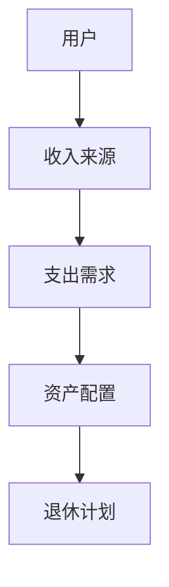
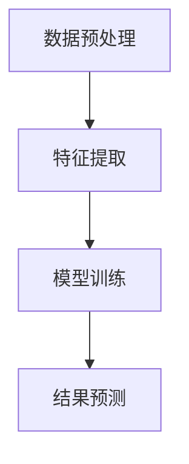
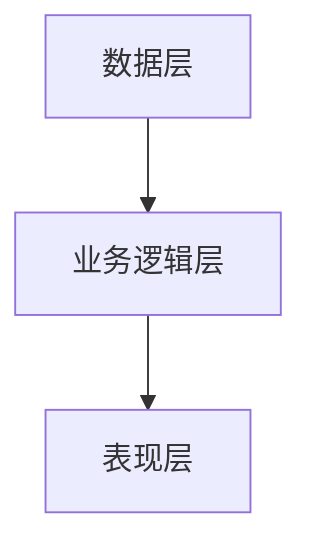

                 


# 《构建智能化的个人退休收入规划工具》

> 关键词：智能化退休规划工具、机器学习、人工智能、数据分析、系统架构设计

> 摘要：本文系统地探讨了如何利用人工智能和大数据技术构建智能化的个人退休收入规划工具。从核心概念分析到算法原理，再到系统架构设计和项目实战，本文为读者提供了从理论到实践的完整指南。通过分析退休规划的关键要素，结合机器学习算法和系统设计方法，本文提出了一个高效的解决方案，帮助个人实现精准的退休收入规划。

---

## 第一部分: 引言

## 第1章: 退休收入规划的重要性

### 1.1 退休规划的背景与意义

#### 1.1.1 人口老龄化与退休规划的挑战
随着全球人口老龄化的加剧，退休规划的重要性日益凸显。传统的人工规划方式效率低下，难以应对复杂多变的经济环境。智能化退休规划工具的出现，为解决这一问题提供了新的可能性。

#### 1.1.2 退休收入规划的核心目标
退休收入规划的目标是确保个人在退休后能够维持一定的生活水平。这需要综合考虑收入来源、支出需求和资产配置等多个因素。

#### 1.1.3 智能化规划的必要性
智能化工具可以通过大数据分析和机器学习算法，帮助用户更精准地预测未来的收入和支出，优化资产配置，从而实现更科学的退休规划。

### 1.2 当前退休规划工具的现状

#### 1.2.1 传统退休规划工具的局限性
传统工具通常依赖人工计算，缺乏动态调整能力，难以应对市场变化和个体需求的多样性。

#### 1.2.2 智能化工具的优势
智能化工具能够实时分析市场数据，利用机器学习算法动态调整规划方案，提供个性化的建议。

#### 1.2.3 用户需求与市场痛点
用户希望退休规划工具能够简单易用、实时更新，并提供个性化的建议。当前市场上的工具大多功能单一，难以满足这些需求。

### 1.3 本书的目标与结构

#### 1.3.1 本书的核心目标
通过技术手段，构建一个智能化的个人退休收入规划工具，帮助用户实现精准的退休规划。

#### 1.3.2 本书的章节安排
- 第一部分：引言
- 第二部分：核心概念与联系
- 第三部分：算法原理与数学模型
- 第四部分：系统分析与架构设计
- 第五部分：项目实战
- 第六部分：总结与展望

#### 1.3.3 读者对象与学习方法
本书适合对人工智能和大数据技术感兴趣的读者，以及对退休规划有需求的个人和家庭。建议读者在阅读时结合实际案例进行思考，逐步掌握工具的构建方法。

---

## 第二部分: 核心概念与联系

## 第2章: 个人退休收入规划的核心要素

### 2.1 退休收入规划的基本概念

#### 2.1.1 收入来源分析
收入来源包括工资、投资收益、社会保障等。不同来源的收入具有不同的风险和稳定性。

#### 2.1.2 支出需求预测
支出需求包括生活开支、医疗费用等。准确预测支出需求是制定退休规划的关键。

#### 2.1.3 资产配置策略
资产配置策略需要根据风险承受能力和市场环境进行动态调整。

### 2.2 关键因素对比分析

#### 2.2.1 不同收入来源的特征对比

| 收入来源 | 稳定性 | 风险性 | 收益性 |
|----------|--------|--------|--------|
| 工资     | 高     | 低     | 中     |
| 投资收益 | 中     | 高     | 高     |
| 社会保障 | 中     | 低     | 中     |

#### 2.2.2 支出需求的层次化分析
支出需求可以分为基本生活支出和可选支出。基本生活支出是刚性需求，需要优先满足。

#### 2.2.3 资产配置的多样性与风险性
资产配置需要在风险和收益之间找到平衡点，通常采用多元化配置策略。

### 2.3 核心概念的ER实体关系图



---

## 第三部分: 算法原理与数学模型

## 第3章: 基于机器学习的退休规划算法

### 3.1 数据分析与特征提取

#### 3.1.1 数据预处理
- 数据清洗：处理缺失值和异常值。
- 数据标准化：将不同量纲的数据统一处理。

#### 3.1.2 特征提取
- 选择对退休规划影响较大的特征，如收入、支出、资产等。

### 3.2 机器学习算法的选择与实现

#### 3.2.1 线性回归模型
线性回归模型用于预测退休后的收入和支出。

$$ y = \beta_0 + \beta_1 x_1 + \beta_2 x_2 + ... + \beta_n x_n $$

其中，$y$ 是预测值，$x_i$ 是特征变量，$\beta_i$ 是回归系数。

#### 3.2.2 遗传算法
遗传算法用于优化资产配置方案。

### 3.3 算法实现的步骤

#### 3.3.1 数据预处理
```python
import pandas as pd
from sklearn.preprocessing import StandardScaler

# 加载数据
data = pd.read_csv('retirement.csv')

# 删除缺失值
data = data.dropna()

# 标准化处理
scaler = StandardScaler()
data_scaled = scaler.fit_transform(data)
```

#### 3.3.2 模型训练
```python
from sklearn.linear_model import LinearRegression

# 训练线性回归模型
model = LinearRegression()
model.fit(data_scaled, target)
```

### 3.4 算法流程图



---

## 第四部分: 系统分析与架构设计

## 第4章: 系统设计与实现

### 4.1 系统功能设计

#### 4.1.1 功能模块划分
- 数据采集模块：收集用户数据。
- 数据处理模块：对数据进行预处理。
- 模型训练模块：训练机器学习模型。
- 用户界面模块：展示规划结果。

#### 4.1.2 领域模型


### 4.2 系统架构设计

#### 4.2.1 分层架构
系统采用分层架构，包括数据层、业务逻辑层和表现层。

#### 4.2.2 系统架构图


---

## 第五部分: 项目实战

## 第5章: 项目实现与案例分析

### 5.1 项目环境安装

#### 5.1.1 安装Python
```bash
python --version
pip install --upgrade pip
```

#### 5.1.2 安装依赖库
```bash
pip install pandas numpy scikit-learn
```

### 5.2 核心代码实现

#### 5.2.1 数据处理
```python
import pandas as pd
import numpy as np
from sklearn.linear_model import LinearRegression

# 加载数据
data = pd.read_csv('retirement.csv')

# 数据清洗
data = data.dropna()

# 特征提取
X = data[['收入', '支出', '资产']]
y = data['退休收入']
```

#### 5.2.2 模型训练
```python
model = LinearRegression()
model.fit(X, y)
print('模型系数:', model.coef_)
print('模型截距:', model.intercept_)
```

### 5.3 实际案例分析

#### 5.3.1 案例背景
假设一个用户的收入为5000元，支出为3000元，资产为100000元。

#### 5.3.2 模型预测
```python
预测收入 = model.predict([[5000, 3000, 100000]])
print('预测退休收入:', 预测收入)
```

---

## 第六部分: 总结与展望

## 第6章: 总结与展望

### 6.1 本书的核心内容回顾
通过机器学习和系统设计，构建了一个智能化的个人退休收入规划工具。

### 6.2 未来展望
未来可以进一步优化算法，引入更多数据源，提升规划的准确性。

### 6.3 最佳实践 tips
- 定期更新数据，保持模型的准确性。
- 根据市场变化，动态调整资产配置。

---

## 附录

## 附录A: 参考文献

## 附录B: 项目代码

---

以上是《构建智能化的个人退休收入规划工具》的完整目录大纲和文章内容。希望对您有所帮助！

