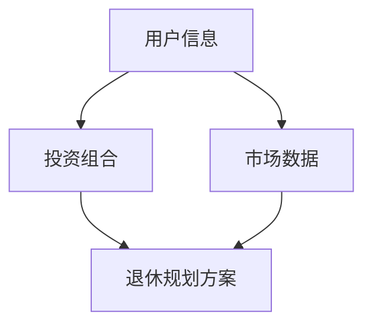
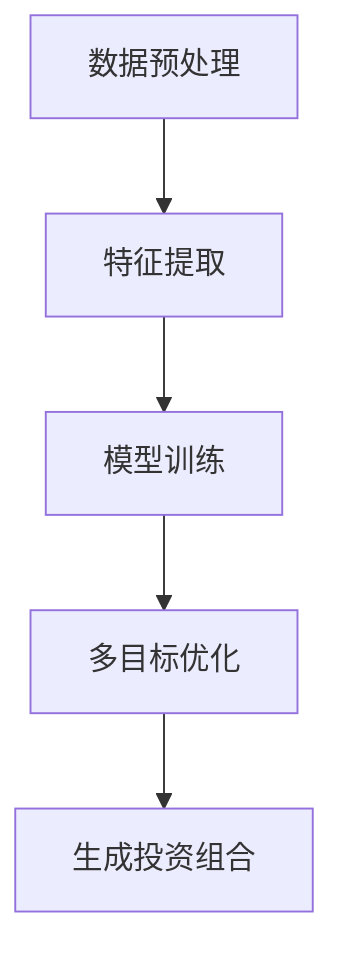
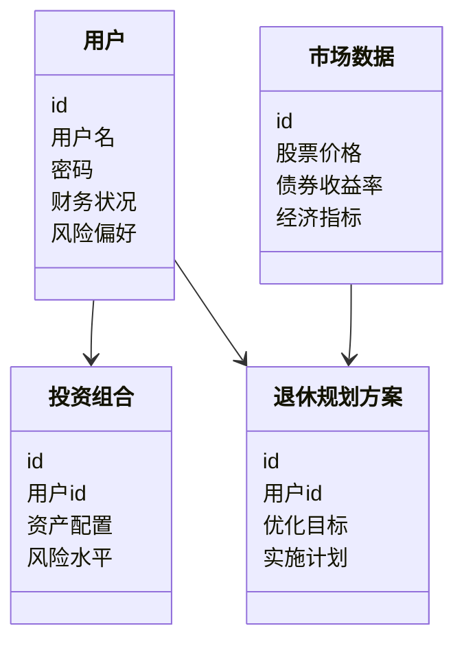
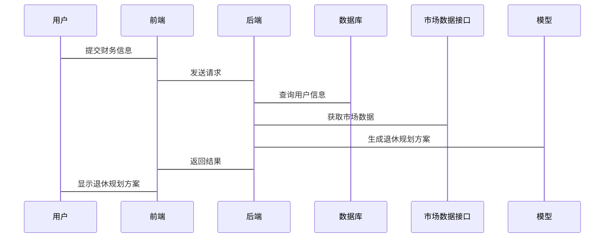

                 


# 构建智能化的个人退休规划优化助手

## 关键词：
- 退休规划
- 人工智能
- 多目标优化
- 数据驱动
- 智能助手

## 摘要：
随着人口老龄化加剧，个人退休规划变得日益重要。传统的退休规划方法依赖于繁琐的手动计算和简单的规则模型，难以应对复杂多变的金融市场和个人需求的变化。本篇文章详细探讨了如何利用人工智能技术构建智能化的个人退休规划优化助手，通过数据驱动的方法，结合多目标优化算法，为用户提供个性化的退休规划方案。文章从背景介绍、核心概念、算法原理、系统架构设计、项目实战到最佳实践，全面解析了构建智能化退休规划优化助手的各个关键环节，帮助读者系统地理解和掌握相关技术。

---

# 第一部分: 背景介绍与核心概念

## 第1章: 个人退休规划的背景与挑战

### 1.1 问题背景
#### 1.1.1 退休规划的重要性
退休规划是确保个人在退休后能够维持一定生活水平的重要财务安排。随着人口老龄化加剧，退休规划的复杂性和重要性日益凸显。传统的退休规划方法依赖于固定的利率假设和简单的资产配置策略，难以应对实际市场波动和个性化需求的变化。

#### 1.1.2 传统退休规划的局限性
- 传统方法通常基于固定假设（如固定退休年龄、固定投资回报率），缺乏灵活性。
- 无法实时跟踪和调整投资组合，难以应对市场变化。
- 无法满足用户的个性化需求（如风险承受能力、消费习惯差异）。

#### 1.1.3 智能化退休规划的优势
- 利用大数据和人工智能技术，可以实时分析市场数据和个人财务状况。
- 通过多目标优化算法，能够为用户提供个性化的退休规划方案。
- 能够动态调整投资组合，适应市场变化和个人需求的变化。

### 1.2 问题描述
#### 1.2.1 退休资金管理的核心问题
退休规划的核心问题是如何在有限的时间内，通过合理的资产配置和投资策略，最大化退休后的财务安全和生活质量。

#### 1.2.2 用户需求与期望
用户期望退休规划助手能够：
- 提供个性化的退休规划方案。
- 实时跟踪和调整投资组合。
- 提供风险评估和资产配置建议。
- 具备良好的用户体验和交互界面。

#### 1.2.3 现有解决方案的不足
- 现有解决方案通常基于固定的假设和简单的模型，缺乏个性化和动态调整能力。
- 缺乏对市场波动和用户需求变化的实时响应能力。
- 信息更新不及时，难以满足用户对实时反馈的需求。

### 1.3 问题解决思路
#### 1.3.1 数据驱动的退休规划
通过收集和分析用户的财务数据、市场数据等，利用数据驱动的方法进行退休规划。

#### 1.3.2 人工智能在退休规划中的应用
利用机器学习算法对市场数据和用户数据进行分析，提供个性化的投资建议和风险评估。

#### 1.3.3 多目标优化的实现路径
通过多目标优化算法，在多个目标（如资产安全性、收益最大化、风险最小化）之间找到最佳平衡点。

### 1.4 边界与外延
#### 1.4.1 退休规划的边界条件
- 退休年龄范围：通常在50-65岁之间。
- 资产范围：包括存款、股票、债券、房地产等。
- 时间范围：从当前年龄到退休后的预期寿命。

#### 1.4.2 相关领域的外延
- 金融市场：股票、债券、基金等。
- 税收政策：不同国家和地区的税收政策差异。
- 通货膨胀：对退休规划的影响。

#### 1.4.3 与其它系统的接口
- 金融市场数据接口：实时获取股票、债券等市场价格数据。
- 用户信息管理系统：获取用户的财务状况和偏好。
- 报告生成系统：生成个性化的退休规划报告。

### 1.5 核心要素与概念结构
#### 1.5.1 核心概念的定义
- 用户信息：用户的财务状况、风险偏好、消费习惯等。
- 市场数据：股票、债券等市场价格数据和经济指标。
- 投资组合：用户持有的各种资产的组合。
- 退休规划方案：基于用户需求和市场数据制定的优化方案。

#### 1.5.2 概念之间的关系
用户信息和市场数据是输入，投资组合是输出，退休规划方案是对投资组合的优化结果。

#### 1.5.3 概念结构图


## 第2章: 核心概念与联系

### 2.1 核心概念原理
#### 2.1.1 数据驱动的退休规划
数据驱动的退休规划通过收集和分析用户的财务数据和市场数据，利用数据挖掘和机器学习技术，为用户提供个性化的退休规划方案。

#### 2.1.2 人工智能在退休规划中的应用
人工智能技术（如机器学习、深度学习）在退休规划中的应用主要体现在市场预测、风险评估、投资组合优化等方面。

#### 2.1.3 多目标优化的实现原理
多目标优化算法通过在多个目标（如资产安全性、收益最大化、风险最小化）之间找到最佳平衡点，提供最优的退休规划方案。

### 2.2 概念属性特征对比表
表2.1 核心概念属性对比

| 概念         | 属性               | 特征描述                         |
|--------------|--------------------|----------------------------------|
| 用户信息     | 财务状况           | 包括收入、资产、负债等           |
|              | 风险偏好           | 风险厌恶型、中性、风险偏好型     |
| 市场数据     | 股票价格           | 实时市场价格数据                 |
|              | 债券收益率           | 债券的收益率数据                 |
| 投资组合     | 资产配置           | 不同资产的分配比例               |
|              | 风险水平           | 投资组合的风险评估               |
| 退休规划方案 | 优化目标           | 包括资产安全性、收益最大化、风险最小化 |
|              | 实施计划           | 包括投资策略、资产调整建议       |

### 2.3 ER实体关系图
```mermaid
erd
    entity 用户 {
        id
        用户名
        密码
        财务状况
        风险偏好
    }

    entity 市场数据 {
        id
        股票价格
        债券收益率
        经济指标
    }

    entity 投资组合 {
        id
        用户id
        资产配置
        风险水平
    }

    entity 退休规划方案 {
        id
        用户id
        优化目标
        实施计划
    }

    用户 - 一对一 - 投资组合
    用户 - 一对一 - 退休规划方案
    市场数据 - 多对多 - 退休规划方案
```

---

# 第二部分: 算法原理讲解

## 第3章: 算法原理与数学模型

### 3.1 算法原理
#### 3.1.1 算法概述
退休规划优化助手采用基于机器学习的多目标优化算法，结合历史市场数据和用户财务数据，生成个性化的退休规划方案。

#### 3.1.2 算法流程
1. 数据预处理：清洗和标准化用户数据和市场数据。
2. 特征提取：提取影响退休规划的关键特征（如年龄、收入、资产、风险偏好）。
3. 模型训练：利用机器学习算法（如随机森林、支持向量机）训练分类或回归模型。
4. 多目标优化：基于训练好的模型，进行多目标优化，生成最优投资组合。

### 3.2 算法流程图


### 3.3 数学模型
#### 3.3.1 资产配置模型
$$ w_i = \frac{r_i - r_f}{\sum_{j=1}^{n} (r_j - r_f)} $$
其中，\( w_i \) 表示第 \( i \) 种资产的配置权重，\( r_i \) 表示第 \( i \) 种资产的预期收益率，\( r_f \) 表示无风险利率。

#### 3.3.2 风险评估模型
$$ \text{VaR}(p) = \text{quantile}(p) $$
其中，\( p \) 表示分位数概率，用于评估投资组合在不同风险水平下的潜在损失。

#### 3.3.3 投资组合优化模型
$$ \min_{w} \sum_{i=1}^{n} w_i^2 \cdot \text{Var}(r_i) $$
$$ \text{s.t.} \quad \sum_{i=1}^{n} w_i = 1 $$
$$ \quad \quad \sum_{i=1}^{n} w_i \cdot r_i = \text{目标收益} $$

### 3.4 算法实现步骤
#### 3.4.1 数据预处理
1. 数据清洗：去除缺失值和异常值。
2. 数据标准化：对数据进行标准化处理，确保不同特征具有相同的量纲。

#### 3.4.2 特征提取
1. 提取关键特征：如年龄、收入、资产、风险偏好等。
2. 维度降维：使用主成分分析（PCA）对特征进行降维。

#### 3.4.3 模型训练
1. 选择模型：如随机森林、支持向量机等。
2. 训练模型：利用训练数据训练模型，得到模型参数。

#### 3.4.4 多目标优化
1. 确定优化目标：如资产安全性、收益最大化、风险最小化。
2. 确定约束条件：如投资比例限制、风险承受能力等。
3. 优化算法：使用遗传算法、粒子群优化等方法进行多目标优化。

### 3.5 算法代码示例
```python
import numpy as np
from sklearn.ensemble import RandomForestRegressor
from sklearn.metrics import mean_squared_error

# 数据预处理
data = pd.read_csv('retire_data.csv')
data = data.dropna().reset_index(drop=True)
data = (data - data.mean()) / data.std()

# 特征提取
features = ['age', 'income', 'assets', 'risk_preference']
target = 'target'

# 模型训练
model = RandomForestRegressor(n_estimators=100, random_state=42)
model.fit(data[features], data[target])

# 多目标优化
from sklearn.multioutput import MultiOutputRegressor
import numpy as np

regr = MultiOutputRegressor(RandomForestRegressor(n_estimators=100, random_state=42))
regr.fit(data[features], data[target])

# 生成投资组合
X_new = pd.DataFrame({
    'age': [50],
    'income': [50000],
    'assets': [200000],
    'risk_preference': [0.5]
})
y_pred = regr.predict(X_new)
```

### 3.6 代码解读与分析
1. 数据预处理：读取数据并进行标准化处理，去除缺失值和异常值。
2. 特征提取：提取关键特征（如年龄、收入、资产、风险偏好）。
3. 模型训练：使用随机森林回归模型进行训练。
4. 多目标优化：使用多输出回归模型进行预测，生成最优投资组合。

---

# 第三部分: 系统分析与架构设计

## 第4章: 系统分析与架构设计

### 4.1 问题场景介绍
退休规划优化助手需要满足以下需求：
- 实时获取市场数据。
- 支持用户输入财务信息。
- 提供个性化的退休规划方案。
- 提供动态调整的投资组合建议。

### 4.2 系统功能设计
#### 4.2.1 领域模型


#### 4.2.2 系统架构设计


### 4.3 系统架构设计
系统架构分为数据层、业务逻辑层和用户界面层：
1. 数据层：存储用户信息、市场数据、投资组合和退休规划方案。
2. 业务逻辑层：处理用户请求，调用优化模型生成退休规划方案。
3. 用户界面层：展示用户信息、市场数据和优化结果。

### 4.4 系统接口设计
1. 用户信息接口：用于获取和更新用户信息。
2. 市场数据接口：用于获取实时市场数据。
3. 投资组合接口：用于获取和更新投资组合。
4. 退休规划方案接口：用于获取和更新退休规划方案。

### 4.5 系统交互序列图


---

# 第四部分: 项目实战

## 第5章: 项目实战

### 5.1 环境安装与配置
1. 安装Python和必要的库：
   ```bash
   pip install pandas numpy scikit-learn
   ```
2. 安装Jupyter Notebook用于数据分析和建模。

### 5.2 系统核心实现
#### 5.2.1 数据预处理
```python
import pandas as pd
import numpy as np

# 数据加载与清洗
data = pd.read_csv('retire_data.csv')
data = data.dropna().reset_index(drop=True)

# 数据标准化
data = (data - data.mean()) / data.std()
```

#### 5.2.2 特征提取与模型训练
```python
from sklearn.ensemble import RandomForestRegressor

features = ['age', 'income', 'assets', 'risk_preference']
target = 'target'

model = RandomForestRegressor(n_estimators=100, random_state=42)
model.fit(data[features], data[target])
```

#### 5.2.3 多目标优化
```python
from sklearn.multioutput import MultiOutputRegressor

regr = MultiOutputRegressor(RandomForestRegressor(n_estimators=100, random_state=42))
regr.fit(data[features], data[target])
```

#### 5.2.4 生成投资组合
```python
X_new = pd.DataFrame({
    'age': [50],
    'income': [50000],
    'assets': [200000],
    'risk_preference': [0.5]
})
y_pred = regr.predict(X_new)
```

### 5.3 代码应用解读与分析
1. 数据预处理：清洗和标准化数据，确保模型输入数据的质量。
2. 模型训练：使用随机森林回归模型训练模型，提取关键特征。
3. 多目标优化：使用多输出回归模型生成最优投资组合。
4. 投资组合生成：根据用户输入的特征，预测最优投资组合。

### 5.4 实际案例分析
1. 案例背景：用户年龄50岁，年收入50000元，资产200000元，风险偏好中性。
2. 投资组合生成：根据模型预测，生成最优投资组合。
3. 结果分析：分析投资组合的预期收益和风险水平。

### 5.5 项目小结
通过本项目的实战，我们可以看到智能化的退休规划优化助手能够为用户提供个性化的投资建议，帮助用户在退休后维持较高的生活质量。

---

# 第五部分: 最佳实践

## 第6章: 最佳实践

### 6.1 小结
智能化的退休规划优化助手通过数据驱动和人工智能技术，能够为用户提供个性化的退休规划方案，帮助用户实现财务自由。

### 6.2 注意事项
1. 数据隐私保护：确保用户数据的安全性和隐私性。
2. 模型维护：定期更新模型参数和市场数据，保证模型的准确性。
3. 用户教育：向用户解释模型的假设和限制，避免用户误解。

### 6.3 拓展阅读
1. 《Python机器学习实战》
2. 《深度学习入门：基于Python》
3. 《算法导论》

---

# 结语
通过本文的详细讲解，我们了解了如何利用人工智能技术构建智能化的个人退休规划优化助手。从背景介绍到项目实战，我们系统地探讨了构建这一系统的各个关键环节。希望本文能够为读者提供有价值的参考和启发，帮助他们更好地理解和掌握相关技术。

