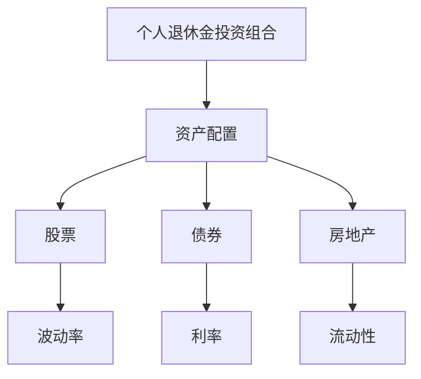
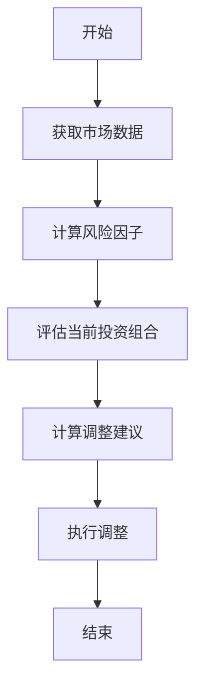
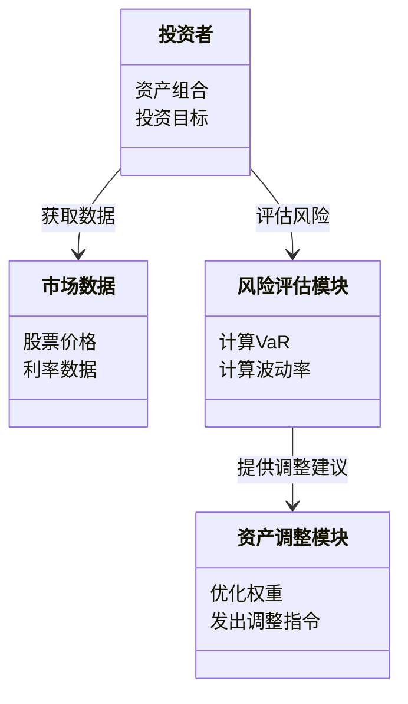
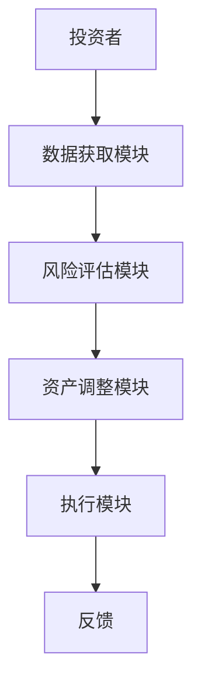
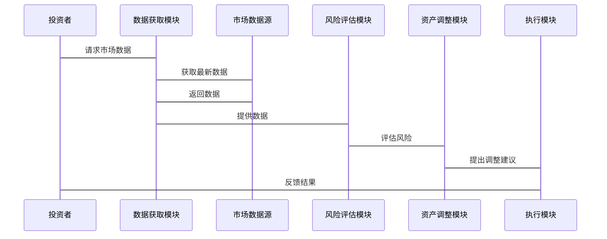

                 


# 构建智能化的个人退休金投资组合动态风险管理助手

> 关键词：退休金投资组合、动态风险管理、智能化投资助手、风险管理模型、资产配置优化、金融数据分析

> 摘要：本文详细探讨了如何构建一个智能化的个人退休金投资组合动态风险管理助手。通过分析退休金投资的背景与挑战，阐述了动态风险管理的核心概念与算法原理，结合系统架构设计与项目实战，展示了如何利用技术手段优化投资组合，降低风险，实现稳健的财务目标。

---

# 第一部分: 背景与核心概念

## 第1章: 问题背景与核心概念

### 1.1 问题背景

#### 1.1.1 退休金投资的重要性
退休金是许多人晚年生活的重要经济来源，投资退休金不仅可以增加收益，还能应对通货膨胀和生活开支的增加。然而，投资市场存在不确定性，如市场波动、经济周期变化等，这使得退休金投资面临较大的风险。

#### 1.1.2 当前退休金投资面临的挑战
- **市场波动风险**：股市、债市等波动可能导致投资组合的价值下降。
- **通货膨胀风险**：通胀会侵蚀投资收益的实际购买力。
- **长寿风险**：寿命延长可能导致退休金不足以支撑长期开支。
- **政策风险**：政府政策的变化可能影响退休金的投资方式和收益。

#### 1.1.3 智能化风险管理的必要性
传统的人工投资和风险管理方式效率低下，且难以应对复杂多变的市场环境。智能化风险管理助手可以通过实时数据分析、算法优化和自动化调整，帮助投资者在不同市场条件下做出最优决策。

### 1.2 核心概念

#### 1.2.1 个人退休金投资组合的定义
个人退休金投资组合是指将退休金分配到多种资产（如股票、债券、房地产等）中，以实现收益最大化和风险最小化的投资策略。

#### 1.2.2 动态风险管理的内涵
动态风险管理是指根据市场环境的变化，实时调整投资组合的资产配置，以规避或降低潜在风险。

#### 1.2.3 边界与外延
- **边界**：仅考虑市场波动、资产回报率和通货膨胀等可量化的因素，不涉及政策变化等不可控因素。
- **外延**：动态风险管理可以与其他投资策略结合，如定投策略、税收优化等。

### 1.3 概念结构与核心要素

#### 1.3.1 核心要素组成
- **资产配置**：不同资产的权重分配。
- **风险因子**：影响资产收益和风险的因素，如波动率、市场流动性等。
- **风险管理规则**：根据风险因子调整资产配置的策略。

#### 1.3.2 概念结构图


---

## 第2章: 核心概念与联系

### 2.1 风险管理的核心原理

#### 2.1.1 风险的定义与分类
- **风险**：资产收益的不确定性，可能带来损失或收益低于预期。
- **分类**：市场风险、流动性风险、信用风险等。

#### 2.1.2 风险管理的基本原则
- **分散化**：通过投资多种资产降低特定风险。
- **风险与收益匹配**：高风险资产可能带来高收益，但也需要承担更大的风险。
- **动态调整**：根据市场变化及时调整投资策略。

#### 2.1.3 动态风险管理的特征
- **实时性**：根据最新市场数据进行调整。
- **数据驱动**：基于量化分析做出决策。
- **自动化**：通过算法实现自动化的风险管理。

### 2.2 投资组合优化的原理

#### 2.2.1 现代投资组合理论
- **均值-方差模型**：通过优化资产的期望收益和方差，找到最优资产配置。
- **有效前沿**：表示在给定风险水平下收益最高的投资组合。

#### 2.2.2 风险调整后的收益最大化
- 在考虑风险的情况下，找到收益最大的投资组合。

#### 2.2.3 组合优化的数学模型
$$
\text{目标函数：} \min_w \sigma^2 \\
\text{约束条件：} \sum_{i=1}^n w_i = 1, \quad w_i \geq 0
$$

### 2.3 核心概念对比分析

#### 2.3.1 风险管理与投资组合优化的对比
| 特性       | 风险管理       | 投资组合优化       |
|------------|---------------|-------------------|
| 目标       | 减少损失       | 提高收益           |
| 方法       | 控制风险因子   | 优化资产配置       |
| 输入       | 市场数据、风险因子 | 资产回报率、协方差矩阵 |

#### 2.3.2 动态调整与静态优化的差异
- **动态调整**：实时根据市场变化进行调整。
- **静态优化**：基于历史数据进行一次性优化。

---

# 第二部分: 算法原理讲解

## 第3章: 算法原理

### 3.1 现代投资组合理论

#### 3.1.1 均值-方差模型
$$
\text{目标函数：} \min_w \sigma^2 \\
\text{约束条件：} \sum_{i=1}^n w_i = 1, \quad w_i \geq 0
$$

#### 3.1.2 资本资产定价模型(CAPM)
$$
E(R_i) = R_f + \beta_i (R_m - R_f)
$$
其中，$R_f$ 是无风险利率，$R_m$ 是市场平均收益，$\beta_i$ 是资产的贝塔系数。

#### 3.1.3 风险调整后的收益计算
通过引入风险溢价调整资产的预期收益。

### 3.2 动态风险管理算法

#### 3.2.1 风险因子分析
- **波动率**：资产收益的波动程度。
- **VaR（在险价值）**：在一定置信水平下可能的最大损失。

#### 3.2.2 动态资产调整策略
- 根据当前市场环境调整资产配置权重。

#### 3.2.3 算法流程


---

## 第4章: 优化算法实现

### 4.1 优化算法选择

#### 4.1.1 简单随机搜索
- **描述**：随机生成候选解，选择最优解。
- **代码示例**：
```python
import numpy as np

def simple_random_search():
    for _ in range(1000):
        w = np.random.random(5)
        w = w / np.sum(w)
        yield w
```

#### 4.1.2 均值-方差优化
- **描述**：基于均值-方差模型优化投资组合。
- **代码示例**：
```python
import numpy as np
from scipy.optimize import minimize

def optimize_portfolio(returns):
    n = len(returns.columns)
    def objective(weights):
        cov = returns.cov().values
        return np.dot(weights.T, np.dot(cov, weights))
    cons = [{'type': 'eq', 'fun': lambda w: sum(w) - 1}]
    bounds = [(0, 1) for _ in range(n)]
    result = minimize(objective, np.ones(n)/n, method='SLSQP', bounds=bounds, constraints=cons)
    return result.x
```

#### 4.1.3 风险平价法
- **描述**：使每种资产的风险贡献相等。
- **代码示例**：
```python
def risk_parity(returns):
    n = len(returns.columns)
    def objective(weights):
        sigma = np.diag(np.sqrt(weights.T @ returns.cov() @ weights))
        return np.sum((sigma - np.mean(sigma))**2)
    cons = [{'type': 'eq', 'fun': lambda w: sum(w) - 1}]
    bounds = [(0, 1) for _ in range(n)]
    result = minimize(objective, np.ones(n)/n, method='SLSQP', bounds=bounds, constraints=cons)
    return result.x
```

### 4.2 动态调整策略

#### 4.2.1 市场状态识别
- **趋势识别**：通过技术指标（如MA、MACD）识别市场趋势。

#### 4.2.2 动态再平衡
- **定期调整**：每隔一段时间重新优化投资组合。

---

## 第5章: 算法实现与代码示例

### 5.1 环境安装

#### 5.1.1 安装必要的Python库
- **numpy**
- **pandas**
- **scipy**
- **matplotlib**

### 5.2 核心代码实现

#### 5.2.1 数据预处理
```python
import pandas as pd

def load_data(tickers):
    df = pd.DataFrame()
    for ticker in tickers:
        data = pd.read_csv(f'data/{ticker}.csv')
        df[ticker] = data['Close']
    return df
```

#### 5.2.2 风险评估
```python
import numpy as np

def calculate_v VaR(returns, confidence_level=0.95):
    sorted_returns = sorted(returns)
    index = int(len(sorted_returns) * (1 - confidence_level))
    return -sorted_returns[index]
```

#### 5.2.3 动态调整
```python
import time

def dynamic_adjustment(weights, current_returns, target_returns):
    while True:
        time.sleep(24 * 3600)  # 每天调整一次
        new_weights = optimize_portfolio(current_returns)
        print(f"New weights: {new_weights}")
```

### 5.3 代码应用解读

#### 5.3.1 数据预处理
加载并整理历史价格数据，计算收益率。

#### 5.3.2 风险评估
计算投资组合的VaR，评估潜在损失。

#### 5.3.3 动态调整
根据市场变化，定期优化投资组合权重。

---

## 第6章: 系统设计与架构

### 6.1 系统分析

#### 6.1.1 问题场景介绍
- 投资者希望通过智能化助手优化退休金投资组合，降低风险。

#### 6.1.2 项目介绍
- 开发一个实时监控和调整投资组合的系统。

### 6.2 系统功能设计

#### 6.2.1 领域模型


#### 6.2.2 系统架构设计


#### 6.2.3 接口设计
- **输入接口**：市场数据、用户目标。
- **输出接口**：调整建议、风险报告。

#### 6.2.4 交互流程


---

## 第7章: 项目实战

### 7.1 环境安装

#### 7.1.1 安装Python和相关库
```bash
pip install numpy pandas scipy matplotlib
```

### 7.2 核心代码实现

#### 7.2.1 数据预处理
```python
import pandas as pd
import numpy as np

def preprocess_data(data):
    data['回报率'] = data['收盘价'].pct_change()
    return data
```

#### 7.2.2 风险评估
```python
def calculate_v VaR(returns, confidence_level=0.95):
    sorted_returns = sorted(returns)
    index = int(len(sorted_returns) * (1 - confidence_level))
    return -sorted_returns[index]
```

#### 7.2.3 动态调整
```python
import time

def dynamic_adjustment(weights, current_returns, target_returns):
    while True:
        time.sleep(24 * 3600)
        new_weights = optimize_portfolio(current_returns)
        print(f"New weights: {new_weights}")
```

### 7.3 实际案例分析

#### 7.3.1 案例背景
假设我们有三个资产：股票、债券和房地产。

#### 7.3.2 数据分析
计算各资产的历史收益率和波动率。

#### 7.3.3 模拟调整
在市场波动加剧时，增加债券权重，减少股票权重。

---

## 第8章: 总结与展望

### 8.1 总结
本文详细介绍了构建智能化个人退休金投资组合动态风险管理助手的背景、核心概念、算法原理、系统设计和项目实现。通过技术手段，我们可以实现投资组合的动态优化，降低风险，提高收益。

### 8.2 展望
未来，可以进一步优化算法，引入机器学习和大数据分析，提升风险管理的精度和效率。同时，结合更多因素（如税收优化、通货膨胀预期）进行投资组合优化，为投资者提供更全面的服务。

---

通过本文的系统讲解和实战案例，读者可以掌握构建智能化退休金投资组合动态风险管理助手的核心技术，并能够在实际应用中灵活运用这些方法，实现稳健的财务目标。

