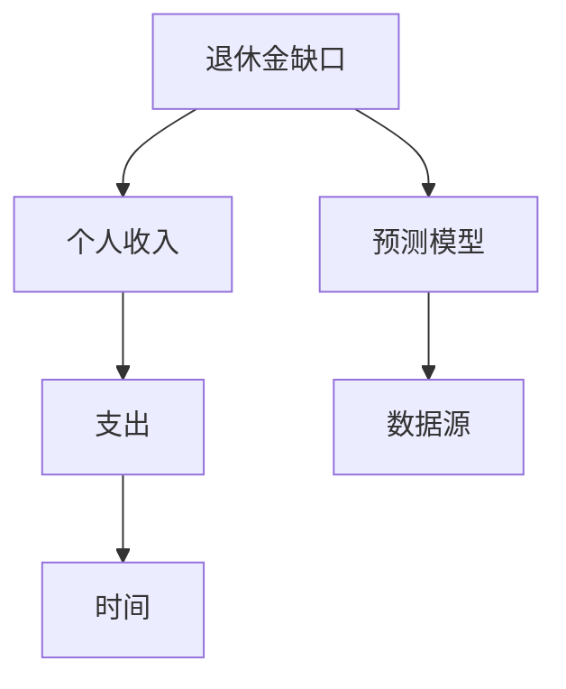
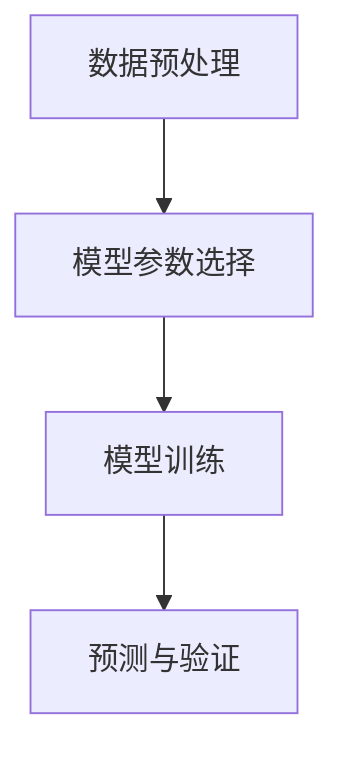
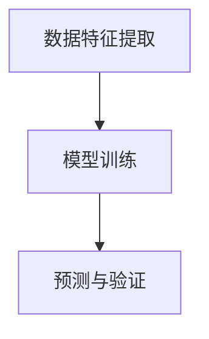
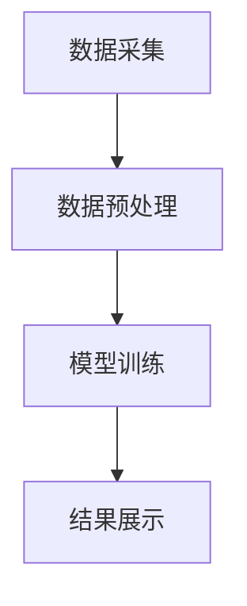
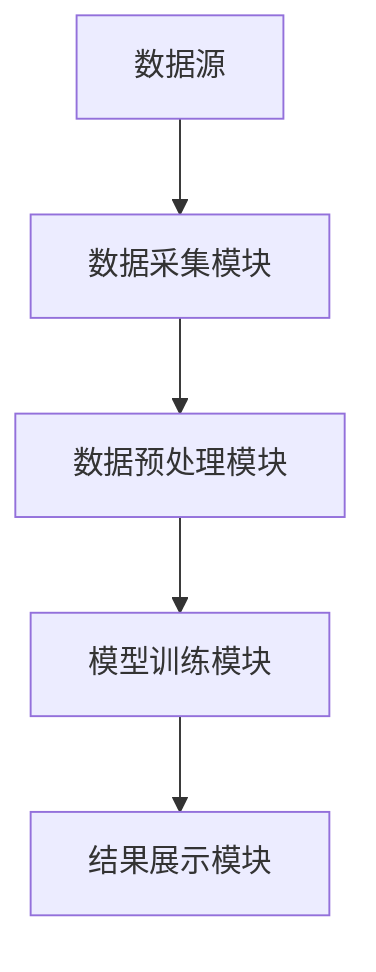

                 


# 构建智能化的个人退休金缺口动态预测助手

## 关键词：退休金缺口预测，智能化，动态预测，机器学习，个人财务规划

## 摘要：本文将详细介绍如何构建一个智能化的个人退休金缺口动态预测助手。通过分析退休金缺口预测的核心概念、算法原理、系统架构和项目实战，结合具体案例和最佳实践，帮助读者掌握如何利用技术手段实现退休金缺口的智能化预测和管理。

---

# 第1章: 背景介绍与核心概念

## 1.1 退休规划的重要性

### 1.1.1 退休规划的核心概念

退休规划是指为确保个人在退休后能够维持一定的生活水平，提前进行财务规划和资金储备。退休金缺口指的是退休后实际所需资金与现有退休金之间的差距。动态预测是指根据个人和经济环境的变化，实时调整和更新退休金缺口的预测结果。

### 1.1.2 退休金缺口的定义与影响

退休金缺口 = 退休后所需总支出 - 退休金来源（包括社保、个人储蓄等）。缺口的存在意味着个人需要通过其他方式（如储蓄、投资、延迟退休等）来弥补。

### 1.1.3 动态预测的必要性

传统静态预测方法仅基于当前数据，无法应对未来经济和收入的变化。动态预测通过实时更新数据和模型，能够更好地应对不确定性，帮助个人及时调整财务计划。

## 1.2 退休金缺口预测的现状与挑战

### 1.2.1 传统退休规划方法的局限性

传统方法通常基于历史数据和固定假设，无法应对通货膨胀、收入变化等不确定性因素。此外，传统方法往往忽略了个人生命周期中收入和支出的变化。

### 1.2.2 智能化预测的优势与应用场景

智能化预测通过机器学习和大数据分析，能够更准确地预测退休金缺口，并提供个性化的调整建议。应用场景包括个人财务规划、金融产品设计等。

### 1.2.3 当前技术发展带来的新机遇

随着人工智能和大数据技术的发展，退休金缺口预测的精确性和实时性得到了显著提升。技术进步为个人提供了更强大的工具和方法。

## 1.3 动态预测的核心要素

### 1.3.1 收入与支出的动态变化

退休前的收入和支出变化，以及退休后的支出需求变化，都是影响退休金缺口的重要因素。

### 1.3.2 经济环境的影响因素

通货膨胀、利率变化、政策调整等经济因素对退休金缺口有直接影响。

### 1.3.3 个人生命周期的阶段特征

不同生命周期阶段的收入、支出和健康状况变化会影响退休金缺口的预测结果。

---

# 第2章: 核心概念与联系

## 2.1 退休金缺口预测的核心概念

### 2.1.1 退休金缺口预测的定义

退休金缺口预测是基于个人当前和未来的收入、支出、资产和经济环境，预测退休后资金是否充足，并计算缺口。

### 2.1.2 核心要素与属性特征对比

| 核心要素       | 描述                                                                 |
|----------------|----------------------------------------------------------------------|
| 个人收入       | 包括工资、投资收益等                                                   |
| 支出           | 包括生活费、医疗费、旅行支出等                                         |
| 时间           | 包括工作阶段和退休阶段                                               |
| 退休金来源     | 包括社保、企业年金、个人储蓄等                                         |
| 经济环境       | 包括通货膨胀率、利率、政策变化等                                       |

### 2.1.3 ER实体关系图架构



## 2.2 核心概念的原理与联系

### 2.2.1 关键概念的数学模型

退休金缺口预测模型可以表示为：

$$
\text{缺口} = \sum_{t=1}^{T} (\text{支出}_t - \text{收入}_t) + \text{初始资产}
$$

其中，$T$ 是退休阶段的年数，$\text{支出}_t$ 和 $\text{收入}_t$ 是第 $t$ 年的支出和收入。

### 2.2.2 概念属性特征对比表格

| 概念       | 属性特征                   |
|------------|----------------------------|
| 收入       | 变动性高，受职业和经济环境影响 |
| 支出       | 基本稳定，受生活方式影响     |
| 时间       | 非线性影响，前期高收入，后期低支出 |
| 退休金来源 | 多样性，包括社保和投资收益   |

### 2.2.3 ER实体关系图的 mermaid 流程图


---

# 第3章: 算法原理与实现

## 3.1 算法原理

### 3.1.1 时间序列分析（ARIMA）

ARIMA（自回归积分滑动平均模型）用于预测退休金缺口的时间序列数据。

#### 3.1.1.1 ARIMA 模型公式

$$
\text{ARIMA}(p, d, q)
$$

其中，$p$ 是自回归阶数，$d$ 是差分阶数，$q$ 是移动平均阶数。

#### 3.1.1.2 ARIMA 算法步骤



### 3.1.2 机器学习模型（随机森林）

随机森林通过集成学习提高预测准确性。

#### 3.1.2.1 随机森林算法步骤



### 3.1.3 神经网络模型（LSTM）

LSTM（长短时记忆网络）适合处理时间序列数据。

#### 3.1.3.1 LSTM 模型公式

$$
f(t) = \text{LSTM}(\text{输入}_t, \text{状态}_{t-1})
$$

---

## 3.2 算法实现

### 3.2.1 时间序列分析（ARIMA）

```python
from statsmodels.tsa.arima.model import ARIMA
import pandas as pd

# 数据预处理
data = pd.Series([1, 2, 3, 4, 5], index=range(5))
model = ARIMA(data, order=(1, 1, 0))
model_fit = model.fit()
forecast = model_fit.forecast(steps=5)
print(forecast)
```

### 3.2.2 机器学习模型（随机森林）

```python
from sklearn.ensemble import RandomForestRegressor
import pandas as pd

# 数据特征提取
data = pd.DataFrame({
    '收入': [100, 200, 300, 400],
    '支出': [50, 100, 150, 200],
    '时间': [2023, 2024, 2025, 2026]
})

# 模型训练
model = RandomForestRegressor(n_estimators=100)
model.fit(data[['收入', '支出']], data['缺口'])
```

### 3.2.3 神经网络模型（LSTM）

```python
from keras.models import Sequential
from keras.layers import LSTM, Dense
import numpy as np

# 数据准备
data = np.array([1, 2, 3, 4, 5])
data = data.reshape((5, 1, 1))

# 模型构建
model = Sequential()
model.add(LSTM(5, input_shape=(1, 1)))
model.add(Dense(1))
model.compile(loss='mean_squared_error', optimizer='adam')
model.fit(data, data, epochs=100, batch_size=1)
```

---

# 第4章: 系统架构设计

## 4.1 系统功能设计

### 4.1.1 功能模块划分

- 数据采集模块：收集个人收入、支出、资产等数据。
- 模型训练模块：基于机器学习算法预测退休金缺口。
- 结果展示模块：可视化预测结果和调整建议。

### 4.1.2 系统功能流程图



## 4.2 系统架构设计

### 4.2.1 系统架构图



---

# 第5章: 项目实战

## 5.1 环境搭建

### 5.1.1 工具安装

- Python 3.8+
- Jupyter Notebook
- 相关库（pandas, statsmodels, scikit-learn, Keras）

## 5.2 核心代码实现

### 5.2.1 数据预处理

```python
import pandas as pd

data = pd.read_csv('退休金数据.csv')
data['时间'] = pd.to_datetime(data['时间'])
data.set_index('时间', inplace=True)
```

### 5.2.2 模型训练与预测

```python
from statsmodels.tsa.arima.model import ARIMA

model = ARIMA(data, order=(1, 1, 0))
model_fit = model.fit()
forecast = model_fit.forecast(steps=10)
print(forecast)
```

## 5.3 实际案例分析

### 5.3.1 数据分析与结果解读

通过具体案例，展示如何利用ARIMA模型预测退休金缺口，并提供调整建议。

---

# 第6章: 最佳实践与总结

## 6.1 项目成果总结

### 6.1.1 项目成果概述

通过构建智能化的退休金缺口动态预测助手，帮助个人更准确地预测退休金缺口，并提供个性化的调整建议。

### 6.1.2 使用建议与注意事项

- 定期更新数据和模型
- 结合实际情况调整模型参数
- 多关注经济环境的变化

## 6.2 项目小结与未来展望

智能化退休金缺口预测助手的开发和应用，不仅提高了预测的准确性，还为个人提供了更灵活的财务规划工具。未来，随着技术的进步，预测模型将更加智能化和个性化。

---

通过以上内容，我们可以看到构建智能化的个人退休金缺口动态预测助手需要综合运用数据分析、机器学习和系统架构设计等技术手段。希望本文能够为读者提供有价值的参考和启示。

