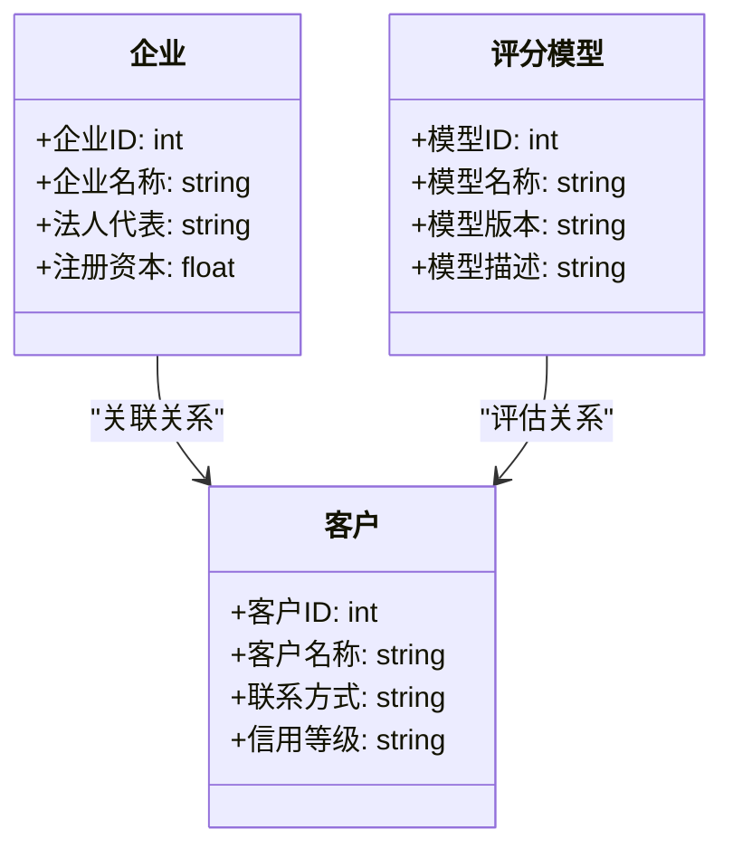
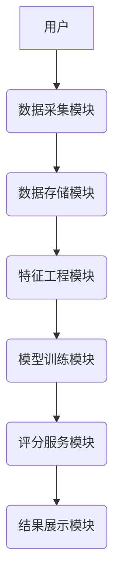
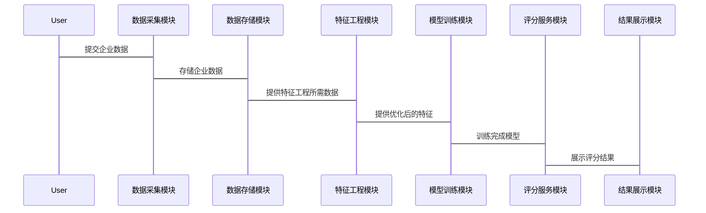

                 


# 构建智能化的企业信用评级系统

## 关键词：企业信用评级、人工智能、大数据分析、机器学习算法、风险管理、评分模型、系统架构设计

## 摘要：  
随着企业信用评级需求的不断增长，传统信用评级方法已难以满足现代化企业的复杂需求。本文将从企业信用评级的核心概念出发，结合人工智能和大数据分析技术，详细探讨构建智能化企业信用评级系统的实现方法。文章内容涵盖信用评分模型的原理、常用机器学习算法、系统架构设计以及项目实战，旨在为企业信用评级系统的智能化转型提供理论支持和实践指导。

---

# 第1章: 企业信用评级系统背景与问题分析

## 1.1 企业信用评级的定义与重要性  
企业信用评级是通过对企业的财务状况、经营能力、市场表现等多维度数据进行分析，评估其信用风险的过程。信用评级结果能够帮助企业做出更明智的信贷决策，降低风险敞口，优化资源配置。  

### 1.1.1 企业信用评级的基本概念  
企业信用评级是对企业信用状况的量化评估，通常以分数或等级的形式表示。信用评级越高，说明企业的信用风险越低，越容易获得贷款或其他金融服务。  

### 1.1.2 信用评级在企业经营中的作用  
信用评级能够帮助企业建立信用形象，增强合作伙伴的信任度，同时也能帮助金融机构更好地控制风险。  

### 1.1.3 信用评级对企业风险管理的意义  
通过信用评级，企业可以识别潜在风险，优化财务结构，制定更合理的经营策略。  

## 1.2 传统信用评级方法的局限性  
传统信用评级方法主要依赖人工经验判断，存在效率低、主观性强、数据利用不足等问题。  

### 1.2.1 传统信用评级的流程与特点  
传统信用评级通常依赖财务报表分析和人工审核，流程繁琐且耗时。  

### 1.2.2 传统方法的不足之处  
- 数据维度有限，难以全面反映企业信用状况；  
- 人工判断主观性强，容易受到人为因素干扰；  
- 无法实时更新，难以应对市场变化。  

### 1.2.3 数据不足与模型简单化的问题  
传统模型往往基于少量财务数据，难以捕捉企业经营中的动态风险。  

## 1.3 智能化信用评级的需求与挑战  
随着企业规模的扩大和市场环境的复杂化，智能化信用评级需求日益迫切。  

### 1.3.1 AI与大数据技术对企业信用评级的推动作用  
人工智能和大数据技术能够从海量数据中提取有价值的信息，帮助建立更精准的信用评估模型。  

### 1.3.2 智能化信用评级的核心需求  
- 实时性：能够快速响应企业的信用变化；  
- 精准性：基于多维度数据，提高评估准确性；  
- 可解释性：模型结果需要能够被理解，便于决策者参考。  

### 1.3.3 技术实现中的主要挑战  
- 数据隐私与安全问题；  
- 模型泛化能力不足；  
- 实时性与计算效率的平衡。  

## 1.4 本章小结  
本章介绍了企业信用评级的基本概念及其重要性，分析了传统评级方法的局限性，并提出了智能化信用评级的需求与挑战，为后续章节的展开奠定了基础。

---

# 第2章: 企业信用评级系统的核心概念与联系  

## 2.1 信用评分模型的原理  
信用评分模型是企业信用评级的核心工具，通过输入特征数据，输出信用评分。  

### 2.1.1 信用评分模型的基本原理  
信用评分模型通过对多个特征变量的加权计算，生成一个综合评分，反映企业的信用风险。  

### 2.1.2 评分模型的输入特征与输出结果  
- 输入特征：财务数据、经营数据、市场数据等；  
- 输出结果：信用评分（如分数或等级）。  

### 2.1.3 模型的可解释性与稳定性  
模型的可解释性是信用评级的重要要求，能够帮助决策者理解评分结果的依据。  

## 2.2 数据特征与信用评分的关系  
数据特征是信用评分的核心影响因素，不同特征对评分结果的影响程度不同。  

### 2.2.1 数据特征的分类与选择  
- 财务特征：收入、利润、负债等；  
- 经营特征：市场占有率、客户满意度等；  
- 宏观特征：行业景气度、政策环境等。  

### 2.2.2 数据特征对评分结果的影响  
通过数据分析，可以确定哪些特征对信用评分影响最大。  

### 2.2.3 特征工程在信用评级中的作用  
特征工程是提升模型性能的关键步骤，包括特征筛选、特征变换等操作。  

## 2.3 信用评分模型的评估指标  
模型的评估指标是衡量信用评分准确性的关键。  

### 2.3.1 模型评估的常用指标  
- 准确率（Accuracy）：模型预测正确的比例；  
- 召回率（Recall）：模型正确识别正样本的比例；  
- F1分数（F1 Score）：综合准确率和召回率的指标。  

### 2.3.2 不同模型的评估标准对比  
通过对比不同模型的评估指标，可以选择性能最优的模型。  

### 2.3.3 模型调优与优化策略  
通过参数调整、特征优化等方法，可以提升模型的性能。  

## 2.4 系统架构的ER实体关系图  
以下是一个简单的ER实体关系图，展示了企业信用评级系统的主要实体及其关系：  

```mermaid
er
    企业(企业ID, 企业名称, 法人代表, 注册资本)
    客户(客户ID, 客户名称, 联系方式, 信用等级)
    评分模型(模型ID, 模型名称, 模型版本, 模型描述)
    企业-客户(企业ID, 客户ID)
```

## 2.5 本章小结  
本章从数据特征和模型评估的角度，分析了企业信用评级系统的核心概念，并通过ER实体关系图展示了系统的主要实体关系，为后续章节的系统设计奠定了基础。

---

# 第3章: 信用评分模型的算法原理  

## 3.1 逻辑回归模型  
逻辑回归是一种常用的二分类算法，适合用于信用评分。  

### 3.1.1 逻辑回归的基本原理  
逻辑回归通过将输入特征映射到0到1的概率空间，预测样本属于某一类的概率。  

### 3.1.2 逻辑回归的损失函数  
逻辑回归的损失函数为对数损失函数，公式如下：  
$$ \text{损失} = -\sum_{i=1}^{n} [y_i \ln(p_i) + (1 - y_i)\ln(1 - p_i)] $$  
其中，\( p_i \) 是第i个样本的预测概率。  

### 3.1.3 逻辑回归的实现步骤  
1. 数据预处理：归一化、特征选择；  
2. 模型训练：使用梯度下降优化参数；  
3. 模型评估：计算准确率、召回率等指标。  

## 3.2 决策树模型  
决策树是一种基于树状结构的分类算法，适合处理非线性关系。  

### 3.2.1 决策树的基本原理  
决策树通过特征分裂构建树状结构，最终预测样本的类别。  

### 3.2.2 决策树的分裂标准  
常用的分裂标准包括信息增益、信息增益率等。  

### 3.2.3 决策树的实现步骤  
1. 数据预处理：去重、填补缺失值；  
2. 模型训练：使用ID3、C4.5等算法构建决策树；  
3. 模型评估：计算准确率、F1分数等指标。  

## 3.3 神经网络模型  
神经网络是一种强大的非线性模型，适合处理复杂的信用评分问题。  

### 3.3.1 神经网络的基本原理  
神经网络通过多层感知机模拟人脑的神经网络结构，提取数据特征。  

### 3.3.2 神经网络的损失函数  
神经网络常用的损失函数为交叉熵损失函数，公式如下：  
$$ \text{损失} = -\sum_{i=1}^{n} y_i \ln(a_i) + (1 - y_i)\ln(1 - a_i) $$  
其中，\( a_i \) 是第i个样本的输出概率。  

### 3.3.3 神经网络的实现步骤  
1. 数据预处理：归一化、特征工程；  
2. 模型训练：使用随机梯度下降优化参数；  
3. 模型评估：计算准确率、AUC值等指标。  

## 3.4 本章小结  
本章详细介绍了逻辑回归、决策树和神经网络三种常用的信用评分模型，分析了它们的原理和实现步骤，为后续章节的系统设计提供了算法基础。

---

# 第4章: 企业信用评级系统的系统架构设计  

## 4.1 项目背景与目标  
本项目旨在构建一个智能化的企业信用评级系统，利用人工智能技术提升信用评估的效率和准确性。  

## 4.2 系统功能设计  
系统主要功能包括数据采集、特征工程、模型训练、评分服务和结果展示。  

### 4.2.1 数据采集模块  
- 数据来源：企业财务数据、市场数据等；  
- 数据格式：结构化数据、非结构化数据。  

### 4.2.2 特征工程模块  
- 数据清洗：去重、填补缺失值；  
- 特征选择：基于相关性分析选择重要特征。  

### 4.2.3 模型训练模块  
- 模型选择：基于评估指标选择最优模型；  
- 模型训练：使用训练数据优化模型参数。  

### 4.2.4 评分服务模块  
- 接收企业数据，返回信用评分；  
- 支持实时评分和批量评分。  

### 4.2.5 结果展示模块  
- 可视化展示评分结果；  
- 提供评分报告和风险提示。  

## 4.3 系统架构设计  

### 4.3.1 领域模型类图  


### 4.3.2 系统架构图  


### 4.3.3 接口设计  
- 数据采集接口：REST API，支持POST请求；  
- 评分服务接口：提供企业ID查询信用评分的接口。  

### 4.3.4 交互流程图  


## 4.4 本章小结  
本章从系统架构的角度，详细设计了企业信用评级系统的功能模块和交互流程，为后续章节的系统实现提供了蓝图。

---

# 第5章: 企业信用评级系统的项目实战  

## 5.1 环境安装与配置  
- 安装Python、Jupyter Notebook、Pandas、Scikit-learn等工具；  
- 安装数据库和相关开发环境。  

## 5.2 系统核心代码实现  

### 5.2.1 数据预处理代码  
```python
import pandas as pd

# 读取数据
df = pd.read_csv('enterprise_data.csv')

# 数据清洗
df.dropna(inplace=True)
df = df.drop_duplicates()

# 特征选择
correlated_features = df.corr().abs().max()
selected_features = correlated_features[correlated_features > 0.8].index

# 数据归一化
from sklearn.preprocessing import StandardScaler
scaler = StandardScaler()
X = scaler.fit_transform(df[selected_features])
y = df['信用等级'].values
```

### 5.2.2 模型训练代码  
```python
from sklearn.linear_model import LogisticRegression
from sklearn.metrics import accuracy_score, recall_score, f1_score

# 训练逻辑回归模型
model = LogisticRegression()
model.fit(X, y)

# 模型评估
y_pred = model.predict(X)
print(f"Accuracy: {accuracy_score(y, y_pred)}")
print(f"Recall: {recall_score(y, y_pred)}")
print(f"F1 Score: {f1_score(y, y_pred)}")
```

### 5.2.3 评分服务代码  
```python
import requests

def get_credit_score(enterprise_id):
    # 发送请求到评分服务接口
    response = requests.post('http://localhost:8000/api/credit_score', json={'enterprise_id': enterprise_id})
    return response.json()['score']

print(get_credit_score(123))  # 示例企业ID
```

## 5.3 项目小结  
本章通过实际案例，详细展示了企业信用评级系统的实现过程，包括数据预处理、模型训练和评分服务的代码实现。  

---

# 第6章: 企业信用评级系统的最佳实践  

## 6.1 小结与总结  
企业信用评级系统的智能化转型是大势所趋，人工智能和大数据技术的应用能够显著提升信用评估的效率和准确性。  

## 6.2 注意事项  
- 数据隐私和安全问题需严格把控；  
- 模型的可解释性是信用评级的重要要求；  
- 系统的实时性和稳定性需重点优化。  

## 6.3 拓展阅读  
- 《机器学习实战》  
- 《深入浅出人工智能》  
- 《大数据分析与挖掘》  

## 6.4 本章小结  
本章总结了企业信用评级系统的最佳实践，提出了系统优化的方向，并提供了进一步学习的资源。

---

# 附录: 参考文献  
1. 刘军, 《机器学习实战》, 机械工业出版社, 2018。  
2. 王鹏, 《深入浅出人工智能》, 清华大学出版社, 2020。  
3. 张宏, 《大数据分析与挖掘》, 北京大学出版社, 2019。  

---

# 结束语  
企业信用评级系统的智能化转型是一个复杂的工程，需要结合人工智能、大数据分析等技术，从数据特征提取、模型选择到系统架构设计等多个方面进行深入研究。希望本文能够为企业信用评级系统的构建提供有价值的参考和指导。

