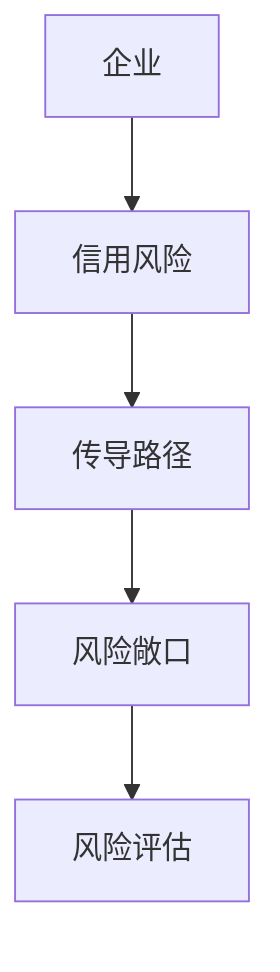
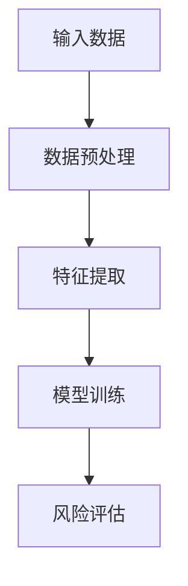
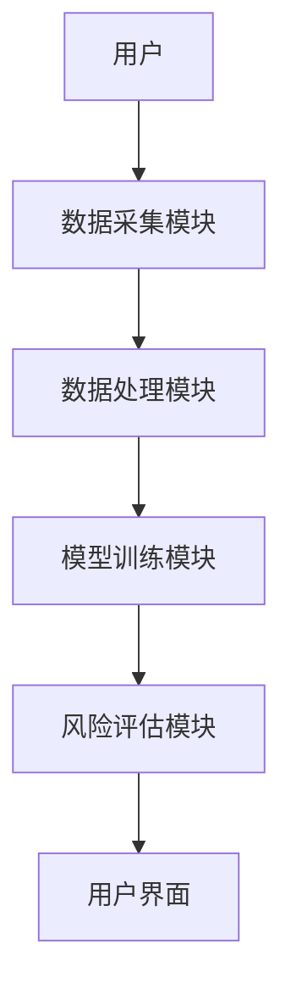

                 


# 构建智能化的企业信用风险传导模型

> 关键词：企业信用风险，风险传导机制，智能模型构建，机器学习，金融风险管理，系统架构设计

> 摘要：本文将系统地介绍如何构建智能化的企业信用风险传导模型。通过分析信用风险的核心概念、传导机制以及智能化模型的构建方法，结合实际案例和系统架构设计，帮助读者深入理解并掌握构建此类模型的全过程。

---

# 第一部分：企业信用风险传导模型的背景与概念

# 第1章：企业信用风险传导模型的背景与问题背景

## 1.1 信用风险的基本概念与定义
### 1.1.1 信用风险的定义
信用风险是指由于债务人或交易对手无法履行其合同义务，导致债权人或相关方遭受损失的可能性。在企业层面，信用风险通常与客户的付款能力、供应商的履约能力以及合作伙伴的稳定性密切相关。

### 1.1.2 信用风险的核心属性与特征
信用风险具有以下核心属性：
1. **可测性**：可以通过数据分析和模型预测进行量化。
2. **可传递性**：风险可能通过企业供应链、合作伙伴或金融市场传递给其他相关方。
3. **可管理性**：企业可以通过风险管理和控制措施降低信用风险。

### 1.1.3 信用风险在企业中的重要性
信用风险是企业经营中的核心风险之一，直接影响企业的财务健康、供应链稳定性以及市场声誉。特别是在全球经济不确定性增加的背景下，构建智能化的信用风险传导模型显得尤为重要。

## 1.2 企业信用风险传导的背景与问题背景
### 1.2.1 企业信用风险传导的定义
信用风险的传导是指由于某一企业或市场参与者信用状况的变化，导致风险通过供应链、合作伙伴关系或其他关联渠道传递到其他企业或市场参与者的过程。

### 1.2.2 信用风险传导的机制与路径
信用风险的传导机制主要包括以下几种路径：
1. **直接传导**：由于企业自身的信用状况恶化，直接导致其合作伙伴或债权人遭受损失。
2. **间接传导**：通过供应链或金融市场的连锁反应，将风险传递给更广泛的市场参与者。
3. **系统性传导**：由于整个市场的信用状况恶化，导致系统性风险的产生。

### 1.2.3 信用风险传导的边界与外延
信用风险传导的边界通常包括企业的供应链、合作伙伴、金融市场以及相关法律法规等。外延则涉及企业内部管理、外部市场环境、宏观经济因素等多个方面。

## 1.3 信用风险传导模型的构建目标与意义
### 1.3.1 构建信用风险传导模型的目标
1. **量化风险**：通过模型量化企业信用风险的大小和影响范围。
2. **预测风险**：基于历史数据和模型预测未来的信用风险。
3. **优化管理**：通过模型优化企业的风险管理策略，降低信用风险的影响。

### 1.3.2 信用风险传导模型的意义与价值
1. **提升企业风险管理能力**：通过模型帮助企业更好地识别和管理信用风险。
2. **支持决策制定**：为企业制定风险管理策略和投资决策提供数据支持。
3. **促进金融市场稳定**：通过模型预测和管理信用风险，有助于维护金融市场的稳定。

### 1.3.3 模型构建的边界与限制
1. **数据限制**：模型的准确性依赖于高质量的数据输入。
2. **模型假设**：模型基于一定的假设条件，可能与实际情况存在偏差。
3. **动态变化**：信用风险的传导机制可能随着市场环境的变化而变化。

## 1.4 本章小结
本章主要介绍了信用风险的基本概念、传导机制以及模型构建的目标和意义。通过理解这些内容，读者可以为后续模型的构建打下坚实的基础。

---

# 第2章：企业信用风险传导模型的核心概念与联系

## 2.1 信用风险传导模型的核心概念
### 2.1.1 信用风险传导模型的定义
信用风险传导模型是指通过数学模型和算法，量化和预测信用风险在企业内外部之间的传导过程。

### 2.1.2 模型的核心要素与组成
1. **输入数据**：包括企业的财务数据、供应链数据、市场数据等。
2. **模型算法**：用于处理和分析数据的核心算法，如机器学习算法。
3. **风险评估**：模型输出的结果，包括风险等级、风险敞口等。

### 2.1.3 模型的输入与输出
- **输入**：企业的财务数据、供应链数据、市场数据。
- **输出**：风险评估结果、风险传导路径、风险影响范围。

## 2.2 核心概念之间的联系与对比
### 2.2.1 信用风险与企业经营风险的对比
| **信用风险** | **企业经营风险** |
|--------------|------------------|
| 主要关注债务人或交易对手的信用状况 | 主要关注企业在经营过程中面临的各种风险 |
| 通常由外部因素（如经济环境）驱动 | 通常由内部和外部因素共同驱动 |

### 2.2.2 信用风险传导与企业内部管理的关系
信用风险的传导可能受到企业内部管理策略的影响，例如供应链管理、风险管理政策等。

### 2.2.3 模型中的关键变量与参数
1. **关键变量**：企业的财务状况、供应链稳定性、市场环境。
2. **参数**：模型中使用的权重系数、阈值等。

## 2.3 模型的ER实体关系图


## 2.4 本章小结
本章详细介绍了信用风险传导模型的核心概念和各部分之间的联系，为后续模型的构建奠定了基础。

---

# 第3章：企业信用风险传导模型的算法原理与数学模型

## 3.1 模型的算法原理
### 3.1.1 模型的基本原理
信用风险传导模型通常基于机器学习算法，通过分析企业的历史数据和市场数据，预测未来的信用风险。

### 3.1.2 模型的输入与输出
- **输入**：企业的财务数据、供应链数据、市场数据。
- **输出**：风险评估结果、风险传导路径、风险影响范围。

### 3.1.3 模型的算法流程
1. 数据预处理：清洗和标准化数据。
2. 特征提取：提取与信用风险相关的特征。
3. 模型训练：使用机器学习算法训练模型。
4. 风险评估：基于模型预测信用风险。

## 3.2 模型的数学公式与模型
### 3.2.1 风险传导的核心公式
$$ R = \sum_{i=1}^{n} w_i \cdot r_i $$
其中，$R$ 表示总风险，$w_i$ 表示第 $i$ 个风险因子的权重，$r_i$ 表示第 $i$ 个风险因子的值。

### 3.2.2 模型的数学推导
通过线性回归或其他机器学习算法，模型可以学习各个风险因子的权重，从而预测总体风险。

### 3.2.3 模型的举例说明
假设某企业有三个风险因子，权重分别为0.3、0.4、0.3，对应的风险值分别为0.8、0.6、0.5，则总风险为：
$$ R = 0.3 \times 0.8 + 0.4 \times 0.6 + 0.3 \times 0.5 = 0.24 + 0.24 + 0.15 = 0.63 $$

## 3.3 模型的算法流程图


## 3.4 本章小结
本章详细介绍了信用风险传导模型的算法原理和数学公式，为后续模型的实现提供了理论基础。

---

# 第4章：企业信用风险传导模型的系统分析与架构设计

## 4.1 系统分析
### 4.1.1 项目场景介绍
构建智能化的企业信用风险传导模型需要结合企业的实际业务场景，分析数据来源、模型需求和系统功能。

### 4.1.2 系统功能设计
- 数据采集模块：采集企业的财务数据、供应链数据、市场数据。
- 数据处理模块：清洗和标准化数据。
- 模型训练模块：基于机器学习算法训练模型。
- 风险评估模块：输出风险评估结果。

### 4.1.3 系统架构设计
1. **分层架构**：包括数据层、算法层和应用层。
2. **数据层**：存储企业的原始数据。
3. **算法层**：实现模型的训练和预测。
4. **应用层**：提供用户界面，展示风险评估结果。

## 4.2 系统接口设计
### 4.2.1 接口设计
1. 数据接口：与企业数据源对接。
2. 模型接口：与其他系统或平台对接。

### 4.2.2 交互序列图


## 4.3 本章小结
本章详细介绍了系统分析与架构设计，为后续模型的实现提供了系统化的框架。

---

# 第5章：企业信用风险传导模型的项目实战

## 5.1 环境安装与配置
### 5.1.1 安装Python环境
安装Python 3.8或更高版本，安装必要的库（如scikit-learn、pandas、numpy等）。

### 5.1.2 数据源获取
获取企业的财务数据、供应链数据和市场数据。

## 5.2 核心代码实现
### 5.2.1 数据预处理
```python
import pandas as pd
import numpy as np

# 读取数据
data = pd.read_csv('credit_data.csv')

# 数据清洗
data.dropna(inplace=True)
data = pd.get_dummies(data)
```

### 5.2.2 模型训练
```python
from sklearn.model import LinearRegression

# 特征提取
X = data.drop('target', axis=1)
y = data['target']

# 训练模型
model = LinearRegression()
model.fit(X, y)

# 预测风险
y_pred = model.predict(X)
```

### 5.2.3 风险评估
```python
from sklearn.metrics import mean_squared_error

# 计算均方误差
mse = mean_squared_error(y, y_pred)
print(f'Mean Squared Error: {mse}')
```

## 5.3 实际案例分析
### 5.3.1 案例背景
假设某企业面临供应链中断的风险，需要通过模型预测风险敞口。

### 5.3.2 数据分析
分析企业的历史财务数据和供应链数据，提取相关特征。

### 5.3.3 风险评估与优化
基于模型预测结果，优化企业的风险管理策略。

## 5.4 本章小结
本章通过实际案例展示了信用风险传导模型的实现过程，帮助读者掌握模型的应用方法。

---

# 第6章：总结与展望

## 6.1 最佳实践 tips
1. 数据质量是模型准确性的关键，需确保数据的完整性和一致性。
2. 模型的可解释性是实际应用的重要考虑因素，需注重模型的可解释性设计。
3. 风险管理需要结合企业的实际情况，模型只是辅助工具。

## 6.2 小结
通过本章的学习，读者可以全面掌握企业信用风险传导模型的构建方法和实际应用。

## 6.3 注意事项
1. 模型的准确性依赖于高质量的数据输入。
2. 模型的假设条件需要与实际情况相符。
3. 需定期更新模型，以适应市场环境的变化。

## 6.4 拓展阅读
1. 《信用风险管理：理论与实践》
2. 《机器学习在金融领域的应用》

## 6.5 本章小结
本章总结了全书的核心内容，并展望了未来的发展方向，为读者进一步学习和实践提供了指导。

---

# 结语

通过以上章节的学习，读者可以系统地掌握企业信用风险传导模型的构建方法和实际应用。希望本书能够为企业的风险管理提供有价值的参考和指导。

