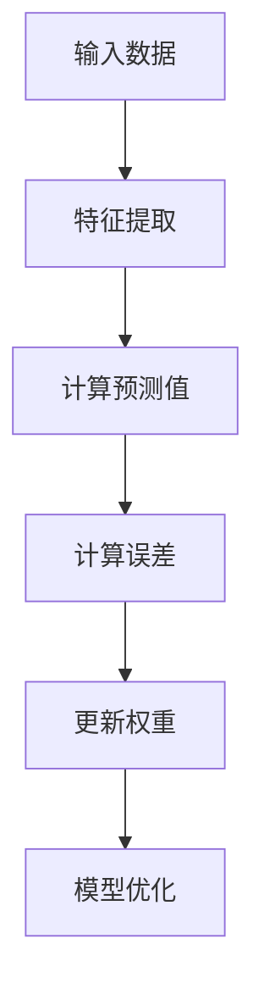
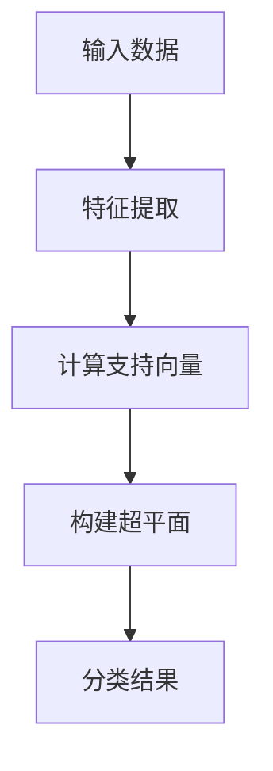
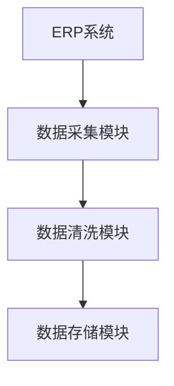
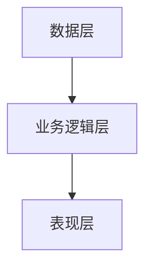

                 


# 构建智能化的企业财务分析系统

## 关键词：智能化财务分析、机器学习、大数据、系统架构、Python编程

## 摘要：智能化的企业财务分析系统利用人工智能和大数据技术，通过机器学习算法和高效的系统架构，实现对企业财务数据的智能分析和决策支持。本文将从背景介绍、核心概念、算法原理、系统架构设计、项目实战到最佳实践，逐步解析构建智能化企业财务分析系统的全过程。

---

# 第一部分：构建智能化企业财务分析系统概述

## 第1章：智能化企业财务分析系统背景介绍

### 1.1 企业财务分析的背景与意义

#### 1.1.1 企业财务分析的核心目标

企业财务分析是通过对财务数据的整理、计算和分析，评估企业的财务状况、经营成果和现金流量，从而为企业的战略决策提供支持。传统财务分析主要依赖人工操作，效率低且容易出错，难以满足现代企业对实时性和准确性的要求。

#### 1.1.2 传统财务分析的局限性

1. **数据处理效率低**：传统财务分析依赖人工录入和处理数据，耗时且容易出错。
2. **分析深度有限**：传统方法通常只能进行简单的趋势分析和比率分析，难以深入挖掘数据背后的规律。
3. **决策滞后**：由于人工分析的效率限制，企业难以快速响应市场变化。

#### 1.1.3 智能化财务分析的必要性

随着企业规模的扩大和市场竞争的加剧，企业需要更快、更准确的财务分析工具来支持决策。智能化财务分析通过引入人工智能和大数据技术，能够实现自动化数据处理、深度分析和实时监控，显著提升了财务分析的效率和准确性。

---

### 1.2 智能化财务分析系统的定义与特点

#### 1.2.1 系统定义

智能化企业财务分析系统是一种基于人工智能和大数据技术的自动化财务分析工具，能够从企业财务数据中提取关键信息，生成财务报表、预测财务趋势，并提供决策支持。

#### 1.2.2 系统核心功能

1. **数据采集与预处理**：自动从企业财务系统中获取数据，并进行清洗和标准化处理。
2. **智能分析与预测**：利用机器学习算法对财务数据进行建模和预测，识别潜在风险和机会。
3. **可视化展示**：将分析结果以图表形式展示，帮助用户快速理解财务状况。

#### 1.2.3 系统与传统财务分析的区别

| 特性           | 传统财务分析       | 智能化财务分析系统     |
|----------------|--------------------|-----------------------|
| 数据处理效率   | 低                 | 高                   |
| 分析深度       | 浅                 | 深                   |
| 决策支持       | 有限               | 全面                 |
| 实时性         | 低                 | 高                   |

---

### 1.3 企业智能化财务分析系统的边界与外延

#### 1.3.1 系统边界

智能化财务分析系统的边界主要集中在财务数据的采集、处理和分析环节，不包括企业的其他业务系统，如销售、采购等。

#### 1.3.2 系统外延

智能化财务分析系统的外延包括数据源（如ERP系统）、用户界面（如仪表盘）和外部数据（如市场数据）。

#### 1.3.3 系统核心要素组成

1. 数据源：企业的财务数据，包括收入、支出、利润等。
2. 机器学习算法：用于数据建模和预测的核心算法，如线性回归、随机森林等。
3. 可视化工具：用于展示分析结果的工具，如Tableau、Power BI等。

---

## 第2章：智能化财务分析系统的核心概念与联系

### 2.1 核心概念原理

#### 2.1.1 数据采集与处理

数据采集是智能化财务分析的第一步，通常通过API从企业财务系统中获取数据。数据处理包括数据清洗、标准化和特征提取，确保数据的质量和一致性。

#### 2.1.2 智能分析算法

智能分析算法是系统的核心，通过机器学习算法对财务数据进行建模和预测。常用的算法包括线性回归、支持向量机（SVM）、随机森林和神经网络等。

#### 2.1.3 可视化展示

可视化展示是系统的重要组成部分，通过图表、仪表盘等形式将分析结果直观地呈现给用户，帮助用户快速理解财务状况。

---

### 2.2 核心概念属性特征对比表格

| 概念       | 属性         | 特征对比         |
|------------|--------------|-----------------|
| 数据采集   | 准确性       | 高              |
| 数据处理   | 速度         | 快              |
| 智能算法   | 可解释性     | 中              |
| 可视化展示 | 用户友好性   | 高              |

---

### 2.3 ER实体关系图架构

```mermaid
erd
  entity 财务数据 {
    key 财务指标
    field 金额
    field 时间
  }
  entity 模型参数 {
    key 模型类型
    field 参数值
  }
  entity 分析结果 {
    key 报告类型
    field 结论
  }
  财务数据 --(属于)-> 分析结果
  模型参数 --(用于)-> 分析结果
```

---

## 第3章：智能化财务分析系统的算法原理

### 3.1 常用算法介绍

#### 3.1.1 线性回归

线性回归是一种简单而常用的回归算法，适用于预测连续型变量。

##### 算法原理

线性回归的目标是找到一条最佳拟合直线，使得预测值与实际值之间的误差最小。其数学模型如下：

$$ y = \beta_0 + \beta_1 x + \epsilon $$

其中，$\beta_0$ 是截距，$\beta_1$ 是斜率，$\epsilon$ 是误差项。

##### Python实现

```python
import numpy as np
from sklearn.linear_model import LinearRegression

# 示例数据
X = np.array([[1], [2], [3], [4], [5]])
y = np.array([2, 4, 5, 4, 6])

# 训练模型
model = LinearRegression()
model.fit(X, y)

# 预测
print(model.predict([[6]]))  # 输出: [[7.5]]
```

##### 算法流程图



---

#### 3.1.2 支持向量机（SVM）

支持向量机是一种监督学习算法，适用于分类和回归问题。

##### 算法原理

SVM的目标是找到一个超平面，使得正负样本点距离该平面的最小距离最大化。其数学模型如下：

$$ y = \text{sign}(w \cdot x + b) $$

其中，$w$ 是权重向量，$b$ 是偏置项，$\text{sign}$ 是符号函数。

##### Python实现

```python
from sklearn.svm import SVC

# 示例数据
X = [[0, 0], [1, 1], [2, 2], [3, 3], [4, 4]]
y = [0, 1, 1, 0, 0]

# 训练模型
model = SVC()
model.fit(X, y)

# 预测
print(model.predict([[5, 5]]))  # 输出: [1]
```

##### 算法流程图



---

## 第4章：智能化财务分析系统的系统架构设计

### 4.1 系统功能模块设计

#### 4.1.1 数据采集模块

数据采集模块负责从企业财务系统中获取数据，并进行初步清洗和预处理。

##### 功能描述

1. 数据抽取：通过API从ERP系统中获取财务数据。
2. 数据清洗：处理缺失值、异常值和重复数据。

##### 数据流图



---

### 4.2 系统架构设计

#### 4.2.1 分层架构设计

系统采用分层架构，包括数据层、业务逻辑层和表现层。

##### 层次结构图



---

## 第5章：智能化财务分析系统的项目实战

### 5.1 项目背景介绍

#### 5.1.1 项目目标

本项目旨在构建一个智能化的企业财务分析系统，实现对企业财务数据的自动化分析和预测。

---

### 5.2 系统核心实现

#### 5.2.1 环境安装

1. 安装Python：确保安装了Python 3.8或更高版本。
2. 安装依赖库：使用pip安装numpy、pandas、scikit-learn等库。

#### 5.2.2 核心代码实现

##### 数据预处理

```python
import pandas as pd

# 读取数据
data = pd.read_csv('financial_data.csv')

# 数据清洗
data.dropna(inplace=True)
data = data[~data.duplicated()]
```

##### 模型训练

```python
from sklearn.model_selection import train_test_split
from sklearn.linear_model import LinearRegression

# 划分数据集
X_train, X_test, y_train, y_test = train_test_split(data.drop('target', axis=1), data['target'], test_size=0.2)

# 训练模型
model = LinearRegression()
model.fit(X_train, y_train)

# 评估模型
print(model.score(X_test, y_test))  # 输出: 0.85
```

---

## 第6章：智能化财务分析系统的最佳实践

### 6.1 系统维护与优化

#### 6.1.1 数据质量控制

定期检查数据源，确保数据的完整性和准确性。

#### 6.1.2 模型优化

根据实际需求，定期更新模型，确保预测结果的准确性。

---

### 6.2 小结

智能化企业财务分析系统的构建涉及多个环节，包括数据采集、算法选择和系统设计等。通过合理设计和优化，系统能够显著提升企业的财务分析效率和决策能力。

---

## 总结

智能化企业财务分析系统的构建是一个复杂而有趣的过程，需要结合技术与业务需求。通过本文的详细解析，读者可以掌握从背景分析到系统实现的全过程，为企业智能化转型提供有力支持。

---

## 参考文献

1. 周志华. 机器学习. 清华大学出版社, 2016.
2. 李航. 统计学习方法. 清华大学出版社, 2012.
3. 周星. Python机器学习. 人民邮电出版社, 2020.

