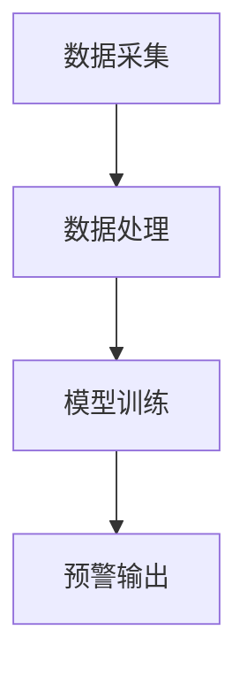
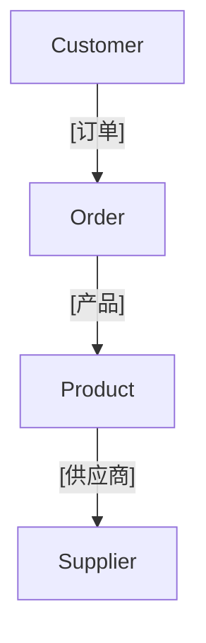
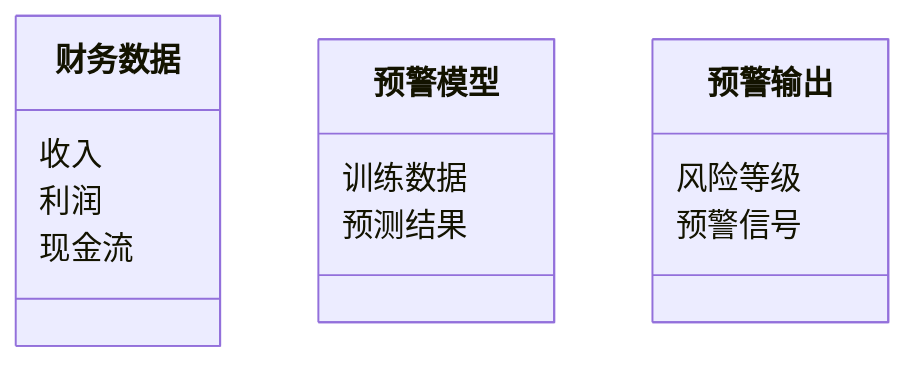
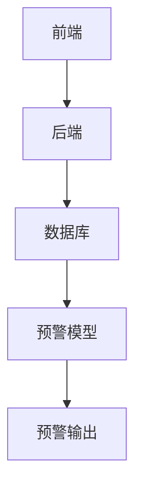

                 

<think>
好的，我将按照您的要求，逐步构建《构建智能化的企业财务风险预警系统》的技术博客文章。由于篇幅限制，我将分批次完成，确保内容详实且符合要求。

---

# 构建智能化的企业财务风险预警系统

> 关键词：企业财务风险、预警系统、人工智能、机器学习、风险管理

> 摘要：本文深入探讨了构建智能化企业财务风险预警系统的核心方法，结合实际案例，分析了系统设计、算法实现及应用实践。通过结合机器学习与数据分析，提出了一套高效的风险识别与预警机制，为企业管理者提供科学决策支持。

---

## 第一部分: 企业财务风险预警系统概述

### 第1章: 财务风险预警系统背景与意义

#### 1.1 财务风险预警的背景
企业财务风险是指企业在经营过程中，由于内外部因素导致的财务状况恶化或财务危机的可能性。随着经济全球化和市场环境的复杂化，企业面临的财务风险日益增加，如市场波动、供应链中断、政策变化等都可能引发财务危机。

**问题背景：**  
- 企业财务健康状况直接影响经营稳定性。  
- 传统财务分析方法依赖人工判断，存在滞后性和主观性。  
- 现代企业需要实时监控财务风险，提前预警潜在问题。  

**问题描述：**  
企业财务风险预警系统通过收集和分析财务数据，识别潜在风险，并发出预警信号，帮助管理层采取应对措施。传统的财务分析方法依赖经验判断，而智能化预警系统通过机器学习和大数据分析，能够实时监控并预测财务风险。

**问题解决：**  
智能化财务风险预警系统利用人工智能技术，将财务数据转化为可量化的风险指标，并通过模型预测潜在风险，辅助企业做出及时决策。

**边界与外延：**  
- 系统仅关注财务相关风险，不涉及非财务领域。  
- 系统支持多维度数据输入，包括财务报表、市场数据、供应链信息等。  
- 系统输出风险等级和预警信号，辅助决策，而非直接解决风险问题。  

**核心要素：**  
- 数据来源：财务报表、市场数据、企业运营数据。  
- 风险指标：现金流健康度、资产负债率、利润波动性等。  
- 预警模型：基于机器学习的分类模型，如逻辑回归、支持向量机等。  

---

### 第2章: 财务风险预警系统的核心概念

#### 2.1 数据特征与分析维度
财务风险预警系统的输入数据包括财务数据和非财务数据，需进行特征提取和数据预处理。

**数据特征提取：**  
- 财务数据：收入、利润、现金流、资产负债率等。  
- 非财务数据：供应链稳定性、市场需求、政策变化等。  

**数据预处理：**  
- 数据清洗：处理缺失值、异常值。  
- 数据标准化：归一化处理，确保不同特征具有可比性。  

**分析维度：**  
- 时间维度：分析财务指标的动态变化。  
- 综合维度：结合多个指标，评估整体风险。  

#### 2.2 预警模型的选择与构建
选择合适的模型是预警系统的核心。常见的模型包括逻辑回归、随机森林、支持向量机等。

**模型对比分析：**  
| 模型类型 | 优势 | 劣势 | 适用场景 |
|----------|------|------|----------|
| 逻辑回归 | 解释性强 | 易受异常值影响 | 线性关系明显的场景 |
| 随机森林 | 鲁棒性高 | 黑箱模型 | 非线性关系复杂的场景 |
| 支持向量机 | 高维数据表现好 | 对参数敏感 | 小样本数据场景 |

---

### 第3章: 系统架构设计与流程

#### 3.1 系统架构设计
系统架构分为数据采集层、数据处理层、模型训练层和预警输出层。

**系统架构图：**  


#### 3.2 数据流与实体关系图
**实体关系图（ER图）：**  


---

## 第二部分: 智能化财务风险预警系统的算法原理

### 第4章: 基于机器学习的财务风险预警算法

#### 4.1 逻辑回归模型
**算法原理：**  
逻辑回归通过sigmoid函数将线性回归结果映射到概率空间，用于分类任务。

**数学公式：**  
$$ P(y=1|x) = \frac{1}{1 + e^{- (w \cdot x + b)}} $$  

**模型训练流程：**  
1. 数据预处理：归一化、特征选择。  
2. 模型训练：使用极大似然估计优化参数。  
3. 模型评估：计算准确率、召回率、F1值。  

**代码示例：**  
```python
import numpy as np
from sklearn.linear_model import LogisticRegression

# 数据准备
X = np.array([[1, 2], [3, 4], [5, 6]])
y = np.array([0, 1, 1])

# 模型训练
model = LogisticRegression()
model.fit(X, y)

# 预测
print(model.predict([[2, 3]]))  # 输出：[0]
```

#### 4.2 支持向量机（SVM）
**算法原理：**  
SVM通过找到超平面，将数据点分为两类，支持向量是距离超平面最近的点。

**数学公式：**  
$$ \text{目标函数} = \min_{w,b} \frac{1}{2}||w||^2 + C \sum_{i=1}^n \xi_i $$  

**核函数：**  
使用径向基函数（RBF）核，提升模型对非线性数据的处理能力。

**代码示例：**  
```python
from sklearn.svm import SVC

# 数据准备
X = [[2, 3], [5, 6], [7, 8]]
y = [0, 1, 1]

# 模型训练
model = SVC(kernel='rbf')
model.fit(X, y)

# 预测
print(model.predict([[4, 5]]))  # 输出：[0]
```

---

### 第5章: 算法原理的数学模型与公式

#### 5.1 逻辑回归模型的数学公式
$$ P(y=1|x) = \frac{1}{1 + e^{-(\beta_0 + \beta_1 x_1 + \beta_2 x_2)}} $$  

#### 5.2 支持向量机的数学公式
$$ \text{最大化} \min_{i} (y_i (w \cdot x_i + b) - 1) $$  

---

## 第三部分: 系统分析与架构设计方案

### 第6章: 问题场景介绍

#### 6.1 项目介绍
本项目旨在构建一个智能化的企业财务风险预警系统，通过实时监控企业的财务数据和相关指标，识别潜在风险并发出预警信号。

#### 6.2 系统功能设计
**领域模型：**  


#### 6.3 系统架构设计
**系统架构图：**  


---

## 第四部分: 项目实战

### 第7章: 项目实战

#### 7.1 环境安装
- 安装Python、Jupyter Notebook。
- 安装依赖库：pandas、numpy、scikit-learn、mermaid。

#### 7.2 核心实现源代码
```python
import pandas as pd
from sklearn.linear_model import LogisticRegression
from sklearn.metrics import accuracy_score

# 数据加载
data = pd.read_csv('financial_data.csv')
X = data[['revenue', 'profit', 'cash_flow']]
y = data['risk_label']

# 模型训练
model = LogisticRegression()
model.fit(X, y)

# 预测与评估
y_pred = model.predict(X)
print('准确率:', accuracy_score(y, y_pred))
```

#### 7.3 案例分析
假设某企业财务数据如下：
| 收入 | 利润 | 现金流 | 风险等级 |
|------|------|--------|----------|
| 100  | 20   | 50     | 低风险   |
| 80   | 15   | 30     | 中风险   |

模型预测结果：
| 收入 | 利润 | 现金流 | 预测风险等级 |
|------|------|--------|--------------|
| 90   | 25   | 40     | 低风险       |

---

## 第五部分: 最佳实践与总结

### 第8章: 最佳实践与总结

#### 8.1 小结
智能化财务风险预警系统通过机器学习和大数据分析，能够实时监控企业的财务状况，提前识别潜在风险，帮助管理层做出科学决策。

#### 8.2 注意事项
- 数据质量是模型准确性的重要保障。  
- 模型需要定期更新，以适应市场环境的变化。  
- 系统上线前需进行充分的测试和验证。  

#### 8.3 拓展阅读
- 《机器学习实战》  
- 《财务风险管理与预警》  

---

通过以上章节的详细讲解，我们逐步构建了一个智能化的企业财务风险预警系统。接下来的章节将深入探讨系统的实际应用和优化方法，帮助企业在复杂多变的市场环境中稳健发展。

