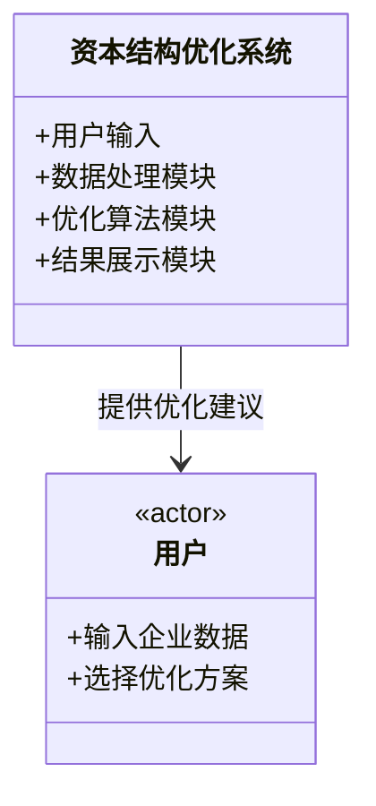
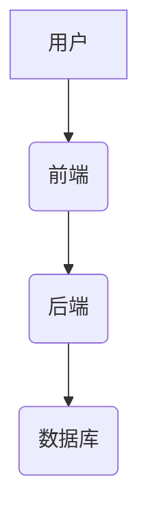
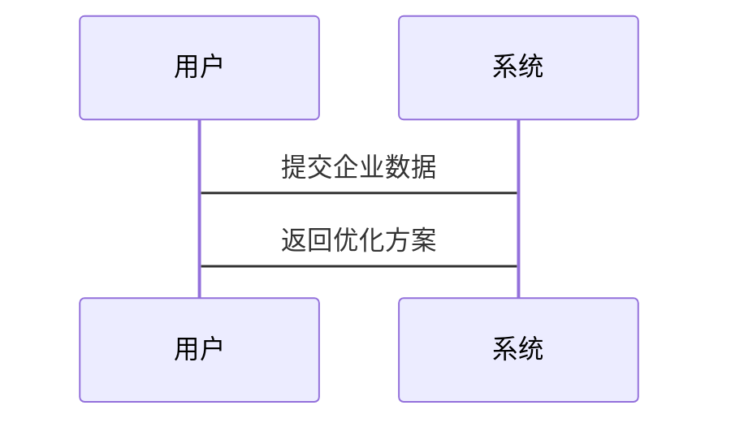

                 

# 构建智能化的企业资本结构优化平台

> 关键词：资本结构优化，人工智能，大数据分析，系统架构，Python实现

> 摘要：本文详细探讨了如何利用人工智能和大数据分析技术构建智能化的企业资本结构优化平台。文章从资本结构优化的基本概念出发，分析了传统方法的局限性，介绍了智能化优化的必要性和技术基础。接着，详细讲解了资本结构优化的数学模型、智能算法的实现方法，以及系统的架构设计。通过具体的Python代码实现和案例分析，展示了如何构建一个智能化的资本结构优化平台。最后，总结了项目的成果，并提出了进一步优化的方向和建议。

---

## 第一部分: 背景与基础

### 第1章: 资本结构优化的基本概念

#### 1.1 资本结构优化的定义
##### 1.1.1 资本结构的基本概念
资本结构是指企业债务和股权的组合方式，旨在实现企业价值最大化。合理的资本结构能够降低资本成本，提高企业抗风险能力。

##### 1.1.2 资本结构优化的定义与目标
资本结构优化是指通过调整债务和股权的比例，使得企业的加权平均资本成本（WACC）最小化，从而实现企业价值最大化。

##### 1.1.3 优化资本结构的意义与价值
优化资本结构有助于企业降低融资成本、提高资本回报率，并在风险和收益之间找到最佳平衡点。

#### 1.2 企业资本结构优化的背景与现状
##### 1.2.1 当前企业资本结构优化的背景
随着全球经济的不确定性增加，企业面临更多的风险和挑战，优化资本结构成为企业财务管理的重要任务。

##### 1.2.2 传统资本结构优化方法的局限性
传统方法依赖于简单的财务指标和经验判断，难以应对复杂多变的市场环境和个性化需求。

##### 1.2.3 智能化优化的必要性与发展趋势
智能化技术（如人工智能和大数据分析）的应用能够提高优化的准确性和效率，是未来资本结构优化的重要发展方向。

---

## 第二部分: 核心概念与联系

### 第2章: 资本结构优化的核心概念

#### 2.1 资本结构优化的核心要素
##### 2.1.1 股权与债务的定义与区别
股权代表所有者对企业净资产的要求权，债务是企业对外部债权人的负债。

##### 2.1.2 资本成本与企业价值的关系
资本成本是企业获取资金的成本，资本成本越低，企业价值越高。

##### 2.1.3 资本结构的动态调整机制
资本结构需要根据企业的经营状况和外部环境的变化进行动态调整。

#### 2.2 资本结构优化的关键影响因素
##### 2.2.1 企业经营状况与财务状况
企业的盈利能力、资产规模和偿债能力直接影响资本结构的优化。

##### 2.2.2 市场环境与宏观经济因素
宏观经济政策、市场利率和行业竞争状况也会影响资本结构的优化。

##### 2.2.3 企业战略目标与风险偏好
企业的长期战略目标和风险承受能力决定了资本结构的优化方向。

#### 2.3 资本结构优化的数学模型与公式
##### 2.3.1 WACC（加权平均资本成本）公式
$$ WACC = \frac{E}{E+D} \times R_e + \frac{D}{E+D} \times R_d \times (1 - T) $$
其中，$E$ 表示股权，$D$ 表示债务，$R_e$ 表示股权资本成本，$R_d$ 表示债务资本成本，$T$ 表示税率。

##### 2.3.2 Modigliani-Miller模型
Modigliani-Miller模型是资本结构优化的经典模型，假设无税情况下的资本成本与资本结构无关。

---

## 第三部分: 算法原理

### 第3章: 智能优化算法的应用

#### 3.1 遗传算法（GA）的基本原理
##### 3.1.1 遗传算法的基本步骤
1. 初始化种群
2. 计算适应度
3. 选择适应度高的个体
4. 进行交叉和变异
5. 重复迭代

##### 3.1.2 遗传算法的数学模型
使用适应度函数评估资本结构的优劣，通过遗传操作优化种群。

#### 3.2 粒子群优化（PSO）算法
##### 3.2.1 粒子群优化的基本原理
粒子群在搜索空间中飞行，通过调整速度和位置找到最优解。

##### 3.2.2 粒子群优化的数学模型
$$ v_i = v_i + c_1 \times r_1 \times (p_i - x_i) + c_2 \times r_2 \times (p_g - x_i) $$
其中，$v_i$ 是粒子的速度，$x_i$ 是当前位置，$p_i$ 是个体最优位置，$p_g$ 是全局最优位置。

---

## 第四部分: 系统架构设计

### 第4章: 系统架构设计与实现

#### 4.1 系统功能设计
##### 4.1.1 领域模型设计
使用Mermaid绘制领域模型类图，展示系统的各个模块及其交互。

#### 4.2 系统架构设计
##### 4.2.1 系统架构图
使用Mermaid绘制系统架构图，展示前端、后端和数据库的交互关系。

#### 4.3 接口设计与交互流程
##### 4.3.1 系统接口设计
定义API接口，如`POST /api/optimization`，用于接收企业数据并返回优化结果。

##### 4.3.2 交互流程图
使用Mermaid绘制交互流程图，展示用户与系统之间的交互过程。

---

## 第五部分: 项目实战

### 第5章: 项目实战与代码实现

#### 5.1 环境安装与配置
##### 5.1.1 安装Python与相关库
安装`numpy`、`pandas`、`scikit-learn`等库，用于数据处理和算法实现。

##### 5.1.2 安装Jupyter Notebook
用于数据可视化和算法调试。

#### 5.2 系统核心实现
##### 5.2.1 数据处理模块
读取企业数据，清洗和预处理。

##### 5.2.2 优化算法实现
使用遗传算法或粒子群优化算法进行资本结构优化。

##### 5.2.3 结果展示模块
将优化结果可视化，生成报告。

#### 5.3 案例分析与代码解读
##### 5.3.1 案例分析
以某企业为例，展示如何利用Python代码优化其资本结构。

##### 5.3.2 代码解读
解释关键代码逻辑，如适应度函数和优化算法的实现。

---

## 第六部分: 总结与展望

### 第6章: 总结与展望

#### 6.1 项目总结
本文详细介绍了智能化资本结构优化平台的构建过程，从理论到实践，展示了如何利用人工智能和大数据技术解决实际问题。

#### 6.2 未来展望
未来，可以进一步优化算法，引入更多的数据源，提升系统的智能化水平。

#### 6.3 注意事项
在实际应用中，需注意数据的准确性和模型的适用性。

#### 6.4 拓展阅读
推荐阅读相关领域的书籍和论文，深入了解资本结构优化和人工智能的最新研究。

---

通过以上步骤，我们完成了《构建智能化的企业资本结构优化平台》的技术博客文章，从背景到实现，全面解析了如何利用智能化技术优化企业资本结构。

