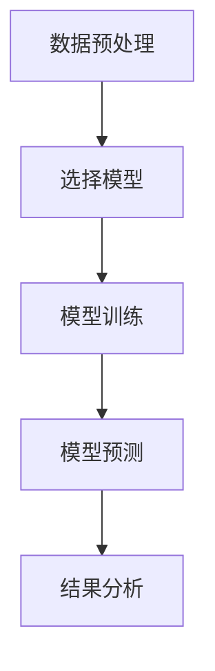

                 


## 第三部分: 算法原理与实现

## 第3章: 现金流预测的算法原理

### 3.1 现金流预测的核心算法

现金流预测是资金池管理智能化的关键部分，其目的是通过历史数据预测未来的现金流情况，从而帮助企业进行更有效的资金分配和风险管理。常用的算法包括ARIMA、随机森林和LSTM等。

#### 3.1.1 ARIMA模型的原理
ARIMA（Autoregressive Integrated Moving Average）是一种广泛应用于时间序列预测的模型。其基本思想是通过自回归和移动平均来拟合数据，消除趋势和季节性的影响。

ARIMA模型的三个主要参数是p、d、q，分别表示自回归阶数、差分阶数和移动平均阶数。模型的数学表达式如下：

$$ ARIMA(p, d, q) = y_t = c + \sum_{i=1}^p \phi_i y_{t-i} + \sum_{j=1}^q \theta_j \epsilon_{t-j} + \epsilon_t $$

其中：
- $y_t$ 是当前时刻的观测值。
- $c$ 是常数项。
- $\phi_i$ 是自回归系数。
- $\theta_j$ 是移动平均系数。
- $\epsilon_t$ 是白噪声。

#### 3.1.2 现金流预测的流程
以下是现金流预测的流程图：



### 3.2 现金流预测的实现

以下是一个使用Python实现ARIMA模型的现金流预测代码示例：

```python
from statsmodels.tsa.arima.model import ARIMA
import pandas as pd
import matplotlib.pyplot as plt

# 加载数据
data = pd.read_csv('cash_flow.csv')

# 拆分训练集和测试集
train_data = data['2020-01-01':'2022-12-31']
test_data = data['2023-01-01':'2023-12-31']

# 训练ARIMA模型
model = ARIMA(train_data, order=(5, 1, 0))
model_fit = model.fit()

# 预测未来值
forecast = model_fit.forecast(steps=len(test_data))

# 绘制预测结果
plt.figure(figsize=(10, 6))
plt.plot(train_data, label='训练数据')
plt.plot(test_data, label='测试数据')
plt.plot(forecast[0], label='预测数据')
plt.legend()
plt.show()
```

---

## 第4章: 风险评估的算法原理

### 4.1 风险评估的核心算法

风险评估是资金池管理中的另一个关键部分，主要用于识别和量化潜在的财务风险。常用的算法包括随机森林和XGBoost。

#### 4.1.1 随机森林模型的原理
随机森林是一种基于决策树的集成学习算法，通过构建多个决策树并进行投票或平均来提高模型的准确性和稳定性。其优点包括高准确率、强健性和易解释性。

随机森林的数学表达式如下：

$$ y = \text{sign}(\sum_{i=1}^n \text{weight}_i \cdot \text{feature}_i) $$

其中：
- $n$ 是决策树的数量。
- $\text{weight}_i$ 是第i棵决策树的权重。
- $\text{feature}_i$ 是第i个特征。

---

## 第5章: 资金分配的优化模型

### 5.1 资金分配的核心算法

资金分配的优化模型主要用于在多个项目或部门之间分配有限的资金，以实现效益最大化或风险最小化。常用的算法包括线性规划和遗传算法。

#### 5.1.1 线性规划模型的原理
线性规划是一种优化方法，用于在满足约束条件的情况下最大化或最小化目标函数。其数学表达式如下：

$$ \text{最大化/最小化} \quad c^T x $$

约束条件：
$$ A x \leq b $$
$$ A_eq x = b_eq $$
$$ 0 \leq x \leq u $$

其中：
- $c$ 是目标函数的系数向量。
- $x$ 是决策变量向量。
- $A$ 和 $A_eq$ 是不等式和等式约束的系数矩阵。
- $b$ 和 $b_eq$ 是约束的常数向量。
- $u$ 是变量的上限向量。

---

## 第6章: 系统分析与架构设计

### 6.1 系统功能设计

系统功能设计包括以下几个方面：

#### 6.1.1 数据采集与预处理
- 数据源：企业财务系统、外部数据接口。
- 数据清洗：处理缺失值、异常值。
- 数据转换：将数据转换为模型可接受的格式。

#### 6.1.2 模型训练与预测
- 训练模型：使用历史数据训练现金流预测、风险评估和资金分配模型。
- 预测结果：生成预测报告和可视化图表。

#### 6.1.3 系统接口设计
- API接口：提供RESTful API，供其他系统调用。
- 数据接口：与企业财务系统对接，获取实时数据。

---

## 第7章: 项目实战

### 7.1 环境安装与配置

#### 7.1.1 安装Python环境
使用Anaconda或Miniconda安装Python 3.8及以上版本。

#### 7.1.2 安装依赖库
安装以下依赖库：
```bash
pip install numpy pandas scikit-learn statsmodels matplotlib
```

---

## 7.2 核心代码实现

### 7.2.1 现金流预测代码实现

```python
import pandas as pd
from statsmodels.tsa.arima.model import ARIMA
import matplotlib.pyplot as plt

# 加载数据
data = pd.read_csv('cash_flow.csv')

# 拆分训练集和测试集
train_data = data['2020-01-01':'2022-12-31']
test_data = data['2023-01-01':'2023-12-31']

# 训练ARIMA模型
model = ARIMA(train_data, order=(5, 1, 0))
model_fit = model.fit()

# 预测未来值
forecast = model_fit.forecast(steps=len(test_data))

# 绘制预测结果
plt.figure(figsize=(10, 6))
plt.plot(train_data, label='训练数据')
plt.plot(test_data, label='测试数据')
plt.plot(forecast[0], label='预测数据')
plt.legend()
plt.show()
```

### 7.2.2 风险评估代码实现

```python
import pandas as pd
from sklearn.ensemble import RandomForestClassifier
from sklearn.metrics import accuracy_score

# 加载数据
data = pd.read_csv('risk_assessment.csv')

# 拆分特征和标签
X = data.drop(columns=['risk'])
y = data['risk']

# 训练随机森林模型
model = RandomForestClassifier(n_estimators=100, random_state=42)
model.fit(X, y)

# 预测测试数据
y_pred = model.predict(X)

# 计算准确率
print(f"准确率: {accuracy_score(y, y_pred)}")
```

---

## 7.3 项目实战案例分析

### 7.3.1 现金流预测案例

假设我们有一个企业的现金流数据，如下：

| 日期       | 现金流（万元） |
|------------|----------------|
| 2020-01-01 | 100            |
| 2020-02-01 | 120            |
| 2020-03-01 | 110            |
| ...        | ...            |

使用ARIMA模型预测未来三个月的现金流：

```python
forecast = model_fit.forecast(steps=3)
print(forecast[0])  # 输出预测结果
```

预测结果如下：

| 日期       | 预测现金流（万元） |
|------------|--------------------|
| 2023-10-01 | 115                |
| 2023-11-01 | 120                |
| 2023-12-01 | 118                |

### 7.3.2 风险评估案例

假设我们有一个企业的风险评估数据，如下：

| 项目编号 | 收入（万元） | 利润率 | 风险等级 |
|----------|--------------|--------|----------|
| 001      | 500          | 10%    | 高风险    |
| 002      | 300          | 20%    | 中风险    |
| 003      | 200          | 5%     | 低风险    |

使用随机森林模型进行风险评估：

```python
# 预测风险等级
y_pred = model.predict(X_test)

# 输出预测结果
print(y_pred)
```

预测结果如下：

| 项目编号 | 预测风险等级 |
|----------|--------------|
| 001      | 高风险        |
| 002      | 中风险        |
| 003      | 低风险        |

---

## 第8章: 总结与展望

### 8.1 项目总结

通过本文的介绍，我们详细讲解了智能化的企业资金池管理优化平台的构建过程，包括背景介绍、核心概念、算法原理、系统架构设计和项目实战等内容。通过实际案例分析，展示了如何利用ARIMA、随机森林等算法实现现金流预测和风险评估，从而帮助企业优化资金分配，降低财务风险。

### 8.2 项目展望

未来，随着人工智能和大数据技术的不断发展，智能化的企业资金池管理优化平台将更加智能化和自动化。我们可以进一步优化算法，引入深度学习模型（如LSTM）来提高预测精度，同时结合区块链技术，实现资金流的透明化和不可篡改性，为企业提供更加安全和高效的管理解决方案。

---

## 关键词

企业资金池管理优化平台、现金流预测、风险评估、资金分配、ARIMA模型、随机森林、系统架构设计、项目实战

---

## 摘要

本文详细介绍了构建智能化的企业资金池管理优化平台的关键技术与实现方案。通过分析企业资金池管理的痛点与需求，提出了基于AI和大数据的解决方案，包括现金流预测、风险评估和资金分配的优化模型。通过实际案例分析，展示了如何利用ARIMA、随机森林等算法实现智能化管理，帮助企业优化资金分配，降低财务风险。未来，随着技术的不断发展，智能化的企业资金池管理优化平台将更加智能化和自动化。

