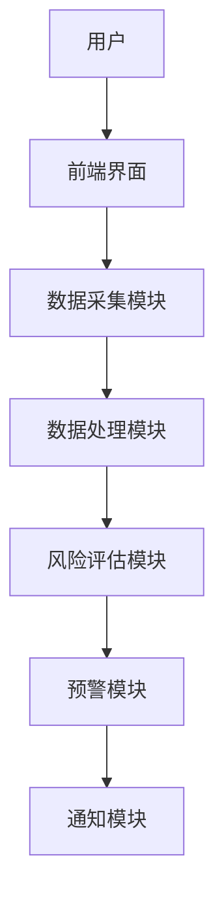
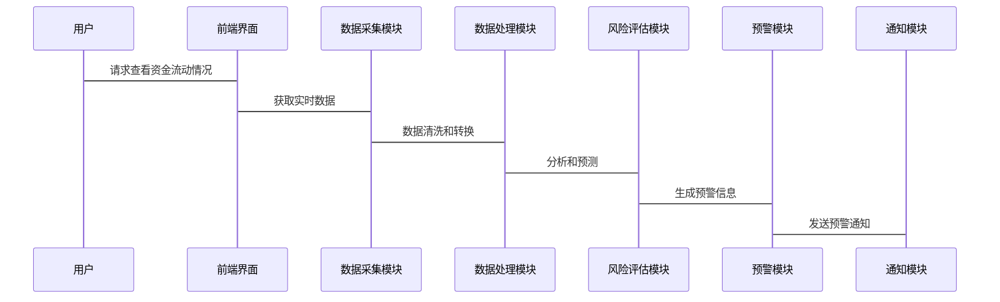

                 


# 构建智能化的企业资金流动性风险动态管理平台

> 关键词：资金流动性风险、智能化管理、动态监控、机器学习、实时预警、企业财务

> 摘要：本文详细探讨了如何构建智能化的企业资金流动性风险动态管理平台，从背景、核心概念、技术实现到系统架构设计，再到项目实战，全面分析了资金流动性风险管理的智能化转型过程。文章结合实际案例，通过机器学习算法、数学模型和系统架构设计，详细阐述了如何利用现代技术手段提升企业资金流动性风险管理的效率和准确性，为企业管理者和IT技术人员提供了实用的解决方案和实践指导。

---

## 第一部分: 资金流动性风险与智能化管理概述

### 第1章: 资金流动性风险的背景与重要性

#### 1.1 企业资金流动性风险的定义

资金流动性风险是指企业在一定时间内无法以合理成本获得足够的资金来满足其资产增长或偿还债务的风险。这种风险通常与企业的现金流管理、融资能力以及市场环境密切相关。资金流动性风险的核心在于企业如何在资金需求与供给之间保持动态平衡，以避免因资金链断裂而导致的经营危机。

**1.1.1 资金流动性风险的核心概念**

- **资金流动**：企业资金的流入和流出，包括销售收入、投资支出、债务偿还等。
- **风险敞口**：企业在特定市场条件下的资金缺口或资金盈余。
- **流动性管理**：通过优化资金调配和融资策略，确保企业资金链的安全性。

**1.1.2 资金流动性风险的分类**

1. **短期流动性风险**：企业短期内的现金流缺口，通常由销售波动、应收账款回收延迟等因素引起。
2. **长期流动性风险**：企业在未来较长时间内的资金缺口，可能由投资扩大、债务偿还等长期需求引起。
3. **市场流动性风险**：由于市场波动导致的资金获取成本上升或难度增加的风险。

**1.1.3 资金流动性风险对企业的影响**

- **直接影响**：可能导致企业无法按时支付账款、员工工资，甚至面临破产风险。
- **间接影响**：影响企业的信用评级，进而影响融资成本和融资能力。

---

#### 1.2 智能化管理的必要性

传统的企业资金管理方式通常依赖于人工操作和静态分析，这种方式在面对复杂多变的市场环境时显得力不从心。智能化管理通过引入人工智能、大数据分析等技术，能够实时监控资金流动情况，预测潜在风险，并提供优化建议。

**1.2.1 传统资金管理的局限性**

- **数据滞后**：传统管理方式通常依赖于定期财务报表，无法实时反映资金流动情况。
- **人工判断**：依赖财务人员的经验判断，容易受到主观因素的影响。
- **效率低下**：人工处理大量数据，效率低且容易出错。

**1.2.2 智能化管理的优势**

- **实时监控**：通过传感器、物联网技术实时采集资金流动数据，实现动态管理。
- **数据驱动决策**：利用大数据分析技术，提供精准的资金流动预测和风险评估。
- **自动化预警**：通过设定阈值，系统自动触发预警，帮助企业在潜在风险发生前采取措施。

**1.2.3 企业资金流动性风险管理的未来趋势**

- **智能化**：通过人工智能技术实现自动化、智能化的资金流动管理。
- **数据驱动**：利用大数据分析技术，提高资金流动预测的准确性。
- **实时性**：实现资金流动的实时监控和动态调整。

---

## 第2章: 资金流动性风险动态管理平台的构建背景

### 2.1 当前企业资金管理面临的挑战

#### 2.1.1 市场波动对企业资金流动性的影响

- **经济周期波动**：经济下行期间，企业可能面临销售下滑、应收账款增加等问题，导致资金流动性风险增加。
- **金融市场波动**：股市、汇市等金融市场的波动可能影响企业的融资成本和资金获取能力。

#### 2.1.2 数据孤岛与信息不透明的问题

- **部门间数据不共享**：财务部门、销售部门、采购部门之间的数据孤岛，导致资金流动信息不完整。
- **信息不透明**：企业内部信息传递不畅，管理层无法及时了解资金流动的真实情况。

#### 2.1.3 传统管理方式的效率低下

- **人工操作**：大量依赖人工处理数据，效率低且容易出错。
- **缺乏预测能力**：传统管理方式难以准确预测资金流动趋势，导致被动应对问题。

---

#### 2.2 智能化管理平台的解决方案

##### 2.2.1 数据驱动的决策支持

- **数据采集与整合**：通过传感器、数据库等技术，实时采集企业内部和外部的资金流动数据，实现数据的整合与分析。
- **数据可视化**：通过图表、仪表盘等方式，直观展示资金流动情况，帮助管理层快速了解资金动态。

##### 2.2.2 实时监控与预警机制

- **实时监控**：系统实时采集和分析资金流动数据，动态更新资金流动状况。
- **预警机制**：根据设定的阈值，当资金流动出现异常时，系统自动触发预警，提醒相关人员采取措施。

##### 2.2.3 人工智能在风险预测中的应用

- **机器学习模型**：利用机器学习算法，分析历史资金流动数据，预测未来的资金流动趋势，识别潜在风险。
- **自然语言处理**：通过分析市场新闻、行业报告等文本数据，提取影响资金流动的潜在因素，辅助风险预测。

---

#### 2.3 平台构建的必要性与目标

##### 2.3.1 平台建设的核心目标

- **实时监控**：实现对企业资金流动的实时监控，确保资金链的安全性。
- **风险预测**：通过机器学习算法，预测资金流动风险，提前采取应对措施。
- **优化决策**：基于数据和模型分析，优化资金流动管理策略，提高资金使用效率。

##### 2.3.2 平台建设的预期效益

- **提高资金流动性管理效率**：通过智能化管理，减少人工操作，提高管理效率。
- **降低资金流动性风险**：通过实时监控和预警机制，有效降低资金流动性风险。
- **提升企业竞争力**：通过优化资金流动管理，提高企业的资金使用效率，增强企业的市场竞争力。

##### 2.3.3 平台建设的实施路径

- **需求分析**：深入了解企业资金流动管理的需求，明确平台的功能和目标。
- **系统设计**：根据需求，设计系统的功能模块、技术架构和数据流。
- **系统开发**：根据设计，进行系统开发，包括数据采集、分析、预警等功能的实现。
- **测试与优化**：对系统进行测试，发现并优化系统中存在的问题。
- **部署与应用**：将系统部署到企业中，进行实际应用，持续优化系统功能。

---

## 第三章: 资金流动性风险动态管理的核心概念与技术

### 3.1 资金流动性风险的核心要素

#### 3.1.1 资金流的定义与属性

- **资金流**：企业资金的流入和流出，包括销售收入、投资支出、债务偿还等。
- **流动性**：资金能够快速转化为现金的能力，反映了资金的灵活性。

#### 3.1.2 风险敞口的计算方法

- **风险敞口**：企业在特定市场条件下的资金缺口或资金盈余。
- **计算方法**：通过分析企业的资金需求和资金供给，计算出企业在不同市场条件下的资金缺口。

#### 3.1.3 流动性管理的关键指标

- **现金周转率**：单位时间内现金的周转次数，反映了资金的流动性。
- **资金缺口率**：资金需求与资金供给之间的缺口占资金需求的比例，反映了资金流动性风险的大小。

---

### 3.2 智能化管理的技术架构

#### 3.2.1 数据采集与处理技术

- **数据采集**：通过传感器、数据库等技术，实时采集企业内部和外部的资金流动数据。
- **数据处理**：对采集到的数据进行清洗、转换和集成，确保数据的准确性和一致性。

#### 3.2.2 风险评估模型

- **机器学习模型**：利用机器学习算法，分析历史资金流动数据，预测未来的资金流动趋势，识别潜在风险。
- **时间序列分析**：通过时间序列分析技术，分析资金流动的历史数据，发现趋势和周期性，辅助风险预测。

#### 3.2.3 预警机制的设计

- **预警规则**：根据企业的实际情况，设定资金流动的预警阈值，当资金流动出现异常时，系统自动触发预警。
- **预警通知**：通过邮件、短信等方式，将预警信息通知相关人员，确保问题能够及时处理。

---

## 第四章: 资金流动性风险动态管理的算法与数学模型

### 4.1 机器学习在资金流动性管理中的应用

#### 4.1.1 机器学习的基本概念

- **机器学习**：通过算法和数据训练模型，使模型能够从数据中学习并做出预测或决策。
- **监督学习**：基于标记的数据进行训练，预测新数据的标签。
- **无监督学习**：基于未标记的数据进行训练，发现数据中的模式和结构。

#### 4.1.2 机器学习在风险预测中的优势

- **自动学习**：机器学习模型能够自动从数据中学习，发现潜在的风险因素。
- **实时更新**：机器学习模型能够实时更新，适应市场的变化，提高预测的准确性。

---

#### 4.1.3 常见的机器学习算法选择

- **线性回归**：适用于线性关系的预测，如资金流动的趋势预测。
- **决策树**：适用于分类和回归问题，能够处理复杂的非线性关系。
- **随机森林**：通过集成多个决策树，提高模型的准确性和稳定性。
- **支持向量机（SVM）**：适用于分类和回归问题，能够处理高维数据。

---

### 4.2 时间序列分析模型

#### 4.2.1 时间序列分析的基本原理

- **时间序列**：按时间顺序排列的数据，反映了变量随时间的变化趋势。
- **平稳时间序列**：均值和方差在时间上保持不变的时间序列。
- **非平稳时间序列**：均值或方差在时间上发生变化的时间序列。

#### 4.2.2 ARIMA模型的实现

- **ARIMA模型**：自回归积分滑动平均模型，适用于非平稳时间序列的预测。
- **模型参数**：包括自回归阶数（p）、差分阶数（d）、滑动平均阶数（q）。
- **模型实现**：通过统计软件（如R、Python）实现ARIMA模型的训练和预测。

#### 4.2.3 LSTM模型的应用

- **LSTM模型**：长短期记忆网络，适用于时间序列数据的预测，能够捕捉长期依赖关系。
- **模型结构**：包括输入门、遗忘门、输出门等组成部分。
- **模型实现**：通过深度学习框架（如TensorFlow、Keras）实现LSTM模型的训练和预测。

---

## 第五章: 数学模型与公式解析

### 5.1 资金流动性风险的数学模型

#### 5.1.1 资金流动的数学模型

$$
\text{资金流动} = \text{资金流入} - \text{资金流出}
$$

- **资金流入**：包括销售收入、投资收益、债务融资等。
- **资金流出**：包括采购支出、工资支出、债务偿还等。

#### 5.1.2 风险敞口的计算公式

$$
\text{风险敞口} = \max(0, \text{资金需求} - \text{资金供给})
$$

- **资金需求**：企业在一定时期内的资金需求，包括运营资金、投资资金等。
- **资金供给**：企业在一定时期内的资金来源，包括自有资金、融资资金等。

#### 5.1.3 资金流动性风险的预测模型

$$
\text{风险概率} = f(\text{历史数据}, \text{市场环境}, \text{企业状况})
$$

- **历史数据**：企业的历史资金流动数据。
- **市场环境**：宏观经济指标、行业发展趋势等。
- **企业状况**：企业的财务状况、经营状况等。

---

## 第六章: 资金流动性风险动态管理的系统架构设计

### 6.1 系统功能设计

#### 6.1.1 数据采集模块

- **功能**：实时采集企业内部和外部的资金流动数据。
- **输入**：传感器、数据库、市场数据接口等。
- **输出**：清洗后的资金流动数据。

#### 6.1.2 风险评估模块

- **功能**：利用机器学习模型和时间序列分析技术，预测资金流动风险。
- **输入**：清洗后的资金流动数据、市场数据等。
- **输出**：风险评估结果、预警信息。

#### 6.1.3 预警模块

- **功能**：根据风险评估结果，触发预警信息。
- **输入**：风险评估结果。
- **输出**：预警通知（邮件、短信等）。

---

### 6.2 系统架构设计

#### 6.2.1 系统架构图



#### 6.2.2 系统交互流程



---

## 第七章: 项目实战

### 7.1 环境安装

#### 7.1.1 安装Python

```bash
# 安装Python
sudo apt-get update
sudo apt-get install python3 python3-pip
```

#### 7.1.2 安装机器学习库

```bash
# 安装机器学习库
pip install numpy pandas scikit-learn tensorflow
```

---

### 7.2 系统核心实现源代码

#### 7.2.1 数据采集模块

```python
import pandas as pd
import requests

# 从数据库获取资金流动数据
def get_data():
    url = "http://localhost:8080/api/financing"
    response = requests.get(url)
    data = response.json()
    df = pd.DataFrame(data)
    return df
```

#### 7.2.2 风险评估模块

```python
from sklearn.ensemble import RandomForestRegressor
import numpy as np

# 训练随机森林模型
def train_model(X, y):
    model = RandomForestRegressor(n_estimators=100, random_state=42)
    model.fit(X, y)
    return model

# 预测资金流动风险
def predict_risk(model, X_test):
    predictions = model.predict(X_test)
    risk = np.mean(predictions)
    return risk
```

#### 7.2.3 预警模块

```python
import smtplib
from email.mime.text import MIMEText

# 发送预警邮件
def send_email(warning_message):
    sender = 'admin@example.com'
    receiver = 'finance@example.com'
    subject = '资金流动风险预警'
    body = warning_message
    message = MIMEText(body)
    message['Subject'] = subject
    message['From'] = sender
    message['To'] = receiver

    smtp = smtplib.SMTP('smtp.example.com', 587)
    smtp.starttls()
    smtp.login(sender, 'password')
    smtp.sendmail(sender, receiver, message.as_string())
    smtp.quit()
```

---

### 7.3 代码应用解读与分析

- **数据采集模块**：通过API接口获取实时资金流动数据，清洗和转换数据，确保数据的准确性和一致性。
- **风险评估模块**：利用随机森林回归模型，训练模型并预测资金流动风险，输出风险概率。
- **预警模块**：根据风险评估结果，触发预警信息，并通过邮件通知相关人员。

---

## 第八章: 总结与展望

### 8.1 总结

本文详细探讨了如何构建智能化的企业资金流动性风险动态管理平台，从背景、核心概念、技术实现到系统架构设计，再到项目实战，全面分析了资金流动性风险管理的智能化转型过程。通过引入机器学习算法、时间序列分析技术和实时监控机制，企业能够实现资金流动的智能化管理，有效降低资金流动性风险，提高资金使用效率。

---

### 8.2 展望

未来，随着人工智能技术的不断发展，企业资金流动性风险管理将更加智能化和自动化。通过引入更先进的机器学习模型、深度学习技术以及大数据分析技术，企业能够更好地应对复杂多变的市场环境，实现更精准的资金流动预测和风险控制。

---

### 8.3 最佳实践 tips

- **数据质量**：确保数据的准确性和完整性，是实现智能化管理的基础。
- **模型优化**：定期更新和优化机器学习模型，提高预测的准确性。
- **系统维护**：定期检查和维护系统，确保系统的稳定性和安全性。

---

通过本文的分析和实践，企业可以更好地理解资金流动性风险管理的智能化转型过程，并结合自身的实际情况，构建适合自己的资金流动性风险动态管理平台。

