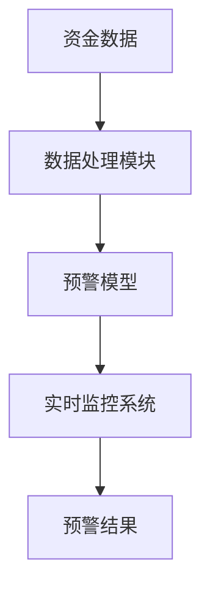
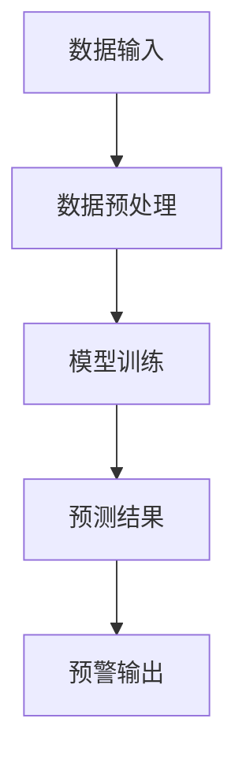
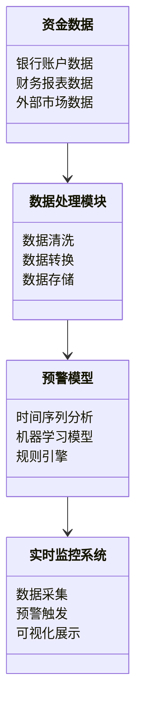
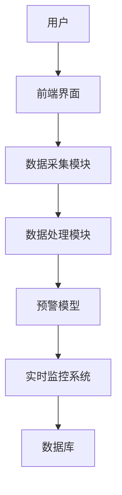
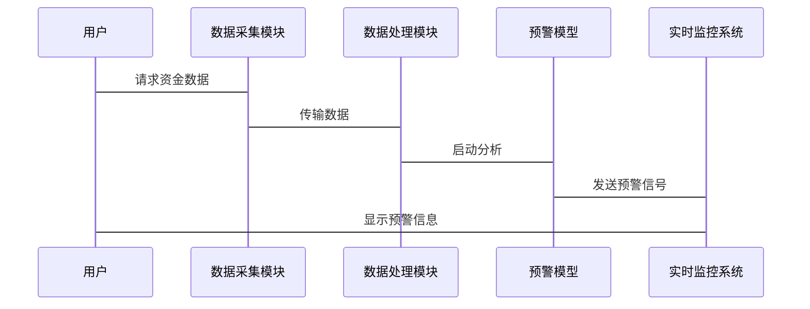

                 


# 构建智能化的企业资金流动性风险预警平台

## 关键词：资金流动性风险，预警平台，人工智能，机器学习，实时监控

## 摘要：资金流动性风险是企业在经营过程中面临的重要挑战之一，智能化的资金流动性风险预警平台能够通过数据分析和预测模型，实时监控企业的资金流动情况，提前发出预警信号，帮助企业采取相应的措施，保障企业的财务健康。本文将详细探讨构建这样一个平台的核心概念、算法原理、系统架构设计以及项目实战，为企业的资金管理提供有力支持。

---

# 第1章: 资金流动性风险与智能化预警平台概述

## 1.1 资金流动性风险的定义与特征

### 1.1.1 资金流动性风险的定义
资金流动性风险是指企业在一定时期内无法及时获得足够的资金来应对负债偿还、资产购买或其他支付需求的风险。这种风险可能由多种因素引起，包括市场波动、供应链问题或企业内部管理不当等。

### 1.1.2 资金流动性风险的特征
- **时间性**：资金流动性风险通常与时间有关，企业在不同时间段内的资金需求和可用性不同。
- **波动性**：资金流动受到市场环境和企业运营的影响，具有一定的波动性。
- **突发性**：某些情况下，资金流动性风险可能是突发的，如突然的大额支付需求或意外的资金短缺。

### 1.1.3 资金流动性风险对企业的影响
资金流动性风险可能引发企业无法按时偿还债务、错失市场机会或甚至导致企业倒闭。因此，及时识别和管理资金流动性风险对企业的生存和发展至关重要。

## 1.2 智能化资金流动性风险预警平台的意义

### 1.2.1 传统资金管理的局限性
传统的资金管理方式通常依赖于人工记录和定期报表，这种方式效率低下，难以实时监控资金流动情况，且容易受到人为因素的影响。

### 1.2.2 智能化预警平台的优势
智能化的资金流动性风险预警平台通过自动化数据采集、智能分析和实时监控，能够快速识别潜在的资金问题，并提供预警和解决方案。

### 1.2.3 平台对企业财务管理的价值
- **提高效率**：自动化数据处理和实时监控节省了大量时间和人力资源。
- **精准预警**：通过先进的算法模型，能够更准确地预测资金流动风险。
- **决策支持**：为企业管理者提供数据支持，帮助其做出更明智的财务决策。

---

# 第2章: 平台的核心概念与体系结构

## 2.1 核心概念与模块

### 2.1.1 数据源模块
- **银行账户数据**：包括银行存款、转账记录等。
- **财务报表数据**：如资产负债表、利润表等。
- **外部市场数据**：如行业趋势、市场波动等。

### 2.1.2 预警模型模块
- **时间序列分析**：用于预测未来资金流动情况。
- **机器学习模型**：如随机森林、支持向量机等，用于分类和回归分析。
- **规则引擎**：基于预设的阈值和条件触发预警。

### 2.1.3 实时监控模块
- **数据采集**：实时获取企业资金流动数据。
- **预警触发**：当模型预测到潜在风险时，立即发出预警。
- **可视化界面**：以图表形式展示资金流动情况和预警信息。

## 2.2 系统核心要素对比

### 2.2.1 数据源特征对比表

| 数据源 | 特征 |
|--------|------|
| 银行账户数据 | 实时性高，数据更新频率快 |
| 财务报表数据 | 数据全面，但更新周期较长 |
| 外部市场数据 | 反映市场整体趋势，具有参考价值 |

### 2.2.2 预警模型属性对比表

| 模型类型 | 优势 | 劣势 |
|----------|-------|------|
| 时间序列分析 | 适合处理具有趋势和周期性的数据 | 对异常值敏感 |
| 机器学习模型 | 能够捕捉复杂模式 | 需要大量数据和计算资源 |
| 规则引擎 | 易于理解和维护 | 可能不够灵活 |

### 2.2.3 实时监控系统功能对比表

| 功能 | 描述 | 实现方式 |
|------|------|----------|
| 数据采集 | 实时获取资金流动数据 | API接口、数据库查询 |
| 预警触发 | 当模型预测到风险时，触发预警 | 基于阈值和条件的规则引擎 |
| 可视化 | 以图表形式展示数据 | 使用数据可视化工具如Tableau、Python的Matplotlib |

## 2.3 系统实体关系图



---

# 第3章: 基于时间序列分析的预警算法

## 3.1 时间序列分析的基本原理

### 3.1.1 时间序列的分解
时间序列分析通常包括以下几个步骤：
1. **趋势分析**：识别数据中的长期趋势。
2. **季节性分析**：识别数据中的周期性波动。
3. **剩余波动分析**：分析数据中无法用趋势和季节性解释的部分。

### 3.1.2 常见的时间序列模型
- **ARIMA模型**：自回归积分滑动平均模型，适用于具有趋势和季节性的数据。
- **Prophet模型**：由Facebook开源，适合处理有明确时间依赖性的数据。

## 3.2 基于ARIMA模型的实现

### 3.2.1 ARIMA模型的数学公式
$$ARIMA(p, d, q) = 0$$
其中，p为自回归阶数，d为差分阶数，q为滑动平均阶数。

### 3.2.2 ARIMA模型的实现步骤


### 3.2.3 ARIMA模型的Python代码实现
```python
import statsmodels.api as sm

def arima_predict(data, order):
    model = sm.tsa.ARIMA(data, order=order)
    result = model.fit()
    return result.forecast(steps=1)
```

---

# 第4章: 机器学习算法在预警中的应用

## 4.1 常见机器学习算法概述

### 4.1.1 监督学习算法
- **随机森林**：适用于分类和回归问题，能够处理高维数据。
- **支持向量机（SVM）**：适用于分类问题，能够处理非线性数据。

### 4.1.2 非监督学习算法
- **K-means**：适用于聚类分析，帮助识别数据中的潜在模式。

### 4.1.3 深度学习算法
- **LSTM**：适用于时间序列数据，能够捕捉长期依赖关系。

## 4.2 机器学习算法的实现步骤

### 4.2.1 数据预处理
- **特征提取**：从原始数据中提取有用的特征。
- **数据标准化**：将数据标准化到统一的范围内。

### 4.2.2 模型训练
- **选择算法**：根据问题类型选择合适的算法。
- **训练模型**：使用训练数据训练模型。

### 4.2.3 模型评估
- **评估指标**：使用准确率、召回率等指标评估模型性能。
- **调优模型**：通过网格搜索等方法优化模型参数。

---

# 第5章: 系统分析与架构设计

## 5.1 问题场景介绍

### 5.1.1 企业资金管理的典型问题
- 资金流动不透明，难以实时监控。
- 缺乏有效的预警机制，导致风险应对不及时。

## 5.2 系统功能设计

### 5.2.1 领域模型类图


## 5.3 系统架构设计

### 5.3.1 系统架构图


## 5.4 系统接口设计

### 5.4.1 接口描述
- **数据接口**：与企业财务系统对接，获取资金流动数据。
- **预警接口**：向企业财务人员发送预警通知。

## 5.5 系统交互序列图



---

# 第6章: 项目实战

## 6.1 环境安装

### 6.1.1 安装Python和必要的库
- **安装Python**：建议使用最新版本的Python。
- **安装库**：`pip install statsmodels matplotlib pandas`

## 6.2 核心代码实现

### 6.2.1 数据处理代码
```python
import pandas as pd

# 数据加载
data = pd.read_csv('financial_data.csv')

# 数据清洗
data.dropna(inplace=True)
data = data.astype('float64')
```

### 6.2.2 预警模型代码
```python
from statsmodels.tsa.arima.model import ARIMA

def train_arima_model(data, order):
    model = ARIMA(data, order=order)
    model_fit = model.fit()
    return model_fit
```

### 6.2.3 实时监控代码
```python
import time

def real_time_monitor(data_stream, model):
    while True:
        # 获取最新数据
        latest_data = next(data_stream)
        # 更新模型
        updated_model = model.update(latest_data)
        # 预警判断
        if updated_model.forecast(steps=1) < threshold:
            print("预警：预计未来1小时资金不足！")
        time.sleep(60)
```

## 6.3 实际案例分析

### 6.3.1 案例背景
某制造企业由于原材料价格上涨，导致资金流动紧张，需要提前预测和管理资金风险。

### 6.3.2 数据分析
通过对企业的历史交易数据和市场数据进行分析，识别出某些供应商付款周期延长，可能引发资金链断裂的风险。

### 6.3.3 预警结果
平台预测未来两周内企业可能面临资金短缺，建议企业提前筹措资金或调整采购策略。

---

# 第7章: 总结与展望

## 7.1 最佳实践 tips
- 数据的实时性和准确性是平台运行的基础。
- 选择合适的算法和模型是确保预警准确性的关键。
- 系统的可扩展性和可维护性需要在设计阶段充分考虑。

## 7.2 小结
通过构建智能化的资金流动性风险预警平台，企业可以更有效地管理和应对资金流动风险，保障企业的财务健康和稳定发展。

## 7.3 注意事项
- 数据隐私和安全问题需要高度重视。
- 系统的稳定性和可靠性是确保预警机制正常运行的前提。
- 需要定期对模型进行更新和优化，以适应不断变化的市场环境。

## 7.4 拓展阅读
- 《时间序列分析与应用》
- 《机器学习实战》
- 《企业风险管理》

---

# 结语

构建智能化的企业资金流动性风险预警平台是一项复杂但极具价值的工程。通过结合先进的数据分析技术和人工智能算法，企业可以更精准地预测和管理资金流动风险，从而在竞争激烈的市场中保持优势。未来，随着技术的不断进步，预警平台的功能和性能将不断提升，为企业提供更加全面和智能的资金管理支持。

