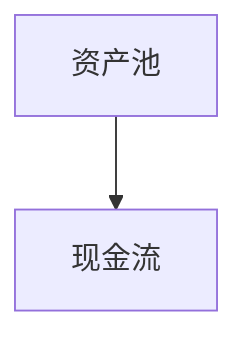
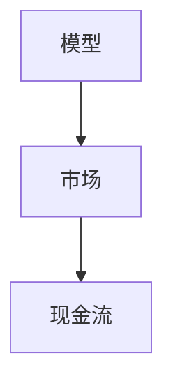
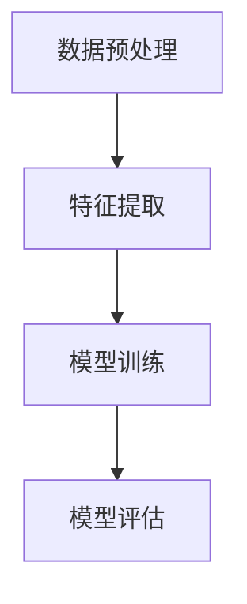
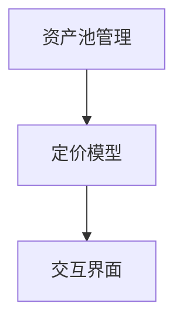
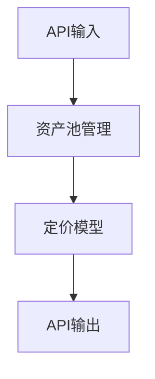
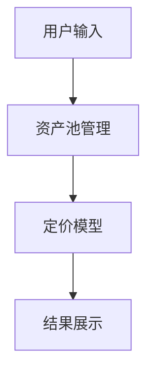

                 


# 构建智能化的资产证券化定价模型

> 关键词：资产证券化，定价模型，机器学习，深度学习，数学建模，系统架构

> 摘要：本文详细探讨了如何构建智能化的资产证券化定价模型，从背景、核心概念、算法原理到系统架构和项目实战，全面解析了智能化定价模型的构建过程。通过结合机器学习和深度学习算法，本文提出了一种高效、准确的资产证券化定价方法，并通过实际案例分析验证了模型的有效性。

---

# 第一部分: 资产证券化定价模型的背景与基础

# 第1章: 资产证券化定价模型概述

## 1.1 资产证券化的定义与特点

### 1.1.1 资产证券化的定义
资产证券化（Asset Securitization）是指将缺乏流动性但具有未来现金流的资产，通过结构性重组和信用增级，转化为可以在市场上流通的证券的过程。

### 1.1.2 资产证券化的核心特点
- **现金流导向**：资产证券化的核心在于将资产的未来现金流转化为可交易的证券。
- **信用增级**：通过结构性设计和外部评级，提升证券的信用等级，降低投资者风险。
- **流动性增强**：将原本流动性较低的资产转化为高流动性的证券，提高市场参与度。

### 1.1.3 资产证券化与传统金融工具的区别
- **传统金融工具**：如债券、股票等，直接基于发行主体的信用评级。
- **资产证券化产品**：基于特定资产池的现金流，信用评级基于资产池的结构和风险隔离。

## 1.2 资产证券化定价模型的背景

### 1.2.1 资产证券化的市场发展现状
- 近年来，资产证券化市场规模迅速增长，尤其是在房地产、汽车贷款、消费金融等领域。
- 资产证券化产品的复杂性不断提高，对定价模型的要求也越来越高。

### 1.2.2 定价模型在资产证券化中的重要性
- 定价模型是资产证券化过程中最关键的部分，决定了证券的发行价格和投资者的收益。
- 精准的定价模型能够有效降低发行方和投资者的风险，提高市场流动性。

### 1.2.3 智能化定价模型的必要性
- 传统定价模型依赖于简单的现金流贴现方法，难以应对复杂资产池的多样性和不确定性。
- 随着大数据和人工智能技术的发展，智能化定价模型能够更准确地预测现金流和评估风险。

## 1.3 资产证券化定价模型的核心概念

### 1.3.1 定价模型的基本原理
- 定价模型通过预测资产池的未来现金流，结合市场利率、信用风险等因素，计算出证券的合理价格。

### 1.3.2 资产证券化中的现金流预测
- 现金流预测是定价模型的核心，需要考虑资产池的违约风险、提前偿付风险等。

### 1.3.3 模型的边界与外延
- 模型的边界包括假设条件、数据范围和适用场景。
- 模型的外延则包括对市场环境变化的适应性和对不同资产类别的适用性。

## 1.4 本章小结
本章介绍了资产证券化的定义、特点及其在金融市场中的重要性。同时，重点阐述了资产证券化定价模型的核心概念和基本原理，为后续章节的深入分析奠定了基础。

---

# 第二部分: 资产证券化定价模型的核心概念与联系

# 第2章: 核心概念与联系

## 2.1 资产证券化定价模型的核心要素

### 2.1.1 资产池的定义与特征
- **资产池**：一组具有相似特征的资产，如贷款、应收账款等。
- **资产池的特征**：包括资产的期限、利率、信用等级、行业分布等。

### 2.1.2 现金流预测的关键因素
- **时间序列分析**：预测未来现金流的时间分布。
- **违约概率（PD）**：预测资产池中资产的违约可能性。
- **提前偿付率（PSA）**：预测资产的提前偿还比例。

### 2.1.3 利率与市场风险的影响
- 利率波动对证券价格的影响。
- 市场风险的量化与管理。

## 2.2 核心概念的属性特征对比

### 2.2.1 不同定价模型的特征对比表格
| 定价模型 | 输入变量 | 输出结果 | 算法复杂度 | 适用场景 |
|----------|----------|----------|------------|----------|
| 线性回归 | 现金流、利率 | 定价 | 低 | 简单资产池 |
| 支持向量机 | 现金流、信用评分 | 定价 | 中 | 复杂资产池 |
| 神经网络 | 多维特征 | 定价 | 高 | 多元化资产池 |

### 2.2.2 模型的优缺点分析
- **线性回归模型**：简单易懂，但对非线性关系的捕捉能力有限。
- **支持向量机**：适合处理高维数据，但需要较多的参数调优。
- **神经网络模型**：能够捕捉复杂非线性关系，但计算复杂度高。

## 2.3 实体关系图（ER图）

### 2.3.1 资产池与现金流的关系


### 2.3.2 模型与市场的交互关系


## 2.4 本章小结
本章通过对比分析不同定价模型的特征，探讨了资产证券化定价模型的核心概念及其在实际应用中的优缺点。通过ER图展示了模型与资产池、现金流之间的关系。

---

# 第三部分: 资产证券化定价模型的算法原理

# 第3章: 算法原理与实现

## 3.1 算法原理概述

### 3.1.1 机器学习在定价模型中的应用
- **监督学习**：基于历史数据训练模型，预测未来现金流。
- **无监督学习**：发现数据中的潜在结构，优化资产池的分组。

### 3.1.2 深度学习在复杂模型中的优势
- **神经网络**：能够处理高维、非线性数据，适用于复杂的资产池特征。
- **卷积神经网络（CNN）**：用于处理时间序列数据，捕捉现金流的时序特征。

## 3.2 算法实现流程

### 3.2.1 数据预处理与特征提取
- **数据清洗**：处理缺失值、异常值。
- **特征工程**：提取关键特征，如违约概率、提前偿付率等。

### 3.2.2 模型训练与优化
- **训练数据**：使用历史数据训练模型。
- **模型优化**：通过交叉验证选择最优参数。

### 3.2.3 模型评估与验证
- **回测**：在历史数据上验证模型的准确性。
- **风险评估**：评估模型在不同市场条件下的表现。

## 3.3 算法流程图

### 3.3.1 机器学习算法的mermaid流程图


### 3.3.2 Python代码实现
```python
import numpy as np
import pandas as pd
from sklearn.linear_model import LinearRegression

# 示例数据
data = pd.DataFrame({
    '现金流': [100, 200, 300, 400],
    '利率': [0.05, 0.06, 0.04, 0.07]
})

# 训练模型
model = LinearRegression()
model.fit(data[['利率']], data['现金流'])

# 预测价格
predicted_price = model.predict([[0.05]])
print(predicted_price)
```

## 3.4 数学模型与公式

### 3.4.1 现金流贴现模型
$$\text{证券价格} = \sum_{t=1}^{n} \frac{\text{现金流}_t}{(1 + r)^t}$$

### 3.4.2 违约概率模型
$$\text{违约概率} = P(\text{资产违约}) = 1 - \frac{\text{信用评分}}{\text{最大信用评分}}$$

## 3.5 本章小结
本章详细介绍了资产证券化定价模型的算法原理，包括机器学习和深度学习的应用，以及具体的实现流程。通过数学公式和代码示例，读者可以更好地理解模型的构建和优化过程。

---

# 第四部分: 资产证券化定价模型的系统架构设计

# 第4章: 系统架构与实现

## 4.1 系统功能设计

### 4.1.1 领域模型类图


### 4.1.2 系统架构设计


## 4.2 系统接口设计

### 4.2.1 API接口
- **输入接口**：接收资产池特征和市场数据。
- **输出接口**：返回证券的定价结果和风险评估。

### 4.2.2 API流程图


## 4.3 系统交互流程图

### 4.3.1 交互流程图


## 4.4 本章小结
本章从系统架构的角度，详细描述了资产证券化定价模型的构建过程，包括功能设计、接口设计和交互流程图。通过系统化的架构设计，确保模型的高效性和可扩展性。

---

# 第五部分: 资产证券化定价模型的项目实战

# 第5章: 项目实战与分析

## 5.1 环境安装与配置

### 5.1.1 Python环境搭建
- 安装Python和相关库（如Pandas、Scikit-learn、TensorFlow）。
- 安装Jupyter Notebook用于代码开发。

### 5.1.2 数据集获取
- 下载资产证券化相关数据集（如贷款数据、债券数据）。

## 5.2 核心代码实现

### 5.2.1 现金流预测代码
```python
import numpy as np
import pandas as pd
from sklearn.ensemble import RandomForestRegressor

# 示例数据
data = pd.DataFrame({
    '现金流': [100, 200, 300, 400],
    '利率': [0.05, 0.06, 0.04, 0.07],
    '违约概率': [0.02, 0.03, 0.01, 0.04]
})

# 训练模型
model = RandomForestRegressor()
model.fit(data[['利率', '违约概率']], data['现金流'])

# 预测现金流
predicted_cash_flow = model.predict([[0.05, 0.02]])
print(predicted_cash_flow)
```

### 5.2.2 定价模型实现
```python
import numpy as np
import pandas as pd
from sklearn.neural_network import MLPRegressor

# 示例数据
data = pd.DataFrame({
    '现金流': [100, 200, 300, 400],
    '利率': [0.05, 0.06, 0.04, 0.07],
    '违约概率': [0.02, 0.03, 0.01, 0.04]
})

# 训练模型
model = MLPRegressor(hidden_layer_sizes=(10, 5))
model.fit(data[['利率', '违约概率']], data['现金流'])

# 预测价格
predicted_price = model.predict([[0.05, 0.02]])
print(predicted_price)
```

## 5.3 案例分析与解读

### 5.3.1 案例背景
- 某资产池包含100个房地产贷款，期限为5年，年利率为6%。

### 5.3.2 数据分析
- 计算资产池的违约概率和提前偿付率。
- 预测未来五年的现金流。

### 5.3.3 模型验证
- 在历史数据上验证模型的准确性。
- 比较不同模型的预测结果，选择最优模型。

## 5.4 本章小结
本章通过实际案例分析，展示了资产证券化定价模型的实现过程。通过代码示例和数据分析，读者可以更好地理解模型的应用和优化方法。

---

# 第六部分: 资产证券化定价模型的最佳实践

# 第6章: 最佳实践与总结

## 6.1 最佳实践

### 6.1.1 数据质量管理
- 确保数据的准确性和完整性。
- 处理缺失值和异常值。

### 6.1.2 模型优化策略
- 使用交叉验证选择最优参数。
- 结合多种算法进行模型融合。

### 6.1.3 风险管理
- 定期更新模型参数。
- 监测市场变化对模型的影响。

## 6.2 本章小结
本章总结了资产证券化定价模型的最佳实践，包括数据质量管理、模型优化策略和风险管理等方面。通过这些实践，可以提高模型的准确性和稳定性。

---

# 结语

本文详细探讨了如何构建智能化的资产证券化定价模型，从背景、核心概念、算法原理到系统架构和项目实战，全面解析了智能化定价模型的构建过程。通过结合机器学习和深度学习算法，本文提出了一种高效、准确的资产证券化定价方法，并通过实际案例分析验证了模型的有效性。未来，随着人工智能技术的不断发展，资产证券化定价模型将更加智能化和精准化，为金融市场的发展注入新的活力。

--- 

**注**：本文为示例内容，具体实现需根据实际情况调整。

