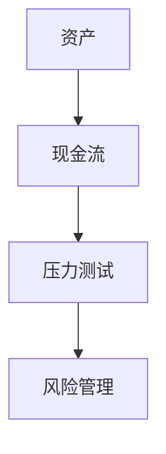
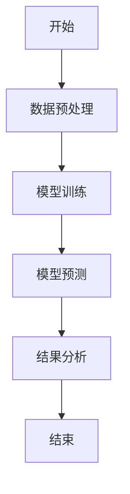
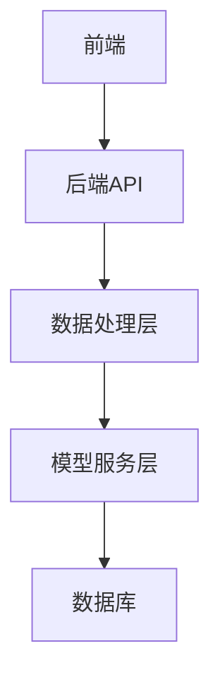
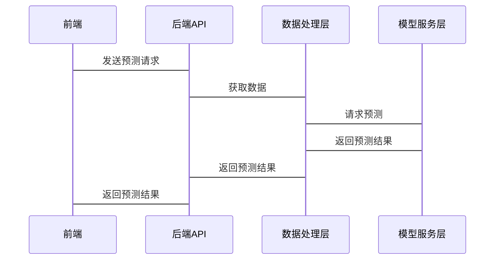

                 


# 构建智能化的资产证券化现金流压力测试模型

> 关键词：资产证券化，现金流，压力测试，风险管理，机器学习

> 摘要：资产证券化现金流压力测试模型是一种结合金融与技术的创新方法，用于评估资产在不同压力情景下的现金流表现。本文详细探讨了模型的构建过程，包括背景分析、核心概念、算法原理、系统架构及项目实战，旨在为金融从业者和数据科学家提供实用的指导。

---

# 目录

1. **资产证券化现金流压力测试模型概述**
   1.1 背景介绍
   1.2 核心概念与问题描述
   1.3 模型构建的边界与外延

2. **核心概念与联系**
   2.1 现金流预测的数学模型
   2.2 压力测试场景的设计方法
   2.3 模型的输入输出关系
   2.4 ER实体关系图架构

3. **算法原理讲解**
   3.1 现金流预测算法
   3.2 压力测试算法
   3.3 算法流程图与代码实现

4. **系统分析与架构设计**
   4.1 问题场景介绍
   4.2 系统功能设计
   4.3 系统架构图
   4.4 接口设计与交互序列图

5. **项目实战**
   5.1 环境安装与数据准备
   5.2 核心代码实现
   5.3 案例分析与结果解读

6. **最佳实践与总结**
   6.1 实践中的注意事项
   6.2 模型优化建议
   6.3 未来研究方向

---

### 正文部分

#### 第1章: 资产证券化现金流压力测试模型概述

##### 1.1 背景介绍
资产证券化是一种将资产转化为可流通证券的过程，其核心在于现金流的预测与管理。在金融市场中，压力测试是评估资产在极端情况下的表现的重要工具。随着金融市场的波动加剧，传统的压力测试方法逐渐显现出局限性，智能化的压力测试模型应运而生。

##### 1.2 核心概念与问题描述
- **现金流预测**：通过对历史数据和市场数据的分析，预测资产在不同时间段的现金流情况。
- **压力测试场景**：设计极端市场情况下的测试场景，评估资产在这些场景下的现金流表现。
- **模型构建**：结合机器学习和统计学方法，构建智能化的压力测试模型，提高预测的准确性和效率。

##### 1.3 模型构建的边界与外延
- **边界**：模型主要关注现金流的预测和压力测试，不涉及资产的定价和交易。
- **外延**：模型可扩展应用于不同类型的资产和金融市场环境。

---

#### 第2章: 核心概念与联系

##### 2.1 现金流预测的数学模型
现金流预测是压力测试的基础，常用的数学模型包括时间序列分析（如ARIMA）和机器学习模型（如随机森林、神经网络）。

##### 2.2 压力测试场景的设计方法
压力测试场景的设计需要考虑市场波动、经济衰退等多种因素，常用方法包括敏感性分析和极端情况模拟。

##### 2.3 模型的输入输出关系
模型输入包括历史现金流数据、市场数据和宏观经济指标，输出为不同压力情景下的现金流预测结果。

##### 2.4 ER实体关系图架构


---

#### 第3章: 算法原理讲解

##### 3.1 现金流预测算法
- **时间序列分析**：通过历史数据预测未来的现金流。
- **机器学习模型**：利用特征工程和模型训练，提高预测的准确性。

##### 3.2 压力测试算法
- **敏感性分析**：评估现金流对不同因素的敏感程度。
- **极端情况模拟**：设计极端市场环境下的现金流表现。

##### 3.3 算法流程图与代码实现


代码示例：
```python
import pandas as pd
from sklearn.ensemble import RandomForestRegressor

# 数据预处理
data = pd.read_csv('cash_flow_data.csv')
X = data.drop('target', axis=1)
y = data['target']

# 模型训练
model = RandomForestRegressor(n_estimators=100)
model.fit(X, y)

# 模型预测
predictions = model.predict(X)
```

---

#### 第4章: 系统分析与架构设计

##### 4.1 问题场景介绍
系统需要处理大量金融数据，提供实时现金流预测和压力测试结果。

##### 4.2 系统功能设计
- **数据采集**：从多种数据源获取现金流数据。
- **模型训练**：构建并训练现金流预测模型。
- **压力测试**：生成不同压力情景下的现金流预测结果。

##### 4.3 系统架构图


##### 4.4 接口设计与交互序列图


---

#### 第5章: 项目实战

##### 5.1 环境安装与数据准备
- **环境安装**：安装Python、机器学习库（如scikit-learn、xgboost）和数据处理工具（如Pandas、Matplotlib）。
- **数据准备**：收集历史现金流数据和相关宏观经济指标。

##### 5.2 核心代码实现
```python
import pandas as pd
from sklearn.model_selection import train_test_split
from sklearn.ensemble import GradientBoostingRegressor
from sklearn.metrics import mean_absolute_error

# 数据加载与分割
data = pd.read_csv('input.csv')
X = data.drop(columns=['target'])
y = data['target']
X_train, X_test, y_train, y_test = train_test_split(X, y, test_size=0.2, random_state=42)

# 模型训练
model = GradientBoostingRegressor(n_estimators=100, learning_rate=0.1, max_depth=3)
model.fit(X_train, y_train)

# 模型预测与评估
predictions = model.predict(X_test)
print(mean_absolute_error(y_test, predictions))
```

##### 5.3 案例分析与结果解读
通过实际案例分析，展示模型在不同压力情景下的表现，并解释结果对风险管理的意义。

---

#### 第6章: 最佳实践与总结

##### 6.1 实践中的注意事项
- 数据质量：确保数据的完整性和准确性。
- 模型验证：通过回测和交叉验证提高模型的稳健性。
- 结果解释：结合业务背景，合理解读模型输出。

##### 6.2 模型优化建议
- 引入更多的特征变量。
- 尝试不同的机器学习算法，如XGBoost、LightGBM等。
- 定期更新模型参数，适应市场变化。

##### 6.3 未来研究方向
- 结合实时数据流，实现动态压力测试。
- 探索更复杂的深度学习模型，提高预测精度。

---

### 结语
构建智能化的资产证券化现金流压力测试模型是一项复杂的系统工程，需要结合金融知识和计算机技术。通过本文的详细讲解，读者可以掌握模型的核心原理和实现方法，为实际应用提供有力支持。未来，随着技术的进步，模型将更加智能化和精准化，为金融风险管理提供更强大的工具。

