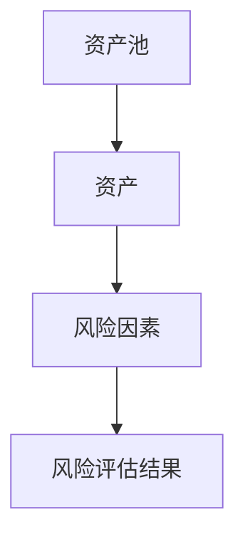
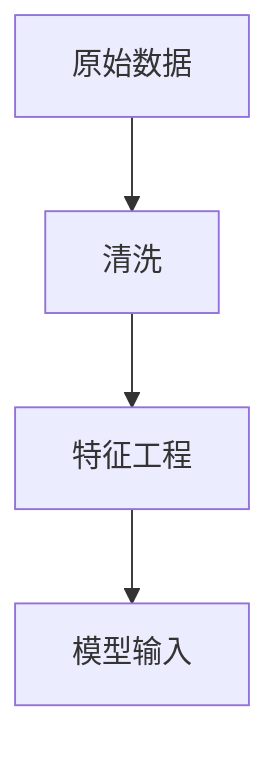
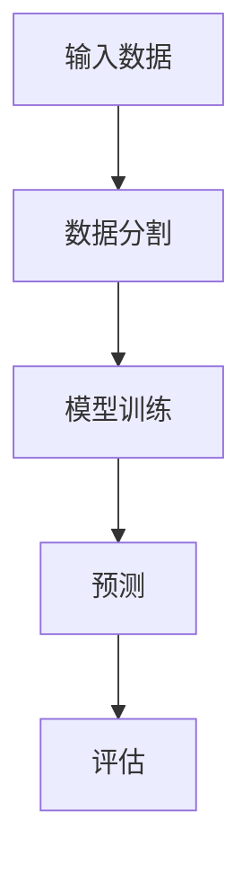
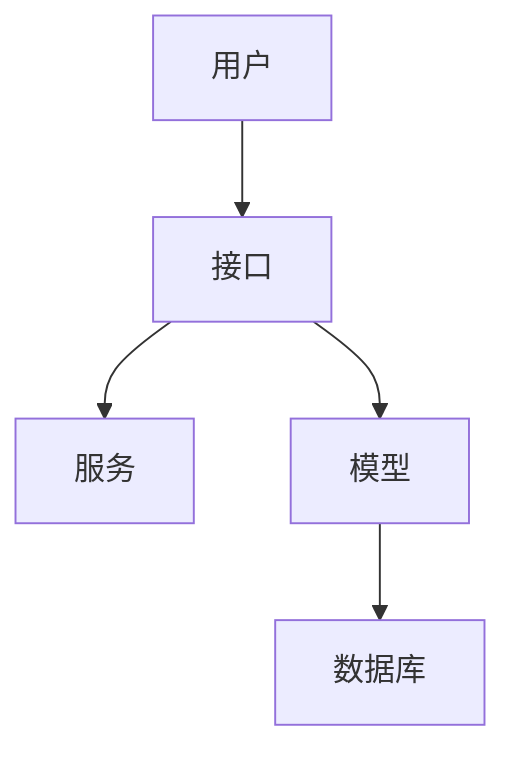

                 


# 构建智能化的资产证券化风险评估模型

## 关键词：资产证券化，风险评估，人工智能，机器学习，大数据

## 摘要：  
资产证券化是一种将非流动性资产转化为可交易证券的过程，其核心在于风险评估。传统的风险评估方法存在效率低下、精度不足等问题，随着人工智能和大数据技术的发展，构建智能化的资产证券化风险评估模型成为可能。本文将详细探讨如何利用机器学习算法、大数据分析和系统架构设计来构建高效、准确的智能化风险评估模型，并通过实际案例展示其应用。

---

# 第一部分: 资产证券化风险评估模型背景与基础

## 第1章: 资产证券化与风险评估概述

### 1.1 资产证券化的定义与流程
#### 1.1.1 资产证券化的定义  
资产证券化是指将流动性较低的资产（如应收账款、房地产等）转化为可在市场上交易的证券的过程。通过资产证券化，投资者可以间接投资于原本难以直接投资的资产类别，而发起人则能够快速回笼资金。

#### 1.1.2 资产证券化的基本流程  
1. **资产池的组建**：选择具有相似风险和收益特征的资产，形成一个资产池。  
2. **信用增级**：通过结构化设计（如优先级和次级债券）或外部担保，提高资产池的信用评级。  
3. **发行证券**：将资产池打包成可以在市场上销售的证券（如ABS、MBS）。  
4. **现金流分配**：根据证券的优先级，将现金流分配给不同投资者。

#### 1.1.3 资产证券化的重要性和作用  
资产证券化能够帮助发起人盘活存量资产，降低融资成本，同时也为投资者提供了更多投资选择。

---

### 1.2 风险评估的核心概念  
#### 1.2.1 风险评估的基本概念  
风险评估是指对资产池在未来可能面临的各种风险（如信用风险、市场风险、流动性风险等）进行量化和分析的过程。  

#### 1.2.2 资产证券化中的主要风险类型  
1. **信用风险**：资产池中的债务人可能无法按时偿还债务。  
2. **市场风险**：市场波动可能导致证券价值下降。  
3. **流动性风险**：资产池中的资产可能难以快速变现。  
4. **操作风险**：资产池管理中的操作失误可能导致损失。  

#### 1.2.3 风险评估的必要性和挑战  
风险评估是资产证券化的核心环节，其准确性直接关系到证券的价值和投资者的收益。然而，传统方法依赖经验判断，存在主观性强、效率低、精度不足等问题。

---

### 1.3 智能化风险评估的背景与意义  
#### 1.3.1 传统风险评估方法的局限性  
传统方法通常依赖历史数据和统计分析，难以捕捉复杂市场环境中的非线性关系和实时变化。

#### 1.3.2 智能化技术在风险评估中的优势  
- 数据驱动：利用大数据技术获取海量数据，构建更全面的特征。  
- 高精度：通过机器学习算法（如随机森林、XGBoost等）提高预测准确性。  
- 实时性：智能化系统可以实时更新模型，适应市场变化。  

#### 1.3.3 资产证券化智能化发展的趋势  
随着人工智能和大数据技术的快速发展，智能化风险评估成为资产证券化领域的必然趋势。

---

## 第2章: 资产证券化风险评估的核心概念与联系

### 2.1 风险评估的核心要素  
#### 2.1.1 资产池的特征分析  
- 资产池的规模、期限、行业分布等。  
- 资产池中债务人的信用状况（如违约率、还款能力等）。  

#### 2.1.2 信用风险的关键因素  
- 债务人的信用评级。  
- 资产池的结构化设计（如优先级和次级债券）。  

#### 2.1.3 市场风险的评估指标  
- 利率波动对证券价值的影响。  
- 市场流动性对资产池变现能力的影响。  

---

### 2.2 核心概念的属性对比  
#### 2.2.1 不同风险类型的核心属性对比  
| 风险类型 | 核心属性 | 影响因素 |  
|----------|----------|----------|  
| 信用风险 | 违约概率 | 债务人信用状况 |  
| 市场风险 | 资产价值波动 | 利率、市场流动性 |  
| 流动性风险 | 资产变现能力 | 市场需求、交易深度 |  

#### 2.2.2 资产池特征与风险的关系分析  
资产池的特征（如资产类型、地域分布）直接影响其风险敞口。例如，集中于房地产行业的资产池可能面临更高的市场风险。

#### 2.2.3 ER实体关系图架构  


---

## 第3章: 数据收集与处理

### 3.1 数据来源与预处理  
#### 3.1.1 数据来源渠道  
- **内部数据**：资产池的历史交易数据、债务人信用记录等。  
- **外部数据**：市场数据（如利率、指数）、宏观经济指标等。  

#### 3.1.2 数据清洗与标准化  
- **数据清洗**：去除重复、缺失或异常数据。  
- **标准化**：将数据归一化，便于模型训练。  

#### 3.1.3 数据增强方法  
- **特征工程**：通过组合现有特征或引入新特征（如时间序列特征）来提高模型性能。  

---

### 3.2 特征工程构建  
#### 3.2.1 特征选择的原则  
- 选择对目标变量有显著影响的特征。  
- 避免选择冗余特征（如多重共线性）。  

#### 3.2.2 特征提取的技术  
- **统计特征**：均值、方差、最大值等。  
- **时间序列特征**：趋势、周期性、波动性。  
- **文本特征**：从非结构化数据（如新闻、报告）中提取关键词。  

#### 3.2.3 特征组合策略  
- 线性组合：通过加权平均生成新特征。  
- 非线性组合：如多项式特征。  

---

### 3.3 数据流分析  


---

## 第4章: 算法原理与模型构建

### 4.1 算法原理  
#### 4.1.1 机器学习算法的选择  
- **监督学习**：随机森林、支持向量机（SVM）。  
- **无监督学习**：聚类分析（K-means）。  
- **集成学习**：XGBoost、LightGBM。  

#### 4.1.2 算法流程  


#### 4.1.3 数学公式  
随机森林的损失函数：  
$$L = -\frac{1}{n} \sum_{i=1}^{n} [y_i \ln(p_i) + (1 - y_i) \ln(1 - p_i)]$$  
目标是最小化损失函数。  

---

### 4.2 模型优化  
#### 4.2.1 超参数调优  
- 使用网格搜索（Grid Search）或随机搜索（Random Search）寻找最优参数。  

#### 4.2.2 模型评估  
- **交叉验证**：防止过拟合。  
- **指标评估**：准确率、召回率、F1分数。  

---

## 第5章: 系统架构与实现

### 5.1 系统架构设计  
#### 5.1.1 模块划分  
- 数据预处理模块：负责数据清洗和特征工程。  
- 模型训练模块：负责模型训练和调优。  
- 风险评估模块：负责输入资产池特征，输出风险评估结果。  

#### 5.1.2 系统架构图  


---

## 第6章: 项目实战与案例分析

### 6.1 项目背景  
以某房地产资产池为例，构建风险评估模型，预测资产池的违约概率。

### 6.2 数据准备  
- 数据来源：房地产项目的历史销售数据、市场数据等。  
- 数据预处理：清洗、标准化。  

### 6.3 模型实现  
```python
import pandas as pd
from sklearn.ensemble import RandomForestClassifier
from sklearn.metrics import accuracy_score

# 数据加载与预处理
data = pd.read_csv('data.csv')
X = data.drop('target', axis=1)
y = data['target']

# 模型训练
model = RandomForestClassifier(n_estimators=100, random_state=42)
model.fit(X, y)

# 模型评估
y_pred = model.predict(X)
print(f'Accuracy: {accuracy_score(y, y_pred)}')
```

### 6.4 结果分析  
通过模型预测，评估资产池的违约概率，并与实际结果对比，验证模型的准确性。

---

## 第7章: 总结与展望

### 7.1 总结  
智能化的资产证券化风险评估模型通过大数据和机器学习技术，显著提高了风险评估的效率和精度。  

### 7.2 未来展望  
- 更加复杂的模型（如深度学习）的应用。  
- 实时风险监控系统的开发。  

### 7.3 最佳实践  
- 数据质量是模型性能的基础，需重视数据清洗和特征工程。  
- 模型调优和评估是提高模型性能的关键步骤。  

---

## 结语  
通过本文的详细讲解，读者可以系统地了解如何构建智能化的资产证券化风险评估模型，并能够在实际应用中灵活运用这些方法和技术。

