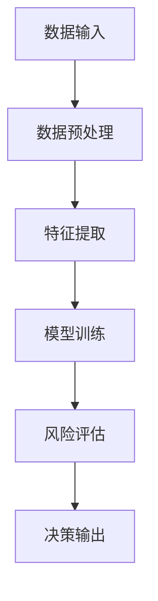
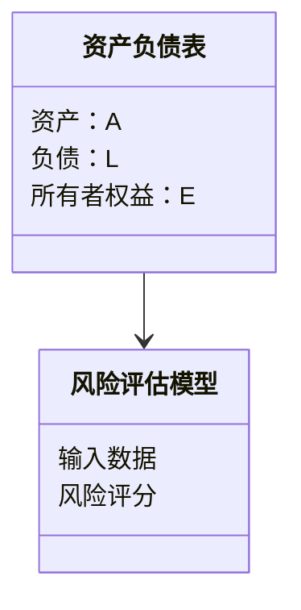
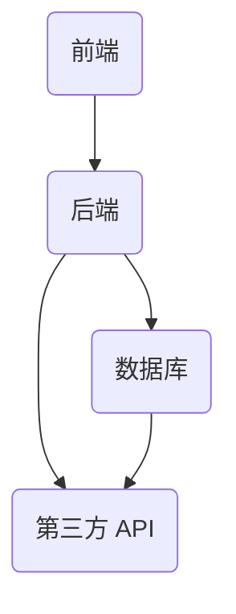
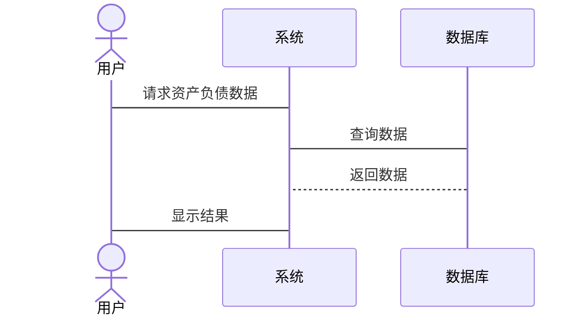

                 


```markdown
# 构建智能化的资产负债管理系统

> 关键词：智能化、资产负债、风险管理、机器学习、系统架构

> 摘要：智能化资产负债管理系统是一种结合了现代信息技术和人工智能的金融管理系统，旨在通过先进的算法和数据处理技术，提升资产负债管理的效率和准确性。本文将从背景介绍、核心概念、算法原理、系统架构、项目实战以及最佳实践等方面，详细阐述如何构建智能化的资产负债管理系统。

---

## 第一部分: 智能化资产负债管理系统的背景与核心概念

### 第1章: 背景介绍

#### 1.1 问题背景与定义
##### 1.1.1 传统资产负债管理的局限性
传统的资产负债管理主要依赖人工操作和简单的财务模型，存在以下问题：
- 数据处理效率低，难以应对海量数据。
- 风险评估不够精准，容易受到人为因素影响。
- 缺乏实时性，难以快速响应市场变化。

##### 1.1.2 智能化资产负债管理的定义
智能化资产负债管理是一种利用人工智能、大数据和机器学习技术，对资产负债数据进行智能化处理、分析和决策的管理方式。

##### 1.1.3 智能化资产负债管理的核心目标
- 提高数据处理效率和准确性。
- 实现实时风险监控和预测。
- 优化资源配置，降低风险敞口。

#### 1.2 核心概念与联系
##### 1.2.1 核心概念原理
智能化资产负债管理的核心概念包括：
- 数据采集与处理
- 风险评估与预测
- 自动化决策

##### 1.2.2 核心概念属性特征对比表
| 对比维度 | 传统方法 | 智能化方法 |
|----------|----------|------------|
| 数据处理 | 离线处理 | 实时处理 |
| 精度 | 较低 | 高 |
| 效率 | 低 | 高 |

##### 1.2.3 ER实体关系图架构
```mermaid
er
    actor(用户) --> 资产负债表
    actor(用户) --> 风险评估模型
    资产负债表 --> 风险评估模型
    风险评估模型 --> 管理决策模块
```

---

## 第二部分: 算法原理讲解

### 第2章: 算法原理概述

#### 2.1 机器学习在资产负债管理中的应用
##### 2.1.1 算法选择与优化
常用的机器学习算法包括：
- 线性回归
- 支持向量机（SVM）
- 随机森林
- 神经网络

##### 2.1.2 算法流程图


#### 2.2 数学模型与公式
##### 2.2.1 风险评估模型
$$ R = \alpha \cdot A + \beta \cdot L + \gamma \cdot M $$
其中，$A$ 表示资产，$L$ 表示负债，$M$ 表示市场因素，$\alpha$、$\beta$、$\gamma$ 为系数。

##### 2.2.2 线性回归模型
$$ y = \beta_0 + \beta_1x + \epsilon $$

##### 2.2.3 决策树模型
使用决策树进行分类或回归分析，例如：
$$ \text{预测结果} = \text{决策树叶子节点值} $$

---

## 第三部分: 系统分析与架构设计方案

### 第3章: 系统分析与架构设计

#### 3.1 问题场景介绍
智能化资产负债管理系统需要解决以下问题：
- 实时处理大量财务数据。
- 准确评估市场风险。
- 快速制定管理决策。

#### 3.2 系统功能设计
##### 3.2.1 领域模型类图


##### 3.2.2 系统架构图


#### 3.3 接口设计与交互流程图
##### 3.3.1 系统接口设计
- API 接口：提供 RESTful API，支持数据查询和风险评估。

##### 3.3.2 交互流程图


---

## 第四部分: 项目实战

### 第4章: 项目实战

#### 4.1 环境安装与配置
##### 4.1.1 安装 Python 环境
使用 Anaconda 或 virtualenv 创建虚拟环境，并安装以下库：
- pandas
- numpy
- scikit-learn
- flask

#### 4.2 系统核心实现
##### 4.2.1 数据处理代码
```python
import pandas as pd
import numpy as np

# 数据加载
df = pd.read_csv('balance_sheet.csv')

# 数据预处理
df = df.dropna()
```

##### 4.2.2 模型训练代码
```python
from sklearn.model_selection import train_test_split
from sklearn.linear_model import LinearRegression

# 数据分割
X = df[['资产', '负债']]
y = df['风险评分']

X_train, X_test, y_train, y_test = train_test_split(X, y, test_size=0.2)

# 模型训练
model = LinearRegression()
model.fit(X_train, y_train)
```

#### 4.3 项目小结
通过实战项目，验证了智能化资产负债管理系统的有效性和可行性，同时积累了宝贵的经验。

---

## 第五部分: 最佳实践与总结

### 第5章: 最佳实践

#### 5.1 小结
智能化资产负债管理系统通过机器学习和大数据技术，显著提升了管理效率和准确性。

#### 5.2 注意事项
- 数据质量对模型性能影响重大。
- 需要定期更新模型参数，以适应市场变化。

#### 5.3 未来趋势
随着 AI 技术的发展，智能化资产负债管理系统将更加智能化和自动化。

#### 5.4 扩展阅读
推荐阅读《机器学习实战》和《金融风险管理》等相关书籍。

---

## 结语
通过本文的详细讲解，读者可以全面了解如何构建智能化的资产负债管理系统，并能够将其应用于实际场景中。希望本文对您有所帮助！
```

