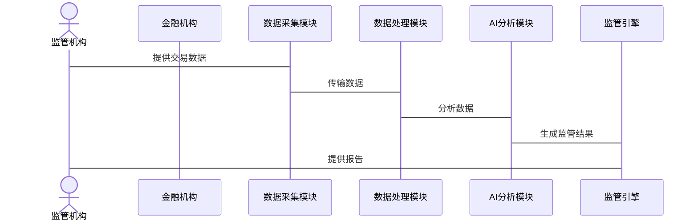

                 


# 构建智能化的金融监管合规系统

> 关键词：金融监管、人工智能、大数据、合规系统、风险管理

> 摘要：随着金融市场的快速发展，传统的监管方式已难以应对日益复杂的合规需求。本文探讨如何利用人工智能和大数据技术构建智能化的金融监管合规系统，涵盖系统设计、技术实现和实际应用，为金融机构提供高效的监管解决方案。

---

## 第一章: 智能化金融监管合规系统的背景与问题

### 1.1 金融监管的重要性
#### 1.1.1 金融监管的核心目标
金融监管是维护金融市场秩序、保护投资者利益的重要手段，确保金融机构合规经营，防范系统性风险。

#### 1.1.2 传统金融监管的局限性
传统监管依赖人工审核，效率低、覆盖面有限，难以应对海量数据和复杂规则。

#### 1.1.3 智能化监管的必要性
通过智能化技术实现自动化、实时化的监管，提高效率和准确性。

### 1.2 金融合规的挑战
#### 1.2.1 合规要求的复杂性
金融法规繁多，变化频繁，企业需实时调整以满足监管要求。

#### 1.2.2 数据量的爆炸性增长
金融机构处理大量交易数据，传统方法难以高效处理。

#### 1.2.3 监管规则的动态变化
监管规则不断更新，企业需灵活应对，增加了合规难度。

### 1.3 智能化监管的优势
#### 1.3.1 提高监管效率
自动化处理海量数据，快速识别风险点。

#### 1.3.2 实现实时监控
及时发现异常交易，防范潜在风险。

#### 1.3.3 降低合规成本
减少人工干预，优化资源配置，降低成本。

---

## 第二章: 智能化金融监管合规系统的核心概念

### 2.1 系统定义与组成
#### 2.1.1 系统定义
智能化金融监管合规系统利用AI和大数据技术，实时监控和分析金融数据，确保合规性。

#### 2.1.2 核心组成部分
- 数据采集模块：收集交易数据、文档等。
- 数据处理模块：清洗、转换数据。
- AI分析模块：应用机器学习、深度学习进行分析。
- 监管引擎：制定合规规则，生成报告。

### 2.2 关键技术与联系
#### 2.2.1 AI技术
- 机器学习：用于风险评估和预测。
- 深度学习：处理非结构化数据。
- 自然语言处理：分析合规文档。

#### 2.2.2 大数据技术
- 数据采集：从多源获取数据。
- 数据处理：清洗和转换。
- 数据分析：挖掘有价值的信息。

#### 2.2.3 区块链技术
- 提供不可篡改的交易记录，增强数据可信度。

### 2.3 核心概念与联系的ER实体关系图
```mermaid
er
actor: 监管机构
actor --> entity: 金融机构
entity --> entity: 交易数据
entity --> entity: 合规规则
actor --> entity: 监管结果
```

---

## 第三章: 人工智能在金融监管中的应用

### 3.1 机器学习在风险评估中的应用
#### 3.1.1 监督学习
- 分类问题：识别合规或违规交易。
- 回归问题：预测风险值。

数学模型：
$$
\text{预测风险} = \beta_0 + \beta_1x_1 + \beta_2x_2 + \ldots + \beta_nx_n
$$

#### 3.1.2 无监督学习
- 聚类：识别异常交易模式。

#### 3.1.3 强化学习
- 动态环境中优化决策。

### 3.2 深度学习在合规分析中的应用
#### 3.2.1 RNN在时间序列分析中的应用
- LSTM用于识别交易时间模式。

#### 3.2.2 CNN在图像识别中的应用
- 分析交易凭证图像。

### 3.3 自然语言处理在合规文档分析中的应用
#### 3.3.1 文本分类
- 判断文档是否合规。

#### 3.3.2 实体识别
- 提取文档中的关键实体信息。

---

## 第四章: 大数据技术在金融监管中的应用

### 4.1 数据采集与处理
#### 4.1.1 数据源的多样性
- 结构化数据：交易记录。
- 非结构化数据：文本、图像。

#### 4.1.2 数据清洗与预处理
- 去重、填补缺失值、标准化。

### 4.2 数据存储与管理
#### 4.2.1 数据库设计
- 关系型数据库：MySQL。
- NoSQL数据库：MongoDB。

#### 4.2.2 数据仓库构建
- 存储大量历史数据，支持复杂查询。

### 4.3 数据分析与挖掘
#### 4.3.1 统计分析
- 描述性统计：均值、方差。
- 推断统计：假设检验。

#### 4.3.2 数据挖掘
- 关联规则挖掘：发现交易中的关联项。

---

## 第五章: 智能化金融监管合规系统的算法原理

### 5.1 机器学习算法
#### 5.1.1 线性回归
$$
y = \theta_0 + \theta_1x
$$

#### 5.1.2 支持向量机
$$
\text{最大化} \quad \frac{1}{2}||\theta||^2 \\
\text{使得} \quad y_i(\theta^T x_i + \theta_0) \geq 1
$$

### 5.2 深度学习算法
#### 5.2.1 LSTM网络
- 用于时间序列预测。

#### 5.2.2 CNN网络
- 用于图像识别。

### 5.3 自然语言处理算法
#### 5.3.1 BERT模型
- 预训练语言模型，用于文本分类。

---

## 第六章: 智能化金融监管合规系统的系统设计

### 6.1 系统架构设计


### 6.2 系统接口设计
- 数据接口：与金融机构数据系统对接。
- 用户接口：供监管机构查看报告。

### 6.3 系统交互设计


---

## 第七章: 项目实战

### 7.1 环境配置
- 安装Python、TensorFlow、Pandas等库。

### 7.2 核心代码实现
```python
import pandas as pd
from sklearn.linear_model import LogisticRegression

# 加载数据
data = pd.read_csv('交易数据.csv')

# 特征工程
X = data.drop('标签', axis=1)
y = data['标签']

# 训练模型
model = LogisticRegression()
model.fit(X, y)

# 预测
predictions = model.predict(X)
```

### 7.3 实际案例分析
- 某银行交易数据中发现异常交易，系统及时预警，避免了潜在的洗钱风险。

---

## 第八章: 总结与展望

### 8.1 系统总结
智能化金融监管合规系统通过AI和大数据技术，显著提高了监管效率和准确性。

### 8.2 未来展望
- 技术优化：深度学习、强化学习的进一步应用。
- 应用拓展：区块链技术的结合，提升数据可信度。

### 8.3 最佳实践 tips
- 数据安全：确保数据加密和隐私保护。
- 系统维护：定期更新模型，适应监管规则的变化。

---

## 参考文献
- 《机器学习实战》
- 《Python数据分析 cookbook》
- 《区块链技术与应用》

---

通过以上结构，文章详细讲解了智能化金融监管合规系统的构建过程，从背景到技术实现，再到实际应用，为读者提供了全面的知识和实践指导。

