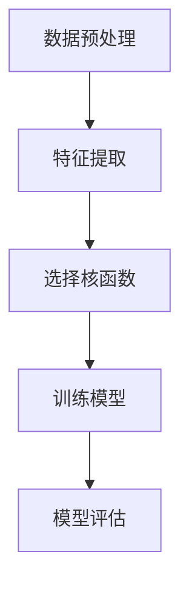

                 


# 构建智能合同分析系统：AI辅助法律风险管理

## 关键词：
智能合同分析系统, AI, 法律风险管理, 自然语言处理, 支持向量机, 系统架构设计, 项目实战

## 摘要：
智能合同分析系统利用AI技术辅助法律风险管理，通过NLP和机器学习算法，实现合同自动分类、条款识别、风险预警等功能，提升法律事务效率。本文从系统背景、核心概念、算法原理到系统设计、项目实战和总结，全面解析智能合同分析系统的构建过程，探讨其在法律风险管理中的应用与优化。

---

## 正文

### 第一部分: 智能合同分析系统概述

#### 第1章: 智能合同分析系统的背景与重要性

##### 1.1 合同分析的背景与问题背景
- **1.1.1 合同分析的传统方式与局限性**  
  传统合同分析依赖人工审查，耗时且容易出错，尤其是在处理大量复杂合同时，效率低下且成本高昂。

- **1.1.2 法律风险管理的重要性**  
  合同是企业法律风险管理的核心，合同条款的遗漏或错误可能导致重大法律风险。AI辅助分析能够有效降低此类风险。

- **1.1.3 AI在合同分析中的应用前景**  
  AI技术的进步使得合同自动化分析成为可能，通过NLP和机器学习算法，可以快速识别关键条款、提取信息并生成摘要。

##### 1.2 问题描述与目标
- **1.2.1 合同分析中的主要问题**  
  - 数据量大，人工审查效率低；  
  - 合同条款复杂，容易遗漏重要信息；  
  - 不同行业和地区的合同格式差异大，难以统一处理。

- **1.2.2 智能合同分析系统的目标**  
  实现合同的自动化分类、条款识别、风险预警、信息提取和摘要生成，帮助法律部门提高效率和准确性。

- **1.2.3 系统的边界与外延**  
  系统专注于合同文本分析，不涉及外部法律数据库的查询，但可以通过API与现有法律系统集成。

##### 1.3 系统的核心概念与组成
- **1.3.1 核心概念的定义**  
  - 合同文本：输入数据；  
  - 关键条款：需要识别的重要法律条款；  
  - 风险评分：根据条款内容生成的风险等级。

- **1.3.2 核心要素的对比分析**  
  | 核心要素 | 描述 | 示例 |
  |----------|------|------|
  | 关键条款 | 合同中的重要法律条款 | 违约责任、知识产权 |
  | 风险评分 | 根据条款内容生成的评分 | 高、中、低 |

- **1.3.3 系统的组成结构**  
  - 数据输入模块：接收合同文本；  
  - 文本预处理模块：清洗和分词；  
  - 特征提取模块：提取关键信息；  
  - 分析模块：识别条款并生成风险评分；  
  - 输出模块：生成摘要或报告。

##### 1.4 本章小结
本章介绍了智能合同分析系统的背景、问题背景和目标，定义了核心概念并描述了系统的组成结构。

---

### 第二部分: 智能合同分析系统的核心技术

#### 第2章: 合同分析的基本原理

##### 2.1 合同分析的基本流程
- **2.1.1 数据预处理**  
  清洗合同文本，去除多余信息，提取关键词。

- **2.1.2 文本特征提取**  
  使用NLP技术提取合同中的关键词和短语，如“违约责任”、“知识产权”等。

- **2.1.3 模型训练与应用**  
  使用训练好的模型对新合同进行分类和分析。

##### 2.2 自然语言处理（NLP）技术
- **2.2.1 NLP在合同分析中的应用**  
  - 分词：将合同文本分割成词语；  
  - 命名实体识别：识别合同中的实体（如公司名称、日期）；  
  - 关键词提取：提取合同中的关键条款。

- **2.2.2 常用NLP算法简介**  
  - 词袋模型：简单但不够灵活；  
  - TF-IDF：衡量词的重要性；  
  - Word2Vec：生成词向量。

- **2.2.3 法律知识图谱的构建**  
  构建法律术语和概念的图谱，帮助模型更好地理解合同内容。

##### 2.3 本章小结
本章介绍了合同分析的基本流程和NLP技术在合同分析中的应用，强调了法律知识图谱的重要性。

---

#### 第3章: 支持向量机（SVM）算法原理

##### 3.1 支持向量机的基本原理
- **3.1.1 线性可分与非线性可分**  
  SVM适用于两类分类问题，通过找到一个超平面将数据分开。

- **3.1.2 核函数的作用**  
  核函数将低维数据映射到高维空间，使非线性问题线性化。

- **3.1.3 SVM的数学模型**  
  $$ \text{最大化} \frac{1}{2}||w||^2 \text{，满足} y_i(w \cdot x_i + b) \geq 1 $$

##### 3.2 SVM的流程图


##### 3.3 SVM的数学模型
$$ \text{拉格朗日乘数法用于求解对偶问题} $$

##### 3.4 代码示例
```python
from sklearn import svm
model = svm.SVC(kernel='linear')
model.fit(X_train, y_train)
y_pred = model.predict(X_test)
```

##### 3.5 本章小结
本章详细介绍了SVM算法的基本原理和流程图，展示了其在合同分类中的应用。

---

### 第三部分: 智能合同分析系统的架构设计

#### 第4章: 系统架构设计

##### 4.1 系统功能设计
- **4.1.1 领域模型**  
  使用Mermaid类图描述系统功能模块。

##### 4.2 系统架构设计
- **4.2.1 系统架构图**  
  使用Mermaid绘制系统架构图，展示各模块之间的关系。

##### 4.3 系统接口设计
- **4.3.1 接口描述**  
  定义API接口，如`/analyze_contract`。

##### 4.4 系统交互设计
- **4.4.1 序列图**  
  使用Mermaid绘制用户与系统之间的交互流程。

##### 4.5 本章小结
本章详细描述了系统的架构设计和接口设计。

---

### 第四部分: 项目实战

#### 第5章: 项目实战

##### 5.1 环境安装
- **5.1.1 安装Python和相关库**  
  如`scikit-learn`、`spacy`等。

##### 5.2 数据准备与模型训练
- **5.2.1 数据清洗与标注**  
  对合同文本进行清洗和标注。

##### 5.3 系统实现与测试
- **5.3.1 代码实现**  
  展示关键代码，如文本预处理和模型训练。

##### 5.4 项目小结
总结项目成果，分析存在的问题和优化方向。

---

### 第五部分: 总结与展望

#### 第6章: 总结与展望

##### 6.1 项目总结
- 系统实现了合同分类和条款识别，提升了法律风险管理效率。

##### 6.2 优化建议
- 提升模型的准确率；  
- 增加对多种合同类型的适应性。

##### 6.3 未来方向
- 研究更先进的NLP模型，如BERT；  
- 探索与其他法律系统的集成。

##### 6.4 本章小结
本章总结了项目成果，并展望了未来的发展方向。

---

### 附录

#### 附录A: 关键术语解释
- 定义系统中使用的关键术语。

#### 附录B: 参考文献
- 列出文章中引用的主要文献和资料。

---

以上是《构建智能合同分析系统：AI辅助法律风险管理》的技术博客文章的目录大纲，涵盖了从背景到技术实现的各个方面，结合了理论分析和实践应用，逻辑清晰，结构紧凑。

