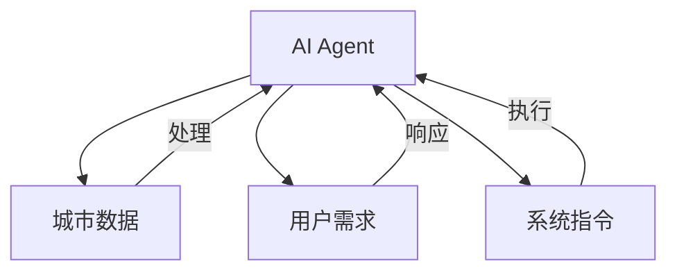
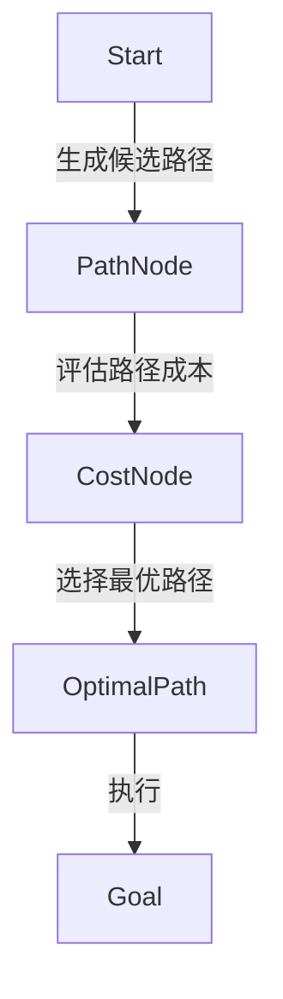
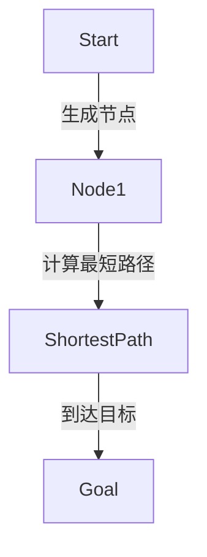
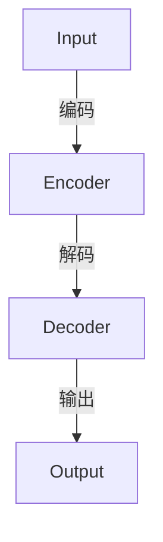

                 


# 构建智能城市管理AI Agent系统

> 关键词：AI Agent，智能城市，城市管理，算法原理，系统架构，项目实战

> 摘要：本文详细探讨了构建智能城市管理AI Agent系统的关键技术与实现方法。首先介绍了AI Agent的基本概念及其在智能城市中的作用，接着分析了AI Agent的核心原理与算法，然后通过系统架构设计展示了如何将AI Agent应用于城市管理系统中，最后通过项目实战验证了系统的可行性和效果。

---

## 第1章: AI Agent与智能城市概述

### 1.1 AI Agent的基本概念

AI Agent（人工智能代理）是一种能够感知环境并采取行动以实现目标的智能实体。它通过接收输入信息、分析问题、制定解决方案，并执行操作来完成特定任务。AI Agent的核心在于其自主性、反应性和目标导向性。

### 1.2 智能城市的技术背景

智能城市是通过先进的信息技术、数据处理和通信技术，将城市中的各个系统有机地结合起来，实现城市资源的优化配置和高效管理。智能城市的建设目标是提升城市管理效率、改善居民生活质量并促进可持续发展。

### 1.3 AI Agent在智能城市中的作用

AI Agent在智能城市中的应用广泛，包括交通管理、环境监测、公共安全、能源管理等领域。AI Agent能够通过实时数据分析，快速做出决策并执行操作，从而提升城市管理的智能化水平。

---

## 第2章: AI Agent的核心概念与联系

### 2.1 AI Agent的核心原理

AI Agent的核心原理包括任务规划、知识表示与推理、自然语言处理与交互等关键技术。任务规划是AI Agent根据目标生成行动计划；知识表示与推理是AI Agent理解和处理信息的基础；自然语言处理则使其能够与人类进行有效沟通。

### 2.2 AI Agent的属性特征对比

下表对比了AI Agent的三种主要属性特征：

| 特性 | 行为驱动 | 数据驱动 | 混合驱动 |
|------|----------|----------|----------|
| 描述 | 基于规则和逻辑推理进行决策 | 基于数据训练和模式识别进行预测 | 综合规则和数据驱动进行决策 |
| 优缺点 | 解决策策速度快，但灵活性较差 | 具有较强的泛化能力，但决策过程可能不够透明 | 结合了规则和数据的优势，但实现复杂度较高 |

### 2.3 ER实体关系图

下图展示了AI Agent在智能城市中的实体关系：



---

## 第3章: AI Agent算法原理

### 3.1 任务规划算法

#### 3.1.1 A*算法

A*算法是一种常用的任务规划算法，通过评估节点的成本和 heuristic函数来找到最优路径。下图展示了A*算法的流程：



#### 3.1.2 Dijkstra算法

Dijkstra算法用于在无权图中寻找最短路径。下图展示了Dijkstra算法的流程：



### 3.2 自然语言处理算法

#### 3.2.1 Transformer模型

Transformer模型是一种基于注意力机制的深度学习模型，广泛应用于自然语言处理任务。下图展示了Transformer模型的流程：



#### 3.2.2 BERT模型

BERT模型是一种预训练语言模型，用于理解和生成自然语言文本。下图展示了BERT模型的流程：

```mermaid
graph TD
    Input -->|嵌
```

