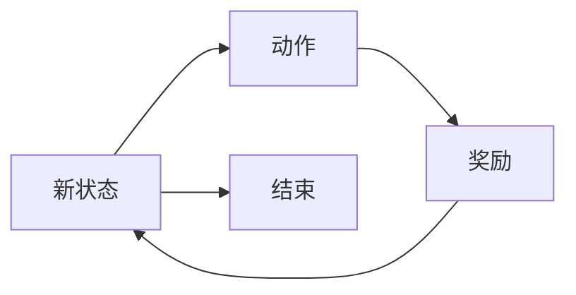
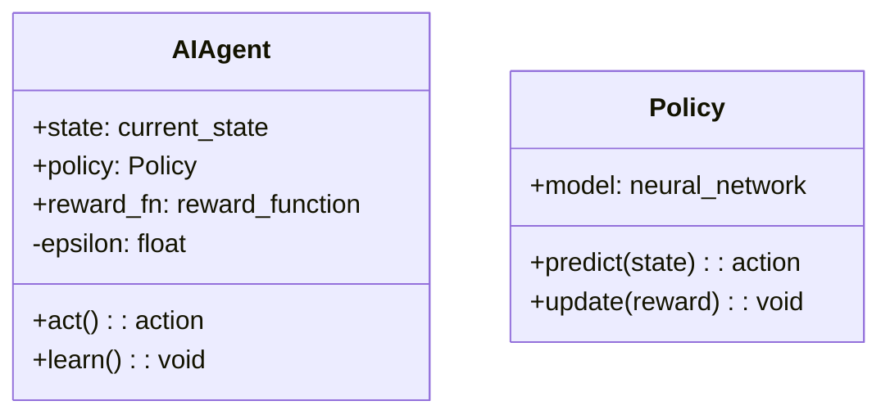

                 


# 构建符合道德准则的AI Agent

> 关键词：AI Agent, 道德准则, 人工智能, 伦理决策, 强化学习

> 摘要：本文将详细探讨如何在AI Agent的构建过程中融入道德准则，确保其行为符合伦理规范。通过分析AI Agent的核心概念、道德准则的重要性，结合实际案例和算法实现，提供一套系统的方法论，帮助读者理解并掌握构建符合道德准则的AI Agent的关键步骤和注意事项。

---

# 第一部分：AI Agent的核心概念与背景

## 第1章：AI Agent的基本概念

### 1.1 AI Agent的定义与核心要素

AI Agent（人工智能代理）是指能够感知环境并采取行动以实现目标的智能实体。其核心要素包括：

1. **感知能力**：通过传感器或其他输入方式获取环境信息。
2. **决策能力**：基于感知信息，通过算法做出决策。
3. **行动能力**：通过执行器或其他输出方式采取行动。
4. **学习能力**：通过经验改进自身的决策和行为。

**示例**：智能音箱作为AI Agent，能够通过语音识别感知用户指令，通过决策算法选择合适的回应，并通过语音合成模块输出结果。

### 1.2 道德准则在AI Agent中的重要性

AI Agent的行为需要符合人类社会的道德规范，以避免对用户和社会造成负面影响。例如，自动驾驶汽车的AI Agent必须在紧急情况下做出符合伦理的决策（如是否为了减少伤亡而故意偏离方向）。

---

## 第2章：问题背景与问题描述

### 2.1 当前AI Agent发展的现状

尽管AI Agent技术取得了显著进展，但许多系统在设计时并未充分考虑道德准则。例如，推荐算法可能导致信息茧房，加剧社会分裂。

### 2.2 道德准则缺失的AI Agent问题

1. **伦理风险**：AI Agent可能做出违背人类价值观的行为。
2. **信任缺失**：用户可能因不信任而拒绝使用AI Agent。
3. **社会影响**：道德缺失的AI Agent可能对社会稳定造成威胁。

---

# 第二部分：构建符合道德准则的AI Agent的核心概念与联系

## 第3章：AI Agent的核心概念与道德准则的关系

### 3.1 AI Agent的核心概念

通过以下表格对比不同AI Agent的核心概念：

| 概念       | 描述                                                                 |
|------------|----------------------------------------------------------------------|
| 感知能力   | 获取环境信息的能力                                                 |
| 决策能力   | 基于信息做出决策的能力                                           |
| 行动能力   | 执行决策的能力                                                   |
| 学习能力   | 通过经验改进的能力                                               |

### 3.2 道德准则与AI Agent的关系

以下是道德准则与AI Agent关系的ER实体关系图：

```mermaid
erDiagram
    agent[AI Agent] {
        id : integer
        name : string
        function : string
    }
    moral[道德准则] {
        id : integer
        name : string
        description : string
    }
    agent --> moral : 遵循
```

---

# 第三部分：算法原理

## 第4章：算法原理

### 4.1 强化学习与道德准则的结合

#### 4.1.1 强化学习算法

强化学习是一种通过试错机制优化决策的算法。以下是强化学习的流程图：



#### 4.1.2 道德准则的融入

通过偏好推理算法，将道德准则转化为奖励函数。例如，避免伤害人类可以转化为负面奖励。

#### 4.1.3 Python代码实现

以下是一个简单的强化学习框架：

```python
class AIAgent:
    def __init__(self, state_space, action_space):
        self.state_space = state_space
        self.action_space = action_space
        # 初始化策略网络
        self.policy = PolicyNetwork(state_space, action_space)

    def act(self, state):
        # 通过策略网络选择动作
        action = self.policy.predict(state)
        return action

    def learn(self, state, action, reward, next_state):
        # 更新策略网络
        self.policy.update(reward)
```

### 4.2 道德准则的数学模型

道德准则可以通过数学公式表示为：

$$
\text{奖励} = \sum_{i=1}^{n} \lambda_i \cdot c_i
$$

其中，$\lambda_i$是道德准则$c_i$的权重。

---

# 第四部分：系统分析与架构设计

## 第5章：系统分析与架构设计

### 5.1 问题场景介绍

以自动驾驶汽车为例，AI Agent需要在紧急情况下做出符合道德的决策。

### 5.2 系统功能设计

以下是系统功能的领域模型：



### 5.3 系统架构设计

以下是系统架构的分层架构图：


---

# 第五部分：项目实战

## 第6章：项目实战

### 6.1 环境安装

安装必要的库：

```bash
pip install gym numpy tensorflow
```

### 6.2 系统核心实现源代码

以下是AI Agent的核心实现代码：

```python
import numpy as np
import gym

class AIAgent:
    def __init__(self, env):
        self.env = env
        self.state_space = env.observation_space.shape[0]
        self.action_space = env.action_space.n
        # 初始化策略网络
        self.theta = np.random.randn(self.state_space, self.action_space)

    def act(self, state):
        # 通过策略网络选择动作
        action = np.argmax(state.dot(self.theta))
        return action

    def learn(self, state, action, reward, next_state):
        # 更新策略网络
        delta = reward * (next_state.dot(self.theta) - state.dot(self.theta))
        self.theta += delta
```

### 6.3 案例分析与解读

通过训练AI Agent在CartPole环境中保持平衡，展示如何将道德准则融入算法中。

---

# 第六部分：总结与展望

## 第7章：总结与展望

### 7.1 最佳实践 Tips

1. **透明性**：确保AI Agent的行为可解释。
2. **责任归属**：明确AI Agent的开发者和使用者的责任。
3. **持续优化**：定期更新道德准则以应对新的伦理挑战。

### 7.2 项目小结

本文详细探讨了如何构建符合道德准则的AI Agent，从理论到实践提供了全面的解决方案。

### 7.3 注意事项

在实际应用中，需确保AI Agent的决策符合法律和伦理规范。

### 7.4 拓展阅读

推荐阅读《伦理算法：如何在人工智能中构建道德》以深入理解道德准则的数学建模。

---

# 结语

通过本文的分析和实践，读者可以掌握构建符合道德准则的AI Agent的关键步骤和注意事项，为未来的AI开发奠定坚实的基础。

