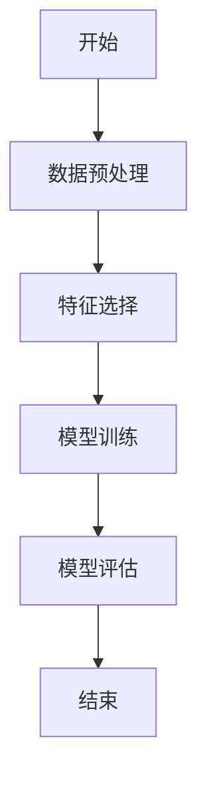
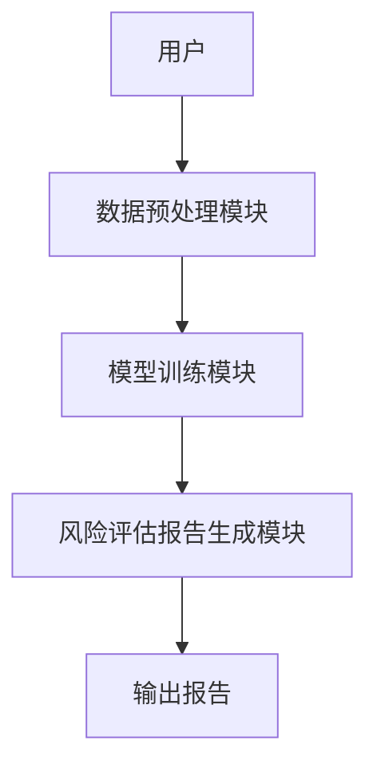

                 


---

# 构建精准的投资风险评估模型

> 关键词：投资风险评估模型、风险评估算法、金融数据分析、系统架构设计、精准预测、投资组合优化

> 摘要：本文详细探讨了构建精准投资风险评估模型的关键步骤与技术实现。从背景与核心概念的介绍，到算法原理的深入分析，再到系统架构设计与项目实战，结合丰富的数学公式、mermaid流程图和Python代码示例，系统性地展示了如何通过数据驱动的方法，利用统计与机器学习算法，构建高精度的风险评估模型，并在实际投资场景中实现有效的风险管理和投资优化。

---

# 第1章: 投资风险评估模型的背景与核心概念

## 1.1 投资风险的基本概念
### 1.1.1 投资风险的定义与内涵
投资风险是指在投资过程中，由于市场波动、经济变化或其他不可预见因素的影响，导致投资收益低于预期或出现损失的可能性。风险是投资决策中不可忽视的重要因素，它直接影响投资者的收益与决策信心。

### 1.1.2 投资风险的分类与特征
投资风险可以分为系统性风险（市场风险）和非系统性风险（特定风险）。系统性风险影响整个市场，如经济衰退、通货膨胀等；非系统性风险则由特定资产或行业引发，如公司财务状况恶化。

### 1.1.3 投资风险评估的重要性
精准的风险评估能够帮助投资者制定合理的投资策略，优化投资组合，降低潜在损失，并在复杂市场环境中做出科学决策。

## 1.2 投资风险评估的必要性
### 1.2.1 投资决策中的不确定性
金融市场具有高度不确定性，投资者需要通过风险评估来量化潜在损失，从而做出更加理性的决策。

### 1.2.2 风险评估在投资组合管理中的作用
通过风险评估，投资者可以了解不同资产之间的相关性，优化资产配置，分散风险，从而提高投资组合的整体收益。

### 1.2.3 精准评估对投资者的价值
精准的风险评估能够帮助投资者更好地理解市场的波动性，抓住投资机会，规避潜在风险。

## 1.3 问题背景与目标
### 1.3.1 当前投资风险评估的主要挑战
传统风险评估方法存在数据不足、模型简单、难以捕捉复杂市场变化等问题，难以满足现代投资管理的需求。

### 1.3.2 构建精准模型的目标与意义
构建精准的投资风险评估模型，旨在通过数据驱动的方法，利用先进的统计与机器学习算法，提高风险评估的准确性和实用性。

### 1.3.3 模型的边界与外延
模型的边界包括数据范围、时间范围和适用场景；其外延则涉及模型的可扩展性、适应性以及与其他投资决策工具的集成。

## 1.4 核心概念与联系
### 1.4.1 核心概念的定义与属性特征对比
| 概念 | 定义 | 属性特征 |
|------|------|----------|
| 风险 | 可能性与影响的结合 | 可量化、可预测 |
| 模型 | 描述风险关系的工具 | 数据驱动、可解释 |

### 1.4.2 ER实体关系图


## 1.5 本章小结
本章介绍了投资风险的基本概念、分类与特征，分析了投资风险评估的必要性，并提出了构建精准模型的目标与意义。通过核心概念与联系的对比，明确了模型在投资决策中的重要作用。

---

# 第2章: 投资风险评估模型的核心概念与联系

## 2.1 风险评估模型的原理
### 2.1.1 数据驱动的模型构建
风险评估模型基于历史数据，通过统计分析和机器学习算法，识别数据中的风险特征，构建风险预测模型。

### 2.1.2 统计与机器学习方法的结合
传统统计方法（如回归分析）与机器学习方法（如随机森林、神经网络）的结合，能够提高模型的准确性和鲁棒性。

## 2.2 核心概念的数学模型
### 2.2.1 风险的度量公式
$$ \text{风险} = \text{概率} \times \text{影响} $$

### 2.2.2 投资组合风险的计算
$$ \text{组合风险} = \sqrt{\sum_{i=1}^{n} \sum_{j=1}^{n} w_i w_j \text{Cov}(r_i, r_j)} $$

## 2.3 模型的核心要素
### 2.3.1 数据来源与特征
- 数据来源：历史价格、财务数据、市场指标、新闻情绪等
- 特征选择：特征重要性分析、特征工程

### 2.3.2 模型假设与限制
- 假设市场数据的可得性和有效性
- 限制模型的适用范围和时间窗口

## 2.4 本章小结
本章详细介绍了风险评估模型的原理，探讨了统计与机器学习方法的结合，并通过数学公式和特征分析，明确了模型的核心要素与假设条件。

---

# 第3章: 常见的风险评估算法与实现

## 3.1 线性回归模型
### 3.1.1 简单线性回归原理
简单线性回归通过最小二乘法拟合一条直线，预测目标变量与单个自变量之间的关系。

### 3.1.2 多元线性回归的应用
多元线性回归扩展了简单线性回归，能够同时考虑多个自变量对目标变量的影响。

### 3.1.3 算法流程图


### 3.1.4 Python代码实现
```python
import numpy as np
from sklearn.linear_model import LinearRegression
from sklearn.metrics import mean_squared_error

# 示例数据
X = np.array([[1], [2], [3], [4], [5]])
y = np.array([2, 4, 5, 4, 6])

# 模型训练
model = LinearRegression()
model.fit(X, y)

# 预测
y_pred = model.predict(X)
print("预测值:", y_pred)
print("均方误差:", mean_squared_error(y, y_pred))
```

## 3.2 机器学习算法的应用
### 3.2.1 随机森林模型
随机森林通过集成学习方法，提高模型的准确性和鲁棒性。

### 3.2.2 算法流程图


### 3.2.3 Python代码实现
```python
from sklearn.ensemble import RandomForestRegressor
from sklearn.metrics import mean_absolute_error

# 示例数据
X = np.array([[1, 2], [3, 4], [5, 6], [7, 8], [9, 10]])
y = np.array([2, 4, 5, 4, 6])

# 模型训练
model = RandomForestRegressor(n_estimators=100)
model.fit(X, y)

# 预测
y_pred = model.predict(X)
print("预测值:", y_pred)
print("平均绝对误差:", mean_absolute_error(y, y_pred))
```

## 3.3 本章小结
本章介绍了常见的风险评估算法，包括线性回归和随机森林模型，并通过代码实现展示了算法的使用方法。

---

# 第4章: 投资风险评估模型的系统架构设计

## 4.1 问题场景介绍
### 4.1.1 需求分析
- 数据收集与处理
- 模型训练与部署
- 风险评估报告生成

### 4.1.2 系统功能设计
- 数据预处理模块
- 模型训练模块
- 风险评估报告生成模块

## 4.2 系统架构设计
### 4.2.1 领域模型类图


### 4.2.2 系统架构图


## 4.3 系统接口设计
### 4.3.1 数据接口
- 数据输入接口：接收原始数据
- 数据输出接口：输出处理后的数据

### 4.3.2 模型接口
- 模型输入接口：接收特征数据
- 模型输出接口：输出预测结果

## 4.4 系统交互流程图


## 4.5 本章小结
本章通过系统架构设计，展示了如何构建一个完整的投资风险评估系统，包括功能模块设计、系统架构图和系统接口设计。

---

# 第5章: 投资风险评估模型的项目实战

## 5.1 环境安装与配置
### 5.1.1 安装Python环境
- 安装Python 3.x
- 安装必要的库：numpy、pandas、scikit-learn

### 5.1.2 数据集准备
- 数据来源：金融数据 API（如Yahoo Finance）
- 数据格式：CSV文件

## 5.2 核心代码实现
### 5.2.1 数据预处理
```python
import pandas as pd
import numpy as np

# 加载数据
data = pd.read_csv('stock_data.csv')

# 数据清洗
data = data.dropna()
data = pd.get_dummies(data)
```

### 5.2.2 模型训练
```python
from sklearn.ensemble import RandomForestRegressor
from sklearn.model_selection import train_test_split
from sklearn.metrics import mean_squared_error

# 数据分割
X = data.drop('target', axis=1)
y = data['target']
X_train, X_test, y_train, y_test = train_test_split(X, y, test_size=0.2, random_state=42)

# 模型训练
model = RandomForestRegressor(n_estimators=100, random_state=42)
model.fit(X_train, y_train)

# 预测
y_pred = model.predict(X_test)
print("均方误差:", mean_squared_error(y_test, y_pred))
```

## 5.3 实际案例分析
### 5.3.1 数据分析
- 数据可视化：使用 matplotlib 或 seaborn 绘制数据分布图
- 数据特征分析：分析各特征对目标变量的影响

### 5.3.2 模型分析
- 模型评估：计算准确率、召回率、F1分数
- 模型优化：调整超参数，提高模型性能

## 5.4 本章小结
本章通过实际项目实战，展示了如何从数据预处理到模型训练，再到模型评估的完整流程。

---

# 第6章: 投资风险评估模型的最佳实践与总结

## 6.1 最佳实践 tips
### 6.1.1 数据质量的重要性
- 数据清洗与特征工程
- 数据来源的可靠性

### 6.1.2 模型选择的策略
- 根据数据特征选择合适的模型
- 模型的可解释性与准确性之间的平衡

### 6.1.3 模型的持续优化
- 定期更新模型
- 监控模型性能

## 6.2 本章小结
本章总结了构建精准投资风险评估模型的最佳实践，包括数据处理、模型选择与优化等方面。

---

# 附录: 拓展阅读与工具推荐

## 附录1: 相关书籍推荐
- 《Python机器学习实战》
- 《金融数据分析与机器学习》

## 附录2: 开源工具推荐
- pandas
- numpy
- scikit-learn
- matplotlib

---

# 结语
通过本文的详细讲解，读者可以系统性地掌握构建精准投资风险评估模型的关键步骤与技术实现。从背景与核心概念的介绍，到算法原理的深入分析，再到系统架构设计与项目实战，结合丰富的数学公式、mermaid流程图和Python代码示例，帮助读者在投资风险管理领域实现更加精准和科学的决策。

---

