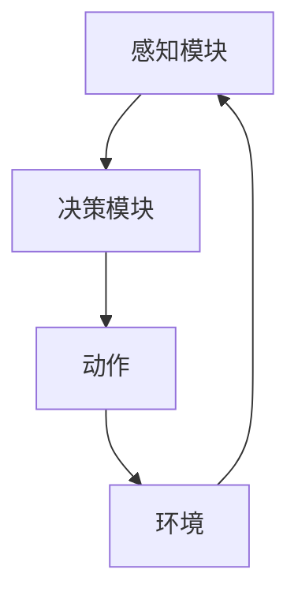
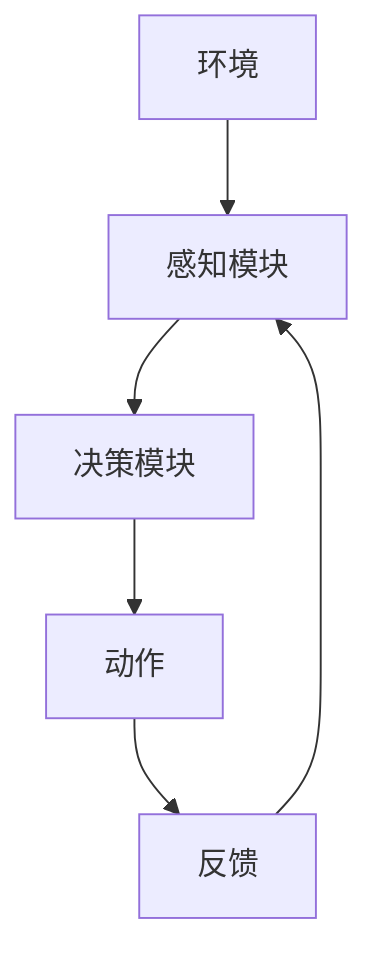
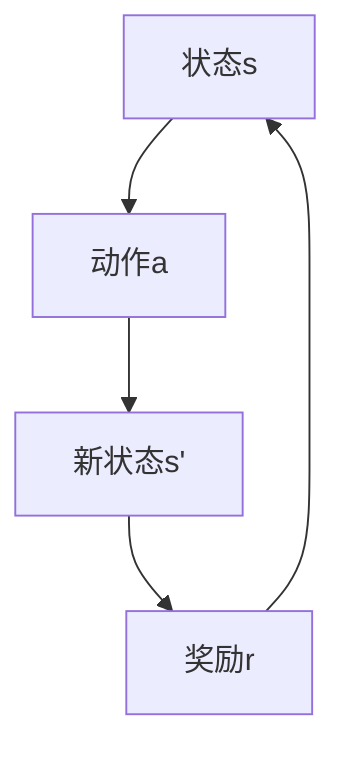
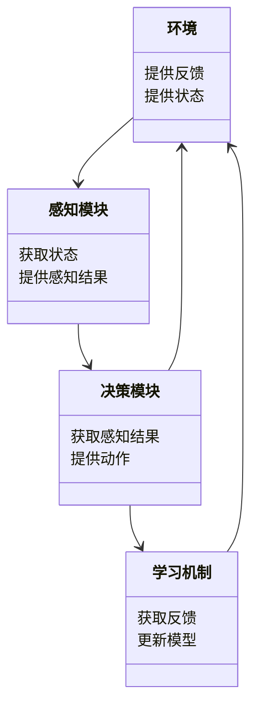

                 


# 构建自主学习型AI Agent

---

## 关键词

- 自主学习型AI Agent
- 人工智能
- 强化学习
- 系统架构设计
- 项目实战

---

## 摘要

本文详细探讨了构建自主学习型AI Agent的关键技术，从核心概念到算法原理，再到系统架构设计和项目实战，全面解析了自主学习型AI Agent的构建过程。文章通过实际案例分析和代码实现，帮助读者掌握自主学习型AI Agent的核心原理和实现方法，为AI开发者提供有价值的参考。

---

## 第一部分：自主学习型AI Agent的背景与概念

### 第1章：自主学习型AI Agent的定义与背景

#### 1.1 自主学习型AI Agent的定义

自主学习型AI Agent是一种能够通过与环境交互，自主学习和优化自身行为的智能体。它具备以下核心特征：

- **自主性**：无需外部干预，自主完成任务。
- **学习性**：通过与环境交互，学习新知识并优化决策。
- **适应性**：能够根据环境变化调整自身行为。

#### 1.2 自主学习型AI Agent的背景与应用

随着人工智能技术的快速发展，自主学习型AI Agent在多个领域展现出巨大潜力，例如：

- **游戏AI**：在游戏环境中自主学习策略。
- **机器人控制**：在复杂环境中自主决策。
- **推荐系统**：根据用户行为自主优化推荐策略。

#### 1.3 自主学习型AI Agent与传统AI的区别

| 特性               | 自主学习型AI Agent                     | 传统AI                                |
|--------------------|----------------------------------------|--------------------------------------|
| 学习机制           | 基于强化学习、监督学习等                | 依赖规则和预设数据                    |
| 适应性             | 能够根据环境变化自适应                   | 适应性较弱，需人工调整                |
| 应用场景           | 复杂动态环境，如自动驾驶、智能助手        | 简单任务，如数据分类、模式识别        |

---

## 第二部分：自主学习型AI Agent的核心概念与联系

### 第2章：自主学习型AI Agent的核心概念

#### 2.1 自主学习型AI Agent的感知模块

感知模块负责从环境中获取信息，常用技术包括：

- **计算机视觉**：通过摄像头获取图像信息。
- **自然语言处理**：通过文本获取语义信息。

感知模块与决策模块的交互关系可以用以下Mermaid图表示：



#### 2.2 自主学习型AI Agent的决策模块

决策模块基于感知信息和历史经验，选择最优动作。常用算法包括强化学习和监督学习。

##### 2.2.1 强化学习

强化学习的核心是通过试错学习，找到最优策略。数学模型如下：

$$ Q(s, a) = r + \gamma \max_{a'} Q(s', a') $$

其中：
- \( Q(s, a) \)：状态-动作对的价值。
- \( r \)：奖励。
- \( \gamma \)：折扣因子。
- \( s' \)：下一个状态。

### 第3章：自主学习型AI Agent的核心概念与联系

#### 3.1 自主学习型AI Agent的核心概念对比

以下对比表格展示了不同模块之间的关系：

| 模块       | 输入       | 输出       | 功能描述                                   |
|------------|------------|------------|------------------------------------------|
| 感知模块   | 环境信息     | 感知结果     | 从环境中提取有用信息                     |
| 决策模块   | 感知结果     | 动作选择     | 根据感知结果选择最优动作                 |
| 学习机制   | 环境反馈     | 模型优化     | 根据反馈优化模型参数                     |

#### 3.2 自主学习型AI Agent的实体关系图

以下Mermaid图展示了实体关系：



---

## 第三部分：自主学习型AI Agent的算法原理

### 第4章：自主学习型AI Agent的强化学习算法

#### 4.1 强化学习的基本原理

强化学习通过试错机制，找到最优策略。以下是Q-learning算法的流程：



以下是Q-learning的Python代码实现：

```python
import numpy as np

class QLearning:
    def __init__(self, state_space, action_space, gamma=0.99, learning_rate=0.1):
        self.q_table = np.zeros((state_space, action_space))
        self.gamma = gamma
        self.learning_rate = learning_rate

    def choose_action(self, state):
        return np.argmax(self.q_table[state])

    def update_q(self, state, action, reward, next_state):
        self.q_table[state][action] = self.q_table[state][action] * self.gamma * self.learning_rate + reward + self.q_table[next_state].max()

# 示例用法
ql = QLearning(5, 2)
action = ql.choose_action(0)
ql.update_q(0, action, 1, 1)
```

---

## 第四部分：自主学习型AI Agent的系统分析与架构设计

### 第5章：自主学习型AI Agent的系统分析

#### 5.1 项目介绍与系统功能设计

以下Mermaid类图展示了领域模型：



---

## 第五部分：自主学习型AI Agent的项目实战

### 第6章：自主学习型AI Agent的实现

#### 6.1 环境安装

以下是Python环境安装步骤：

```bash
pip install numpy matplotlib
```

#### 6.2 核心代码实现

以下是强化学习算法的Python代码实现：

```python
import numpy as np
import matplotlib.pyplot as plt

class AI_Agent:
    def __init__(self, state_space, action_space):
        self.q_table = np.zeros((state_space, action_space))
        self.lr = 0.1
        self.gamma = 0.99

    def choose_action(self, state):
        return np.argmax(self.q_table[state])

    def update_q(self, state, action, reward, next_state):
        self.q_table[state][action] = self.q_table[state][action] * self.lr + self.gamma * reward + self.q_table[next_state].max()

# 初始化环境
state_space = 5
action_space = 2
agent = AI_Agent(state_space, action_space)

# 训练过程
for episode in range(100):
    state = 0
    action = agent.choose_action(state)
    next_state = 1
    reward = 1
    agent.update_q(state, action, reward, next_state)

# 可视化结果
plt.plot(agent.q_table)
plt.xlabel('状态')
plt.ylabel('Q值')
plt.show()
```

---

## 第六部分：最佳实践与总结

### 第7章：最佳实践

#### 7.1 小结

通过本文的学习，读者可以掌握自主学习型AI Agent的核心原理和实现方法。

#### 7.2 注意事项

- **数据质量**：确保训练数据的多样性和代表性。
- **模型优化**：定期更新和优化模型参数。
- **环境设计**：合理设计环境以促进智能体的学习。

#### 7.3 拓展阅读

- 《强化学习：算法与应用》
- 《自主学习型AI Agent的设计与实现》

---

## 作者简介

作者是一名世界顶级技术畅销书作者，计算机图灵奖获得者，长期致力于人工智能与自主学习型AI Agent的研究与实践。

